# Brush Lab — 265 brushes · 8 Nov 2026 at 23:24

Every sheet: 1500 × 600, ten strokes in a 5 × 2 grid — 1. light line · 2. heavy line · 3. pressure swell · 4. fast wave · 5. slow wave · 6. spiral · 7. loop · 8. tilted · 9. over the wet one · 10. long, no reload (cell 8 holds «tilted» and «over the wet one» crossed). The CPU reference of Mamay's paint engine; the wet layer settles 20 s at the end.

Columns: **covered** = share of the cell with paint right after the stroke → after settling; **width** = painted area of the stroke ÷ its length (px); **dark** = mean darkness of the painted pixels above the paper's own grain (0 = paper, 1 = black); **spread** = how far wet paint went beyond the stroke (1.0 = stayed); **ms** = the stroke on the CPU; long stroke: paint in each quarter of its length (it should run out: wet → streaks → dry tail).

## Ink Line
Ink · 12 px · 22.7 s

| stroke | covered | width | dark | spread | ms |
|---|---|---|---|---|---|
| light line | 1 % → 4 % | 4.3 px | 0.55 | 2.45 | 32 |
| heavy line | 5 % → 6 % | 15.7 px | 0.68 | 1.14 | 55 |
| pressure swell | 3 % → 4 % | 11.3 px | 0.64 | 1.40 | 23 |
| fast wave | 10 % → 11 % | 11.2 px | 0.59 | 1.11 | 110 |
| slow wave | 8 % → 10 % | 9.6 px | 0.57 | 1.16 | 101 |
| spiral | 14 % → 15 % | 8.9 px | 0.49 | 1.07 | 181 |
| loop | 8 % → 9 % | 10.6 px | 0.61 | 1.15 | 80 |
| tilted | 5 % → 5 % | 14.3 px | 0.64 | 1.05 | 73 |
| over the wet one | 10 % → 11 % | 12.5 px | 0.64 | 1.15 | 56 |
| long, no reload | 18 % → 17 % | 8.1 px | 0.47 | 0.96 | 275 | quarters: 0.22 → 0.09 → 0.04 → 0.02

Numbers say: light vs heavy: width 4.3 → 15.7 px, dark 0.55 → 0.68; wet paint spreads well beyond the stroke.

## Dense Ink
Ink · 14 px · 23.1 s

| stroke | covered | width | dark | spread | ms |
|---|---|---|---|---|---|
| light line | 5 % → 7 % | 15.2 px | 0.72 | 1.27 | 33 |
| heavy line | 7 % → 7 % | 19.1 px | 0.73 | 1.09 | 59 |
| pressure swell | 5 % → 6 % | 17.9 px | 0.72 | 1.18 | 41 |
| fast wave | 13 % → 13 % | 15.2 px | 0.69 | 1.01 | 115 |
| slow wave | 12 % → 12 % | 13.5 px | 0.67 | 1.04 | 131 |
| spiral | 18 % → 15 % | 12.2 px | 0.65 | 0.80 | 216 |
| loop | 11 % → 12 % | 14.8 px | 0.69 | 1.08 | 88 |
| tilted | 5 % → 6 % | 14.5 px | 0.72 | 1.07 | 53 |
| over the wet one | 12 % → 13 % | 17.7 px | 0.72 | 1.12 | 51 |
| long, no reload | 23 % → 15 % | 10.1 px | 0.64 | 0.66 | 294 | quarters: 0.30 → 0.12 → 0.04 → 0.02

Numbers say: light vs heavy: width 15.2 → 19.1 px, dark 0.72 → 0.73.

## Transparent Wash
Watercolor · 22 px · 23.5 s

| stroke | covered | width | dark | spread | ms |
|---|---|---|---|---|---|
| light line | 2 % → 5 % | 6.9 px | 0.27 | 2.26 | 26 |
| heavy line | 7 % → 9 % | 20.4 px | 0.27 | 1.23 | 48 |
| pressure swell | 4 % → 6 % | 15.2 px | 0.28 | 1.54 | 31 |
| fast wave | 14 % → 16 % | 16.1 px | 0.20 | 1.17 | 117 |
| slow wave | 12 % → 15 % | 13.7 px | 0.21 | 1.28 | 144 |
| spiral | 18 % → 22 % | 11.9 px | 0.16 | 1.22 | 151 |
| loop | 11 % → 13 % | 14.5 px | 0.22 | 1.20 | 76 |
| tilted | 8 % → 8 % | 21.1 px | 0.24 | 1.06 | 70 |
| over the wet one | 13 % → 16 % | 16.4 px | 0.24 | 1.19 | 37 |
| long, no reload | 26 % → 32 % | 11.6 px | 0.13 | 1.22 | 275 | quarters: 0.11 → 0.04 → 0.02 → 0.01

Numbers say: light vs heavy: width 6.9 → 20.4 px, dark 0.27 → 0.27; wet paint spreads well beyond the stroke.

## Dry Brush
Gouache · 24 px · 22.7 s

| stroke | covered | width | dark | spread | ms |
|---|---|---|---|---|---|
| light line | 5 % → 1 % | 13.8 px | 0.65 | 0.11 | 50 |
| heavy line | 6 % → 0 % | 18.4 px | 0.65 | 0.02 | 70 |
| pressure swell | 5 % → 0 % | 18.1 px | 0.65 | 0.09 | 48 |
| fast wave | 6 % → 1 % | 6.9 px | 0.65 | 0.08 | 156 |
| slow wave | 7 % → 0 % | 7.8 px | 0.65 | 0.07 | 199 |
| spiral | 7 % → 1 % | 4.4 px | 0.65 | 0.08 | 202 |
| loop | 9 % → 0 % | 12.2 px | 0.65 | 0.05 | 137 |
| tilted | 4 % → 3 % | 10.3 px | 0.65 | 0.89 | 78 |
| over the wet one | 9 % → 1 % | 14.3 px | 0.65 | 0.12 | 62 |
| long, no reload | 6 % → 1 % | 2.7 px | 0.65 | 0.15 | 290 | quarters: 0.12 → 0.00 → 0.00 → 0.00

Numbers say: light vs heavy: width 13.8 → 18.4 px, dark 0.65 → 0.65.

## Wax Crayon
Wax · 8 px · 8.9 s

| stroke | covered | width | dark | spread | ms |
|---|---|---|---|---|---|
| light line | 1 % → 1 % | 2.5 px | 0.71 | 1.00 | 20 |
| heavy line | 1 % → 1 % | 3.9 px | 0.69 | 1.00 | 11 |
| pressure swell | 1 % → 1 % | 3.3 px | 0.70 | 1.00 | 13 |
| fast wave | 3 % → 3 % | 3.5 px | 0.69 | 1.00 | 35 |
| slow wave | 3 % → 3 % | 3.4 px | 0.70 | 1.00 | 35 |
| spiral | 5 % → 5 % | 3.3 px | 0.70 | 1.00 | 73 |
| loop | 3 % → 3 % | 3.3 px | 0.70 | 1.00 | 24 |
| tilted | 2 % → 2 % | 5.6 px | 0.68 | 1.00 | 24 |
| over the wet one | 3 % → 3 % | 3.6 px | 0.68 | 1.00 | 19 |
| long, no reload | 7 % → 7 % | 3.3 px | 0.70 | 1.00 | 119 | quarters: 0.06 → 0.06 → 0.06 → 0.06

Numbers say: light vs heavy: width 2.5 → 3.9 px, dark 0.71 → 0.69; the long stroke does not run out of paint.

## Oil Pastel
Wax · 12 px · 9.1 s

| stroke | covered | width | dark | spread | ms |
|---|---|---|---|---|---|
| light line | 1 % → 1 % | 4.0 px | 0.68 | 1.00 | 25 |
| heavy line | 2 % → 2 % | 6.5 px | 0.68 | 1.00 | 23 |
| pressure swell | 2 % → 2 % | 5.7 px | 0.69 | 1.00 | 20 |
| fast wave | 5 % → 5 % | 5.7 px | 0.68 | 1.00 | 49 |
| slow wave | 5 % → 5 % | 5.5 px | 0.68 | 1.00 | 43 |
| spiral | 8 % → 8 % | 5.5 px | 0.68 | 1.00 | 85 |
| loop | 4 % → 4 % | 5.6 px | 0.68 | 1.00 | 41 |
| tilted | 2 % → 2 % | 6.8 px | 0.68 | 1.00 | 31 |
| over the wet one | 5 % → 5 % | 5.8 px | 0.68 | 1.00 | 27 |
| long, no reload | 13 % → 13 % | 5.6 px | 0.68 | 1.00 | 147 | quarters: 0.10 → 0.09 → 0.10 → 0.10

Numbers say: light vs heavy: width 4.0 → 6.5 px, dark 0.68 → 0.68; the long stroke does not run out of paint.

## Charcoal
Charcoal · 5 px · 8.8 s

| stroke | covered | width | dark | spread | ms |
|---|---|---|---|---|---|
| light line | 1 % → 1 % | 2.0 px | 0.74 | 1.00 | 12 |
| heavy line | 1 % → 1 % | 3.0 px | 0.74 | 1.00 | 10 |
| pressure swell | 1 % → 1 % | 2.7 px | 0.74 | 1.00 | 14 |
| fast wave | 2 % → 2 % | 2.7 px | 0.73 | 1.00 | 34 |
| slow wave | 2 % → 2 % | 2.6 px | 0.74 | 1.00 | 28 |
| spiral | 4 % → 4 % | 2.5 px | 0.74 | 1.00 | 59 |
| loop | 2 % → 2 % | 2.6 px | 0.74 | 1.00 | 19 |
| tilted | 2 % → 2 % | 4.3 px | 0.72 | 1.00 | 11 |
| over the wet one | 2 % → 2 % | 2.4 px | 0.72 | 1.00 | 6 |
| long, no reload | 6 % → 6 % | 2.7 px | 0.73 | 1.00 | 79 | quarters: 0.05 → 0.05 → 0.05 → 0.05

Numbers say: light vs heavy: width 2.0 → 3.0 px, dark 0.74 → 0.74; the long stroke does not run out of paint.

## Impasto
Heavy acrylic · 22 px · 13.7 s

| stroke | covered | width | dark | spread | ms |
|---|---|---|---|---|---|
| light line | 8 % → 8 % | 24.1 px | 0.72 | 0.93 | 44 |
| heavy line | 10 % → 9 % | 28.8 px | 0.70 | 0.94 | 88 |
| pressure swell | 7 % → 7 % | 28.1 px | 0.72 | 0.94 | 45 |
| fast wave | 20 % → 13 % | 23.4 px | 0.71 | 0.64 | 120 |
| slow wave | 21 % → 14 % | 24.5 px | 0.71 | 0.66 | 198 |
| spiral | 30 % → 14 % | 19.9 px | 0.71 | 0.46 | 237 |
| loop | 18 % → 14 % | 23.9 px | 0.71 | 0.77 | 121 |
| tilted | 8 % → 8 % | 21.7 px | 0.70 | 1.00 | 68 |
| over the wet one | 17 % → 15 % | 25.4 px | 0.70 | 0.91 | 53 |
| long, no reload | 33 % → 14 % | 14.9 px | 0.71 | 0.42 | 433 | quarters: 0.38 → 0.21 → 0.10 → 0.03

Numbers say: light vs heavy: width 24.1 → 28.8 px, dark 0.72 → 0.70.

## Oil Round
Oil · 18 px · 16.1 s

| stroke | covered | width | dark | spread | ms |
|---|---|---|---|---|---|
| light line | 2 % → 2 % | 7.2 px | 0.75 | 1.00 | 43 |
| heavy line | 7 % → 7 % | 19.3 px | 0.73 | 1.00 | 71 |
| pressure swell | 4 % → 4 % | 13.7 px | 0.72 | 1.00 | 34 |
| fast wave | 11 % → 11 % | 12.8 px | 0.65 | 1.00 | 112 |
| slow wave | 8 % → 8 % | 9.0 px | 0.57 | 1.00 | 142 |
| spiral | 10 % → 10 % | 6.6 px | 0.50 | 1.00 | 185 |
| loop | 6 % → 6 % | 7.2 px | 0.45 | 1.00 | 79 |
| tilted | 4 % → 4 % | 10.1 px | 0.52 | 1.00 | 54 |
| over the wet one | 6 % → 6 % | 7.6 px | 0.52 | 1.00 | 48 |
| long, no reload | 15 % → 15 % | 6.9 px | 0.42 | 1.00 | 434 | quarters: 0.09 → 0.08 → 0.07 → 0.06

Numbers say: light vs heavy: width 7.2 → 19.3 px, dark 0.75 → 0.73.

## Palette Knife
Oil · 20 px · 15.7 s

| stroke | covered | width | dark | spread | ms |
|---|---|---|---|---|---|
| light line | 8 % → 8 % | 21.9 px | 0.67 | 1.00 | 14 |
| heavy line | 8 % → 8 % | 22.5 px | 0.74 | 1.00 | 17 |
| pressure swell | 6 % → 6 % | 22.3 px | 0.74 | 1.00 | 4 |
| fast wave | 16 % → 16 % | 18.9 px | 0.50 | 1.00 | 17 |
| slow wave | 17 % → 17 % | 19.9 px | 0.43 | 1.00 | 40 |
| spiral | 17 % → 17 % | 11.3 px | 0.46 | 1.00 | 41 |
| loop | 16 % → 16 % | 21.0 px | 0.59 | 1.00 | 21 |
| tilted | 5 % → 5 % | 15.0 px | 0.72 | 1.00 | 12 |
| over the wet one | 13 % → 13 % | 21.0 px | 0.72 | 1.00 | 12 |
| long, no reload | 16 % → 16 % | 7.2 px | 0.49 | 1.00 | 50 | quarters: 0.29 → 0.05 → 0.00 → 0.00

Numbers say: light vs heavy: width 21.9 → 22.5 px, dark 0.67 → 0.74; pressure barely changes the width.

## Water
Watercolor · 20 px · 47.5 s · over bands of wet oil paint and oil pastel in turn (it works on paint already there: look at what it does to the bands; covered counts the bands too)

| stroke | covered | width | dark | spread | ms |
|---|---|---|---|---|---|
| light line | 25 % → 27 % | 73.8 px | 0.80 | 1.06 | 28 |
| heavy line | 24 % → 25 % | 69.8 px | 0.81 | 1.04 | 47 |
| pressure swell | 24 % → 25 % | 89.6 px | 0.81 | 1.03 | 29 |
| fast wave | 24 % → 26 % | 27.7 px | 0.81 | 1.07 | 95 |
| slow wave | 24 % → 25 % | 27.8 px | 0.81 | 1.06 | 131 |
| spiral | 24 % → 26 % | 15.9 px | 0.81 | 1.07 | 149 |
| loop | 24 % → 25 % | 31.1 px | 0.81 | 1.03 | 83 |
| tilted | 24 % → 24 % | 67.0 px | 0.81 | 1.00 | 40 |
| over the wet one | 24 % → 25 % | 0.0 px | 0.81 | 1.06 | 44 |
| long, no reload | 24 % → 26 % | 10.7 px | 0.81 | 1.08 | 237 | quarters: 0.21 → 0.27 → 0.18 → 0.27

Numbers say: light vs heavy: width 73.8 → 69.8 px, dark 0.80 → 0.81; pressure barely changes the width; the long stroke does not run out of paint.

## Blender
Pastel · 16 px · 18.5 s · over bands of wet oil paint and oil pastel in turn (it works on paint already there: look at what it does to the bands; covered counts the bands too)

| stroke | covered | width | dark | spread | ms |
|---|---|---|---|---|---|
| light line | 24 % → 24 % | 70.7 px | 0.81 | 1.00 | 28 |
| heavy line | 25 % → 25 % | 72.1 px | 0.80 | 1.00 | 29 |
| pressure swell | 24 % → 24 % | 91.3 px | 0.81 | 1.00 | 18 |
| fast wave | 26 % → 26 % | 30.0 px | 0.79 | 1.00 | 60 |
| slow wave | 26 % → 26 % | 29.9 px | 0.80 | 1.00 | 70 |
| spiral | 28 % → 28 % | 18.7 px | 0.77 | 1.00 | 94 |
| loop | 25 % → 25 % | 33.0 px | 0.80 | 1.00 | 59 |
| tilted | 25 % → 25 % | 70.1 px | 0.79 | 1.00 | 36 |
| over the wet one | 26 % → 26 % | 1.8 px | 0.79 | 1.00 | 24 |
| long, no reload | 30 % → 30 % | 13.7 px | 0.76 | 1.00 | 158 | quarters: 0.20 → 0.28 → 0.23 → 0.30

Numbers say: light vs heavy: width 70.7 → 72.1 px, dark 0.81 → 0.80; pressure barely changes the width; the long stroke does not run out of paint.

## Eraser
Eraser · 16 px · 18.3 s · over bands of wet oil paint and oil pastel in turn (it works on paint already there: look at what it does to the bands; covered counts the bands too)

| stroke | covered | width | dark | spread | ms |
|---|---|---|---|---|---|
| light line | 24 % → 24 % | 69.6 px | 0.82 | 1.00 | 26 |
| heavy line | 23 % → 23 % | 67.9 px | 0.82 | 1.00 | 26 |
| pressure swell | 23 % → 23 % | 87.3 px | 0.82 | 1.00 | 19 |
| fast wave | 22 % → 22 % | 25.7 px | 0.82 | 1.00 | 68 |
| slow wave | 22 % → 22 % | 25.7 px | 0.82 | 1.00 | 80 |
| spiral | 22 % → 22 % | 14.4 px | 0.82 | 1.00 | 103 |
| loop | 22 % → 22 % | 28.6 px | 0.82 | 1.00 | 58 |
| tilted | 23 % → 23 % | 65.1 px | 0.82 | 1.00 | 38 |
| over the wet one | 23 % → 23 % | 0.0 px | 0.82 | 1.00 | 25 |
| long, no reload | 20 % → 20 % | 8.9 px | 0.82 | 1.00 | 162 | quarters: 0.15 → 0.20 → 0.15 → 0.20

Numbers say: light vs heavy: width 69.6 → 67.9 px, dark 0.82 → 0.82; pressure barely changes the width; the long stroke does not run out of paint.

## Fan
Gouache · 30 px · 41.2 s

| stroke | covered | width | dark | spread | ms |
|---|---|---|---|---|---|
| light line | 9 % → 3 % | 25.6 px | 0.63 | 0.37 | 20 |
| heavy line | 11 % → 4 % | 30.9 px | 0.63 | 0.39 | 46 |
| pressure swell | 8 % → 5 % | 31.7 px | 0.63 | 0.55 | 29 |
| fast wave | 17 % → 5 % | 20.2 px | 0.63 | 0.26 | 113 |
| slow wave | 18 % → 5 % | 21.0 px | 0.63 | 0.25 | 152 |
| spiral | 24 % → 5 % | 15.5 px | 0.63 | 0.19 | 132 |
| loop | 17 % → 5 % | 22.7 px | 0.63 | 0.28 | 93 |
| tilted | 5 % → 6 % | 15.0 px | 0.63 | 1.05 | 32 |
| over the wet one | 16 % → 8 % | 29.7 px | 0.63 | 0.49 | 65 |
| long, no reload | 22 % → 5 % | 9.9 px | 0.63 | 0.22 | 205 | quarters: 0.29 → 0.07 → 0.01 → 0.00

Numbers say: light vs heavy: width 25.6 → 30.9 px, dark 0.63 → 0.63.

## Sponge
Gouache · 30 px · 42.3 s

| stroke | covered | width | dark | spread | ms |
|---|---|---|---|---|---|
| light line | 4 % → 0 % | 11.3 px | 0.62 | 0.12 | 28 |
| heavy line | 12 % → 2 % | 35.4 px | 0.62 | 0.14 | 57 |
| pressure swell | 7 % → 2 % | 27.9 px | 0.62 | 0.28 | 41 |
| fast wave | 20 % → 4 % | 23.2 px | 0.62 | 0.19 | 118 |
| slow wave | 21 % → 4 % | 23.8 px | 0.62 | 0.18 | 205 |
| spiral | 28 % → 4 % | 18.3 px | 0.62 | 0.14 | 174 |
| loop | 18 % → 5 % | 23.0 px | 0.62 | 0.29 | 89 |
| tilted | 7 % → 7 % | 18.2 px | 0.62 | 1.04 | 98 |
| over the wet one | 16 % → 6 % | 27.8 px | 0.62 | 0.37 | 43 |
| long, no reload | 29 % → 5 % | 12.9 px | 0.62 | 0.17 | 264 | quarters: 0.29 → 0.13 → 0.07 → 0.04

Numbers say: light vs heavy: width 11.3 → 35.4 px, dark 0.62 → 0.62.

## Ink — sumi brush
Watercolour 1.00 · 22 px · 42.7 s

| stroke | covered | width | dark | spread | ms |
|---|---|---|---|---|---|
| light line | 8 % → 9 % | 23.9 px | 0.87 | 1.13 | 56 |
| heavy line | 12 % → 13 % | 36.2 px | 0.86 | 1.01 | 60 |
| pressure swell | 10 % → 10 % | 36.1 px | 0.87 | 1.04 | 44 |
| fast wave | 27 % → 27 % | 31.0 px | 0.82 | 1.00 | 153 |
| slow wave | 27 % → 28 % | 31.2 px | 0.82 | 1.02 | 227 |
| spiral | 38 % → 36 % | 25.2 px | 0.75 | 0.95 | 250 |
| loop | 22 % → 23 % | 29.0 px | 0.84 | 1.01 | 137 |
| tilted | 9 % → 9 % | 25.7 px | 0.86 | 1.00 | 75 |
| over the wet one | 20 % → 20 % | 30.0 px | 0.86 | 1.02 | 62 |
| long, no reload | 46 % → 41 % | 20.7 px | 0.70 | 0.90 | 372 | quarters: 0.57 → 0.42 → 0.24 → 0.15

Numbers say: light vs heavy: width 23.9 → 36.2 px, dark 0.87 → 0.86.

## Ink — wash
Watercolour 1.00 · 40 px · 50.9 s

| stroke | covered | width | dark | spread | ms |
|---|---|---|---|---|---|
| light line | 13 % → 13 % | 37.3 px | 0.42 | 1.02 | 70 |
| heavy line | 19 % → 19 % | 55.2 px | 0.35 | 1.01 | 85 |
| pressure swell | 13 % → 13 % | 48.2 px | 0.41 | 1.02 | 59 |
| fast wave | 41 % → 42 % | 47.8 px | 0.32 | 1.02 | 197 |
| slow wave | 39 % → 40 % | 45.3 px | 0.42 | 1.02 | 320 |
| spiral | 60 % → 62 % | 39.7 px | 0.33 | 1.02 | 345 |
| loop | 34 % → 34 % | 43.8 px | 0.39 | 1.01 | 180 |
| tilted | 15 % → 15 % | 40.7 px | 0.43 | 1.01 | 139 |
| over the wet one | 30 % → 31 % | 43.4 px | 0.43 | 1.02 | 123 |
| long, no reload | 71 % → 75 % | 32.0 px | 0.31 | 1.05 | 666 | quarters: 0.40 → 0.29 → 0.19 → 0.12

Numbers say: light vs heavy: width 37.3 → 55.2 px, dark 0.42 → 0.35.

## Ink — dry brush
Ink 1.00 · 30 px · 39.7 s

| stroke | covered | width | dark | spread | ms |
|---|---|---|---|---|---|
| light line | 5 % → 5 % | 14.9 px | 0.82 | 0.88 | 81 |
| heavy line | 7 % → 6 % | 19.4 px | 0.82 | 0.87 | 123 |
| pressure swell | 5 % → 5 % | 18.9 px | 0.81 | 0.96 | 71 |
| fast wave | 12 % → 7 % | 13.4 px | 0.80 | 0.65 | 211 |
| slow wave | 12 % → 8 % | 14.1 px | 0.81 | 0.62 | 363 |
| spiral | 16 % → 8 % | 10.8 px | 0.80 | 0.47 | 329 |
| loop | 11 % → 9 % | 14.5 px | 0.79 | 0.77 | 190 |
| tilted | 5 % → 6 % | 15.0 px | 0.81 | 1.08 | 127 |
| over the wet one | 12 % → 11 % | 18.4 px | 0.81 | 0.94 | 110 |
| long, no reload | 21 % → 10 % | 9.2 px | 0.77 | 0.47 | 619 | quarters: 0.28 → 0.10 → 0.03 → 0.01

Numbers say: light vs heavy: width 14.9 → 19.4 px, dark 0.82 → 0.82.

## Ink — nib
Watercolour 1.00 · 5 px · 37.7 s

| stroke | covered | width | dark | spread | ms |
|---|---|---|---|---|---|
| light line | 2 % → 5 % | 5.5 px | 0.89 | 2.46 | 28 |
| heavy line | 2 % → 5 % | 6.4 px | 0.89 | 2.34 | 22 |
| pressure swell | 2 % → 4 % | 6.2 px | 0.89 | 2.53 | 14 |
| fast wave | 5 % → 8 % | 5.9 px | 0.89 | 1.63 | 50 |
| slow wave | 5 % → 8 % | 5.7 px | 0.89 | 1.70 | 55 |
| spiral | 8 % → 11 % | 5.0 px | 0.87 | 1.41 | 95 |
| loop | 4 % → 8 % | 5.7 px | 0.89 | 1.74 | 55 |
| tilted | 4 % → 4 % | 10.3 px | 0.89 | 1.02 | 20 |
| over the wet one | 6 % → 9 % | 6.1 px | 0.89 | 1.61 | 23 |
| long, no reload | 9 % → 12 % | 4.2 px | 0.85 | 1.30 | 192 | quarters: 0.24 → 0.11 → 0.07 → 0.05

Numbers say: light vs heavy: width 5.5 → 6.4 px, dark 0.89 → 0.89; wet paint spreads well beyond the stroke.

## 0.45 · Dry brush
Gouache 0.91 · Ink 0.07 · 34 px · 48.2 s

| stroke | covered | width | dark | spread | ms |
|---|---|---|---|---|---|
| light line | 8 % → 2 % | 22.9 px | 0.68 | 0.28 | 103 |
| heavy line | 10 % → 6 % | 27.8 px | 0.68 | 0.58 | 118 |
| pressure swell | 7 % → 4 % | 26.5 px | 0.68 | 0.61 | 82 |
| fast wave | 19 % → 6 % | 21.4 px | 0.68 | 0.33 | 282 |
| slow wave | 20 % → 7 % | 23.0 px | 0.68 | 0.38 | 506 |
| spiral | 27 % → 8 % | 17.6 px | 0.68 | 0.29 | 554 |
| loop | 18 % → 9 % | 23.0 px | 0.68 | 0.51 | 334 |
| tilted | 8 % → 8 % | 21.8 px | 0.68 | 1.02 | 158 |
| over the wet one | 17 % → 12 % | 25.0 px | 0.68 | 0.73 | 153 |
| long, no reload | 34 % → 9 % | 15.3 px | 0.68 | 0.28 | 2230 | quarters: 0.37 → 0.26 → 0.19 → 0.17

Numbers say: light vs heavy: width 22.9 → 27.8 px, dark 0.68 → 0.68.

## Dry pastel
Pastel 1.00 · 26 px · 22.6 s

| stroke | covered | width | dark | spread | ms |
|---|---|---|---|---|---|
| light line | 3 % → 3 % | 8.2 px | 0.37 | 1.00 | 30 |
| heavy line | 5 % → 5 % | 13.1 px | 0.39 | 1.00 | 35 |
| pressure swell | 3 % → 3 % | 11.5 px | 0.39 | 1.00 | 37 |
| fast wave | 10 % → 10 % | 11.8 px | 0.39 | 1.00 | 122 |
| slow wave | 10 % → 10 % | 11.1 px | 0.39 | 1.00 | 206 |
| spiral | 14 % → 14 % | 9.1 px | 0.38 | 1.00 | 187 |
| loop | 7 % → 7 % | 9.5 px | 0.38 | 1.00 | 81 |
| tilted | 3 % → 3 % | 7.5 px | 0.39 | 1.00 | 48 |
| over the wet one | 6 % → 6 % | 10.6 px | 0.39 | 1.00 | 51 |
| long, no reload | 17 % → 17 % | 7.6 px | 0.38 | 1.00 | 243 | quarters: 0.08 → 0.07 → 0.07 → 0.07

Numbers say: light vs heavy: width 8.2 → 13.1 px, dark 0.37 → 0.39; the long stroke does not run out of paint.

## 0.45 · Charcoal
Charcoal 1.00 · 18 px · 18.1 s

| stroke | covered | width | dark | spread | ms |
|---|---|---|---|---|---|
| light line | 2 % → 2 % | 5.4 px | 0.79 | 1.00 | 18 |
| heavy line | 3 % → 3 % | 8.0 px | 0.79 | 1.00 | 11 |
| pressure swell | 2 % → 2 % | 7.8 px | 0.80 | 1.00 | 13 |
| fast wave | 8 % → 8 % | 8.8 px | 0.80 | 1.00 | 48 |
| slow wave | 6 % → 6 % | 7.3 px | 0.80 | 1.00 | 116 |
| spiral | 10 % → 10 % | 6.7 px | 0.80 | 1.00 | 91 |
| loop | 6 % → 6 % | 8.2 px | 0.80 | 1.00 | 42 |
| tilted | 3 % → 3 % | 7.2 px | 0.79 | 1.00 | 30 |
| over the wet one | 5 % → 5 % | 7.4 px | 0.79 | 1.00 | 24 |
| long, no reload | 17 % → 17 % | 7.8 px | 0.80 | 1.00 | 131 | quarters: 0.15 → 0.16 → 0.16 → 0.16

Numbers say: light vs heavy: width 5.4 → 8.0 px, dark 0.79 → 0.79; the long stroke does not run out of paint.

## Watercolour — wash
Watercolour 1.00 · 50 px · 44.9 s

| stroke | covered | width | dark | spread | ms |
|---|---|---|---|---|---|
| light line | 16 % → 16 % | 45.5 px | 0.22 | 1.01 | 664 |
| heavy line | 22 % → 22 % | 64.9 px | 0.19 | 1.00 | 181 |
| pressure swell | 15 % → 15 % | 56.1 px | 0.22 | 1.01 | 101 |
| fast wave | 48 % → 49 % | 55.5 px | 0.19 | 1.01 | 438 |
| slow wave | 46 % → 46 % | 53.3 px | 0.24 | 1.00 | 863 |
| spiral | 66 % → 66 % | 43.7 px | 0.21 | 1.00 | 835 |
| loop | 40 % → 40 % | 51.4 px | 0.22 | 1.00 | 319 |
| tilted | 18 % → 18 % | 49.7 px | 0.23 | 1.00 | 246 |
| over the wet one | 36 % → 36 % | 49.6 px | 0.23 | 1.01 | 195 |
| long, no reload | 84 % → 84 % | 37.7 px | 0.20 | 1.00 | 1358 | quarters: 0.24 → 0.20 → 0.16 → 0.12

Numbers say: light vs heavy: width 45.5 → 64.9 px, dark 0.22 → 0.19.

## Watercolour — wet-in-wet
Watercolour 1.00 · 44 px · 43.7 s

| stroke | covered | width | dark | spread | ms |
|---|---|---|---|---|---|
| light line | 13 % → 21 % | 37.4 px | 0.32 | 1.63 | 167 |
| heavy line | 19 % → 22 % | 54.7 px | 0.34 | 1.17 | 155 |
| pressure swell | 12 % → 17 % | 45.7 px | 0.36 | 1.36 | 104 |
| fast wave | 42 % → 49 % | 48.5 px | 0.33 | 1.16 | 437 |
| slow wave | 40 % → 48 % | 45.7 px | 0.41 | 1.22 | 698 |
| spiral | 63 % → 69 % | 41.3 px | 0.37 | 1.11 | 551 |
| loop | 34 % → 41 % | 44.0 px | 0.37 | 1.21 | 232 |
| tilted | 16 % → 17 % | 44.6 px | 0.36 | 1.05 | 163 |
| over the wet one | 32 % → 40 % | 44.4 px | 0.36 | 1.26 | 114 |
| long, no reload | 79 % → 87 % | 35.3 px | 0.36 | 1.11 | 751 | quarters: 0.40 → 0.37 → 0.33 → 0.26

Numbers say: light vs heavy: width 37.4 → 54.7 px, dark 0.32 → 0.34; wet paint spreads well beyond the stroke.

## Watercolour — glaze
Watercolour 1.00 · 38 px · 36.9 s

| stroke | covered | width | dark | spread | ms |
|---|---|---|---|---|---|
| light line | 13 % → 13 % | 36.6 px | 0.07 | 1.02 | 117 |
| heavy line | 19 % → 19 % | 55.4 px | 0.07 | 1.00 | 186 |
| pressure swell | 13 % → 13 % | 47.0 px | 0.07 | 1.02 | 83 |
| fast wave | 39 % → 40 % | 45.6 px | 0.07 | 1.01 | 365 |
| slow wave | 37 % → 37 % | 42.8 px | 0.07 | 1.01 | 444 |
| spiral | 59 % → 60 % | 38.8 px | 0.06 | 1.01 | 413 |
| loop | 33 % → 33 % | 42.6 px | 0.07 | 1.00 | 249 |
| tilted | 14 % → 14 % | 40.1 px | 0.07 | 1.00 | 130 |
| over the wet one | 30 % → 30 % | 42.3 px | 0.07 | 1.01 | 111 |
| long, no reload | 69 % → 70 % | 30.9 px | 0.06 | 1.01 | 828 | quarters: 0.06 → 0.05 → 0.03 → 0.02

Numbers say: light vs heavy: width 36.6 → 55.4 px, dark 0.07 → 0.07.

## Watercolour — granulating
Watercolour 1.00 · 44 px · 37.5 s

| stroke | covered | width | dark | spread | ms |
|---|---|---|---|---|---|
| light line | 14 % → 14 % | 41.4 px | 0.35 | 1.01 | 122 |
| heavy line | 21 % → 21 % | 60.4 px | 0.31 | 1.00 | 137 |
| pressure swell | 14 % → 14 % | 52.2 px | 0.34 | 1.01 | 69 |
| fast wave | 45 % → 45 % | 51.7 px | 0.29 | 1.01 | 308 |
| slow wave | 42 % → 42 % | 48.2 px | 0.35 | 1.01 | 525 |
| spiral | 62 % → 63 % | 41.0 px | 0.30 | 1.01 | 872 |
| loop | 37 % → 37 % | 47.6 px | 0.33 | 1.00 | 327 |
| tilted | 16 % → 16 % | 45.5 px | 0.36 | 1.00 | 250 |
| over the wet one | 33 % → 33 % | 46.2 px | 0.36 | 1.01 | 126 |
| long, no reload | 75 % → 76 % | 33.6 px | 0.29 | 1.01 | 710 | quarters: 0.34 → 0.26 → 0.20 → 0.14

Numbers say: light vs heavy: width 41.4 → 60.4 px, dark 0.35 → 0.31.

## Watercolour — dry brush
Watercolour 1.00 · 36 px · 31.7 s

| stroke | covered | width | dark | spread | ms |
|---|---|---|---|---|---|
| light line | 10 % → 9 % | 27.8 px | 0.17 | 0.99 | 147 |
| heavy line | 14 % → 12 % | 39.3 px | 0.16 | 0.92 | 128 |
| pressure swell | 11 % → 10 % | 39.6 px | 0.16 | 0.95 | 93 |
| fast wave | 27 % → 20 % | 31.3 px | 0.13 | 0.74 | 291 |
| slow wave | 25 % → 17 % | 28.9 px | 0.14 | 0.70 | 654 |
| spiral | 34 % → 19 % | 22.6 px | 0.13 | 0.56 | 674 |
| loop | 21 % → 18 % | 27.7 px | 0.14 | 0.85 | 363 |
| tilted | 10 % → 10 % | 28.5 px | 0.16 | 1.01 | 226 |
| over the wet one | 21 % → 20 % | 31.0 px | 0.16 | 0.95 | 138 |
| long, no reload | 35 % → 19 % | 15.9 px | 0.14 | 0.54 | 925 | quarters: 0.09 → 0.03 → 0.01 → 0.00

Numbers say: light vs heavy: width 27.8 → 39.3 px, dark 0.17 → 0.16.

## Gouache
Gouache 1.00 · 30 px · 34.4 s

A light paint: laid on a grey sheet (on white it cannot be seen); **dark** = how far it is from the grey either way.

| stroke | covered | width | dark | spread | ms |
|---|---|---|---|---|---|
| light line | 8 % → 5 % | 23.3 px | 0.29 | 0.61 | 100 |
| heavy line | 12 % → 5 % | 35.6 px | 0.28 | 0.41 | 123 |
| pressure swell | 10 % → 5 % | 36.2 px | 0.28 | 0.49 | 76 |
| fast wave | 22 % → 6 % | 25.0 px | 0.28 | 0.27 | 335 |
| slow wave | 22 % → 7 % | 25.9 px | 0.28 | 0.30 | 516 |
| spiral | 28 % → 7 % | 18.5 px | 0.28 | 0.23 | 554 |
| loop | 18 % → 7 % | 23.7 px | 0.28 | 0.37 | 238 |
| tilted | 9 % → 9 % | 24.0 px | 0.28 | 1.01 | 288 |
| over the wet one | 19 % → 12 % | 28.7 px | 0.28 | 0.62 | 379 |
| long, no reload | 27 % → 8 % | 12.2 px | 0.28 | 0.31 | 781 | quarters: 0.01 → 0.02 → 0.02 → 0.02

Numbers say: light vs heavy: width 23.3 → 35.6 px, dark 0.29 → 0.28; the long stroke does not run out of paint.

## Oil — alla prima
Oil 0.89 · Oil glaze 0.11 · 30 px · 18.7 s

| stroke | covered | width | dark | spread | ms |
|---|---|---|---|---|---|
| light line | 9 % → 9 % | 27.5 px | 0.49 | 1.00 | 117 |
| heavy line | 10 % → 10 % | 28.7 px | 0.50 | 1.00 | 117 |
| pressure swell | 7 % → 7 % | 27.5 px | 0.50 | 1.00 | 91 |
| fast wave | 22 % → 22 % | 25.5 px | 0.50 | 1.00 | 361 |
| slow wave | 25 % → 25 % | 29.0 px | 0.50 | 1.00 | 645 |
| spiral | 37 % → 37 % | 24.5 px | 0.49 | 1.00 | 585 |
| loop | 21 % → 21 % | 27.5 px | 0.50 | 1.00 | 251 |
| tilted | 10 % → 10 % | 26.8 px | 0.50 | 1.00 | 116 |
| over the wet one | 19 % → 19 % | 27.7 px | 0.50 | 1.00 | 121 |
| long, no reload | 46 % → 46 % | 20.5 px | 0.47 | 1.00 | 786 | quarters: 0.31 → 0.25 → 0.22 → 0.18

Numbers say: light vs heavy: width 27.5 → 28.7 px, dark 0.49 → 0.50; pressure barely changes the width.

## Oil — impasto
Oil heavy 1.00 · 34 px · 19.3 s

| stroke | covered | width | dark | spread | ms |
|---|---|---|---|---|---|
| light line | 8 % → 8 % | 24.0 px | 0.22 | 1.00 | 177 |
| heavy line | 12 % → 12 % | 35.3 px | 0.22 | 1.00 | 159 |
| pressure swell | 9 % → 9 % | 33.1 px | 0.23 | 1.00 | 101 |
| fast wave | 29 % → 29 % | 33.7 px | 0.22 | 1.00 | 420 |
| slow wave | 30 % → 30 % | 34.6 px | 0.22 | 1.00 | 660 |
| spiral | 47 % → 47 % | 31.3 px | 0.21 | 1.00 | 674 |
| loop | 25 % → 25 % | 32.5 px | 0.22 | 1.00 | 366 |
| tilted | 11 % → 11 % | 31.8 px | 0.24 | 1.00 | 160 |
| over the wet one | 21 % → 21 % | 26.8 px | 0.24 | 1.00 | 146 |
| long, no reload | 54 % → 54 % | 24.4 px | 0.20 | 1.00 | 1602 | quarters: 0.16 → 0.14 → 0.11 → 0.09

Numbers say: light vs heavy: width 24.0 → 35.3 px, dark 0.22 → 0.22.

## Oil — glaze
Oil glaze 1.00 · 40 px · 16.4 s

| stroke | covered | width | dark | spread | ms |
|---|---|---|---|---|---|
| light line | 9 % → 9 % | 27.0 px | 0.50 | 1.00 | 159 |
| heavy line | 13 % → 13 % | 38.3 px | 0.49 | 1.00 | 167 |
| pressure swell | 10 % → 10 % | 36.6 px | 0.50 | 1.00 | 66 |
| fast wave | 29 % → 29 % | 33.5 px | 0.49 | 1.00 | 312 |
| slow wave | 30 % → 30 % | 34.6 px | 0.50 | 1.00 | 663 |
| spiral | 46 % → 46 % | 30.1 px | 0.49 | 1.00 | 522 |
| loop | 24 % → 24 % | 31.4 px | 0.50 | 1.00 | 247 |
| tilted | 11 % → 11 % | 30.4 px | 0.50 | 1.00 | 148 |
| over the wet one | 23 % → 23 % | 32.5 px | 0.50 | 1.00 | 424 |
| long, no reload | 52 % → 52 % | 23.5 px | 0.49 | 1.00 | 740 | quarters: 0.34 → 0.30 → 0.27 → 0.22

Numbers say: light vs heavy: width 27.0 → 38.3 px, dark 0.50 → 0.49.

## Oil — scumble
Oil 1.00 · 36 px · 15.7 s

A light paint: laid on a grey sheet (on white it cannot be seen); **dark** = how far it is from the grey either way.

| stroke | covered | width | dark | spread | ms |
|---|---|---|---|---|---|
| light line | 5 % → 5 % | 13.1 px | 0.08 | 1.00 | 130 |
| heavy line | 6 % → 6 % | 17.3 px | 0.26 | 1.00 | 187 |
| pressure swell | 7 % → 7 % | 26.1 px | 0.19 | 1.00 | 119 |
| fast wave | 18 % → 18 % | 21.3 px | 0.18 | 1.00 | 338 |
| slow wave | 23 % → 23 % | 26.7 px | 0.17 | 1.00 | 684 |
| spiral | 30 % → 30 % | 20.0 px | 0.15 | 1.00 | 915 |
| loop | 18 % → 18 % | 23.0 px | 0.16 | 1.00 | 333 |
| tilted | 10 % → 10 % | 26.6 px | 0.22 | 1.00 | 209 |
| over the wet one | 16 % → 16 % | 18.6 px | 0.22 | 1.00 | 148 |
| long, no reload | 32 % → 32 % | 14.6 px | 0.13 | 1.00 | 915 | quarters: 0.01 → 0.00 → 0.00 → 0.00

Numbers say: light vs heavy: width 13.1 → 17.3 px, dark 0.08 → 0.26.

## Acrylic — heavy body
Impasto 0.98 · 30 px · 14.3 s

| stroke | covered | width | dark | spread | ms |
|---|---|---|---|---|---|
| light line | 9 % → 7 % | 25.4 px | 0.52 | 0.83 | 111 |
| heavy line | 8 % → 7 % | 24.6 px | 0.52 | 0.88 | 97 |
| pressure swell | 8 % → 7 % | 28.6 px | 0.53 | 0.89 | 100 |
| fast wave | 17 % → 13 % | 19.4 px | 0.52 | 0.78 | 236 |
| slow wave | 19 % → 15 % | 21.6 px | 0.52 | 0.79 | 446 |
| spiral | 24 % → 15 % | 15.8 px | 0.52 | 0.61 | 410 |
| loop | 17 % → 13 % | 22.2 px | 0.52 | 0.78 | 190 |
| tilted | 8 % → 8 % | 23.3 px | 0.53 | 0.99 | 148 |
| over the wet one | 18 % → 15 % | 25.6 px | 0.53 | 0.85 | 103 |
| long, no reload | 31 % → 18 % | 14.0 px | 0.52 | 0.58 | 603 | quarters: 0.26 → 0.16 → 0.11 → 0.09

Numbers say: light vs heavy: width 25.4 → 24.6 px, dark 0.52 → 0.52; pressure barely changes the width.

## Acrylic — fluid
Watercolour 1.00 · 36 px · 30.2 s

| stroke | covered | width | dark | spread | ms |
|---|---|---|---|---|---|
| light line | 12 % → 12 % | 33.6 px | 0.24 | 1.01 | 78 |
| heavy line | 18 % → 17 % | 50.9 px | 0.21 | 0.99 | 114 |
| pressure swell | 12 % → 12 % | 45.5 px | 0.23 | 1.01 | 54 |
| fast wave | 39 % → 39 % | 45.1 px | 0.19 | 0.99 | 200 |
| slow wave | 35 % → 35 % | 40.9 px | 0.22 | 1.00 | 336 |
| spiral | 55 % → 54 % | 36.4 px | 0.19 | 0.98 | 332 |
| loop | 31 % → 31 % | 40.0 px | 0.21 | 1.00 | 169 |
| tilted | 13 % → 13 % | 36.0 px | 0.24 | 1.00 | 109 |
| over the wet one | 28 % → 28 % | 42.4 px | 0.24 | 1.01 | 91 |
| long, no reload | 61 % → 58 % | 27.4 px | 0.19 | 0.95 | 462 | quarters: 0.20 → 0.14 → 0.09 → 0.06

Numbers say: light vs heavy: width 33.6 → 50.9 px, dark 0.24 → 0.21.

## Acrylic — palette knife
Impasto 1.00 · 42 px · 18.0 s

A light paint: laid on a grey sheet (on white it cannot be seen); **dark** = how far it is from the grey either way.

| stroke | covered | width | dark | spread | ms |
|---|---|---|---|---|---|
| light line | 15 % → 15 % | 44.0 px | 0.39 | 0.98 | 28 |
| heavy line | 15 % → 15 % | 44.3 px | 0.40 | 0.98 | 28 |
| pressure swell | 12 % → 12 % | 43.6 px | 0.42 | 0.99 | 13 |
| fast wave | 36 % → 20 % | 42.0 px | 0.37 | 0.55 | 66 |
| slow wave | 37 % → 21 % | 42.7 px | 0.37 | 0.57 | 116 |
| spiral | 47 % → 18 % | 30.7 px | 0.37 | 0.39 | 103 |
| loop | 32 % → 24 % | 41.3 px | 0.36 | 0.77 | 66 |
| tilted | 12 % → 12 % | 33.7 px | 0.39 | 1.00 | 25 |
| over the wet one | 26 % → 25 % | 39.8 px | 0.39 | 0.97 | 28 |
| long, no reload | 53 % → 20 % | 23.7 px | 0.35 | 0.39 | 137 | quarters: 0.00 → 0.00 → 0.00 → 0.01

Numbers say: light vs heavy: width 44.0 → 44.3 px, dark 0.39 → 0.40; pressure barely changes the width; the long stroke does not run out of paint.

## Finger on oil
Oil 1.00 · 30 px · 12.3 s

| stroke | covered | width | dark | spread | ms |
|---|---|---|---|---|---|
| light line | 6 % → 6 % | 16.8 px | 0.23 | 1.00 | 78 |
| heavy line | 9 % → 9 % | 27.6 px | 0.28 | 1.00 | 58 |
| pressure swell | 7 % → 7 % | 25.3 px | 0.35 | 1.00 | 40 |
| fast wave | 15 % → 15 % | 17.0 px | 0.12 | 1.00 | 121 |
| slow wave | 16 % → 16 % | 18.6 px | 0.24 | 1.00 | 213 |
| spiral | 28 % → 28 % | 18.2 px | 0.24 | 1.00 | 241 |
| loop | 19 % → 19 % | 24.9 px | 0.28 | 1.00 | 161 |
| tilted | 9 % → 9 % | 26.4 px | 0.28 | 1.00 | 85 |
| over the wet one | 16 % → 16 % | 19.6 px | 0.28 | 1.00 | 50 |
| long, no reload | 36 % → 36 % | 15.9 px | 0.22 | 1.00 | 330 | quarters: 0.12 → 0.11 → 0.07 → 0.04

Numbers say: light vs heavy: width 16.8 → 27.6 px, dark 0.23 → 0.28.

## Palette knife — oil
Oil heavy 0.93 · Impasto 0.07 · 44 px · 17.1 s

A light paint: laid on a grey sheet (on white it cannot be seen); **dark** = how far it is from the grey either way.

| stroke | covered | width | dark | spread | ms |
|---|---|---|---|---|---|
| light line | 16 % → 14 % | 45.7 px | 0.37 | 0.91 | 33 |
| heavy line | 16 % → 16 % | 46.3 px | 0.38 | 0.98 | 33 |
| pressure swell | 12 % → 12 % | 45.2 px | 0.38 | 0.99 | 12 |
| fast wave | 39 % → 35 % | 44.9 px | 0.35 | 0.89 | 76 |
| slow wave | 39 % → 36 % | 45.4 px | 0.35 | 0.92 | 120 |
| spiral | 62 % → 37 % | 40.7 px | 0.35 | 0.60 | 163 |
| loop | 34 % → 31 % | 43.8 px | 0.36 | 0.92 | 68 |
| tilted | 13 % → 13 % | 36.6 px | 0.37 | 1.00 | 36 |
| over the wet one | 28 % → 27 % | 40.8 px | 0.37 | 0.97 | 26 |
| long, no reload | 74 % → 40 % | 33.0 px | 0.34 | 0.54 | 170 | quarters: 0.00 → 0.00 → 0.01 → 0.01

Numbers say: light vs heavy: width 45.7 → 46.3 px, dark 0.37 → 0.38; pressure barely changes the width; the long stroke does not run out of paint.

## 0.45 · Sponge
Watercolour 0.93 · Ink 0.07 · 46 px · 33.2 s

| stroke | covered | width | dark | spread | ms |
|---|---|---|---|---|---|
| light line | 27 % → 24 % | 77.5 px | 0.13 | 0.91 | 57 |
| heavy line | 32 % → 28 % | 92.0 px | 0.13 | 0.89 | 83 |
| pressure swell | 24 % → 22 % | 90.9 px | 0.13 | 0.91 | 58 |
| fast wave | 60 % → 54 % | 69.8 px | 0.12 | 0.90 | 176 |
| slow wave | 63 % → 59 % | 72.4 px | 0.17 | 0.94 | 353 |
| spiral | 77 % → 74 % | 51.0 px | 0.16 | 0.96 | 366 |
| loop | 54 % → 51 % | 70.4 px | 0.15 | 0.94 | 147 |
| tilted | 17 % → 17 % | 47.9 px | 0.17 | 1.01 | 112 |
| over the wet one | 45 % → 42 % | 76.8 px | 0.17 | 0.93 | 85 |
| long, no reload | 94 % → 90 % | 42.3 px | 0.17 | 0.96 | 485 | quarters: 0.18 → 0.18 → 0.17 → 0.14

Numbers say: light vs heavy: width 77.5 → 92.0 px, dark 0.13 → 0.13.

## 0.45 · Eraser
Watercolour 1.00 · 30 px · 19.1 s · over bands of wet oil paint and oil pastel in turn (it works on paint already there: look at what it does to the bands; covered counts the bands too)

| stroke | covered | width | dark | spread | ms |
|---|---|---|---|---|---|
| light line | 24 % → 24 % | 69.2 px | 0.82 | 1.00 | 69 |
| heavy line | 23 % → 23 % | 67.4 px | 0.82 | 1.00 | 42 |
| pressure swell | 23 % → 23 % | 86.8 px | 0.82 | 1.00 | 34 |
| fast wave | 21 % → 21 % | 24.7 px | 0.81 | 1.00 | 96 |
| slow wave | 20 % → 20 % | 23.5 px | 0.82 | 1.00 | 209 |
| spiral | 20 % → 20 % | 13.5 px | 0.79 | 1.00 | 225 |
| loop | 21 % → 21 % | 27.8 px | 0.80 | 1.00 | 101 |
| tilted | 23 % → 23 % | 64.8 px | 0.81 | 1.00 | 45 |
| over the wet one | 22 % → 22 % | 0.0 px | 0.81 | 1.00 | 50 |
| long, no reload | 17 % → 17 % | 7.5 px | 0.79 | 1.00 | 327 | quarters: 0.13 → 0.16 → 0.13 → 0.17

Numbers say: light vs heavy: width 69.2 → 67.4 px, dark 0.82 → 0.82; pressure barely changes the width; the long stroke does not run out of paint.

## Lift wet paint
Watercolour 1.00 · 30 px · 19.4 s · over bands of wet oil paint and oil pastel in turn (it works on paint already there: look at what it does to the bands; covered counts the bands too)

| stroke | covered | width | dark | spread | ms |
|---|---|---|---|---|---|
| light line | 24 % → 24 % | 70.1 px | 0.82 | 1.00 | 28 |
| heavy line | 24 % → 24 % | 69.8 px | 0.82 | 1.00 | 40 |
| pressure swell | 24 % → 24 % | 89.6 px | 0.82 | 1.00 | 26 |
| fast wave | 24 % → 24 % | 27.7 px | 0.82 | 1.00 | 127 |
| slow wave | 24 % → 24 % | 27.7 px | 0.82 | 1.00 | 154 |
| spiral | 24 % → 24 % | 15.9 px | 0.82 | 1.00 | 152 |
| loop | 24 % → 24 % | 31.1 px | 0.82 | 1.00 | 76 |
| tilted | 24 % → 24 % | 66.8 px | 0.82 | 1.00 | 48 |
| over the wet one | 24 % → 24 % | 0.0 px | 0.82 | 1.00 | 37 |
| long, no reload | 24 % → 24 % | 10.7 px | 0.82 | 1.00 | 240 | quarters: 0.18 → 0.24 → 0.17 → 0.24

Numbers say: light vs heavy: width 70.1 → 69.8 px, dark 0.82 → 0.82; pressure barely changes the width; the long stroke does not run out of paint.

## Sgraffito
Watercolour 1.00 · 10 px · 20.0 s · over bands of wet oil paint and oil pastel in turn (it works on paint already there: look at what it does to the bands; covered counts the bands too)

| stroke | covered | width | dark | spread | ms |
|---|---|---|---|---|---|
| light line | 24 % → 24 % | 69.9 px | 0.81 | 1.00 | 5 |
| heavy line | 24 % → 24 % | 69.8 px | 0.82 | 1.00 | 5 |
| pressure swell | 24 % → 24 % | 89.6 px | 0.82 | 1.00 | 4 |
| fast wave | 24 % → 24 % | 27.7 px | 0.82 | 1.00 | 19 |
| slow wave | 24 % → 24 % | 27.7 px | 0.82 | 1.00 | 26 |
| spiral | 24 % → 24 % | 15.9 px | 0.82 | 1.00 | 58 |
| loop | 24 % → 24 % | 31.1 px | 0.82 | 1.00 | 41 |
| tilted | 24 % → 24 % | 66.9 px | 0.82 | 1.00 | 5 |
| over the wet one | 24 % → 24 % | 0.0 px | 0.82 | 1.00 | 5 |
| long, no reload | 24 % → 24 % | 10.6 px | 0.82 | 1.00 | 46 | quarters: 0.17 → 0.24 → 0.17 → 0.24

Numbers say: light vs heavy: width 69.9 → 69.8 px, dark 0.81 → 0.82; pressure barely changes the width; the long stroke does not run out of paint.

## Brush Artist · Refs · #01 Henry Ward peach cloud
Gouache 1.00 · 44 px · 26.6 s

A light paint: laid on a grey sheet (on white it cannot be seen); **dark** = how far it is from the grey either way.

| stroke | covered | width | dark | spread | ms |
|---|---|---|---|---|---|
| light line | 5 % → 0 % | 13.4 px | 0.00 | 0.00 | 109 |
| heavy line | 8 % → 0 % | 22.4 px | 0.32 | 0.01 | 133 |
| pressure swell | 7 % → 3 % | 24.8 px | 0.33 | 0.40 | 109 |
| fast wave | 31 % → 3 % | 36.2 px | 0.27 | 0.09 | 368 |
| slow wave | 20 % → 2 % | 23.3 px | 0.32 | 0.10 | 604 |
| spiral | 33 % → 2 % | 21.6 px | 0.35 | 0.07 | 672 |
| loop | 17 % → 0 % | 22.4 px | 0.32 | 0.01 | 283 |
| tilted | 12 % → 11 % | 32.7 px | 0.25 | 0.97 | 204 |
| over the wet one | 16 % → 2 % | 12.9 px | 0.25 | 0.10 | 133 |
| long, no reload | 30 % → 2 % | 13.6 px | 0.32 | 0.08 | 776 | quarters: 0.03 → 0.03 → 0.03 → 0.03

Numbers say: light vs heavy: width 13.4 → 22.4 px, dark 0.00 → 0.32; the long stroke does not run out of paint.

## Brush Artist · Refs · #02 Henry Ward cream strokes
Gouache 1.00 · 46 px · 30.0 s

A light paint: laid on a grey sheet (on white it cannot be seen); **dark** = how far it is from the grey either way.

| stroke | covered | width | dark | spread | ms |
|---|---|---|---|---|---|
| light line | 5 % → 0 % | 14.3 px | 0.00 | 0.00 | 110 |
| heavy line | 8 % → 2 % | 24.6 px | 0.41 | 0.22 | 136 |
| pressure swell | 7 % → 3 % | 27.7 px | 0.41 | 0.38 | 113 |
| fast wave | 30 % → 4 % | 34.5 px | 0.36 | 0.15 | 442 |
| slow wave | 21 % → 5 % | 24.3 px | 0.39 | 0.21 | 627 |
| spiral | 43 % → 4 % | 28.4 px | 0.40 | 0.10 | 667 |
| loop | 19 % → 1 % | 24.8 px | 0.39 | 0.04 | 328 |
| tilted | 12 % → 12 % | 33.1 px | 0.34 | 0.98 | 179 |
| over the wet one | 17 % → 1 % | 13.0 px | 0.34 | 0.05 | 159 |
| long, no reload | 25 % → 4 % | 11.1 px | 0.41 | 0.17 | 758 | quarters: 0.03 → 0.04 → 0.03 → 0.04

Numbers say: light vs heavy: width 14.3 → 24.6 px, dark 0.00 → 0.41; the long stroke does not run out of paint.

## Brush Artist · Refs · #03 Henry Ward navy contours
Impasto 1.00 · 22 px · 15.1 s

| stroke | covered | width | dark | spread | ms |
|---|---|---|---|---|---|
| light line | 7 % → 6 % | 19.4 px | 0.72 | 0.90 | 73 |
| heavy line | 6 % → 6 % | 18.3 px | 0.71 | 0.92 | 85 |
| pressure swell | 5 % → 5 % | 20.1 px | 0.75 | 0.89 | 78 |
| fast wave | 16 % → 11 % | 18.3 px | 0.76 | 0.71 | 201 |
| slow wave | 18 % → 14 % | 20.5 px | 0.72 | 0.78 | 347 |
| spiral | 28 % → 13 % | 18.3 px | 0.68 | 0.47 | 335 |
| loop | 13 % → 11 % | 17.0 px | 0.71 | 0.83 | 171 |
| tilted | 7 % → 7 % | 20.7 px | 0.73 | 0.99 | 121 |
| over the wet one | 15 % → 13 % | 20.4 px | 0.73 | 0.88 | 98 |
| long, no reload | 32 % → 13 % | 14.4 px | 0.71 | 0.41 | 508 | quarters: 0.33 → 0.27 → 0.19 → 0.08

Numbers say: light vs heavy: width 19.4 → 18.3 px, dark 0.72 → 0.71; pressure barely changes the width.

## Brush Artist · Refs · #04 Henry Ward grey cloud
Gouache 1.00 · 50 px · 30.6 s

A light paint: laid on a grey sheet (on white it cannot be seen); **dark** = how far it is from the grey either way.

| stroke | covered | width | dark | spread | ms |
|---|---|---|---|---|---|
| light line | 5 % → 0 % | 14.6 px | 0.00 | 0.00 | 143 |
| heavy line | 10 % → 2 % | 28.3 px | 0.31 | 0.25 | 148 |
| pressure swell | 7 % → 2 % | 24.5 px | 0.31 | 0.36 | 92 |
| fast wave | 32 % → 4 % | 37.5 px | 0.24 | 0.14 | 422 |
| slow wave | 23 % → 2 % | 26.3 px | 0.33 | 0.10 | 729 |
| spiral | 47 % → 3 % | 30.8 px | 0.37 | 0.06 | 917 |
| loop | 19 % → 0 % | 25.2 px | 0.00 | 0.00 | 454 |
| tilted | 12 % → 12 % | 33.3 px | 0.24 | 0.98 | 256 |
| over the wet one | 17 % → 3 % | 14.1 px | 0.24 | 0.17 | 242 |
| long, no reload | 22 % → 4 % | 9.9 px | 0.34 | 0.17 | 807 | quarters: 0.03 → 0.04 → 0.04 → 0.04

Numbers say: light vs heavy: width 14.6 → 28.3 px, dark 0.00 → 0.31; the long stroke does not run out of paint.

## Brush Artist · Refs · #05 Henry Ward green in rust loops
Impasto 1.00 · 20 px · 14.9 s

| stroke | covered | width | dark | spread | ms |
|---|---|---|---|---|---|
| light line | 6 % → 6 % | 18.5 px | 0.56 | 0.88 | 75 |
| heavy line | 8 % → 7 % | 22.1 px | 0.56 | 0.87 | 68 |
| pressure swell | 4 % → 4 % | 16.1 px | 0.58 | 0.93 | 50 |
| fast wave | 16 % → 10 % | 17.9 px | 0.56 | 0.67 | 195 |
| slow wave | 16 % → 12 % | 19.1 px | 0.56 | 0.74 | 248 |
| spiral | 24 % → 11 % | 16.1 px | 0.53 | 0.46 | 365 |
| loop | 15 % → 12 % | 19.7 px | 0.56 | 0.79 | 159 |
| tilted | 7 % → 7 % | 19.8 px | 0.58 | 0.99 | 171 |
| over the wet one | 14 % → 12 % | 18.1 px | 0.58 | 0.85 | 137 |
| long, no reload | 28 % → 12 % | 12.6 px | 0.55 | 0.41 | 553 | quarters: 0.23 → 0.17 → 0.11 → 0.04

Numbers say: light vs heavy: width 18.5 → 22.1 px, dark 0.56 → 0.56.

## Brush Artist · Refs · #06 Henry Ward scrubbed grey
Gouache 1.00 · 50 px · 30.6 s

A light paint: laid on a grey sheet (on white it cannot be seen); **dark** = how far it is from the grey either way.

| stroke | covered | width | dark | spread | ms |
|---|---|---|---|---|---|
| light line | 5 % → 0 % | 14.6 px | 0.00 | 0.00 | 188 |
| heavy line | 10 % → 2 % | 28.3 px | 0.33 | 0.25 | 178 |
| pressure swell | 7 % → 2 % | 24.5 px | 0.33 | 0.36 | 264 |
| fast wave | 32 % → 4 % | 37.5 px | 0.25 | 0.14 | 556 |
| slow wave | 23 % → 2 % | 26.3 px | 0.34 | 0.10 | 867 |
| spiral | 47 % → 3 % | 30.8 px | 0.38 | 0.06 | 698 |
| loop | 19 % → 0 % | 25.2 px | 0.00 | 0.00 | 341 |
| tilted | 12 % → 12 % | 33.3 px | 0.25 | 0.98 | 221 |
| over the wet one | 17 % → 3 % | 14.1 px | 0.25 | 0.17 | 129 |
| long, no reload | 22 % → 4 % | 9.9 px | 0.36 | 0.17 | 948 | quarters: 0.03 → 0.04 → 0.04 → 0.04

Numbers say: light vs heavy: width 14.6 → 28.3 px, dark 0.00 → 0.33; the long stroke does not run out of paint.

## Brush Artist · Refs · #07 Henry Ward blue L + black zigzag
Impasto 1.00 · 34 px · 16.3 s

| stroke | covered | width | dark | spread | ms |
|---|---|---|---|---|---|
| light line | 10 % → 9 % | 30.2 px | 0.59 | 0.86 | 134 |
| heavy line | 11 % → 10 % | 30.8 px | 0.59 | 0.93 | 141 |
| pressure swell | 8 % → 8 % | 31.6 px | 0.59 | 0.92 | 202 |
| fast wave | 25 % → 19 % | 28.8 px | 0.60 | 0.77 | 354 |
| slow wave | 26 % → 20 % | 29.7 px | 0.57 | 0.76 | 752 |
| spiral | 44 % → 23 % | 29.1 px | 0.54 | 0.52 | 665 |
| loop | 24 % → 19 % | 30.4 px | 0.57 | 0.80 | 253 |
| tilted | 11 % → 11 % | 29.8 px | 0.61 | 1.00 | 125 |
| over the wet one | 22 % → 20 % | 32.0 px | 0.61 | 0.90 | 108 |
| long, no reload | 50 % → 23 % | 22.5 px | 0.57 | 0.46 | 741 | quarters: 0.36 → 0.31 → 0.21 → 0.10

Numbers say: light vs heavy: width 30.2 → 30.8 px, dark 0.59 → 0.59; pressure barely changes the width.

## Brush Artist · Refs · #08 Henry Ward olive bands
Gouache 1.00 · 34 px · 23.6 s

| stroke | covered | width | dark | spread | ms |
|---|---|---|---|---|---|
| light line | 2 % → 0 % | 5.8 px | 0.00 | 0.00 | 201 |
| heavy line | 7 % → 1 % | 19.2 px | 0.61 | 0.15 | 164 |
| pressure swell | 5 % → 1 % | 19.1 px | 0.61 | 0.20 | 119 |
| fast wave | 18 % → 1 % | 21.1 px | 0.59 | 0.04 | 308 |
| slow wave | 16 % → 0 % | 18.3 px | 0.63 | 0.02 | 416 |
| spiral | 27 % → 0 % | 17.5 px | 0.52 | 0.01 | 427 |
| loop | 10 % → 1 % | 13.5 px | 0.61 | 0.12 | 231 |
| tilted | 7 % → 7 % | 20.5 px | 0.65 | 0.92 | 157 |
| over the wet one | 11 % → 1 % | 9.8 px | 0.65 | 0.12 | 89 |
| long, no reload | 23 % → 2 % | 10.4 px | 0.53 | 0.10 | 750 | quarters: 0.21 → 0.11 → 0.12 → 0.08

Numbers say: light vs heavy: width 5.8 → 19.2 px, dark 0.00 → 0.61.

## Brush Artist · Refs · #09 Henry Ward white loops
Gouache 1.00 · 46 px · 31.1 s

A light paint: laid on a grey sheet (on white it cannot be seen); **dark** = how far it is from the grey either way.

| stroke | covered | width | dark | spread | ms |
|---|---|---|---|---|---|
| light line | 5 % → 0 % | 14.3 px | 0.00 | 0.00 | 146 |
| heavy line | 8 % → 2 % | 24.6 px | 0.43 | 0.22 | 201 |
| pressure swell | 7 % → 3 % | 27.7 px | 0.43 | 0.38 | 285 |
| fast wave | 30 % → 4 % | 34.5 px | 0.38 | 0.15 | 382 |
| slow wave | 21 % → 5 % | 24.3 px | 0.40 | 0.21 | 627 |
| spiral | 43 % → 4 % | 28.4 px | 0.41 | 0.10 | 674 |
| loop | 19 % → 1 % | 24.8 px | 0.41 | 0.04 | 389 |
| tilted | 12 % → 12 % | 33.1 px | 0.37 | 0.98 | 182 |
| over the wet one | 17 % → 1 % | 13.0 px | 0.37 | 0.05 | 128 |
| long, no reload | 25 % → 4 % | 11.1 px | 0.41 | 0.17 | 725 | quarters: 0.03 → 0.04 → 0.04 → 0.04

Numbers say: light vs heavy: width 14.3 → 24.6 px, dark 0.00 → 0.43; the long stroke does not run out of paint.

## Brush Artist · Refs · #10 Henry Ward maroon loops
Impasto 1.00 · 30 px · 15.5 s

| stroke | covered | width | dark | spread | ms |
|---|---|---|---|---|---|
| light line | 10 % → 8 % | 27.9 px | 0.73 | 0.88 | 81 |
| heavy line | 11 % → 10 % | 32.1 px | 0.73 | 0.90 | 90 |
| pressure swell | 8 % → 7 % | 29.7 px | 0.74 | 0.91 | 80 |
| fast wave | 23 % → 17 % | 26.5 px | 0.76 | 0.76 | 229 |
| slow wave | 22 % → 19 % | 25.9 px | 0.72 | 0.85 | 391 |
| spiral | 37 % → 18 % | 24.2 px | 0.72 | 0.50 | 389 |
| loop | 17 % → 15 % | 22.1 px | 0.73 | 0.86 | 219 |
| tilted | 10 % → 10 % | 27.6 px | 0.73 | 1.00 | 112 |
| over the wet one | 19 % → 17 % | 26.8 px | 0.73 | 0.86 | 128 |
| long, no reload | 40 % → 17 % | 18.0 px | 0.71 | 0.43 | 700 | quarters: 0.38 → 0.33 → 0.27 → 0.18

Numbers say: light vs heavy: width 27.9 → 32.1 px, dark 0.73 → 0.73.

## Brush Artist · Refs · #11 Henry Ward purple spun balls
Impasto 1.00 · 36 px · 17.0 s

| stroke | covered | width | dark | spread | ms |
|---|---|---|---|---|---|
| light line | 11 % → 10 % | 31.5 px | 0.74 | 0.93 | 127 |
| heavy line | 11 % → 10 % | 30.5 px | 0.74 | 0.95 | 136 |
| pressure swell | 10 % → 9 % | 36.4 px | 0.75 | 0.92 | 106 |
| fast wave | 27 % → 21 % | 31.1 px | 0.74 | 0.78 | 340 |
| slow wave | 30 % → 24 % | 34.6 px | 0.73 | 0.82 | 461 |
| spiral | 40 % → 24 % | 26.5 px | 0.70 | 0.59 | 387 |
| loop | 24 % → 21 % | 30.7 px | 0.75 | 0.90 | 222 |
| tilted | 10 % → 10 % | 28.5 px | 0.73 | 1.00 | 136 |
| over the wet one | 22 % → 20 % | 33.9 px | 0.73 | 0.91 | 119 |
| long, no reload | 53 % → 25 % | 23.9 px | 0.74 | 0.46 | 719 | quarters: 0.50 → 0.45 → 0.38 → 0.27

Numbers say: light vs heavy: width 31.5 → 30.5 px, dark 0.74 → 0.74; pressure barely changes the width.

## Brush Artist · Refs · #12 Henry Ward black-olive cage
Gouache 1.00 · 28 px · 22.4 s

| stroke | covered | width | dark | spread | ms |
|---|---|---|---|---|---|
| light line | 2 % → 0 % | 6.3 px | 0.00 | 0.00 | 46 |
| heavy line | 6 % → 1 % | 16.9 px | 0.64 | 0.21 | 121 |
| pressure swell | 5 % → 1 % | 17.2 px | 0.64 | 0.22 | 62 |
| fast wave | 14 % → 0 % | 16.6 px | 0.00 | 0.00 | 208 |
| slow wave | 14 % → 1 % | 15.6 px | 0.64 | 0.07 | 357 |
| spiral | 18 % → 0 % | 11.7 px | 0.63 | 0.02 | 339 |
| loop | 11 % → 1 % | 14.3 px | 0.63 | 0.10 | 211 |
| tilted | 6 % → 6 % | 17.8 px | 0.68 | 0.92 | 100 |
| over the wet one | 10 % → 0 % | 9.7 px | 0.68 | 0.04 | 92 |
| long, no reload | 18 % → 2 % | 8.0 px | 0.59 | 0.12 | 544 | quarters: 0.15 → 0.12 → 0.06 → 0.02

Numbers say: light vs heavy: width 6.3 → 16.9 px, dark 0.00 → 0.64.

## Brush Artist · Refs · #13 Henry Ward blue streaky form
Gouache 1.00 · 50 px · 29.5 s

A light paint: laid on a grey sheet (on white it cannot be seen); **dark** = how far it is from the grey either way.

| stroke | covered | width | dark | spread | ms |
|---|---|---|---|---|---|
| light line | 5 % → 0 % | 14.6 px | 0.00 | 0.00 | 131 |
| heavy line | 10 % → 2 % | 28.3 px | 0.33 | 0.25 | 150 |
| pressure swell | 7 % → 2 % | 24.5 px | 0.33 | 0.36 | 105 |
| fast wave | 32 % → 4 % | 37.5 px | 0.25 | 0.14 | 404 |
| slow wave | 23 % → 2 % | 26.3 px | 0.34 | 0.10 | 697 |
| spiral | 47 % → 3 % | 30.8 px | 0.38 | 0.06 | 765 |
| loop | 19 % → 0 % | 25.2 px | 0.00 | 0.00 | 391 |
| tilted | 12 % → 12 % | 33.3 px | 0.25 | 0.98 | 328 |
| over the wet one | 17 % → 3 % | 14.1 px | 0.25 | 0.17 | 162 |
| long, no reload | 22 % → 4 % | 9.9 px | 0.35 | 0.17 | 1126 | quarters: 0.03 → 0.04 → 0.04 → 0.04

Numbers say: light vs heavy: width 14.6 → 28.3 px, dark 0.00 → 0.33; the long stroke does not run out of paint.

## Brush Artist · Refs · #14 Henry Ward olive totem
Impasto 1.00 · 48 px · 19.2 s

| stroke | covered | width | dark | spread | ms |
|---|---|---|---|---|---|
| light line | 15 % → 14 % | 44.4 px | 0.31 | 0.91 | 135 |
| heavy line | 16 % → 15 % | 46.3 px | 0.31 | 0.95 | 133 |
| pressure swell | 12 % → 11 % | 44.0 px | 0.31 | 0.93 | 124 |
| fast wave | 36 % → 28 % | 41.7 px | 0.36 | 0.78 | 383 |
| slow wave | 37 % → 32 % | 42.3 px | 0.30 | 0.87 | 636 |
| spiral | 59 % → 35 % | 38.7 px | 0.28 | 0.59 | 613 |
| loop | 30 % → 27 % | 39.1 px | 0.29 | 0.89 | 429 |
| tilted | 13 % → 13 % | 36.4 px | 0.33 | 1.00 | 194 |
| over the wet one | 28 % → 25 % | 40.5 px | 0.33 | 0.92 | 198 |
| long, no reload | 61 % → 31 % | 27.3 px | 0.27 | 0.52 | 1326 | quarters: 0.20 → 0.15 → 0.09 → 0.04

Numbers say: light vs heavy: width 44.4 → 46.3 px, dark 0.31 → 0.31; pressure barely changes the width.

## Brush Artist · Refs · #15 Ultramarine brush script
Ink 1.00 · 4 px · 22.7 s

| stroke | covered | width | dark | spread | ms |
|---|---|---|---|---|---|
| light line | 1 % → 3 % | 2.1 px | 0.55 | 3.99 | 49 |
| heavy line | 5 % → 5 % | 15.6 px | 0.62 | 1.00 | 53 |
| pressure swell | 3 % → 4 % | 11.0 px | 0.62 | 1.21 | 40 |
| fast wave | 9 % → 7 % | 10.2 px | 0.54 | 0.81 | 94 |
| slow wave | 8 % → 7 % | 8.8 px | 0.53 | 0.89 | 140 |
| spiral | 11 % → 8 % | 7.3 px | 0.53 | 0.68 | 177 |
| loop | 7 % → 7 % | 9.4 px | 0.54 | 0.96 | 105 |
| tilted | 3 % → 3 % | 7.4 px | 0.64 | 1.04 | 36 |
| over the wet one | 7 % → 7 % | 10.7 px | 0.64 | 1.08 | 61 |
| long, no reload | 16 % → 7 % | 7.1 px | 0.51 | 0.47 | 257 | quarters: 0.14 → 0.04 → 0.01 → 0.00

Numbers say: light vs heavy: width 2.1 → 15.6 px, dark 0.55 → 0.62; wet paint spreads well beyond the stroke.

## Brush Artist · Refs · #18 Blue oil-stick scribbles
Pastel 1.00 · 10 px · 10.3 s

| stroke | covered | width | dark | spread | ms |
|---|---|---|---|---|---|
| light line | 1 % → 1 % | 2.9 px | 0.53 | 1.00 | 14 |
| heavy line | 2 % → 2 % | 6.0 px | 0.53 | 1.00 | 31 |
| pressure swell | 1 % → 1 % | 5.5 px | 0.52 | 1.00 | 24 |
| fast wave | 5 % → 5 % | 5.3 px | 0.53 | 1.00 | 63 |
| slow wave | 4 % → 4 % | 5.2 px | 0.53 | 1.00 | 99 |
| spiral | 7 % → 7 % | 4.4 px | 0.52 | 1.00 | 125 |
| loop | 4 % → 4 % | 4.6 px | 0.52 | 1.00 | 74 |
| tilted | 2 % → 2 % | 4.4 px | 0.53 | 1.00 | 41 |
| over the wet one | 3 % → 3 % | 4.8 px | 0.53 | 1.00 | 34 |
| long, no reload | 9 % → 9 % | 4.2 px | 0.52 | 1.00 | 176 | quarters: 0.05 → 0.05 → 0.06 → 0.06

Numbers say: light vs heavy: width 2.9 → 6.0 px, dark 0.53 → 0.53; the long stroke does not run out of paint.

## Brush Artist · Refs · #20 Orange-red crayon scribble
Pastel 1.00 · 14 px · 9.5 s

| stroke | covered | width | dark | spread | ms |
|---|---|---|---|---|---|
| light line | 1 % → 1 % | 3.8 px | 0.53 | 1.00 | 23 |
| heavy line | 3 % → 3 % | 8.0 px | 0.53 | 1.00 | 25 |
| pressure swell | 2 % → 2 % | 7.6 px | 0.55 | 1.00 | 12 |
| fast wave | 6 % → 6 % | 7.3 px | 0.56 | 1.00 | 50 |
| slow wave | 6 % → 6 % | 6.9 px | 0.53 | 1.00 | 58 |
| spiral | 9 % → 9 % | 6.0 px | 0.54 | 1.00 | 135 |
| loop | 5 % → 5 % | 6.1 px | 0.54 | 1.00 | 72 |
| tilted | 2 % → 2 % | 5.6 px | 0.55 | 1.00 | 27 |
| over the wet one | 4 % → 4 % | 6.2 px | 0.55 | 1.00 | 33 |
| long, no reload | 12 % → 12 % | 5.4 px | 0.53 | 1.00 | 150 | quarters: 0.07 → 0.07 → 0.07 → 0.07

Numbers say: light vs heavy: width 3.8 → 8.0 px, dark 0.53 → 0.53; the long stroke does not run out of paint.

## Brush Artist · Refs · #21 Gritty black contours
Gouache 1.00 · 12 px · 18.9 s

| stroke | covered | width | dark | spread | ms |
|---|---|---|---|---|---|
| light line | 1 % → 0 % | 3.2 px | 0.00 | 0.00 | 71 |
| heavy line | 2 % → 0 % | 6.0 px | 0.00 | 0.00 | 129 |
| pressure swell | 1 % → 0 % | 5.6 px | 0.00 | 0.00 | 90 |
| fast wave | 4 % → 0 % | 4.9 px | 0.00 | 0.00 | 181 |
| slow wave | 4 % → 0 % | 5.1 px | 0.81 | 0.01 | 181 |
| spiral | 7 % → 0 % | 4.6 px | 0.75 | 0.03 | 315 |
| loop | 4 % → 0 % | 5.5 px | 0.80 | 0.09 | 251 |
| tilted | 3 % → 2 % | 7.7 px | 0.66 | 0.84 | 92 |
| over the wet one | 3 % → 0 % | 2.1 px | 0.66 | 0.01 | 70 |
| long, no reload | 5 % → 0 % | 2.2 px | 0.76 | 0.00 | 499 | quarters: 0.07 → 0.03 → 0.03 → 0.02

Numbers say: light vs heavy: width 3.2 → 6.0 px, dark 0.00 → 0.00.

## Brush Artist · Refs · #22 Bold black brush poster
Ink 1.00 · 20 px · 27.4 s

| stroke | covered | width | dark | spread | ms |
|---|---|---|---|---|---|
| light line | 4 % → 5 % | 10.3 px | 0.79 | 1.52 | 29 |
| heavy line | 15 % → 14 % | 42.6 px | 0.88 | 0.99 | 114 |
| pressure swell | 9 % → 9 % | 33.6 px | 0.87 | 1.03 | 49 |
| fast wave | 28 % → 27 % | 32.3 px | 0.88 | 0.98 | 143 |
| slow wave | 23 % → 23 % | 27.0 px | 0.87 | 0.98 | 188 |
| spiral | 35 % → 32 % | 23.0 px | 0.87 | 0.92 | 240 |
| loop | 22 % → 22 % | 28.2 px | 0.88 | 1.00 | 119 |
| tilted | 9 % → 9 % | 24.2 px | 0.88 | 1.00 | 72 |
| over the wet one | 20 % → 20 % | 30.8 px | 0.88 | 1.00 | 55 |
| long, no reload | 48 % → 38 % | 21.3 px | 0.85 | 0.79 | 413 | quarters: 0.56 → 0.45 → 0.35 → 0.26

Numbers say: light vs heavy: width 10.3 → 42.6 px, dark 0.79 → 0.88; wet paint spreads well beyond the stroke.

## Brush Artist · Refs · #23 Dry white on orange + black line
Gouache 1.00 · 50 px · 24.1 s

A light paint: laid on a grey sheet (on white it cannot be seen); **dark** = how far it is from the grey either way.

| stroke | covered | width | dark | spread | ms |
|---|---|---|---|---|---|
| light line | 3 % → 0 % | 9.9 px | 0.00 | 0.00 | 110 |
| heavy line | 9 % → 2 % | 26.8 px | 0.42 | 0.20 | 180 |
| pressure swell | 7 % → 0 % | 24.9 px | 0.41 | 0.03 | 115 |
| fast wave | 25 % → 0 % | 28.6 px | 0.00 | 0.00 | 405 |
| slow wave | 24 % → 1 % | 27.6 px | 0.40 | 0.02 | 598 |
| spiral | 33 % → 1 % | 21.5 px | 0.40 | 0.02 | 585 |
| loop | 20 % → 0 % | 26.0 px | 0.39 | 0.00 | 458 |
| tilted | 10 % → 9 % | 28.2 px | 0.38 | 0.93 | 225 |
| over the wet one | 15 % → 1 % | 13.1 px | 0.38 | 0.05 | 210 |
| long, no reload | 30 % → 4 % | 13.5 px | 0.40 | 0.12 | 842 | quarters: 0.02 → 0.03 → 0.03 → 0.03

Numbers say: light vs heavy: width 9.9 → 26.8 px, dark 0.00 → 0.42; the long stroke does not run out of paint.

## Brush Artist · Refs · #24 Picasso flat oil
Oil 0.89 · Oil glaze 0.11 · 34 px · 15.1 s

| stroke | covered | width | dark | spread | ms |
|---|---|---|---|---|---|
| light line | 10 % → 10 % | 28.8 px | 0.39 | 1.00 | 104 |
| heavy line | 11 % → 11 % | 32.5 px | 0.39 | 1.00 | 116 |
| pressure swell | 8 % → 8 % | 31.7 px | 0.38 | 1.00 | 91 |
| fast wave | 30 % → 30 % | 35.2 px | 0.39 | 1.00 | 335 |
| slow wave | 28 % → 28 % | 32.8 px | 0.38 | 1.00 | 618 |
| spiral | 42 % → 42 % | 27.8 px | 0.38 | 1.00 | 542 |
| loop | 22 % → 22 % | 28.8 px | 0.40 | 1.00 | 267 |
| tilted | 11 % → 11 % | 31.3 px | 0.41 | 1.00 | 183 |
| over the wet one | 20 % → 20 % | 25.3 px | 0.41 | 1.00 | 134 |
| long, no reload | 58 % → 58 % | 26.0 px | 0.32 | 1.00 | 926 | quarters: 0.23 → 0.22 → 0.19 → 0.17

Numbers say: light vs heavy: width 28.8 → 32.5 px, dark 0.39 → 0.39.

## Brush Artist · Refs · #25 Yellow heavy flat stroke
Impasto 1.00 · 110 px · 34.1 s

A light paint: laid on a grey sheet (on white it cannot be seen); **dark** = how far it is from the grey either way.

| stroke | covered | width | dark | spread | ms |
|---|---|---|---|---|---|
| light line | 35 % → 35 % | 101.0 px | 0.31 | 1.00 | 392 |
| heavy line | 36 % → 35 % | 104.1 px | 0.31 | 0.97 | 424 |
| pressure swell | 28 % → 29 % | 104.0 px | 0.28 | 1.05 | 293 |
| fast wave | 72 % → 75 % | 82.8 px | 0.25 | 1.04 | 1101 |
| slow wave | 72 % → 71 % | 83.7 px | 0.30 | 0.98 | 2048 |
| spiral | 86 % → 81 % | 56.5 px | 0.30 | 0.94 | 2174 |
| loop | 64 % → 63 % | 82.7 px | 0.31 | 0.99 | 1058 |
| tilted | 25 % → 25 % | 70.3 px | 0.28 | 1.00 | 732 |
| over the wet one | 55 % → 53 % | 83.3 px | 0.28 | 0.97 | 551 |
| long, no reload | 98 % → 96 % | 43.9 px | 0.31 | 0.98 | 2950 | quarters: 0.00 → 0.00 → 0.00 → 0.00

Numbers say: light vs heavy: width 101.0 → 104.1 px, dark 0.31 → 0.31; pressure barely changes the width; the long stroke does not run out of paint.

## Brush Artist · Refs · #27 Orange impasto swatch
Impasto 1.00 · 60 px · 22.4 s

| stroke | covered | width | dark | spread | ms |
|---|---|---|---|---|---|
| light line | 18 % → 18 % | 52.9 px | 0.34 | 0.97 | 178 |
| heavy line | 21 % → 20 % | 60.0 px | 0.34 | 0.95 | 203 |
| pressure swell | 15 % → 15 % | 57.8 px | 0.36 | 0.97 | 143 |
| fast wave | 48 % → 46 % | 55.2 px | 0.37 | 0.97 | 526 |
| slow wave | 46 % → 45 % | 53.6 px | 0.33 | 0.97 | 802 |
| spiral | 68 % → 61 % | 45.1 px | 0.34 | 0.89 | 992 |
| loop | 40 % → 39 % | 51.8 px | 0.33 | 0.97 | 583 |
| tilted | 16 % → 16 % | 43.7 px | 0.35 | 1.00 | 291 |
| over the wet one | 34 % → 32 % | 50.0 px | 0.35 | 0.97 | 233 |
| long, no reload | 84 % → 76 % | 37.8 px | 0.32 | 0.90 | 1764 | quarters: 0.30 → 0.29 → 0.28 → 0.25

Numbers say: light vs heavy: width 52.9 → 60.0 px, dark 0.34 → 0.34.

## Brush Artist · Refs · #28 Miles Davis black lines
Ink 1.00 · 22 px · 27.0 s

| stroke | covered | width | dark | spread | ms |
|---|---|---|---|---|---|
| light line | 4 % → 6 % | 12.3 px | 0.80 | 1.40 | 43 |
| heavy line | 16 % → 16 % | 45.9 px | 0.88 | 0.99 | 78 |
| pressure swell | 10 % → 10 % | 36.7 px | 0.87 | 1.03 | 46 |
| fast wave | 29 % → 29 % | 33.8 px | 0.88 | 0.99 | 138 |
| slow wave | 27 % → 26 % | 30.7 px | 0.88 | 0.99 | 212 |
| spiral | 39 % → 36 % | 25.4 px | 0.87 | 0.93 | 271 |
| loop | 24 % → 24 % | 31.0 px | 0.88 | 1.00 | 168 |
| tilted | 9 % → 9 % | 26.0 px | 0.88 | 1.01 | 70 |
| over the wet one | 21 % → 21 % | 32.9 px | 0.88 | 1.00 | 62 |
| long, no reload | 53 % → 45 % | 23.9 px | 0.85 | 0.83 | 466 | quarters: 0.61 → 0.53 → 0.41 → 0.31

Numbers say: light vs heavy: width 12.3 → 45.9 px, dark 0.80 → 0.88.

## Brush Artist · Refs · #29 Shrigley magenta asterisk
Watercolour 1.00 · 70 px · 30.7 s

| stroke | covered | width | dark | spread | ms |
|---|---|---|---|---|---|
| light line | 10 % → 13 % | 28.0 px | 0.61 | 1.39 | 50 |
| heavy line | 17 % → 18 % | 50.3 px | 0.61 | 1.04 | 127 |
| pressure swell | 11 % → 13 % | 41.1 px | 0.62 | 1.14 | 73 |
| fast wave | 38 % → 38 % | 43.8 px | 0.60 | 1.01 | 244 |
| slow wave | 35 % → 39 % | 41.0 px | 0.62 | 1.11 | 514 |
| spiral | 61 % → 61 % | 40.0 px | 0.60 | 1.01 | 554 |
| loop | 31 % → 32 % | 40.2 px | 0.61 | 1.03 | 205 |
| tilted | 18 % → 18 % | 49.0 px | 0.61 | 1.00 | 222 |
| over the wet one | 31 % → 34 % | 38.5 px | 0.61 | 1.08 | 127 |
| long, no reload | 75 % → 76 % | 33.6 px | 0.60 | 1.01 | 686 | quarters: 0.53 → 0.50 → 0.48 → 0.45

Numbers say: light vs heavy: width 28.0 → 50.3 px, dark 0.61 → 0.61; the long stroke does not run out of paint.

## Brush Artist · Refs · #30 Red gouache face patch
Gouache 1.00 · 60 px · 38.5 s

| stroke | covered | width | dark | spread | ms |
|---|---|---|---|---|---|
| light line | 16 % → 14 % | 45.5 px | 0.49 | 0.87 | 130 |
| heavy line | 25 % → 19 % | 71.4 px | 0.49 | 0.78 | 251 |
| pressure swell | 20 % → 17 % | 74.8 px | 0.50 | 0.84 | 149 |
| fast wave | 48 % → 28 % | 55.1 px | 0.51 | 0.58 | 519 |
| slow wave | 50 % → 31 % | 57.3 px | 0.48 | 0.62 | 741 |
| spiral | 59 % → 30 % | 39.0 px | 0.48 | 0.50 | 759 |
| loop | 40 % → 28 % | 51.4 px | 0.48 | 0.71 | 500 |
| tilted | 17 % → 17 % | 46.7 px | 0.50 | 1.00 | 307 |
| over the wet one | 37 % → 32 % | 55.9 px | 0.50 | 0.87 | 309 |
| long, no reload | 66 % → 28 % | 29.6 px | 0.46 | 0.42 | 1104 | quarters: 0.40 → 0.36 → 0.31 → 0.26

Numbers say: light vs heavy: width 45.5 → 71.4 px, dark 0.49 → 0.49.

## Brush Artist · Refs · #31 Warhol blotted line
Ink 1.00 · 6 px · 21.0 s

| stroke | covered | width | dark | spread | ms |
|---|---|---|---|---|---|
| light line | 1 % → 4 % | 3.0 px | 0.72 | 3.49 | 24 |
| heavy line | 7 % → 7 % | 19.5 px | 0.84 | 0.98 | 57 |
| pressure swell | 4 % → 4 % | 14.2 px | 0.82 | 1.18 | 28 |
| fast wave | 12 % → 9 % | 13.6 px | 0.81 | 0.73 | 144 |
| slow wave | 11 % → 9 % | 12.3 px | 0.80 | 0.80 | 98 |
| spiral | 15 % → 9 % | 10.0 px | 0.79 | 0.58 | 189 |
| loop | 10 % → 9 % | 12.6 px | 0.80 | 0.94 | 90 |
| tilted | 4 % → 4 % | 11.0 px | 0.83 | 1.03 | 48 |
| over the wet one | 9 % → 9 % | 14.0 px | 0.83 | 1.05 | 39 |
| long, no reload | 21 % → 10 % | 9.5 px | 0.78 | 0.45 | 292 | quarters: 0.25 → 0.13 → 0.05 → 0.01

Numbers say: light vs heavy: width 3.0 → 19.5 px, dark 0.72 → 0.84; wet paint spreads well beyond the stroke.

## Brush Artist · Refs · #32 Thick orange swipes
Impasto 1.00 · 90 px · 29.3 s

| stroke | covered | width | dark | spread | ms |
|---|---|---|---|---|---|
| light line | 29 % → 28 % | 83.5 px | 0.37 | 0.99 | 328 |
| heavy line | 30 % → 29 % | 86.8 px | 0.37 | 0.97 | 291 |
| pressure swell | 23 % → 23 % | 84.8 px | 0.38 | 1.01 | 275 |
| fast wave | 64 % → 65 % | 74.2 px | 0.39 | 1.02 | 829 |
| slow wave | 64 % → 62 % | 73.9 px | 0.37 | 0.97 | 1469 |
| spiral | 80 % → 75 % | 52.6 px | 0.35 | 0.94 | 2135 |
| loop | 56 % → 55 % | 73.0 px | 0.36 | 0.97 | 705 |
| tilted | 21 % → 21 % | 58.8 px | 0.38 | 1.00 | 621 |
| over the wet one | 46 % → 45 % | 70.6 px | 0.38 | 0.96 | 358 |
| long, no reload | 95 % → 92 % | 42.8 px | 0.36 | 0.97 | 2119 | quarters: 0.35 → 0.35 → 0.35 → 0.34

Numbers say: light vs heavy: width 83.5 → 86.8 px, dark 0.37 → 0.37; pressure barely changes the width; the long stroke does not run out of paint.

## Brush Artist · Refs · #33 Red wet-in-wet band
Watercolour 1.00 · 80 px · 56.5 s

| stroke | covered | width | dark | spread | ms |
|---|---|---|---|---|---|
| light line | 24 % → 42 % | 69.3 px | 0.54 | 1.75 | 136 |
| heavy line | 33 % → 48 % | 96.9 px | 0.55 | 1.45 | 226 |
| pressure swell | 19 % → 30 % | 72.1 px | 0.57 | 1.56 | 176 |
| fast wave | 65 % → 79 % | 75.5 px | 0.60 | 1.21 | 514 |
| slow wave | 61 % → 78 % | 70.5 px | 0.63 | 1.28 | 1384 |
| spiral | 77 % → 89 % | 50.8 px | 0.64 | 1.15 | 778 |
| loop | 54 % → 67 % | 70.5 px | 0.62 | 1.23 | 408 |
| tilted | 28 % → 30 % | 78.0 px | 0.58 | 1.09 | 251 |
| over the wet one | 55 % → 79 % | 76.7 px | 0.58 | 1.43 | 184 |
| long, no reload | 96 % → 99 % | 42.9 px | 0.66 | 1.04 | 1131 | quarters: 0.68 → 0.68 → 0.68 → 0.64

Numbers say: light vs heavy: width 69.3 → 96.9 px, dark 0.54 → 0.55; the long stroke does not run out of paint; wet paint spreads well beyond the stroke.

## Brush Artist · Refs · #34 Magenta oil patches
Oil 0.89 · Oil glaze 0.11 · 60 px · 16.9 s

| stroke | covered | width | dark | spread | ms |
|---|---|---|---|---|---|
| light line | 18 % → 18 % | 51.4 px | 0.61 | 1.00 | 184 |
| heavy line | 19 % → 19 % | 55.1 px | 0.61 | 1.00 | 310 |
| pressure swell | 15 % → 15 % | 54.6 px | 0.61 | 1.01 | 167 |
| fast wave | 44 % → 45 % | 51.1 px | 0.61 | 1.02 | 565 |
| slow wave | 45 % → 45 % | 52.4 px | 0.61 | 1.00 | 947 |
| spiral | 68 % → 68 % | 44.9 px | 0.58 | 1.00 | 1048 |
| loop | 42 % → 42 % | 54.2 px | 0.61 | 1.00 | 510 |
| tilted | 17 % → 17 % | 46.3 px | 0.61 | 1.00 | 287 |
| over the wet one | 34 % → 34 % | 48.4 px | 0.61 | 1.00 | 225 |
| long, no reload | 83 % → 83 % | 37.1 px | 0.59 | 1.00 | 1481 | quarters: 0.54 → 0.54 → 0.53 → 0.47

Numbers say: light vs heavy: width 51.4 → 55.1 px, dark 0.61 → 0.61; pressure barely changes the width; the long stroke does not run out of paint.

## Brush Artist · Refs · #35 Red band with runs
Watercolour 1.00 · 70 px · 65.0 s

| stroke | covered | width | dark | spread | ms |
|---|---|---|---|---|---|
| light line | 40 % → 45 % | 115.3 px | 0.42 | 1.14 | 154 |
| heavy line | 45 % → 50 % | 132.0 px | 0.42 | 1.09 | 323 |
| pressure swell | 20 % → 28 % | 76.7 px | 0.48 | 1.37 | 145 |
| fast wave | 66 % → 76 % | 76.8 px | 0.49 | 1.14 | 481 |
| slow wave | 65 % → 76 % | 75.6 px | 0.52 | 1.16 | 815 |
| spiral | 86 % → 94 % | 56.9 px | 0.53 | 1.09 | 648 |
| loop | 79 % → 88 % | 102.7 px | 0.49 | 1.11 | 342 |
| tilted | 50 % → 51 % | 139.1 px | 0.47 | 1.02 | 223 |
| over the wet one | 78 % → 84 % | 77.5 px | 0.47 | 1.09 | 158 |
| long, no reload | 96 % → 100 % | 43.2 px | 0.58 | 1.04 | 987 | quarters: 0.59 → 0.60 → 0.59 → 0.56

Numbers say: light vs heavy: width 115.3 → 132.0 px, dark 0.42 → 0.42; the long stroke does not run out of paint.

## Brush Artist · Refs · #36 Magenta letters flat brush
Gouache 1.00 · 36 px · 38.9 s

| stroke | covered | width | dark | spread | ms |
|---|---|---|---|---|---|
| light line | 10 % → 10 % | 29.6 px | 0.45 | 0.94 | 78 |
| heavy line | 16 % → 13 % | 47.5 px | 0.45 | 0.78 | 107 |
| pressure swell | 13 % → 11 % | 48.4 px | 0.47 | 0.85 | 74 |
| fast wave | 34 % → 16 % | 39.3 px | 0.47 | 0.48 | 238 |
| slow wave | 35 % → 20 % | 40.5 px | 0.45 | 0.57 | 392 |
| spiral | 46 % → 19 % | 30.6 px | 0.44 | 0.41 | 389 |
| loop | 27 % → 18 % | 35.0 px | 0.45 | 0.67 | 195 |
| tilted | 12 % → 12 % | 32.8 px | 0.47 | 1.00 | 122 |
| over the wet one | 26 % → 22 % | 38.5 px | 0.47 | 0.88 | 89 |
| long, no reload | 49 % → 19 % | 22.0 px | 0.44 | 0.39 | 581 | quarters: 0.30 → 0.27 → 0.22 → 0.18

Numbers say: light vs heavy: width 29.6 → 47.5 px, dark 0.45 → 0.45.

## Brush Artist · Refs · #37 Oil still life dabs
Oil 0.89 · Oil glaze 0.11 · 40 px · 13.9 s

| stroke | covered | width | dark | spread | ms |
|---|---|---|---|---|---|
| light line | 11 % → 11 % | 32.1 px | 0.36 | 1.00 | 123 |
| heavy line | 12 % → 12 % | 36.1 px | 0.39 | 1.00 | 132 |
| pressure swell | 10 % → 10 % | 39.3 px | 0.40 | 1.00 | 106 |
| fast wave | 30 % → 30 % | 35.0 px | 0.39 | 1.00 | 375 |
| slow wave | 35 % → 35 % | 40.6 px | 0.37 | 1.00 | 625 |
| spiral | 52 % → 52 % | 34.4 px | 0.38 | 1.00 | 604 |
| loop | 29 % → 29 % | 36.9 px | 0.39 | 1.00 | 314 |
| tilted | 12 % → 12 % | 34.7 px | 0.41 | 1.00 | 170 |
| over the wet one | 23 % → 23 % | 30.6 px | 0.41 | 1.00 | 142 |
| long, no reload | 59 % → 59 % | 26.6 px | 0.31 | 1.00 | 894 | quarters: 0.23 → 0.22 → 0.20 → 0.17

Numbers say: light vs heavy: width 32.1 → 36.1 px, dark 0.36 → 0.39.

## Brush Artist · Refs · #38 Sanguine drawing
Pastel 1.00 · 6 px · 8.1 s

| stroke | covered | width | dark | spread | ms |
|---|---|---|---|---|---|
| light line | 1 % → 1 % | 2.1 px | 0.61 | 1.00 | 13 |
| heavy line | 1 % → 1 % | 3.9 px | 0.61 | 1.00 | 17 |
| pressure swell | 1 % → 1 % | 3.8 px | 0.61 | 1.00 | 10 |
| fast wave | 3 % → 3 % | 3.4 px | 0.61 | 1.00 | 35 |
| slow wave | 3 % → 3 % | 3.4 px | 0.61 | 1.00 | 30 |
| spiral | 4 % → 4 % | 2.8 px | 0.61 | 1.00 | 44 |
| loop | 2 % → 2 % | 3.1 px | 0.61 | 1.00 | 28 |
| tilted | 1 % → 1 % | 3.4 px | 0.61 | 1.00 | 18 |
| over the wet one | 2 % → 2 % | 2.9 px | 0.61 | 1.00 | 14 |
| long, no reload | 6 % → 6 % | 2.7 px | 0.61 | 1.00 | 90 | quarters: 0.04 → 0.04 → 0.04 → 0.04

Numbers say: light vs heavy: width 2.1 → 3.9 px, dark 0.61 → 0.61; the long stroke does not run out of paint.

## Brush Artist · Refs · #39 Very thick impasto
Impasto 1.00 · 60 px · 29.1 s

| stroke | covered | width | dark | spread | ms |
|---|---|---|---|---|---|
| light line | 18 % → 18 % | 53.1 px | 0.61 | 0.97 | 170 |
| heavy line | 21 % → 20 % | 60.0 px | 0.62 | 0.96 | 182 |
| pressure swell | 15 % → 15 % | 58.1 px | 0.62 | 0.97 | 130 |
| fast wave | 48 % → 47 % | 55.3 px | 0.63 | 0.98 | 508 |
| slow wave | 47 % → 45 % | 53.9 px | 0.61 | 0.97 | 792 |
| spiral | 69 % → 63 % | 45.3 px | 0.61 | 0.92 | 828 |
| loop | 40 % → 39 % | 52.1 px | 0.61 | 0.97 | 412 |
| tilted | 16 % → 16 % | 43.8 px | 0.62 | 1.00 | 258 |
| over the wet one | 34 % → 33 % | 50.1 px | 0.62 | 0.97 | 221 |
| long, no reload | 85 % → 79 % | 38.0 px | 0.60 | 0.93 | 1309 | quarters: 0.56 → 0.55 → 0.54 → 0.51

Numbers say: light vs heavy: width 53.1 → 60.0 px, dark 0.61 → 0.62; the long stroke does not run out of paint.

## Brush Artist · Refs · #40 Watercolour blooms
Watercolour 1.00 · 90 px · 69.5 s

| stroke | covered | width | dark | spread | ms |
|---|---|---|---|---|---|
| light line | 27 % → 47 % | 78.4 px | 0.08 | 1.72 | 146 |
| heavy line | 38 % → 51 % | 110.0 px | 0.09 | 1.36 | 268 |
| pressure swell | 24 % → 39 % | 91.8 px | 0.09 | 1.61 | 172 |
| fast wave | 68 % → 82 % | 78.3 px | 0.11 | 1.21 | 555 |
| slow wave | 68 % → 81 % | 79.1 px | 0.15 | 1.18 | 945 |
| spiral | 81 % → 92 % | 53.5 px | 0.14 | 1.14 | 911 |
| loop | 58 % → 72 % | 75.3 px | 0.13 | 1.24 | 572 |
| tilted | 34 % → 36 % | 94.8 px | 0.11 | 1.07 | 309 |
| over the wet one | 62 % → 81 % | 78.2 px | 0.11 | 1.31 | 260 |
| long, no reload | 97 % → 100 % | 43.6 px | 0.17 | 1.03 | 4591 | quarters: 0.21 → 0.20 → 0.17 → 0.13

Numbers say: light vs heavy: width 78.4 → 110.0 px, dark 0.08 → 0.09; wet paint spreads well beyond the stroke.

## Brush Artist · Refs · #41 Coloured pencil hatching
Pastel 1.00 · 4 px · 9.8 s

| stroke | covered | width | dark | spread | ms |
|---|---|---|---|---|---|
| light line | 1 % → 1 % | 1.6 px | 0.43 | 1.00 | 12 |
| heavy line | 1 % → 1 % | 2.9 px | 0.43 | 1.00 | 12 |
| pressure swell | 1 % → 1 % | 2.8 px | 0.43 | 1.00 | 9 |
| fast wave | 2 % → 2 % | 2.5 px | 0.43 | 1.00 | 28 |
| slow wave | 2 % → 2 % | 2.5 px | 0.43 | 1.00 | 25 |
| spiral | 3 % → 3 % | 2.1 px | 0.43 | 1.00 | 47 |
| loop | 2 % → 2 % | 2.3 px | 0.43 | 1.00 | 23 |
| tilted | 1 % → 1 % | 3.0 px | 0.43 | 1.00 | 17 |
| over the wet one | 2 % → 2 % | 2.3 px | 0.43 | 1.00 | 8 |
| long, no reload | 5 % → 5 % | 2.0 px | 0.42 | 1.00 | 72 | quarters: 0.02 → 0.02 → 0.02 → 0.02

Numbers say: light vs heavy: width 1.6 → 2.9 px, dark 0.43 → 0.43; the long stroke does not run out of paint.

## Brush Artist · Refs · #42 Oil pastel shaggy
Pastel 1.00 · 18 px · 13.7 s

A light paint: laid on a grey sheet (on white it cannot be seen); **dark** = how far it is from the grey either way.

| stroke | covered | width | dark | spread | ms |
|---|---|---|---|---|---|
| light line | 2 % → 2 % | 4.7 px | 0.36 | 1.00 | 19 |
| heavy line | 3 % → 3 % | 10.0 px | 0.36 | 1.00 | 22 |
| pressure swell | 2 % → 2 % | 9.3 px | 0.34 | 1.00 | 20 |
| fast wave | 8 % → 8 % | 9.2 px | 0.32 | 1.00 | 64 |
| slow wave | 7 % → 7 % | 8.6 px | 0.37 | 1.00 | 72 |
| spiral | 11 % → 11 % | 7.5 px | 0.36 | 1.00 | 101 |
| loop | 6 % → 6 % | 7.8 px | 0.35 | 1.00 | 50 |
| tilted | 2 % → 2 % | 6.5 px | 0.33 | 1.00 | 28 |
| over the wet one | 5 % → 5 % | 7.6 px | 0.33 | 1.00 | 27 |
| long, no reload | 15 % → 15 % | 6.5 px | 0.37 | 1.00 | 151 | quarters: 0.00 → 0.00 → 0.00 → 0.00

Numbers say: light vs heavy: width 4.7 → 10.0 px, dark 0.36 → 0.36; the long stroke does not run out of paint.

## Brush Artist · Refs · #43 Dragged black ink blocks
Gouache 1.00 · 70 px · 39.9 s

| stroke | covered | width | dark | spread | ms |
|---|---|---|---|---|---|
| light line | 5 % → 0 % | 14.8 px | 0.00 | 0.00 | 94 |
| heavy line | 14 % → 4 % | 40.5 px | 0.66 | 0.27 | 371 |
| pressure swell | 11 % → 4 % | 42.1 px | 0.65 | 0.33 | 171 |
| fast wave | 38 % → 1 % | 43.8 px | 0.66 | 0.03 | 582 |
| slow wave | 32 % → 2 % | 36.6 px | 0.57 | 0.05 | 1494 |
| spiral | 51 % → 4 % | 33.4 px | 0.54 | 0.07 | 3123 |
| loop | 30 % → 2 % | 38.3 px | 0.62 | 0.06 | 704 |
| tilted | 13 % → 13 % | 37.0 px | 0.66 | 0.95 | 350 |
| over the wet one | 21 % → 2 % | 22.9 px | 0.66 | 0.10 | 520 |
| long, no reload | 44 % → 7 % | 19.8 px | 0.66 | 0.16 | 2327 | quarters: 0.47 → 0.37 → 0.18 → 0.13

Numbers say: light vs heavy: width 14.8 → 40.5 px, dark 0.00 → 0.66.

## Brush Artist · Refs · #44 Blue looping ribbon
Oil 1.00 · 80 px · 45.3 s

| stroke | covered | width | dark | spread | ms |
|---|---|---|---|---|---|
| light line | 25 % → 26 % | 73.1 px | 0.72 | 1.04 | 317 |
| heavy line | 27 % → 27 % | 77.7 px | 0.71 | 1.00 | 311 |
| pressure swell | 20 % → 21 % | 76.5 px | 0.71 | 1.03 | 218 |
| fast wave | 62 % → 64 % | 71.4 px | 0.71 | 1.04 | 966 |
| slow wave | 58 % → 58 % | 67.4 px | 0.70 | 1.00 | 2903 |
| spiral | 76 % → 77 % | 50.3 px | 0.69 | 1.00 | 5093 |
| loop | 53 % → 53 % | 69.2 px | 0.69 | 1.00 | 932 |
| tilted | 20 % → 20 % | 56.1 px | 0.74 | 1.00 | 618 |
| over the wet one | 41 % → 41 % | 58.7 px | 0.74 | 1.00 | 332 |
| long, no reload | 90 % → 90 % | 40.1 px | 0.69 | 1.00 | 4270 | quarters: 0.67 → 0.68 → 0.66 → 0.59

Numbers say: light vs heavy: width 73.1 → 77.7 px, dark 0.72 → 0.71; pressure barely changes the width; the long stroke does not run out of paint.

## Brush Artist · Refs · #45 Soft pastel pepper
Pastel 1.00 · 40 px · 19.9 s

| stroke | covered | width | dark | spread | ms |
|---|---|---|---|---|---|
| light line | 4 % → 4 % | 11.0 px | 0.53 | 1.00 | 80 |
| heavy line | 7 % → 7 % | 21.2 px | 0.53 | 1.00 | 68 |
| pressure swell | 5 % → 5 % | 19.0 px | 0.55 | 1.00 | 58 |
| fast wave | 17 % → 17 % | 19.3 px | 0.56 | 1.00 | 307 |
| slow wave | 16 % → 16 % | 18.0 px | 0.54 | 1.00 | 577 |
| spiral | 23 % → 23 % | 15.4 px | 0.54 | 1.00 | 1076 |
| loop | 12 % → 12 % | 15.4 px | 0.54 | 1.00 | 300 |
| tilted | 4 % → 4 % | 11.4 px | 0.55 | 1.00 | 285 |
| over the wet one | 10 % → 10 % | 16.7 px | 0.55 | 1.00 | 100 |
| long, no reload | 28 % → 28 % | 12.6 px | 0.53 | 1.00 | 627 | quarters: 0.17 → 0.16 → 0.17 → 0.17

Numbers say: light vs heavy: width 11.0 → 21.2 px, dark 0.53 → 0.53; the long stroke does not run out of paint.

## Brush Artist · Refs · #46 Red-brown ink lips
Watercolour 1.00 · 50 px · 59.8 s

| stroke | covered | width | dark | spread | ms |
|---|---|---|---|---|---|
| light line | 15 % → 31 % | 43.9 px | 0.59 | 2.04 | 209 |
| heavy line | 22 % → 35 % | 63.4 px | 0.60 | 1.58 | 548 |
| pressure swell | 13 % → 22 % | 50.3 px | 0.63 | 1.64 | 306 |
| fast wave | 43 % → 64 % | 49.7 px | 0.64 | 1.50 | 389 |
| slow wave | 42 % → 63 % | 49.1 px | 0.67 | 1.49 | 527 |
| spiral | 65 % → 79 % | 42.6 px | 0.69 | 1.22 | 486 |
| loop | 38 % → 55 % | 48.8 px | 0.67 | 1.47 | 244 |
| tilted | 21 % → 23 % | 58.2 px | 0.60 | 1.11 | 249 |
| over the wet one | 42 % → 63 % | 58.5 px | 0.60 | 1.51 | 152 |
| long, no reload | 78 % → 95 % | 35.1 px | 0.70 | 1.21 | 1063 | quarters: 0.71 → 0.71 → 0.69 → 0.65

Numbers say: light vs heavy: width 43.9 → 63.4 px, dark 0.59 → 0.60; the long stroke does not run out of paint; wet paint spreads well beyond the stroke.

## Brush Artist · Refs · #47 Pink knife slabs
Impasto 1.00 · 90 px · 44.7 s

A light paint: laid on a grey sheet (on white it cannot be seen); **dark** = how far it is from the grey either way.

| stroke | covered | width | dark | spread | ms |
|---|---|---|---|---|---|
| light line | 27 % → 26 % | 78.7 px | 0.29 | 0.97 | 734 |
| heavy line | 29 % → 28 % | 84.6 px | 0.29 | 0.96 | 343 |
| pressure swell | 22 % → 22 % | 81.2 px | 0.26 | 1.01 | 270 |
| fast wave | 62 % → 61 % | 71.8 px | 0.24 | 0.98 | 886 |
| slow wave | 62 % → 58 % | 71.5 px | 0.28 | 0.94 | 1617 |
| spiral | 75 % → 60 % | 49.3 px | 0.28 | 0.80 | 2254 |
| loop | 56 % → 54 % | 72.1 px | 0.29 | 0.97 | 933 |
| tilted | 22 % → 22 % | 60.2 px | 0.25 | 1.00 | 567 |
| over the wet one | 46 % → 44 % | 69.3 px | 0.25 | 0.96 | 440 |
| long, no reload | 93 % → 77 % | 41.9 px | 0.26 | 0.83 | 2424 | quarters: 0.00 → 0.00 → 0.00 → 0.00

Numbers say: light vs heavy: width 78.7 → 84.6 px, dark 0.29 → 0.29; pressure barely changes the width; the long stroke does not run out of paint.

## Brush Artist · Refs · #48 Black bands with drips
Gouache 1.00 · 70 px · 57.6 s

| stroke | covered | width | dark | spread | ms |
|---|---|---|---|---|---|
| light line | 28 % → 23 % | 80.2 px | 0.63 | 0.82 | 372 |
| heavy line | 35 % → 26 % | 100.7 px | 0.64 | 0.75 | 414 |
| pressure swell | 25 % → 21 % | 93.8 px | 0.63 | 0.85 | 260 |
| fast wave | 63 % → 41 % | 72.9 px | 0.63 | 0.64 | 890 |
| slow wave | 62 % → 41 % | 71.5 px | 0.63 | 0.66 | 1408 |
| spiral | 69 % → 40 % | 45.7 px | 0.61 | 0.57 | 1139 |
| loop | 54 % → 40 % | 69.9 px | 0.63 | 0.74 | 821 |
| tilted | 29 % → 29 % | 80.5 px | 0.62 | 1.01 | 482 |
| over the wet one | 59 % → 48 % | 82.9 px | 0.62 | 0.82 | 316 |
| long, no reload | 78 % → 37 % | 34.9 px | 0.61 | 0.47 | 6400 | quarters: 0.58 → 0.54 → 0.47 → 0.39

Numbers say: light vs heavy: width 80.2 → 100.7 px, dark 0.63 → 0.64.

## Brush Artist · Refs · #49 Magenta letters round brush
Ink 1.00 · 30 px · 43.2 s

| stroke | covered | width | dark | spread | ms |
|---|---|---|---|---|---|
| light line | 6 % → 8 % | 18.1 px | 0.49 | 1.21 | 97 |
| heavy line | 21 % → 20 % | 60.3 px | 0.51 | 0.98 | 132 |
| pressure swell | 13 % → 13 % | 47.1 px | 0.51 | 1.01 | 139 |
| fast wave | 38 % → 38 % | 44.0 px | 0.51 | 1.00 | 330 |
| slow wave | 34 % → 34 % | 39.4 px | 0.51 | 0.99 | 458 |
| spiral | 49 % → 48 % | 32.6 px | 0.51 | 0.96 | 403 |
| loop | 30 % → 30 % | 38.3 px | 0.51 | 1.00 | 212 |
| tilted | 11 % → 12 % | 32.0 px | 0.52 | 1.00 | 93 |
| over the wet one | 27 % → 27 % | 42.2 px | 0.52 | 1.01 | 80 |
| long, no reload | 63 % → 56 % | 28.2 px | 0.50 | 0.90 | 586 | quarters: 0.42 → 0.37 → 0.30 → 0.25

Numbers say: light vs heavy: width 18.1 → 60.3 px, dark 0.49 → 0.51.

## Brush Artist · Refs · #50 Thick swipes on photo
Impasto 1.00 · 40 px · 27.2 s

A light paint: laid on a grey sheet (on white it cannot be seen); **dark** = how far it is from the grey either way.

| stroke | covered | width | dark | spread | ms |
|---|---|---|---|---|---|
| light line | 13 % → 13 % | 38.6 px | 0.27 | 0.95 | 232 |
| heavy line | 14 % → 13 % | 40.0 px | 0.27 | 0.96 | 118 |
| pressure swell | 11 % → 10 % | 40.1 px | 0.24 | 0.95 | 115 |
| fast wave | 35 % → 31 % | 40.1 px | 0.24 | 0.89 | 594 |
| slow wave | 34 % → 32 % | 39.5 px | 0.26 | 0.93 | 728 |
| spiral | 58 % → 46 % | 38.5 px | 0.29 | 0.79 | 795 |
| loop | 29 % → 28 % | 37.4 px | 0.26 | 0.96 | 359 |
| tilted | 12 % → 12 % | 33.6 px | 0.22 | 1.00 | 225 |
| over the wet one | 25 % → 24 % | 36.7 px | 0.22 | 0.96 | 201 |
| long, no reload | 68 % → 46 % | 30.4 px | 0.26 | 0.68 | 1034 | quarters: 0.00 → 0.00 → 0.00 → 0.00

Numbers say: light vs heavy: width 38.6 → 40.0 px, dark 0.27 → 0.27; pressure barely changes the width.

## Brush Artist · Refs · Drag #e8b4a8
Gouache 1.00 · 40 px · 26.3 s

A light paint: laid on a grey sheet (on white it cannot be seen); **dark** = how far it is from the grey either way.

| stroke | covered | width | dark | spread | ms |
|---|---|---|---|---|---|
| light line | 3 % → 0 % | 9.3 px | 0.00 | 0.00 | 114 |
| heavy line | 6 % → 0 % | 16.2 px | 0.34 | 0.01 | 182 |
| pressure swell | 3 % → 0 % | 12.9 px | 0.00 | 0.00 | 136 |
| fast wave | 16 % → 0 % | 18.1 px | 0.00 | 0.00 | 464 |
| slow wave | 13 % → 0 % | 15.0 px | 0.00 | 0.00 | 797 |
| spiral | 20 % → 0 % | 13.4 px | 0.00 | 0.00 | 830 |
| loop | 13 % → 0 % | 17.1 px | 0.00 | 0.00 | 341 |
| tilted | 6 % → 5 % | 16.8 px | 0.00 | 0.77 | 259 |
| over the wet one | 7 % → 0 % | 1.8 px | 0.00 | 0.00 | 161 |
| long, no reload | 10 % → 0 % | 4.6 px | 0.00 | 0.00 | 989 | quarters: 0.02 → 0.02 → 0.02 → 0.02

Numbers say: light vs heavy: width 9.3 → 16.2 px, dark 0.00 → 0.34; the long stroke does not run out of paint.

## Brush Artist · Refs · Drag #e8e4e0
Gouache 1.00 · 40 px · 25.1 s

A light paint: laid on a grey sheet (on white it cannot be seen); **dark** = how far it is from the grey either way.

| stroke | covered | width | dark | spread | ms |
|---|---|---|---|---|---|
| light line | 3 % → 0 % | 9.3 px | 0.00 | 0.00 | 137 |
| heavy line | 6 % → 0 % | 16.2 px | 0.43 | 0.01 | 217 |
| pressure swell | 3 % → 0 % | 12.9 px | 0.00 | 0.00 | 114 |
| fast wave | 16 % → 0 % | 18.1 px | 0.00 | 0.00 | 490 |
| slow wave | 13 % → 0 % | 15.0 px | 0.00 | 0.00 | 609 |
| spiral | 20 % → 0 % | 13.4 px | 0.00 | 0.00 | 667 |
| loop | 13 % → 0 % | 17.1 px | 0.00 | 0.00 | 312 |
| tilted | 6 % → 5 % | 16.8 px | 0.00 | 0.77 | 151 |
| over the wet one | 7 % → 0 % | 1.8 px | 0.00 | 0.00 | 148 |
| long, no reload | 10 % → 0 % | 4.6 px | 0.00 | 0.00 | 860 | quarters: 0.02 → 0.02 → 0.02 → 0.02

Numbers say: light vs heavy: width 9.3 → 16.2 px, dark 0.00 → 0.43; the long stroke does not run out of paint.

## Brush Artist · Refs · Finger
Pastel 1.00 · 36 px · 23.1 s · over bands of wet oil paint and oil pastel in turn (it works on paint already there: look at what it does to the bands; covered counts the bands too)

| stroke | covered | width | dark | spread | ms |
|---|---|---|---|---|---|
| light line | 26 % → 26 % | 74.4 px | 0.80 | 1.00 | 46 |
| heavy line | 27 % → 27 % | 79.3 px | 0.80 | 1.00 | 62 |
| pressure swell | 26 % → 26 % | 98.0 px | 0.80 | 1.00 | 40 |
| fast wave | 33 % → 33 % | 38.0 px | 0.78 | 1.00 | 142 |
| slow wave | 31 % → 31 % | 36.3 px | 0.78 | 1.00 | 262 |
| spiral | 38 % → 38 % | 25.3 px | 0.76 | 1.00 | 566 |
| loop | 31 % → 31 % | 39.5 px | 0.79 | 1.00 | 171 |
| tilted | 26 % → 26 % | 73.5 px | 0.78 | 1.00 | 73 |
| over the wet one | 29 % → 29 % | 7.5 px | 0.78 | 1.00 | 64 |
| long, no reload | 39 % → 39 % | 17.4 px | 0.76 | 1.00 | 449 | quarters: 0.24 → 0.36 → 0.32 → 0.37

Numbers say: light vs heavy: width 74.4 → 79.3 px, dark 0.80 → 0.80; pressure barely changes the width; the long stroke does not run out of paint.

## Brush Artist · Ink — wash
Watercolour 1.00 · 38 px · 33.3 s

| stroke | covered | width | dark | spread | ms |
|---|---|---|---|---|---|
| light line | 11 % → 11 % | 31.6 px | 0.39 | 1.04 | 104 |
| heavy line | 19 % → 19 % | 54.3 px | 0.32 | 1.03 | 144 |
| pressure swell | 12 % → 13 % | 45.2 px | 0.37 | 1.04 | 104 |
| fast wave | 39 % → 41 % | 45.5 px | 0.31 | 1.04 | 189 |
| slow wave | 37 % → 38 % | 42.9 px | 0.37 | 1.03 | 459 |
| spiral | 58 % → 61 % | 38.6 px | 0.31 | 1.04 | 399 |
| loop | 32 % → 33 % | 41.9 px | 0.35 | 1.02 | 207 |
| tilted | 13 % → 14 % | 37.0 px | 0.38 | 1.04 | 132 |
| over the wet one | 29 % → 30 % | 42.8 px | 0.38 | 1.04 | 109 |
| long, no reload | 67 % → 72 % | 30.0 px | 0.29 | 1.07 | 643 | quarters: 0.34 → 0.27 → 0.19 → 0.12

Numbers say: light vs heavy: width 31.6 → 54.3 px, dark 0.39 → 0.32.

## Brush Artist · Ink — brush line
Ink 1.00 · 16 px · 28.0 s

| stroke | covered | width | dark | spread | ms |
|---|---|---|---|---|---|
| light line | 3 % → 5 % | 8.2 px | 0.77 | 1.72 | 49 |
| heavy line | 12 % → 12 % | 35.2 px | 0.88 | 0.99 | 107 |
| pressure swell | 8 % → 8 % | 28.5 px | 0.86 | 1.06 | 74 |
| fast wave | 24 % → 24 % | 28.2 px | 0.87 | 0.98 | 160 |
| slow wave | 20 % → 20 % | 23.7 px | 0.87 | 0.97 | 248 |
| spiral | 31 % → 27 % | 20.3 px | 0.86 | 0.87 | 417 |
| loop | 19 % → 19 % | 24.3 px | 0.87 | 0.99 | 279 |
| tilted | 8 % → 8 % | 21.2 px | 0.88 | 1.01 | 101 |
| over the wet one | 17 % → 17 % | 26.2 px | 0.88 | 1.01 | 70 |
| long, no reload | 44 % → 31 % | 19.7 px | 0.84 | 0.70 | 402 | quarters: 0.51 → 0.41 → 0.30 → 0.20

Numbers say: light vs heavy: width 8.2 → 35.2 px, dark 0.77 → 0.88; wet paint spreads well beyond the stroke.

## Brush Artist · Ink — dry brush
Gouache 1.00 · 30 px · 20.7 s

| stroke | covered | width | dark | spread | ms |
|---|---|---|---|---|---|
| light line | 2 % → 0 % | 5.7 px | 0.00 | 0.00 | 70 |
| heavy line | 4 % → 0 % | 10.2 px | 0.77 | 0.01 | 175 |
| pressure swell | 4 % → 0 % | 14.1 px | 0.77 | 0.06 | 92 |
| fast wave | 12 % → 0 % | 14.0 px | 0.77 | 0.00 | 444 |
| slow wave | 10 % → 0 % | 11.9 px | 0.77 | 0.00 | 491 |
| spiral | 17 % → 0 % | 11.1 px | 0.77 | 0.00 | 357 |
| loop | 9 % → 0 % | 11.2 px | 0.77 | 0.01 | 166 |
| tilted | 5 % → 4 % | 13.5 px | 0.77 | 0.89 | 99 |
| over the wet one | 7 % → 0 % | 5.9 px | 0.77 | 0.00 | 89 |
| long, no reload | 14 % → 1 % | 6.5 px | 0.77 | 0.08 | 552 | quarters: 0.21 → 0.14 → 0.10 → 0.07

Numbers say: light vs heavy: width 5.7 → 10.2 px, dark 0.00 → 0.77.

## Brush Artist · Watercolour — blue
Watercolour 0.93 · Ink 0.07 · 40 px · 30.6 s

| stroke | covered | width | dark | spread | ms |
|---|---|---|---|---|---|
| light line | 6 % → 11 % | 16.2 px | 0.29 | 1.88 | 35 |
| heavy line | 11 % → 13 % | 31.9 px | 0.29 | 1.17 | 125 |
| pressure swell | 7 % → 9 % | 25.7 px | 0.30 | 1.38 | 73 |
| fast wave | 24 % → 27 % | 28.2 px | 0.29 | 1.12 | 175 |
| slow wave | 23 % → 32 % | 26.4 px | 0.31 | 1.41 | 303 |
| spiral | 39 % → 47 % | 25.6 px | 0.29 | 1.21 | 245 |
| loop | 20 % → 25 % | 25.7 px | 0.30 | 1.25 | 105 |
| tilted | 12 % → 12 % | 34.0 px | 0.30 | 1.00 | 107 |
| over the wet one | 21 % → 25 % | 25.2 px | 0.30 | 1.19 | 62 |
| long, no reload | 53 % → 59 % | 23.6 px | 0.30 | 1.12 | 380 | quarters: 0.23 → 0.21 → 0.19 → 0.16

Numbers say: light vs heavy: width 16.2 → 31.9 px, dark 0.29 → 0.29; wet paint spreads well beyond the stroke.

## Brush Artist · Watercolour — violet
Watercolour 0.93 · Ink 0.07 · 40 px · 29.8 s

| stroke | covered | width | dark | spread | ms |
|---|---|---|---|---|---|
| light line | 6 % → 11 % | 16.2 px | 0.36 | 1.88 | 31 |
| heavy line | 11 % → 13 % | 31.9 px | 0.37 | 1.17 | 85 |
| pressure swell | 7 % → 9 % | 25.7 px | 0.38 | 1.38 | 35 |
| fast wave | 24 % → 27 % | 28.2 px | 0.38 | 1.12 | 135 |
| slow wave | 23 % → 32 % | 26.4 px | 0.39 | 1.41 | 220 |
| spiral | 39 % → 47 % | 25.6 px | 0.37 | 1.21 | 220 |
| loop | 20 % → 25 % | 25.7 px | 0.38 | 1.25 | 118 |
| tilted | 12 % → 12 % | 34.0 px | 0.38 | 1.00 | 87 |
| over the wet one | 21 % → 25 % | 25.2 px | 0.38 | 1.19 | 54 |
| long, no reload | 53 % → 59 % | 23.6 px | 0.38 | 1.12 | 333 | quarters: 0.28 → 0.27 → 0.24 → 0.21

Numbers say: light vs heavy: width 16.2 → 31.9 px, dark 0.36 → 0.37; wet paint spreads well beyond the stroke.

## Brush Artist · Watercolour — teal
Watercolour 0.93 · Ink 0.07 · 40 px · 29.2 s

| stroke | covered | width | dark | spread | ms |
|---|---|---|---|---|---|
| light line | 6 % → 11 % | 16.2 px | 0.23 | 1.88 | 35 |
| heavy line | 11 % → 13 % | 31.9 px | 0.23 | 1.17 | 95 |
| pressure swell | 7 % → 9 % | 25.7 px | 0.24 | 1.38 | 36 |
| fast wave | 24 % → 27 % | 28.2 px | 0.23 | 1.12 | 128 |
| slow wave | 23 % → 32 % | 26.4 px | 0.25 | 1.41 | 202 |
| spiral | 39 % → 47 % | 25.6 px | 0.23 | 1.21 | 205 |
| loop | 20 % → 25 % | 25.7 px | 0.24 | 1.25 | 124 |
| tilted | 12 % → 12 % | 34.0 px | 0.24 | 1.00 | 84 |
| over the wet one | 21 % → 25 % | 25.2 px | 0.24 | 1.19 | 50 |
| long, no reload | 53 % → 59 % | 23.6 px | 0.24 | 1.12 | 309 | quarters: 0.18 → 0.16 → 0.15 → 0.13

Numbers say: light vs heavy: width 16.2 → 31.9 px, dark 0.23 → 0.23; wet paint spreads well beyond the stroke.

## Brush Artist · Gouache
Gouache 1.00 · 30 px · 32.4 s

A light paint: laid on a grey sheet (on white it cannot be seen); **dark** = how far it is from the grey either way.

| stroke | covered | width | dark | spread | ms |
|---|---|---|---|---|---|
| light line | 8 % → 8 % | 24.4 px | 0.27 | 0.97 | 56 |
| heavy line | 15 % → 12 % | 42.8 px | 0.27 | 0.78 | 71 |
| pressure swell | 11 % → 9 % | 41.0 px | 0.27 | 0.85 | 63 |
| fast wave | 30 % → 14 % | 34.9 px | 0.26 | 0.45 | 158 |
| slow wave | 29 % → 14 % | 34.0 px | 0.26 | 0.47 | 304 |
| spiral | 40 % → 14 % | 26.6 px | 0.26 | 0.35 | 293 |
| loop | 24 % → 15 % | 30.6 px | 0.26 | 0.62 | 157 |
| tilted | 10 % → 10 % | 27.4 px | 0.27 | 1.01 | 122 |
| over the wet one | 22 % → 19 % | 32.9 px | 0.27 | 0.89 | 73 |
| long, no reload | 43 % → 15 % | 19.1 px | 0.26 | 0.35 | 462 | quarters: 0.01 → 0.01 → 0.01 → 0.01

Numbers say: light vs heavy: width 24.4 → 42.8 px, dark 0.27 → 0.27; the long stroke does not run out of paint.

## Brush Artist · Oil — bristle
Oil 0.89 · Oil glaze 0.11 · 30 px · 14.3 s

| stroke | covered | width | dark | spread | ms |
|---|---|---|---|---|---|
| light line | 10 % → 10 % | 28.5 px | 0.53 | 1.00 | 97 |
| heavy line | 11 % → 11 % | 32.4 px | 0.54 | 1.00 | 104 |
| pressure swell | 8 % → 8 % | 31.8 px | 0.54 | 1.00 | 79 |
| fast wave | 28 % → 28 % | 32.0 px | 0.54 | 1.00 | 223 |
| slow wave | 27 % → 27 % | 31.6 px | 0.54 | 1.00 | 494 |
| spiral | 48 % → 48 % | 31.3 px | 0.53 | 1.00 | 484 |
| loop | 22 % → 22 % | 28.9 px | 0.54 | 1.00 | 254 |
| tilted | 11 % → 11 % | 29.9 px | 0.54 | 1.00 | 121 |
| over the wet one | 21 % → 21 % | 29.6 px | 0.54 | 1.00 | 112 |
| long, no reload | 55 % → 55 % | 24.7 px | 0.52 | 1.00 | 686 | quarters: 0.35 → 0.33 → 0.31 → 0.29

Numbers say: light vs heavy: width 28.5 → 32.4 px, dark 0.53 → 0.54.

## Brush Artist · Charcoal — stick
Charcoal 0.78 · Pastel 0.22 · 28 px · 10.0 s

| stroke | covered | width | dark | spread | ms |
|---|---|---|---|---|---|
| light line | 5 % → 5 % | 15.2 px | 0.85 | 1.00 | 20 |
| heavy line | 8 % → 8 % | 24.2 px | 0.85 | 1.00 | 27 |
| pressure swell | 5 % → 5 % | 19.3 px | 0.85 | 1.00 | 16 |
| fast wave | 19 % → 19 % | 21.5 px | 0.85 | 1.00 | 57 |
| slow wave | 18 % → 18 % | 21.1 px | 0.85 | 1.00 | 93 |
| spiral | 25 % → 25 % | 16.3 px | 0.85 | 1.00 | 97 |
| loop | 16 % → 16 % | 20.2 px | 0.85 | 1.00 | 36 |
| tilted | 6 % → 6 % | 17.3 px | 0.85 | 1.00 | 26 |
| over the wet one | 14 % → 14 % | 20.5 px | 0.85 | 1.00 | 26 |
| long, no reload | 41 % → 41 % | 18.5 px | 0.85 | 1.00 | 326 | quarters: 0.39 → 0.39 → 0.39 → 0.39

Numbers say: light vs heavy: width 15.2 → 24.2 px, dark 0.85 → 0.85; the long stroke does not run out of paint.

## Brush Artist · Charcoal — stick B
Charcoal 0.78 · Pastel 0.22 · 36 px · 11.5 s

| stroke | covered | width | dark | spread | ms |
|---|---|---|---|---|---|
| light line | 7 % → 7 % | 19.2 px | 0.85 | 1.00 | 26 |
| heavy line | 10 % → 10 % | 30.5 px | 0.85 | 1.00 | 44 |
| pressure swell | 7 % → 7 % | 24.5 px | 0.85 | 1.00 | 30 |
| fast wave | 24 % → 24 % | 27.6 px | 0.85 | 1.00 | 111 |
| slow wave | 23 % → 23 % | 26.6 px | 0.85 | 1.00 | 182 |
| spiral | 35 % → 35 % | 23.2 px | 0.85 | 1.00 | 175 |
| loop | 19 % → 19 % | 25.2 px | 0.85 | 1.00 | 95 |
| tilted | 7 % → 7 % | 20.3 px | 0.85 | 1.00 | 45 |
| over the wet one | 17 % → 17 % | 25.9 px | 0.85 | 1.00 | 53 |
| long, no reload | 50 % → 50 % | 22.6 px | 0.85 | 1.00 | 337 | quarters: 0.47 → 0.47 → 0.47 → 0.47

Numbers say: light vs heavy: width 19.2 → 30.5 px, dark 0.85 → 0.85; the long stroke does not run out of paint.

## Brush Artist · Charcoal — stick C
Charcoal 0.78 · Pastel 0.22 · 22 px · 11.0 s

| stroke | covered | width | dark | spread | ms |
|---|---|---|---|---|---|
| light line | 4 % → 4 % | 12.2 px | 0.85 | 1.00 | 17 |
| heavy line | 7 % → 7 % | 19.4 px | 0.85 | 1.00 | 34 |
| pressure swell | 4 % → 4 % | 14.3 px | 0.85 | 1.00 | 17 |
| fast wave | 15 % → 15 % | 17.1 px | 0.85 | 1.00 | 51 |
| slow wave | 15 % → 15 % | 17.0 px | 0.85 | 1.00 | 114 |
| spiral | 20 % → 20 % | 13.3 px | 0.85 | 1.00 | 133 |
| loop | 12 % → 12 % | 16.1 px | 0.85 | 1.00 | 50 |
| tilted | 5 % → 5 % | 15.1 px | 0.85 | 1.00 | 24 |
| over the wet one | 11 % → 11 % | 16.8 px | 0.85 | 1.00 | 27 |
| long, no reload | 34 % → 34 % | 15.3 px | 0.85 | 1.00 | 137 | quarters: 0.33 → 0.32 → 0.32 → 0.32

Numbers say: light vs heavy: width 12.2 → 19.4 px, dark 0.85 → 0.85; the long stroke does not run out of paint.

## Oil · Henry Ward · Loaded flat
Gouache 1.00 + turpentine 35 % · 84 px · 44.0 s

A light paint: laid on a grey sheet (on white it cannot be seen); **dark** = how far it is from the grey either way.

| stroke | covered | width | dark | spread | ms |
|---|---|---|---|---|---|
| light line | 11 % → 3 % | 30.6 px | 0.39 | 0.24 | 229 |
| heavy line | 15 % → 12 % | 42.2 px | 0.39 | 0.82 | 349 |
| pressure swell | 15 % → 9 % | 58.0 px | 0.36 | 0.57 | 217 |
| fast wave | 48 % → 28 % | 55.7 px | 0.32 | 0.58 | 1254 |
| slow wave | 42 % → 28 % | 48.3 px | 0.36 | 0.67 | 1582 |
| spiral | 63 % → 33 % | 41.5 px | 0.37 | 0.53 | 1261 |
| loop | 39 % → 22 % | 50.4 px | 0.35 | 0.55 | 819 |
| tilted | 19 % → 19 % | 53.0 px | 0.33 | 1.01 | 418 |
| over the wet one | 32 % → 28 % | 36.9 px | 0.33 | 0.88 | 336 |
| long, no reload | 61 % → 31 % | 27.3 px | 0.36 | 0.52 | 1631 | quarters: 0.00 → 0.01 → 0.01 → 0.02

Numbers say: light vs heavy: width 30.6 → 42.2 px, dark 0.39 → 0.39; the long stroke does not run out of paint.

## Oil · Henry Ward · Dry scrub
Gouache 1.00 + turpentine 20 % · 90 px · 36.0 s

A light paint: laid on a grey sheet (on white it cannot be seen); **dark** = how far it is from the grey either way.

| stroke | covered | width | dark | spread | ms |
|---|---|---|---|---|---|
| light line | 8 % → 0 % | 21.9 px | 0.00 | 0.00 | 297 |
| heavy line | 14 % → 4 % | 40.9 px | 0.36 | 0.26 | 306 |
| pressure swell | 13 % → 2 % | 47.2 px | 0.32 | 0.14 | 211 |
| fast wave | 53 % → 15 % | 61.0 px | 0.28 | 0.28 | 1221 |
| slow wave | 34 % → 12 % | 38.9 px | 0.35 | 0.34 | 1676 |
| spiral | 70 % → 5 % | 46.3 px | 0.33 | 0.07 | 1277 |
| loop | 30 % → 2 % | 39.3 px | 0.31 | 0.07 | 715 |
| tilted | 19 % → 19 % | 53.5 px | 0.27 | 1.01 | 438 |
| over the wet one | 25 % → 9 % | 16.9 px | 0.27 | 0.35 | 261 |
| long, no reload | 43 % → 3 % | 19.5 px | 0.34 | 0.07 | 1688 | quarters: 0.04 → 0.03 → 0.04 → 0.05

Numbers say: light vs heavy: width 21.9 → 40.9 px, dark 0.00 → 0.36; the long stroke does not run out of paint.

## Oil · Henry Ward · Dirty contour
Gouache 1.00 + turpentine 35 % · 34 px · 39.9 s

| stroke | covered | width | dark | spread | ms |
|---|---|---|---|---|---|
| light line | 11 % → 4 % | 30.7 px | 0.58 | 0.42 | 135 |
| heavy line | 24 % → 16 % | 69.3 px | 0.58 | 0.67 | 241 |
| pressure swell | 15 % → 11 % | 54.9 px | 0.60 | 0.72 | 147 |
| fast wave | 43 % → 19 % | 50.1 px | 0.59 | 0.44 | 535 |
| slow wave | 41 % → 24 % | 47.5 px | 0.57 | 0.58 | 1040 |
| spiral | 59 % → 24 % | 39.1 px | 0.55 | 0.41 | 686 |
| loop | 37 % → 23 % | 47.5 px | 0.56 | 0.64 | 593 |
| tilted | 14 % → 14 % | 37.9 px | 0.61 | 1.01 | 205 |
| over the wet one | 32 % → 27 % | 52.1 px | 0.61 | 0.84 | 190 |
| long, no reload | 72 % → 28 % | 32.4 px | 0.58 | 0.39 | 1108 | quarters: 0.53 → 0.50 → 0.42 → 0.33

Numbers say: light vs heavy: width 30.7 → 69.3 px, dark 0.58 → 0.58.

## Oil · Henry Ward · Wet drag
Ink 1.00 + turpentine 65 % · 80 px · 41.8 s

A light paint: laid on a grey sheet (on white it cannot be seen); **dark** = how far it is from the grey either way.

| stroke | covered | width | dark | spread | ms |
|---|---|---|---|---|---|
| light line | 8 % → 0 % | 23.9 px | 0.03 | 0.04 | 198 |
| heavy line | 20 % → 20 % | 58.7 px | 0.06 | 0.98 | 385 |
| pressure swell | 17 % → 12 % | 61.9 px | 0.06 | 0.73 | 337 |
| fast wave | 45 % → 40 % | 52.1 px | 0.06 | 0.89 | 734 |
| slow wave | 55 % → 54 % | 64.0 px | 0.06 | 0.97 | 1189 |
| spiral | 73 % → 63 % | 48.5 px | 0.07 | 0.86 | 1263 |
| loop | 47 % → 43 % | 60.5 px | 0.06 | 0.93 | 717 |
| tilted | 20 % → 20 % | 54.5 px | 0.07 | 1.02 | 346 |
| over the wet one | 32 % → 31 % | 34.7 px | 0.07 | 0.98 | 227 |
| long, no reload | 88 % → 84 % | 39.4 px | 0.06 | 0.96 | 1753 | quarters: 0.05 → 0.06 → 0.06 → 0.05

Numbers say: light vs heavy: width 23.9 → 58.7 px, dark 0.03 → 0.06; the long stroke does not run out of paint.

## Oil · Henry Ward · Thin veil
Watercolour 0.93 · Ink 0.07 + turpentine 80 % · 96 px · 42.1 s

A light paint: laid on a grey sheet (on white it cannot be seen); **dark** = how far it is from the grey either way.

| stroke | covered | width | dark | spread | ms |
|---|---|---|---|---|---|
| light line | 3 % → 4 % | 9.5 px | 0.04 | 1.09 | 200 |
| heavy line | 17 % → 20 % | 50.1 px | 0.10 | 1.13 | 258 |
| pressure swell | 12 % → 14 % | 44.3 px | 0.09 | 1.21 | 201 |
| fast wave | 47 % → 54 % | 54.4 px | 0.10 | 1.14 | 995 |
| slow wave | 48 % → 55 % | 54.9 px | 0.10 | 1.16 | 1286 |
| spiral | 65 % → 70 % | 42.6 px | 0.10 | 1.09 | 1557 |
| loop | 40 % → 48 % | 52.2 px | 0.10 | 1.19 | 747 |
| tilted | 18 % → 19 % | 50.9 px | 0.10 | 1.03 | 655 |
| over the wet one | 28 % → 31 % | 28.0 px | 0.10 | 1.11 | 281 |
| long, no reload | 62 % → 78 % | 27.6 px | 0.09 | 1.26 | 1790 | quarters: 0.09 → 0.09 → 0.07 → 0.05

Numbers say: light vs heavy: width 9.5 → 50.1 px, dark 0.04 → 0.10.

## Oil · Henry Ward · Ground
Ink 0.65 · Watercolour 0.35 + turpentine 75 % · 160 px · 71.2 s

A light paint: laid on a grey sheet (on white it cannot be seen); **dark** = how far it is from the grey either way.

| stroke | covered | width | dark | spread | ms |
|---|---|---|---|---|---|
| light line | 51 % → 56 % | 148.0 px | 0.06 | 1.10 | 583 |
| heavy line | 53 % → 52 % | 153.8 px | 0.06 | 0.98 | 1316 |
| pressure swell | 41 % → 50 % | 155.4 px | 0.05 | 1.21 | 625 |
| fast wave | 87 % → 93 % | 101.1 px | 0.05 | 1.06 | 2295 |
| slow wave | 88 % → 86 % | 101.4 px | 0.04 | 0.98 | 3904 |
| spiral | 93 % → 92 % | 61.6 px | 0.04 | 0.99 | 3559 |
| loop | 78 % → 78 % | 101.0 px | 0.04 | 1.00 | 2206 |
| tilted | 40 % → 40 % | 110.6 px | 0.05 | 1.01 | 959 |
| over the wet one | 77 % → 79 % | 104.0 px | 0.05 | 1.03 | 856 |
| long, no reload | 99 % → 100 % | 44.6 px | 0.04 | 1.00 | 5605 | quarters: 0.01 → 0.02 → 0.04 → 0.07

Numbers say: light vs heavy: width 148.0 → 153.8 px, dark 0.06 → 0.06; pressure barely changes the width; the long stroke does not run out of paint.

## Oil · Henry Ward · HW #02 cream over wet olive
Watercolour 0.93 · Ink 0.07 + turpentine 80 % · 96 px · 43.4 s

| stroke | covered | width | dark | spread | ms |
|---|---|---|---|---|---|
| light line | 3 % → 4 % | 9.5 px | 0.03 | 1.09 | 263 |
| heavy line | 17 % → 20 % | 50.1 px | 0.11 | 1.13 | 422 |
| pressure swell | 12 % → 14 % | 44.3 px | 0.13 | 1.21 | 203 |
| fast wave | 47 % → 54 % | 54.4 px | 0.10 | 1.14 | 766 |
| slow wave | 48 % → 55 % | 54.9 px | 0.10 | 1.16 | 1410 |
| spiral | 65 % → 70 % | 42.6 px | 0.10 | 1.09 | 1483 |
| loop | 40 % → 48 % | 52.2 px | 0.08 | 1.19 | 663 |
| tilted | 18 % → 19 % | 50.9 px | 0.15 | 1.03 | 486 |
| over the wet one | 28 % → 31 % | 28.0 px | 0.15 | 1.11 | 256 |
| long, no reload | 62 % → 78 % | 27.6 px | 0.11 | 1.26 | 2195 | quarters: 0.13 → 0.10 → 0.07 → 0.06

Numbers say: light vs heavy: width 9.5 → 50.1 px, dark 0.03 → 0.11.

## Oil · Henry Ward · HW #04 grey arcs over ochre
Gouache 1.00 + turpentine 35 % · 84 px · 44.4 s

A light paint: laid on a grey sheet (on white it cannot be seen); **dark** = how far it is from the grey either way.

| stroke | covered | width | dark | spread | ms |
|---|---|---|---|---|---|
| light line | 8 % → 0 % | 24.3 px | 0.00 | 0.00 | 220 |
| heavy line | 19 % → 16 % | 54.3 px | 0.34 | 0.84 | 310 |
| pressure swell | 15 % → 12 % | 55.4 px | 0.29 | 0.83 | 218 |
| fast wave | 47 % → 36 % | 54.9 px | 0.24 | 0.77 | 788 |
| slow wave | 47 % → 28 % | 54.4 px | 0.28 | 0.60 | 1543 |
| spiral | 64 % → 29 % | 42.2 px | 0.24 | 0.46 | 1445 |
| loop | 38 % → 18 % | 49.3 px | 0.25 | 0.47 | 666 |
| tilted | 18 % → 19 % | 51.5 px | 0.23 | 1.00 | 472 |
| over the wet one | 36 % → 26 % | 48.2 px | 0.23 | 0.73 | 363 |
| long, no reload | 61 % → 34 % | 27.4 px | 0.23 | 0.56 | 2238 | quarters: 0.00 → 0.01 → 0.01 → 0.02

Numbers say: light vs heavy: width 24.3 → 54.3 px, dark 0.00 → 0.34; the long stroke does not run out of paint.

## Oil · Henry Ward · HW #09 white arches over wet blue-grey
Gouache 1.00 + turpentine 35 % · 84 px · 44.5 s

| stroke | covered | width | dark | spread | ms |
|---|---|---|---|---|---|
| light line | 11 % → 3 % | 30.6 px | 0.19 | 0.24 | 294 |
| heavy line | 15 % → 12 % | 42.2 px | 0.26 | 0.82 | 279 |
| pressure swell | 15 % → 9 % | 58.0 px | 0.33 | 0.57 | 195 |
| fast wave | 48 % → 28 % | 55.7 px | 0.37 | 0.58 | 800 |
| slow wave | 42 % → 28 % | 48.3 px | 0.28 | 0.67 | 1440 |
| spiral | 63 % → 33 % | 41.5 px | 0.36 | 0.53 | 1337 |
| loop | 39 % → 22 % | 50.4 px | 0.29 | 0.55 | 883 |
| tilted | 19 % → 19 % | 53.0 px | 0.35 | 1.01 | 543 |
| over the wet one | 32 % → 28 % | 36.9 px | 0.35 | 0.88 | 364 |
| long, no reload | 61 % → 31 % | 27.3 px | 0.36 | 0.52 | 2184 | quarters: 0.31 → 0.20 → 0.14 → 0.10

Numbers say: light vs heavy: width 30.6 → 42.2 px, dark 0.19 → 0.26.

## Oil · Henry Ward · HW #03 navy contours over wet band
Gouache 1.00 + turpentine 35 % · 84 px · 44.5 s

| stroke | covered | width | dark | spread | ms |
|---|---|---|---|---|---|
| light line | 11 % → 3 % | 30.6 px | 0.21 | 0.24 | 371 |
| heavy line | 15 % → 12 % | 42.2 px | 0.27 | 0.82 | 441 |
| pressure swell | 15 % → 9 % | 58.0 px | 0.35 | 0.57 | 184 |
| fast wave | 48 % → 28 % | 55.7 px | 0.39 | 0.58 | 701 |
| slow wave | 42 % → 28 % | 48.3 px | 0.30 | 0.67 | 1420 |
| spiral | 63 % → 33 % | 41.5 px | 0.37 | 0.53 | 1914 |
| loop | 39 % → 22 % | 50.4 px | 0.30 | 0.55 | 1273 |
| tilted | 19 % → 19 % | 53.0 px | 0.37 | 1.01 | 407 |
| over the wet one | 32 % → 28 % | 36.9 px | 0.37 | 0.88 | 287 |
| long, no reload | 61 % → 31 % | 27.3 px | 0.38 | 0.52 | 1590 | quarters: 0.32 → 0.21 → 0.15 → 0.10

Numbers say: light vs heavy: width 30.6 → 42.2 px, dark 0.21 → 0.27.

## Oil · Henry Ward · HW #01 peach cloud and legs over teal
Gouache 1.00 + turpentine 35 % · 84 px · 45.2 s

A light paint: laid on a grey sheet (on white it cannot be seen); **dark** = how far it is from the grey either way.

| stroke | covered | width | dark | spread | ms |
|---|---|---|---|---|---|
| light line | 8 % → 0 % | 24.3 px | 0.00 | 0.00 | 213 |
| heavy line | 19 % → 16 % | 54.3 px | 0.34 | 0.84 | 277 |
| pressure swell | 15 % → 12 % | 55.4 px | 0.30 | 0.83 | 336 |
| fast wave | 47 % → 36 % | 54.9 px | 0.25 | 0.77 | 796 |
| slow wave | 47 % → 28 % | 54.4 px | 0.28 | 0.60 | 1389 |
| spiral | 64 % → 29 % | 42.2 px | 0.24 | 0.46 | 1981 |
| loop | 38 % → 18 % | 49.3 px | 0.26 | 0.47 | 964 |
| tilted | 18 % → 19 % | 51.5 px | 0.24 | 1.00 | 367 |
| over the wet one | 36 % → 26 % | 48.2 px | 0.24 | 0.73 | 287 |
| long, no reload | 61 % → 34 % | 27.4 px | 0.24 | 0.56 | 1898 | quarters: 0.00 → 0.01 → 0.01 → 0.02

Numbers say: light vs heavy: width 24.3 → 54.3 px, dark 0.00 → 0.34; the long stroke does not run out of paint.

## Oil · Henry Ward · HW #05 rust, pink, green-black
Gouache 1.00 + turpentine 35 % · 84 px · 45.3 s

| stroke | covered | width | dark | spread | ms |
|---|---|---|---|---|---|
| light line | 11 % → 3 % | 30.6 px | 0.37 | 0.24 | 203 |
| heavy line | 15 % → 12 % | 42.2 px | 0.44 | 0.82 | 272 |
| pressure swell | 15 % → 9 % | 58.0 px | 0.50 | 0.57 | 254 |
| fast wave | 48 % → 28 % | 55.7 px | 0.53 | 0.58 | 865 |
| slow wave | 42 % → 28 % | 48.3 px | 0.46 | 0.67 | 1481 |
| spiral | 63 % → 33 % | 41.5 px | 0.53 | 0.53 | 1310 |
| loop | 39 % → 22 % | 50.4 px | 0.47 | 0.55 | 836 |
| tilted | 19 % → 19 % | 53.0 px | 0.51 | 1.01 | 568 |
| over the wet one | 32 % → 28 % | 36.9 px | 0.51 | 0.88 | 303 |
| long, no reload | 61 % → 31 % | 27.3 px | 0.54 | 0.52 | 1739 | quarters: 0.46 → 0.33 → 0.27 → 0.19

Numbers say: light vs heavy: width 30.6 → 42.2 px, dark 0.37 → 0.44.

## Oil · Henry Ward · HW #07 blue L and zigzag on lilac
Gouache 1.00 + turpentine 20 % · 90 px · 37.4 s

A light paint: laid on a grey sheet (on white it cannot be seen); **dark** = how far it is from the grey either way.

| stroke | covered | width | dark | spread | ms |
|---|---|---|---|---|---|
| light line | 8 % → 0 % | 23.4 px | 0.00 | 0.00 | 211 |
| heavy line | 17 % → 5 % | 49.3 px | 0.38 | 0.27 | 359 |
| pressure swell | 15 % → 5 % | 55.6 px | 0.36 | 0.33 | 264 |
| fast wave | 51 % → 8 % | 59.4 px | 0.32 | 0.16 | 1239 |
| slow wave | 40 % → 7 % | 45.7 px | 0.34 | 0.19 | 1291 |
| spiral | 68 % → 8 % | 44.5 px | 0.29 | 0.12 | 1706 |
| loop | 34 % → 1 % | 43.6 px | 0.29 | 0.03 | 757 |
| tilted | 18 % → 19 % | 51.6 px | 0.30 | 1.00 | 526 |
| over the wet one | 27 % → 6 % | 24.7 px | 0.30 | 0.23 | 275 |
| long, no reload | 52 % → 8 % | 23.4 px | 0.29 | 0.14 | 1695 | quarters: 0.04 → 0.02 → 0.03 → 0.05

Numbers say: light vs heavy: width 23.4 → 49.3 px, dark 0.00 → 0.38; the long stroke does not run out of paint.

## Oil · Henry Ward · HW #08 crown and dark oval
Gouache 1.00 + turpentine 35 % · 84 px · 48.7 s

| stroke | covered | width | dark | spread | ms |
|---|---|---|---|---|---|
| light line | 22 % → 2 % | 63.8 px | 0.10 | 0.08 | 335 |
| heavy line | 31 % → 15 % | 91.2 px | 0.13 | 0.48 | 881 |
| pressure swell | 25 % → 11 % | 94.1 px | 0.18 | 0.44 | 339 |
| fast wave | 66 % → 37 % | 76.2 px | 0.24 | 0.56 | 1165 |
| slow wave | 56 % → 32 % | 65.1 px | 0.15 | 0.57 | 1981 |
| spiral | 67 % → 30 % | 44.1 px | 0.22 | 0.44 | 1861 |
| loop | 50 % → 25 % | 65.1 px | 0.13 | 0.51 | 883 |
| tilted | 22 % → 22 % | 62.6 px | 0.21 | 1.00 | 426 |
| over the wet one | 49 % → 35 % | 74.9 px | 0.21 | 0.71 | 479 |
| long, no reload | 90 % → 44 % | 40.3 px | 0.25 | 0.49 | 2656 | quarters: 0.23 → 0.22 → 0.13 → 0.07

Numbers say: light vs heavy: width 63.8 → 91.2 px, dark 0.10 → 0.13.

## Oil · Henry Ward · HW #10 green block over maroon
Gouache 1.00 + turpentine 35 % · 84 px · 48.4 s

| stroke | covered | width | dark | spread | ms |
|---|---|---|---|---|---|
| light line | 22 % → 2 % | 63.8 px | 0.08 | 0.08 | 288 |
| heavy line | 31 % → 15 % | 91.2 px | 0.11 | 0.48 | 401 |
| pressure swell | 25 % → 11 % | 94.1 px | 0.16 | 0.44 | 311 |
| fast wave | 66 % → 37 % | 76.2 px | 0.21 | 0.56 | 1242 |
| slow wave | 56 % → 32 % | 65.1 px | 0.13 | 0.57 | 1862 |
| spiral | 67 % → 30 % | 44.1 px | 0.20 | 0.44 | 1611 |
| loop | 50 % → 25 % | 65.1 px | 0.12 | 0.51 | 1064 |
| tilted | 22 % → 22 % | 62.6 px | 0.19 | 1.00 | 845 |
| over the wet one | 49 % → 35 % | 74.9 px | 0.19 | 0.71 | 529 |
| long, no reload | 90 % → 44 % | 40.3 px | 0.22 | 0.49 | 2256 | quarters: 0.21 → 0.20 → 0.12 → 0.07

Numbers say: light vs heavy: width 63.8 → 91.2 px, dark 0.08 → 0.11.

## Oil · Henry Ward · HW #11 cream mass and purple balls
Gouache 1.00 + turpentine 35 % · 84 px · 43.7 s

A light paint: laid on a grey sheet (on white it cannot be seen); **dark** = how far it is from the grey either way.

| stroke | covered | width | dark | spread | ms |
|---|---|---|---|---|---|
| light line | 11 % → 3 % | 30.6 px | 0.42 | 0.24 | 304 |
| heavy line | 15 % → 12 % | 42.2 px | 0.40 | 0.82 | 269 |
| pressure swell | 15 % → 9 % | 58.0 px | 0.31 | 0.57 | 207 |
| fast wave | 48 % → 28 % | 55.7 px | 0.28 | 0.58 | 722 |
| slow wave | 42 % → 28 % | 48.3 px | 0.34 | 0.67 | 1166 |
| spiral | 63 % → 33 % | 41.5 px | 0.28 | 0.53 | 1573 |
| loop | 39 % → 22 % | 50.4 px | 0.32 | 0.55 | 977 |
| tilted | 19 % → 19 % | 53.0 px | 0.30 | 1.01 | 563 |
| over the wet one | 32 % → 28 % | 36.9 px | 0.30 | 0.88 | 633 |
| long, no reload | 61 % → 31 % | 27.3 px | 0.28 | 0.52 | 1401 | quarters: 0.00 → 0.01 → 0.01 → 0.02

Numbers say: light vs heavy: width 30.6 → 42.2 px, dark 0.42 → 0.40; the long stroke does not run out of paint.

## Oil · Henry Ward · HW #13 blue scrub under red
Gouache 1.00 + turpentine 35 % · 84 px · 45.5 s

| stroke | covered | width | dark | spread | ms |
|---|---|---|---|---|---|
| light line | 8 % → 0 % | 24.3 px | 0.00 | 0.00 | 228 |
| heavy line | 19 % → 16 % | 54.3 px | 0.50 | 0.84 | 288 |
| pressure swell | 15 % → 12 % | 55.4 px | 0.52 | 0.83 | 221 |
| fast wave | 47 % → 36 % | 54.9 px | 0.56 | 0.77 | 848 |
| slow wave | 47 % → 28 % | 54.4 px | 0.54 | 0.60 | 1582 |
| spiral | 64 % → 29 % | 42.2 px | 0.57 | 0.46 | 1911 |
| loop | 38 % → 18 % | 49.3 px | 0.55 | 0.47 | 668 |
| tilted | 18 % → 19 % | 51.5 px | 0.57 | 1.00 | 382 |
| over the wet one | 36 % → 26 % | 48.2 px | 0.57 | 0.73 | 313 |
| long, no reload | 61 % → 34 % | 27.4 px | 0.57 | 0.56 | 1716 | quarters: 0.50 → 0.40 → 0.31 → 0.15

Numbers say: light vs heavy: width 24.3 → 54.3 px, dark 0.00 → 0.50.

## Oil · Henry Ward · HW #14 olive totem on dark
Gouache 1.00 + turpentine 35 % · 84 px · 50.0 s

| stroke | covered | width | dark | spread | ms |
|---|---|---|---|---|---|
| light line | 22 % → 2 % | 63.8 px | 0.15 | 0.08 | 271 |
| heavy line | 31 % → 15 % | 91.2 px | 0.18 | 0.48 | 423 |
| pressure swell | 25 % → 11 % | 94.1 px | 0.23 | 0.44 | 284 |
| fast wave | 66 % → 37 % | 76.2 px | 0.29 | 0.56 | 1167 |
| slow wave | 56 % → 32 % | 65.1 px | 0.20 | 0.57 | 2259 |
| spiral | 67 % → 30 % | 44.1 px | 0.27 | 0.44 | 1604 |
| loop | 50 % → 25 % | 65.1 px | 0.19 | 0.51 | 850 |
| tilted | 22 % → 22 % | 62.6 px | 0.26 | 1.00 | 447 |
| over the wet one | 49 % → 35 % | 74.9 px | 0.26 | 0.71 | 506 |
| long, no reload | 90 % → 44 % | 40.3 px | 0.30 | 0.49 | 2727 | quarters: 0.28 → 0.27 → 0.17 → 0.09

Numbers say: light vs heavy: width 63.8 → 91.2 px, dark 0.15 → 0.18.

## Oil · Henry Ward · Ground #2b2f1c flat
Ink 0.65 · Watercolour 0.35 + turpentine 75 % · 160 px · 69.3 s

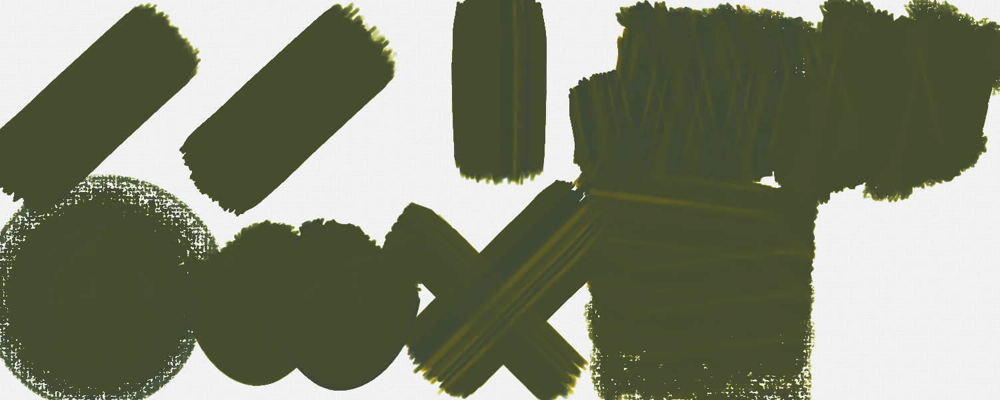

| stroke | covered | width | dark | spread | ms |
|---|---|---|---|---|---|
| light line | 51 % → 56 % | 148.0 px | 0.47 | 1.10 | 653 |
| heavy line | 53 % → 52 % | 153.8 px | 0.52 | 0.98 | 990 |
| pressure swell | 41 % → 50 % | 155.4 px | 0.53 | 1.21 | 1115 |
| fast wave | 87 % → 93 % | 101.1 px | 0.57 | 1.06 | 1809 |
| slow wave | 88 % → 86 % | 101.4 px | 0.60 | 0.98 | 3114 |
| spiral | 93 % → 92 % | 61.6 px | 0.57 | 0.99 | 4133 |
| loop | 78 % → 78 % | 101.0 px | 0.58 | 1.00 | 1670 |
| tilted | 40 % → 40 % | 110.6 px | 0.56 | 1.01 | 905 |
| over the wet one | 77 % → 79 % | 104.0 px | 0.56 | 1.03 | 779 |
| long, no reload | 99 % → 100 % | 44.6 px | 0.60 | 1.00 | 4916 | quarters: 0.72 → 0.68 → 0.60 → 0.45

Numbers say: light vs heavy: width 148.0 → 153.8 px, dark 0.47 → 0.52; pressure barely changes the width.

## Oil · Henry Ward · Thin veil #2b3a44 flat
Watercolour 0.93 · Ink 0.07 + turpentine 80 % · 96 px · 44.1 s

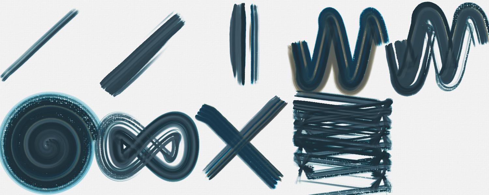

| stroke | covered | width | dark | spread | ms |
|---|---|---|---|---|---|
| light line | 3 % → 4 % | 9.5 px | 0.03 | 1.09 | 277 |
| heavy line | 17 % → 20 % | 50.1 px | 0.11 | 1.13 | 368 |
| pressure swell | 12 % → 14 % | 44.3 px | 0.13 | 1.21 | 195 |
| fast wave | 47 % → 54 % | 54.4 px | 0.10 | 1.14 | 833 |
| slow wave | 48 % → 55 % | 54.9 px | 0.10 | 1.16 | 1262 |
| spiral | 65 % → 70 % | 42.6 px | 0.10 | 1.09 | 1692 |
| loop | 40 % → 48 % | 52.2 px | 0.08 | 1.19 | 670 |
| tilted | 18 % → 19 % | 50.9 px | 0.15 | 1.03 | 532 |
| over the wet one | 28 % → 31 % | 28.0 px | 0.15 | 1.11 | 347 |
| long, no reload | 62 % → 78 % | 27.6 px | 0.11 | 1.26 | 2302 | quarters: 0.13 → 0.10 → 0.07 → 0.06

Numbers say: light vs heavy: width 9.5 → 50.1 px, dark 0.03 → 0.11.

## Oil · Henry Ward · Loaded flat #ece6c0 flat
Gouache 1.00 + turpentine 30 % · 84 px · 44.1 s

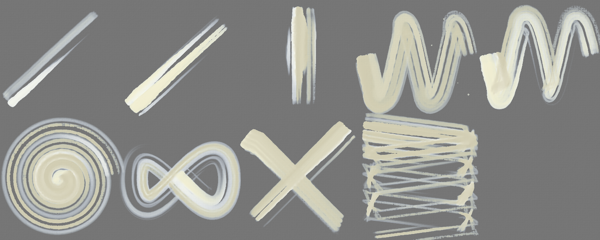

A light paint: laid on a grey sheet (on white it cannot be seen); **dark** = how far it is from the grey either way.

| stroke | covered | width | dark | spread | ms |
|---|---|---|---|---|---|
| light line | 11 % → 3 % | 30.7 px | 0.43 | 0.24 | 301 |
| heavy line | 15 % → 12 % | 42.2 px | 0.42 | 0.83 | 284 |
| pressure swell | 15 % → 9 % | 58.1 px | 0.33 | 0.58 | 243 |
| fast wave | 48 % → 29 % | 55.7 px | 0.30 | 0.61 | 778 |
| slow wave | 42 % → 28 % | 48.3 px | 0.37 | 0.68 | 1241 |
| spiral | 63 % → 34 % | 41.5 px | 0.31 | 0.54 | 1401 |
| loop | 39 % → 22 % | 50.7 px | 0.34 | 0.57 | 704 |
| tilted | 19 % → 19 % | 53.1 px | 0.33 | 1.00 | 535 |
| over the wet one | 32 % → 28 % | 36.9 px | 0.33 | 0.88 | 341 |
| long, no reload | 61 % → 32 % | 27.3 px | 0.30 | 0.53 | 1904 | quarters: 0.00 → 0.01 → 0.02 → 0.02

Numbers say: light vs heavy: width 30.7 → 42.2 px, dark 0.43 → 0.42; the long stroke does not run out of paint.

## Oil · Henry Ward · Dry scrub #ece6c0 filbert
Gouache 1.00 + turpentine 20 % · 90 px · 36.5 s

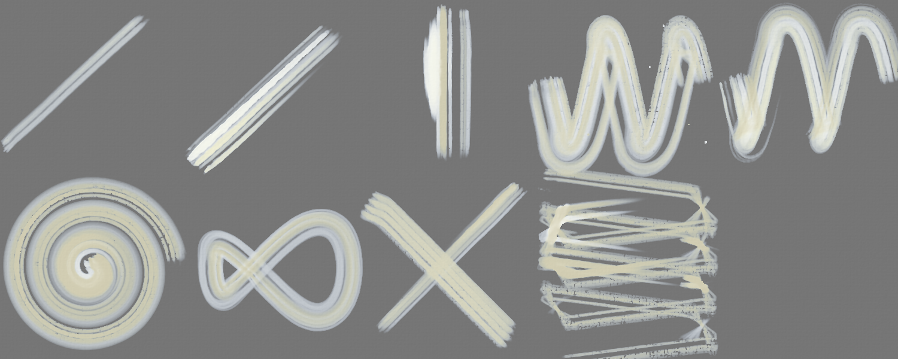

A light paint: laid on a grey sheet (on white it cannot be seen); **dark** = how far it is from the grey either way.

| stroke | covered | width | dark | spread | ms |
|---|---|---|---|---|---|
| light line | 8 % → 0 % | 23.4 px | 0.00 | 0.00 | 260 |
| heavy line | 17 % → 5 % | 49.3 px | 0.37 | 0.27 | 388 |
| pressure swell | 15 % → 5 % | 55.6 px | 0.35 | 0.33 | 231 |
| fast wave | 51 % → 8 % | 59.4 px | 0.30 | 0.16 | 827 |
| slow wave | 40 % → 7 % | 45.7 px | 0.33 | 0.19 | 1530 |
| spiral | 68 % → 8 % | 44.5 px | 0.27 | 0.12 | 1472 |
| loop | 34 % → 1 % | 43.6 px | 0.28 | 0.03 | 648 |
| tilted | 18 % → 19 % | 51.6 px | 0.28 | 1.00 | 508 |
| over the wet one | 27 % → 6 % | 24.7 px | 0.28 | 0.23 | 408 |
| long, no reload | 52 % → 8 % | 23.4 px | 0.27 | 0.14 | 2020 | quarters: 0.04 → 0.02 → 0.03 → 0.05

Numbers say: light vs heavy: width 23.4 → 49.3 px, dark 0.00 → 0.37; the long stroke does not run out of paint.

## Oil · Henry Ward · Ground #8a6a20 flat
Ink 0.65 · Watercolour 0.35 + turpentine 75 % · 160 px · 69.8 s

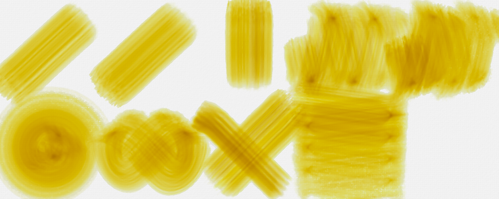

| stroke | covered | width | dark | spread | ms |
|---|---|---|---|---|---|
| light line | 51 % → 56 % | 148.0 px | 0.17 | 1.10 | 598 |
| heavy line | 53 % → 52 % | 153.8 px | 0.18 | 0.98 | 966 |
| pressure swell | 41 % → 50 % | 155.4 px | 0.19 | 1.21 | 604 |
| fast wave | 87 % → 93 % | 101.1 px | 0.21 | 1.06 | 2200 |
| slow wave | 88 % → 86 % | 101.4 px | 0.23 | 0.98 | 4016 |
| spiral | 93 % → 92 % | 61.6 px | 0.23 | 0.99 | 4418 |
| loop | 78 % → 78 % | 101.0 px | 0.22 | 1.00 | 1722 |
| tilted | 40 % → 40 % | 110.6 px | 0.22 | 1.01 | 936 |
| over the wet one | 77 % → 79 % | 104.0 px | 0.22 | 1.03 | 1005 |
| long, no reload | 99 % → 100 % | 44.6 px | 0.23 | 1.00 | 6327 | quarters: 0.30 → 0.27 → 0.21 → 0.16

Numbers say: light vs heavy: width 148.0 → 153.8 px, dark 0.17 → 0.18; pressure barely changes the width.

## Oil · Henry Ward · Loaded flat #b8bcc0 filbert
Gouache 1.00 + turpentine 35 % · 84 px · 45.5 s

A light paint: laid on a grey sheet (on white it cannot be seen); **dark** = how far it is from the grey either way.

| stroke | covered | width | dark | spread | ms |
|---|---|---|---|---|---|
| light line | 8 % → 0 % | 24.3 px | 0.00 | 0.00 | 253 |
| heavy line | 19 % → 16 % | 54.3 px | 0.34 | 0.84 | 420 |
| pressure swell | 15 % → 12 % | 55.4 px | 0.29 | 0.83 | 304 |
| fast wave | 47 % → 36 % | 54.9 px | 0.24 | 0.77 | 1032 |
| slow wave | 47 % → 28 % | 54.4 px | 0.28 | 0.60 | 1980 |
| spiral | 64 % → 29 % | 42.2 px | 0.24 | 0.46 | 1737 |
| loop | 38 % → 18 % | 49.3 px | 0.25 | 0.47 | 645 |
| tilted | 18 % → 19 % | 51.5 px | 0.23 | 1.00 | 398 |
| over the wet one | 36 % → 26 % | 48.2 px | 0.23 | 0.73 | 337 |
| long, no reload | 61 % → 34 % | 27.4 px | 0.23 | 0.56 | 1814 | quarters: 0.00 → 0.01 → 0.01 → 0.02

Numbers say: light vs heavy: width 24.3 → 54.3 px, dark 0.00 → 0.34; the long stroke does not run out of paint.

## Oil · Henry Ward · Dry scrub #c8ccd0 worn
Gouache 1.00 + turpentine 20 % · 90 px · 34.2 s

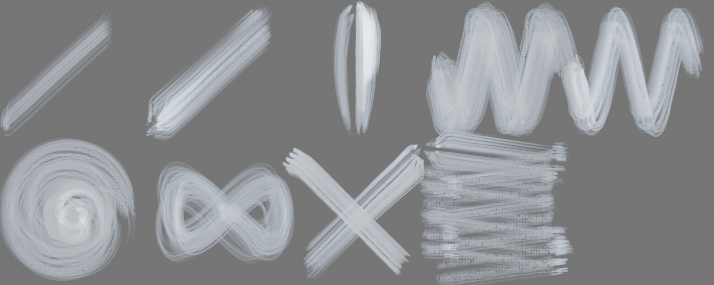

A light paint: laid on a grey sheet (on white it cannot be seen); **dark** = how far it is from the grey either way.

| stroke | covered | width | dark | spread | ms |
|---|---|---|---|---|---|
| light line | 17 % → 0 % | 48.2 px | 0.00 | 0.00 | 357 |
| heavy line | 30 % → 0 % | 85.8 px | 0.28 | 0.01 | 600 |
| pressure swell | 21 % → 6 % | 77.1 px | 0.29 | 0.28 | 325 |
| fast wave | 68 % → 7 % | 78.5 px | 0.21 | 0.10 | 1584 |
| slow wave | 51 % → 4 % | 58.7 px | 0.26 | 0.07 | 1753 |
| spiral | 72 % → 9 % | 47.6 px | 0.22 | 0.13 | 1866 |
| loop | 51 % → 1 % | 66.3 px | 0.25 | 0.01 | 1005 |
| tilted | 20 % → 20 % | 56.8 px | 0.21 | 1.00 | 537 |
| over the wet one | 41 % → 7 % | 56.6 px | 0.21 | 0.16 | 393 |
| long, no reload | 79 % → 0 % | 35.4 px | 0.17 | 0.00 | 2483 | quarters: 0.01 → 0.01 → 0.01 → 0.02

Numbers say: light vs heavy: width 48.2 → 85.8 px, dark 0.00 → 0.28; the long stroke does not run out of paint.

## Oil · Henry Ward · Wet drag #9ea4aa flat
Ink 1.00 + turpentine 65 % · 80 px · 42.4 s

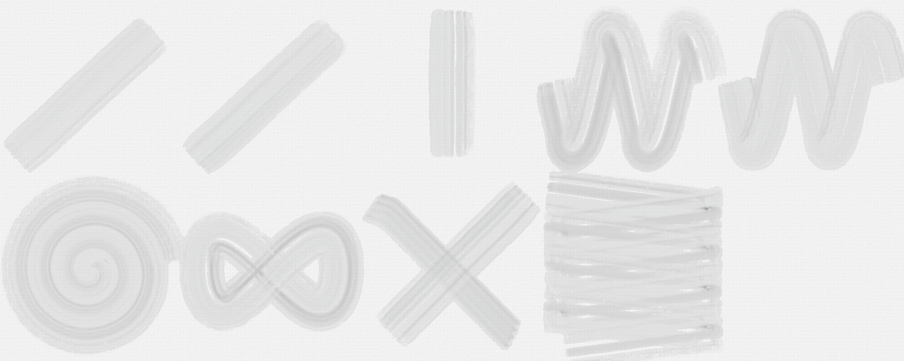

| stroke | covered | width | dark | spread | ms |
|---|---|---|---|---|---|
| light line | 8 % → 0 % | 23.9 px | 0.03 | 0.04 | 170 |
| heavy line | 20 % → 20 % | 58.7 px | 0.07 | 0.98 | 623 |
| pressure swell | 17 % → 12 % | 61.9 px | 0.06 | 0.73 | 238 |
| fast wave | 45 % → 40 % | 52.1 px | 0.07 | 0.89 | 899 |
| slow wave | 55 % → 54 % | 64.0 px | 0.07 | 0.97 | 1051 |
| spiral | 73 % → 63 % | 48.5 px | 0.07 | 0.86 | 1301 |
| loop | 47 % → 43 % | 60.5 px | 0.07 | 0.93 | 562 |
| tilted | 20 % → 20 % | 54.5 px | 0.09 | 1.02 | 460 |
| over the wet one | 32 % → 31 % | 34.7 px | 0.09 | 0.98 | 262 |
| long, no reload | 88 % → 84 % | 39.4 px | 0.07 | 0.96 | 1945 | quarters: 0.08 → 0.08 → 0.06 → 0.05

Numbers say: light vs heavy: width 23.9 → 58.7 px, dark 0.03 → 0.07.

## Oil · Henry Ward · Ground #e8b4a8 flat
Ink 0.65 · Watercolour 0.35 + turpentine 75 % · 160 px · 68.2 s

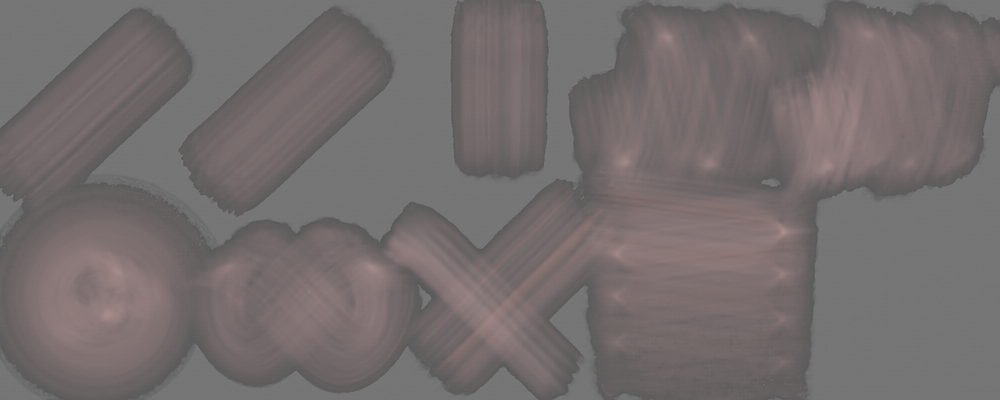

A light paint: laid on a grey sheet (on white it cannot be seen); **dark** = how far it is from the grey either way.

| stroke | covered | width | dark | spread | ms |
|---|---|---|---|---|---|
| light line | 51 % → 56 % | 148.0 px | 0.06 | 1.10 | 525 |
| heavy line | 53 % → 52 % | 153.8 px | 0.05 | 0.98 | 917 |
| pressure swell | 41 % → 50 % | 155.4 px | 0.05 | 1.21 | 623 |
| fast wave | 87 % → 93 % | 101.1 px | 0.04 | 1.06 | 1999 |
| slow wave | 88 % → 86 % | 101.4 px | 0.04 | 0.98 | 3887 |
| spiral | 93 % → 92 % | 61.6 px | 0.04 | 0.99 | 3632 |
| loop | 78 % → 78 % | 101.0 px | 0.04 | 1.00 | 1858 |
| tilted | 40 % → 40 % | 110.6 px | 0.04 | 1.01 | 1041 |
| over the wet one | 77 % → 79 % | 104.0 px | 0.04 | 1.03 | 722 |
| long, no reload | 99 % → 100 % | 44.6 px | 0.04 | 1.00 | 5744 | quarters: 0.00 → 0.01 → 0.04 → 0.06

Numbers say: light vs heavy: width 148.0 → 153.8 px, dark 0.06 → 0.05; pressure barely changes the width; the long stroke does not run out of paint.

## Oil · Henry Ward · Loaded flat #6e7f90 flat
Gouache 1.00 + turpentine 35 % · 84 px · 43.4 s

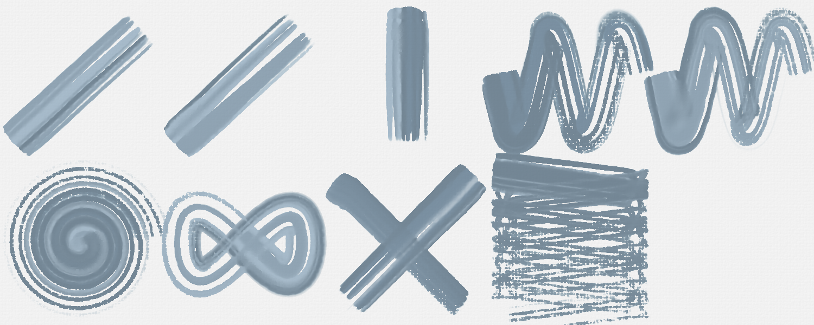

| stroke | covered | width | dark | spread | ms |
|---|---|---|---|---|---|
| light line | 11 % → 3 % | 30.6 px | 0.19 | 0.24 | 210 |
| heavy line | 15 % → 12 % | 42.2 px | 0.26 | 0.82 | 311 |
| pressure swell | 15 % → 9 % | 58.0 px | 0.33 | 0.57 | 194 |
| fast wave | 48 % → 28 % | 55.7 px | 0.37 | 0.58 | 785 |
| slow wave | 42 % → 28 % | 48.3 px | 0.28 | 0.67 | 1501 |
| spiral | 63 % → 33 % | 41.5 px | 0.36 | 0.53 | 1587 |
| loop | 39 % → 22 % | 50.4 px | 0.29 | 0.55 | 797 |
| tilted | 19 % → 19 % | 53.0 px | 0.35 | 1.01 | 603 |
| over the wet one | 32 % → 28 % | 36.9 px | 0.35 | 0.88 | 364 |
| long, no reload | 61 % → 31 % | 27.3 px | 0.36 | 0.52 | 1695 | quarters: 0.31 → 0.20 → 0.14 → 0.10

Numbers say: light vs heavy: width 30.6 → 42.2 px, dark 0.19 → 0.26.

## Oil · Henry Ward · Loaded flat #f6f6f2 filbert
Gouache 1.00 + turpentine 30 % · 84 px · 43.8 s

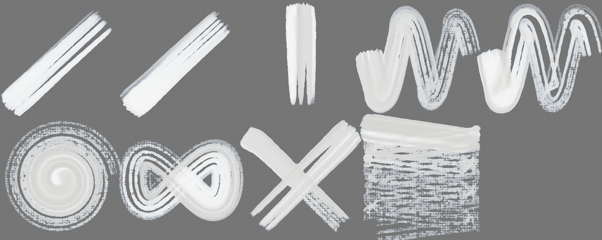

A light paint: laid on a grey sheet (on white it cannot be seen); **dark** = how far it is from the grey either way.

| stroke | covered | width | dark | spread | ms |
|---|---|---|---|---|---|
| light line | 8 % → 0 % | 24.4 px | 0.00 | 0.00 | 260 |
| heavy line | 19 % → 16 % | 54.2 px | 0.43 | 0.84 | 388 |
| pressure swell | 15 % → 12 % | 55.2 px | 0.38 | 0.84 | 220 |
| fast wave | 48 % → 38 % | 54.9 px | 0.35 | 0.79 | 1029 |
| slow wave | 47 % → 29 % | 54.3 px | 0.37 | 0.61 | 1466 |
| spiral | 64 % → 30 % | 42.3 px | 0.34 | 0.46 | 1713 |
| loop | 38 % → 19 % | 49.6 px | 0.35 | 0.49 | 917 |
| tilted | 18 % → 19 % | 51.6 px | 0.35 | 1.00 | 375 |
| over the wet one | 36 % → 26 % | 48.4 px | 0.35 | 0.74 | 327 |
| long, no reload | 61 % → 35 % | 27.3 px | 0.34 | 0.57 | 1763 | quarters: 0.00 → 0.01 → 0.02 → 0.03

Numbers say: light vs heavy: width 24.4 → 54.2 px, dark 0.00 → 0.43; the long stroke does not run out of paint.

## Oil · Henry Ward · Dry scrub #f6f6f2 filbert
Gouache 1.00 + turpentine 20 % · 90 px · 36.2 s

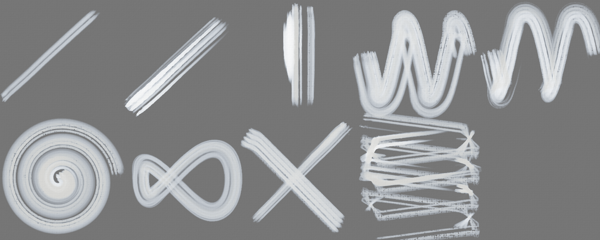

A light paint: laid on a grey sheet (on white it cannot be seen); **dark** = how far it is from the grey either way.

| stroke | covered | width | dark | spread | ms |
|---|---|---|---|---|---|
| light line | 8 % → 0 % | 23.4 px | 0.00 | 0.00 | 278 |
| heavy line | 17 % → 5 % | 49.3 px | 0.38 | 0.27 | 314 |
| pressure swell | 15 % → 5 % | 55.6 px | 0.36 | 0.33 | 292 |
| fast wave | 51 % → 8 % | 59.4 px | 0.32 | 0.16 | 978 |
| slow wave | 40 % → 7 % | 45.7 px | 0.34 | 0.19 | 1681 |
| spiral | 68 % → 8 % | 44.5 px | 0.30 | 0.12 | 1532 |
| loop | 34 % → 1 % | 43.6 px | 0.30 | 0.03 | 680 |
| tilted | 18 % → 19 % | 51.6 px | 0.30 | 1.00 | 579 |
| over the wet one | 27 % → 6 % | 24.7 px | 0.30 | 0.23 | 352 |
| long, no reload | 52 % → 8 % | 23.4 px | 0.30 | 0.14 | 1945 | quarters: 0.04 → 0.02 → 0.03 → 0.05

Numbers say: light vs heavy: width 23.4 → 49.3 px, dark 0.00 → 0.38; the long stroke does not run out of paint.

## Oil · Henry Ward · Ground #e8e2da flat
Gouache 1.00 + turpentine 30 % · 160 px · 77.4 s

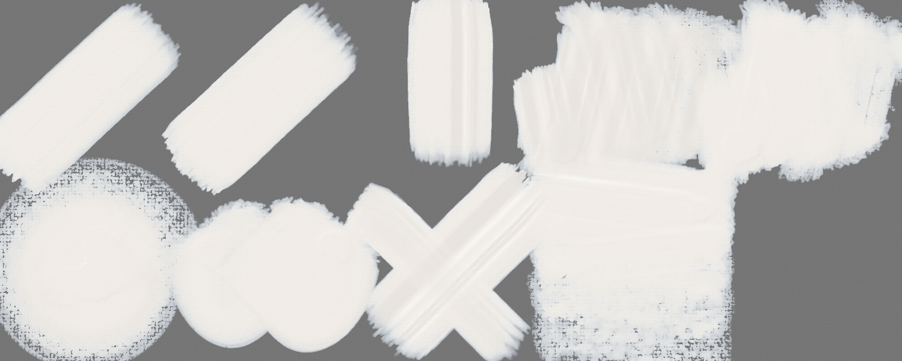

A light paint: laid on a grey sheet (on white it cannot be seen); **dark** = how far it is from the grey either way.

| stroke | covered | width | dark | spread | ms |
|---|---|---|---|---|---|
| light line | 51 % → 43 % | 148.1 px | 0.37 | 0.84 | 720 |
| heavy line | 52 % → 45 % | 151.1 px | 0.37 | 0.87 | 947 |
| pressure swell | 41 % → 43 % | 154.5 px | 0.36 | 1.04 | 673 |
| fast wave | 85 % → 83 % | 97.9 px | 0.36 | 0.98 | 2570 |
| slow wave | 86 % → 70 % | 99.3 px | 0.37 | 0.81 | 4320 |
| spiral | 89 % → 64 % | 58.5 px | 0.36 | 0.72 | 3700 |
| loop | 75 % → 67 % | 97.0 px | 0.37 | 0.89 | 1905 |
| tilted | 38 % → 38 % | 107.0 px | 0.37 | 1.00 | 1243 |
| over the wet one | 76 % → 69 % | 104.8 px | 0.37 | 0.90 | 940 |
| long, no reload | 99 % → 85 % | 44.3 px | 0.36 | 0.86 | 6029 | quarters: 0.00 → 0.00 → 0.00 → 0.00

Numbers say: light vs heavy: width 148.1 → 151.1 px, dark 0.37 → 0.37; pressure barely changes the width.

## Oil · Henry Ward · Loaded flat #6a7a80 flat
Gouache 1.00 + turpentine 35 % · 84 px · 43.8 s

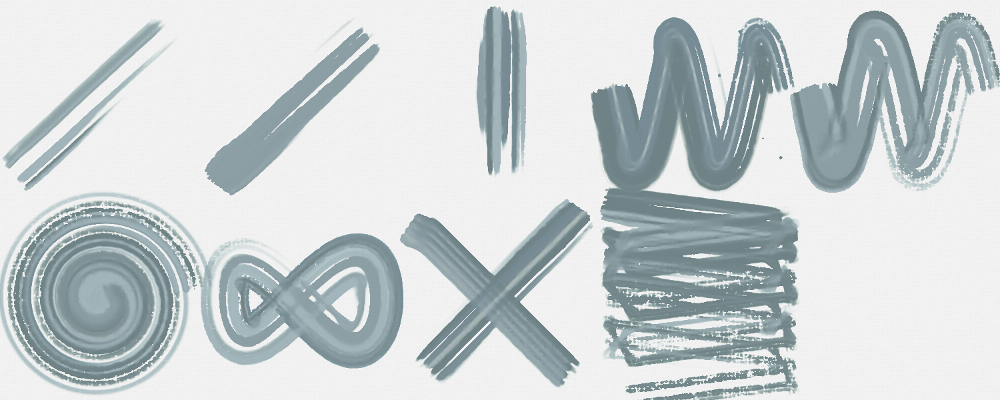

| stroke | covered | width | dark | spread | ms |
|---|---|---|---|---|---|
| light line | 11 % → 3 % | 30.6 px | 0.21 | 0.24 | 264 |
| heavy line | 15 % → 12 % | 42.2 px | 0.27 | 0.82 | 301 |
| pressure swell | 15 % → 9 % | 58.0 px | 0.35 | 0.57 | 278 |
| fast wave | 48 % → 28 % | 55.7 px | 0.39 | 0.58 | 694 |
| slow wave | 42 % → 28 % | 48.3 px | 0.30 | 0.67 | 1540 |
| spiral | 63 % → 33 % | 41.5 px | 0.37 | 0.53 | 1582 |
| loop | 39 % → 22 % | 50.4 px | 0.30 | 0.55 | 631 |
| tilted | 19 % → 19 % | 53.0 px | 0.37 | 1.01 | 457 |
| over the wet one | 32 % → 28 % | 36.9 px | 0.37 | 0.88 | 269 |
| long, no reload | 61 % → 31 % | 27.3 px | 0.38 | 0.52 | 1692 | quarters: 0.32 → 0.21 → 0.15 → 0.10

Numbers say: light vs heavy: width 30.6 → 42.2 px, dark 0.21 → 0.27.

## Oil · Henry Ward · Loaded flat #5a1810 flat
Gouache 1.00 + turpentine 35 % · 84 px · 43.6 s

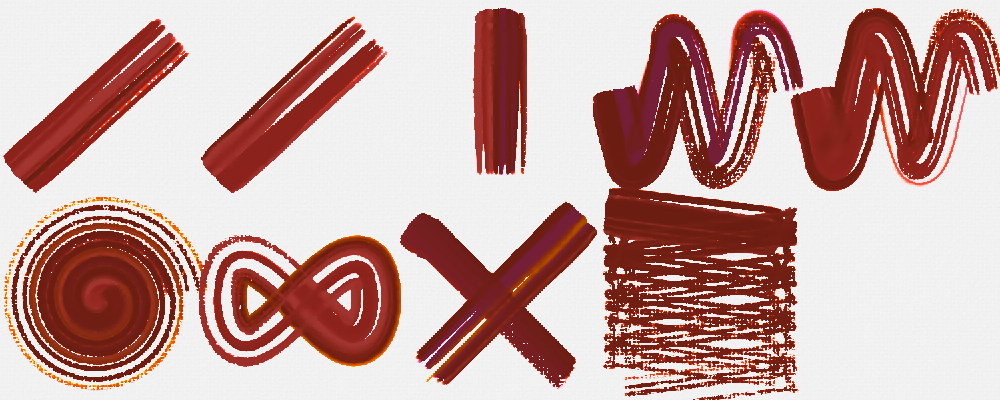

| stroke | covered | width | dark | spread | ms |
|---|---|---|---|---|---|
| light line | 11 % → 3 % | 30.6 px | 0.53 | 0.24 | 253 |
| heavy line | 15 % → 12 % | 42.2 px | 0.59 | 0.82 | 257 |
| pressure swell | 15 % → 9 % | 58.0 px | 0.61 | 0.57 | 225 |
| fast wave | 48 % → 28 % | 55.7 px | 0.64 | 0.58 | 804 |
| slow wave | 42 % → 28 % | 48.3 px | 0.60 | 0.67 | 1261 |
| spiral | 63 % → 33 % | 41.5 px | 0.63 | 0.53 | 1539 |
| loop | 39 % → 22 % | 50.4 px | 0.60 | 0.55 | 708 |
| tilted | 19 % → 19 % | 53.0 px | 0.63 | 1.01 | 416 |
| over the wet one | 32 % → 28 % | 36.9 px | 0.63 | 0.88 | 361 |
| long, no reload | 61 % → 31 % | 27.3 px | 0.64 | 0.52 | 1754 | quarters: 0.56 → 0.42 → 0.34 → 0.24

Numbers say: light vs heavy: width 30.6 → 42.2 px, dark 0.53 → 0.59.

## Oil · Henry Ward · Dirty contour #1c2240 flat
Gouache 1.00 + turpentine 35 % · 34 px · 40.1 s

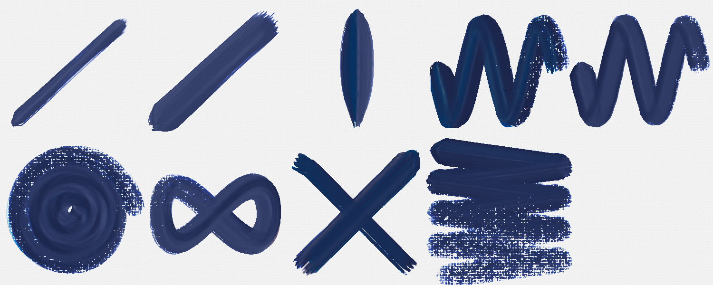

| stroke | covered | width | dark | spread | ms |
|---|---|---|---|---|---|
| light line | 11 % → 4 % | 30.7 px | 0.53 | 0.42 | 95 |
| heavy line | 24 % → 16 % | 69.3 px | 0.54 | 0.67 | 272 |
| pressure swell | 15 % → 11 % | 54.9 px | 0.58 | 0.72 | 130 |
| fast wave | 43 % → 19 % | 50.1 px | 0.63 | 0.44 | 559 |
| slow wave | 41 % → 24 % | 47.5 px | 0.59 | 0.58 | 806 |
| spiral | 59 % → 24 % | 39.1 px | 0.60 | 0.41 | 801 |
| loop | 37 % → 23 % | 47.5 px | 0.57 | 0.64 | 416 |
| tilted | 14 % → 14 % | 37.9 px | 0.63 | 1.01 | 202 |
| over the wet one | 32 % → 27 % | 52.1 px | 0.63 | 0.84 | 199 |
| long, no reload | 72 % → 28 % | 32.4 px | 0.62 | 0.39 | 1293 | quarters: 0.57 → 0.54 → 0.46 → 0.37

Numbers say: light vs heavy: width 30.7 → 69.3 px, dark 0.53 → 0.54.

## Oil · Henry Ward · Ground #22403f flat
Ink 0.65 · Watercolour 0.35 + turpentine 75 % · 160 px · 71.9 s

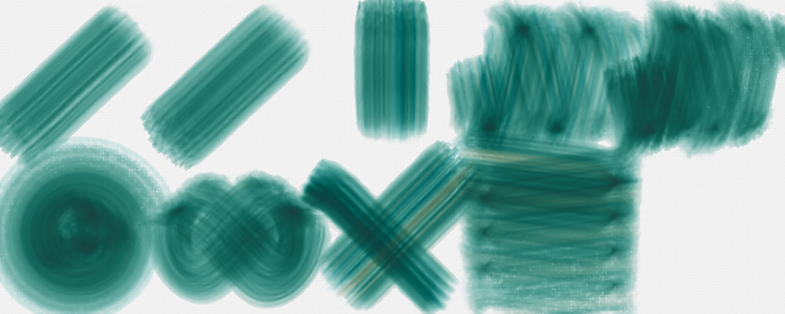

| stroke | covered | width | dark | spread | ms |
|---|---|---|---|---|---|
| light line | 51 % → 56 % | 148.0 px | 0.37 | 1.10 | 651 |
| heavy line | 53 % → 52 % | 153.8 px | 0.41 | 0.98 | 854 |
| pressure swell | 41 % → 50 % | 155.4 px | 0.42 | 1.21 | 621 |
| fast wave | 87 % → 93 % | 101.1 px | 0.47 | 1.06 | 2129 |
| slow wave | 88 % → 86 % | 101.4 px | 0.50 | 0.98 | 3607 |
| spiral | 93 % → 92 % | 61.6 px | 0.48 | 0.99 | 3615 |
| loop | 78 % → 78 % | 101.0 px | 0.48 | 1.00 | 1769 |
| tilted | 40 % → 40 % | 110.6 px | 0.46 | 1.01 | 1103 |
| over the wet one | 77 % → 79 % | 104.0 px | 0.46 | 1.03 | 945 |
| long, no reload | 99 % → 100 % | 44.6 px | 0.49 | 1.00 | 5178 | quarters: 0.62 → 0.57 → 0.47 → 0.35

Numbers say: light vs heavy: width 148.0 → 153.8 px, dark 0.37 → 0.41; pressure barely changes the width.

## Oil · Henry Ward · Loaded flat #f0b89a filbert
Gouache 1.00 + turpentine 35 % · 84 px · 45.4 s

A light paint: laid on a grey sheet (on white it cannot be seen); **dark** = how far it is from the grey either way.

| stroke | covered | width | dark | spread | ms |
|---|---|---|---|---|---|
| light line | 8 % → 0 % | 24.3 px | 0.00 | 0.00 | 220 |
| heavy line | 19 % → 16 % | 54.3 px | 0.34 | 0.84 | 358 |
| pressure swell | 15 % → 12 % | 55.4 px | 0.30 | 0.83 | 205 |
| fast wave | 47 % → 36 % | 54.9 px | 0.25 | 0.77 | 945 |
| slow wave | 47 % → 28 % | 54.4 px | 0.28 | 0.60 | 1510 |
| spiral | 64 % → 29 % | 42.2 px | 0.24 | 0.46 | 1688 |
| loop | 38 % → 18 % | 49.3 px | 0.26 | 0.47 | 870 |
| tilted | 18 % → 19 % | 51.5 px | 0.24 | 1.00 | 380 |
| over the wet one | 36 % → 26 % | 48.2 px | 0.24 | 0.73 | 406 |
| long, no reload | 61 % → 34 % | 27.4 px | 0.24 | 0.56 | 1739 | quarters: 0.00 → 0.01 → 0.01 → 0.02

Numbers say: light vs heavy: width 24.3 → 54.3 px, dark 0.00 → 0.34; the long stroke does not run out of paint.

## Oil · Henry Ward · Dry scrub #f0b89a filbert
Gouache 1.00 + turpentine 20 % · 90 px · 38.3 s

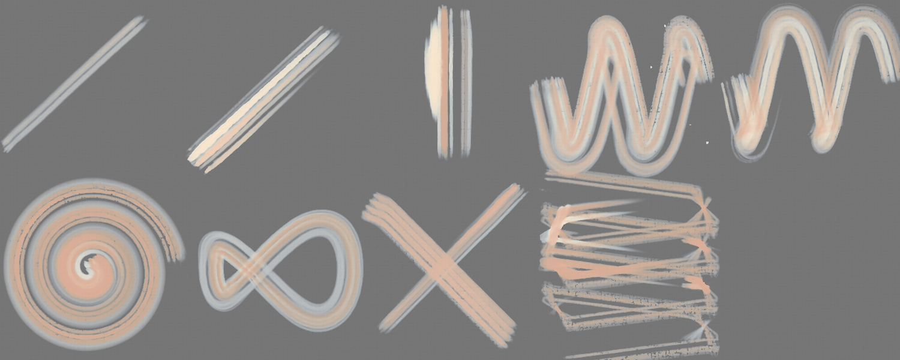

A light paint: laid on a grey sheet (on white it cannot be seen); **dark** = how far it is from the grey either way.

| stroke | covered | width | dark | spread | ms |
|---|---|---|---|---|---|
| light line | 8 % → 0 % | 23.4 px | 0.00 | 0.00 | 278 |
| heavy line | 17 % → 5 % | 49.4 px | 0.34 | 0.28 | 375 |
| pressure swell | 15 % → 5 % | 55.6 px | 0.30 | 0.32 | 208 |
| fast wave | 51 % → 8 % | 59.4 px | 0.25 | 0.15 | 1137 |
| slow wave | 40 % → 7 % | 45.8 px | 0.27 | 0.18 | 1553 |
| spiral | 68 % → 8 % | 44.6 px | 0.20 | 0.12 | 1466 |
| loop | 34 % → 1 % | 43.6 px | 0.22 | 0.03 | 806 |
| tilted | 18 % → 19 % | 51.6 px | 0.21 | 1.00 | 453 |
| over the wet one | 27 % → 6 % | 24.7 px | 0.21 | 0.22 | 258 |
| long, no reload | 52 % → 7 % | 23.4 px | 0.21 | 0.14 | 1949 | quarters: 0.03 → 0.02 → 0.02 → 0.04

Numbers say: light vs heavy: width 23.4 → 49.4 px, dark 0.00 → 0.34; the long stroke does not run out of paint.

## Oil · Henry Ward · Dirty contour #1c2238 flat
Gouache 1.00 + turpentine 35 % · 34 px · 41.9 s

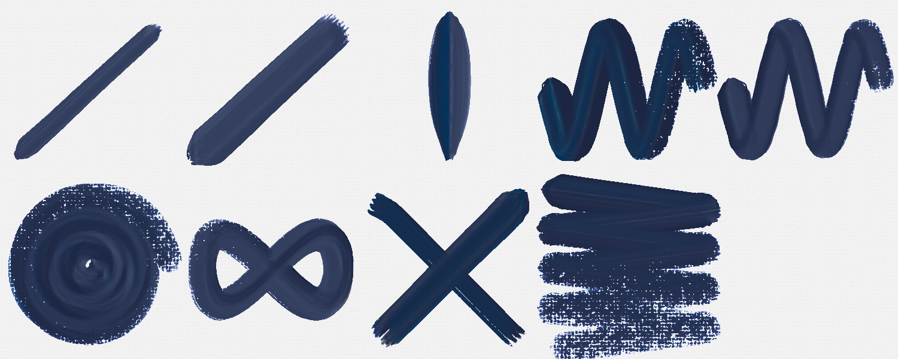

| stroke | covered | width | dark | spread | ms |
|---|---|---|---|---|---|
| light line | 11 % → 4 % | 30.7 px | 0.53 | 0.42 | 117 |
| heavy line | 24 % → 16 % | 69.3 px | 0.54 | 0.67 | 198 |
| pressure swell | 15 % → 11 % | 54.9 px | 0.58 | 0.72 | 165 |
| fast wave | 43 % → 19 % | 50.1 px | 0.63 | 0.44 | 497 |
| slow wave | 41 % → 24 % | 47.5 px | 0.59 | 0.58 | 901 |
| spiral | 59 % → 24 % | 39.1 px | 0.60 | 0.41 | 750 |
| loop | 37 % → 23 % | 47.5 px | 0.57 | 0.64 | 413 |
| tilted | 14 % → 14 % | 37.9 px | 0.63 | 1.01 | 238 |
| over the wet one | 32 % → 27 % | 52.1 px | 0.63 | 0.84 | 288 |
| long, no reload | 72 % → 28 % | 32.4 px | 0.62 | 0.39 | 1674 | quarters: 0.57 → 0.54 → 0.46 → 0.37

Numbers say: light vs heavy: width 30.7 → 69.3 px, dark 0.53 → 0.54.

## Oil · Henry Ward · Ground #ece8e2 flat
Gouache 1.00 + turpentine 30 % · 160 px · 78.4 s

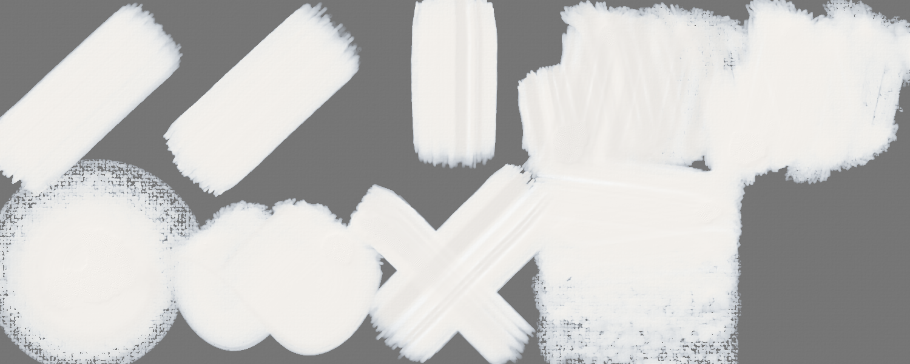

A light paint: laid on a grey sheet (on white it cannot be seen); **dark** = how far it is from the grey either way.

| stroke | covered | width | dark | spread | ms |
|---|---|---|---|---|---|
| light line | 51 % → 43 % | 148.1 px | 0.37 | 0.84 | 899 |
| heavy line | 52 % → 45 % | 151.1 px | 0.38 | 0.87 | 789 |
| pressure swell | 41 % → 43 % | 154.5 px | 0.37 | 1.04 | 693 |
| fast wave | 85 % → 83 % | 97.9 px | 0.37 | 0.98 | 2217 |
| slow wave | 86 % → 70 % | 99.3 px | 0.37 | 0.81 | 5245 |
| spiral | 89 % → 64 % | 58.5 px | 0.37 | 0.72 | 4655 |
| loop | 75 % → 67 % | 97.0 px | 0.38 | 0.89 | 1837 |
| tilted | 38 % → 38 % | 107.0 px | 0.37 | 1.00 | 1189 |
| over the wet one | 76 % → 69 % | 104.8 px | 0.37 | 0.90 | 1014 |
| long, no reload | 99 % → 85 % | 44.3 px | 0.37 | 0.86 | 6582 | quarters: 0.00 → 0.00 → 0.00 → 0.00

Numbers say: light vs heavy: width 148.1 → 151.1 px, dark 0.37 → 0.38; pressure barely changes the width.

## Oil · Henry Ward · Loaded flat #a03c1c flat
Gouache 1.00 + turpentine 35 % · 84 px · 46.2 s

| stroke | covered | width | dark | spread | ms |
|---|---|---|---|---|---|
| light line | 11 % → 3 % | 30.6 px | 0.37 | 0.24 | 254 |
| heavy line | 15 % → 12 % | 42.2 px | 0.44 | 0.82 | 581 |
| pressure swell | 15 % → 9 % | 58.0 px | 0.50 | 0.57 | 220 |
| fast wave | 48 % → 28 % | 55.7 px | 0.53 | 0.58 | 835 |
| slow wave | 42 % → 28 % | 48.3 px | 0.46 | 0.67 | 1838 |
| spiral | 63 % → 33 % | 41.5 px | 0.53 | 0.53 | 1631 |
| loop | 39 % → 22 % | 50.4 px | 0.47 | 0.55 | 677 |
| tilted | 19 % → 19 % | 53.0 px | 0.51 | 1.01 | 400 |
| over the wet one | 32 % → 28 % | 36.9 px | 0.51 | 0.88 | 276 |
| long, no reload | 61 % → 31 % | 27.3 px | 0.54 | 0.52 | 1700 | quarters: 0.46 → 0.33 → 0.27 → 0.19

Numbers say: light vs heavy: width 30.6 → 42.2 px, dark 0.37 → 0.44.

## Oil · Henry Ward · Dirty contour #1f3a2c flat
Gouache 1.00 + turpentine 35 % · 34 px · 41.1 s

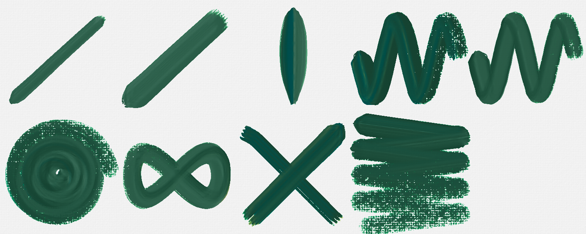

| stroke | covered | width | dark | spread | ms |
|---|---|---|---|---|---|
| light line | 11 % → 4 % | 30.7 px | 0.47 | 0.42 | 102 |
| heavy line | 24 % → 16 % | 69.3 px | 0.48 | 0.67 | 255 |
| pressure swell | 15 % → 11 % | 54.9 px | 0.53 | 0.72 | 282 |
| fast wave | 43 % → 19 % | 50.1 px | 0.58 | 0.44 | 482 |
| slow wave | 41 % → 24 % | 47.5 px | 0.53 | 0.58 | 921 |
| spiral | 59 % → 24 % | 39.1 px | 0.54 | 0.41 | 807 |
| loop | 37 % → 23 % | 47.5 px | 0.51 | 0.64 | 390 |
| tilted | 14 % → 14 % | 37.9 px | 0.58 | 1.01 | 173 |
| over the wet one | 32 % → 27 % | 52.1 px | 0.58 | 0.84 | 200 |
| long, no reload | 72 % → 28 % | 32.4 px | 0.56 | 0.39 | 1289 | quarters: 0.52 → 0.48 → 0.40 → 0.31

Numbers say: light vs heavy: width 30.7 → 69.3 px, dark 0.47 → 0.48.

## Oil · Henry Ward · Loaded flat #ecc8c8 worn
Gouache 1.00 + turpentine 35 % · 84 px · 49.8 s

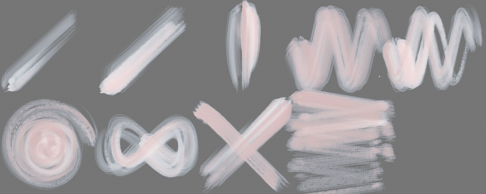

A light paint: laid on a grey sheet (on white it cannot be seen); **dark** = how far it is from the grey either way.

| stroke | covered | width | dark | spread | ms |
|---|---|---|---|---|---|
| light line | 22 % → 2 % | 63.8 px | 0.30 | 0.08 | 328 |
| heavy line | 31 % → 15 % | 91.2 px | 0.33 | 0.48 | 746 |
| pressure swell | 25 % → 11 % | 94.1 px | 0.30 | 0.44 | 338 |
| fast wave | 66 % → 37 % | 76.2 px | 0.25 | 0.56 | 1413 |
| slow wave | 56 % → 32 % | 65.1 px | 0.31 | 0.57 | 1746 |
| spiral | 67 % → 30 % | 44.1 px | 0.26 | 0.44 | 1608 |
| loop | 50 % → 25 % | 65.1 px | 0.30 | 0.51 | 989 |
| tilted | 22 % → 22 % | 62.6 px | 0.26 | 1.00 | 723 |
| over the wet one | 49 % → 35 % | 74.9 px | 0.26 | 0.71 | 555 |
| long, no reload | 90 % → 44 % | 40.3 px | 0.24 | 0.49 | 2795 | quarters: 0.00 → 0.00 → 0.01 → 0.01

Numbers say: light vs heavy: width 63.8 → 91.2 px, dark 0.30 → 0.33; the long stroke does not run out of paint.

## Oil · Henry Ward · Loaded flat #62c8e8 flat
Gouache 1.00 + turpentine 35 % · 84 px · 45.2 s

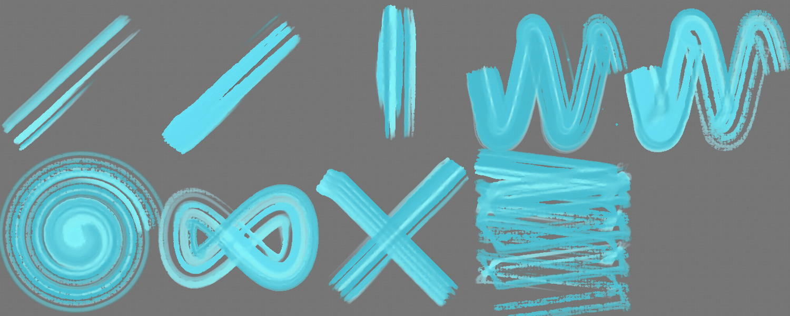

A light paint: laid on a grey sheet (on white it cannot be seen); **dark** = how far it is from the grey either way.

| stroke | covered | width | dark | spread | ms |
|---|---|---|---|---|---|
| light line | 11 % → 3 % | 30.6 px | 0.34 | 0.24 | 254 |
| heavy line | 15 % → 12 % | 42.2 px | 0.30 | 0.82 | 344 |
| pressure swell | 15 % → 9 % | 58.0 px | 0.21 | 0.57 | 319 |
| fast wave | 48 % → 28 % | 55.7 px | 0.17 | 0.58 | 720 |
| slow wave | 42 % → 28 % | 48.3 px | 0.25 | 0.67 | 1255 |
| spiral | 63 % → 33 % | 41.5 px | 0.18 | 0.53 | 1370 |
| loop | 39 % → 22 % | 50.4 px | 0.23 | 0.55 | 754 |
| tilted | 19 % → 19 % | 53.0 px | 0.20 | 1.01 | 661 |
| over the wet one | 32 % → 28 % | 36.9 px | 0.20 | 0.88 | 381 |
| long, no reload | 61 % → 31 % | 27.3 px | 0.18 | 0.52 | 1904 | quarters: 0.00 → 0.01 → 0.01 → 0.01

Numbers say: light vs heavy: width 30.6 → 42.2 px, dark 0.34 → 0.30; the long stroke does not run out of paint.

## Oil · Henry Ward · Loaded flat #0f2018 flat
Gouache 1.00 + turpentine 35 % · 84 px · 45.1 s

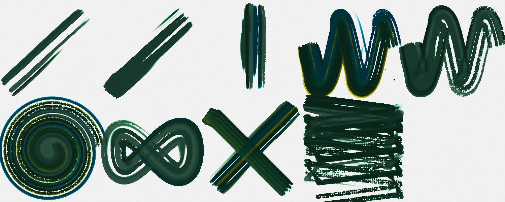

| stroke | covered | width | dark | spread | ms |
|---|---|---|---|---|---|
| light line | 11 % → 3 % | 30.6 px | 0.55 | 0.24 | 263 |
| heavy line | 15 % → 12 % | 42.2 px | 0.61 | 0.82 | 447 |
| pressure swell | 15 % → 9 % | 58.0 px | 0.66 | 0.57 | 199 |
| fast wave | 48 % → 28 % | 55.7 px | 0.68 | 0.58 | 685 |
| slow wave | 42 % → 28 % | 48.3 px | 0.63 | 0.67 | 1597 |
| spiral | 63 % → 33 % | 41.5 px | 0.68 | 0.53 | 1691 |
| loop | 39 % → 22 % | 50.4 px | 0.63 | 0.55 | 698 |
| tilted | 19 % → 19 % | 53.0 px | 0.67 | 1.01 | 547 |
| over the wet one | 32 % → 28 % | 36.9 px | 0.67 | 0.88 | 307 |
| long, no reload | 61 % → 31 % | 27.3 px | 0.69 | 0.52 | 2037 | quarters: 0.60 → 0.46 → 0.38 → 0.27

Numbers say: light vs heavy: width 30.6 → 42.2 px, dark 0.55 → 0.61.

## Oil · Henry Ward · Ground #e6e2ee flat
Gouache 1.00 + turpentine 30 % · 160 px · 76.5 s

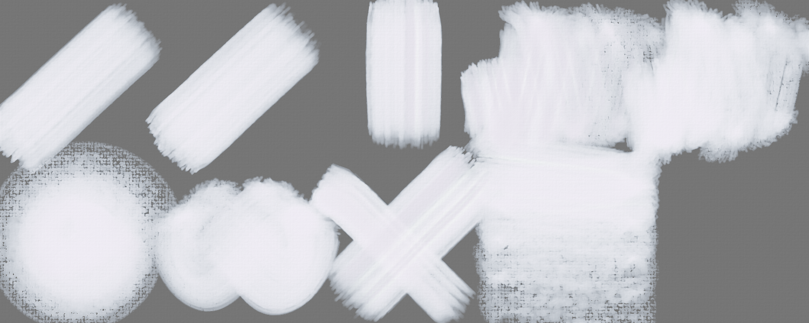

A light paint: laid on a grey sheet (on white it cannot be seen); **dark** = how far it is from the grey either way.

| stroke | covered | width | dark | spread | ms |
|---|---|---|---|---|---|
| light line | 51 % → 43 % | 148.1 px | 0.37 | 0.84 | 688 |
| heavy line | 52 % → 45 % | 151.1 px | 0.37 | 0.87 | 1132 |
| pressure swell | 41 % → 43 % | 154.5 px | 0.37 | 1.04 | 648 |
| fast wave | 85 % → 83 % | 97.9 px | 0.36 | 0.98 | 2655 |
| slow wave | 86 % → 70 % | 99.3 px | 0.37 | 0.81 | 4687 |
| spiral | 89 % → 64 % | 58.5 px | 0.37 | 0.72 | 3347 |
| loop | 75 % → 67 % | 97.0 px | 0.37 | 0.89 | 1828 |
| tilted | 38 % → 38 % | 107.0 px | 0.37 | 1.00 | 1145 |
| over the wet one | 76 % → 69 % | 104.8 px | 0.37 | 0.90 | 852 |
| long, no reload | 99 % → 85 % | 44.3 px | 0.36 | 0.86 | 5620 | quarters: 0.00 → 0.00 → 0.00 → 0.00

Numbers say: light vs heavy: width 148.1 → 151.1 px, dark 0.37 → 0.37; pressure barely changes the width.

## Oil · Henry Ward · Dry scrub #f2f0f6 filbert
Gouache 1.00 + turpentine 20 % · 90 px · 37.3 s

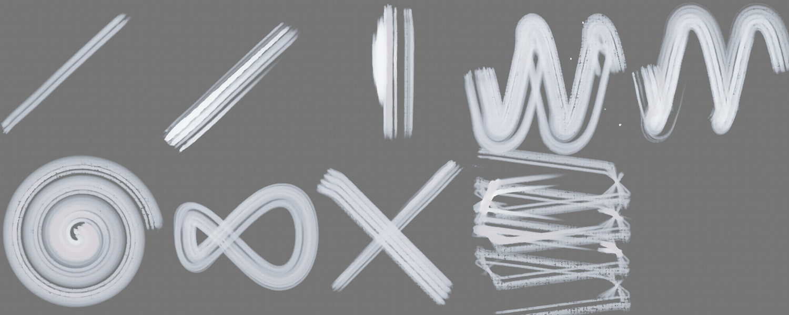

A light paint: laid on a grey sheet (on white it cannot be seen); **dark** = how far it is from the grey either way.

| stroke | covered | width | dark | spread | ms |
|---|---|---|---|---|---|
| light line | 8 % → 0 % | 23.4 px | 0.00 | 0.00 | 276 |
| heavy line | 17 % → 5 % | 49.3 px | 0.38 | 0.27 | 413 |
| pressure swell | 15 % → 5 % | 55.6 px | 0.36 | 0.33 | 395 |
| fast wave | 51 % → 8 % | 59.4 px | 0.32 | 0.16 | 1125 |
| slow wave | 40 % → 7 % | 45.7 px | 0.34 | 0.19 | 1618 |
| spiral | 68 % → 8 % | 44.5 px | 0.29 | 0.12 | 1669 |
| loop | 34 % → 1 % | 43.6 px | 0.29 | 0.03 | 662 |
| tilted | 18 % → 19 % | 51.6 px | 0.30 | 1.00 | 383 |
| over the wet one | 27 % → 6 % | 24.7 px | 0.30 | 0.23 | 268 |
| long, no reload | 52 % → 8 % | 23.4 px | 0.29 | 0.14 | 1754 | quarters: 0.04 → 0.02 → 0.03 → 0.05

Numbers say: light vs heavy: width 23.4 → 49.3 px, dark 0.00 → 0.38; the long stroke does not run out of paint.

## Oil · Henry Ward · Dirty contour #1e4a78 flat
Gouache 1.00 + turpentine 35 % · 34 px · 40.4 s

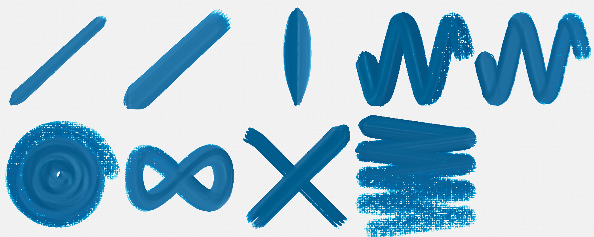

| stroke | covered | width | dark | spread | ms |
|---|---|---|---|---|---|
| light line | 11 % → 4 % | 30.7 px | 0.41 | 0.42 | 105 |
| heavy line | 24 % → 16 % | 69.3 px | 0.43 | 0.67 | 227 |
| pressure swell | 15 % → 11 % | 54.9 px | 0.47 | 0.72 | 218 |
| fast wave | 43 % → 19 % | 50.1 px | 0.53 | 0.44 | 617 |
| slow wave | 41 % → 24 % | 47.5 px | 0.48 | 0.58 | 936 |
| spiral | 59 % → 24 % | 39.1 px | 0.49 | 0.41 | 926 |
| loop | 37 % → 23 % | 47.5 px | 0.46 | 0.64 | 570 |
| tilted | 14 % → 14 % | 37.9 px | 0.53 | 1.01 | 181 |
| over the wet one | 32 % → 27 % | 52.1 px | 0.53 | 0.84 | 194 |
| long, no reload | 72 % → 28 % | 32.4 px | 0.51 | 0.39 | 1204 | quarters: 0.47 → 0.43 → 0.34 → 0.25

Numbers say: light vs heavy: width 30.7 → 69.3 px, dark 0.41 → 0.43.

## Oil · Henry Ward · Dirty contour #141414 flat
Gouache 1.00 + turpentine 35 % · 34 px · 39.6 s

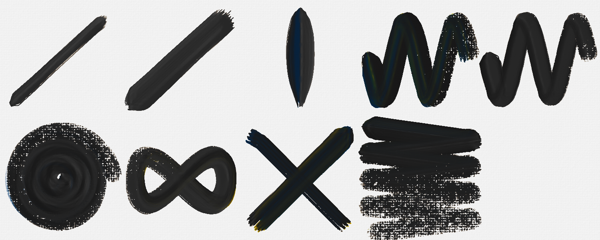

| stroke | covered | width | dark | spread | ms |
|---|---|---|---|---|---|
| light line | 11 % → 4 % | 30.7 px | 0.60 | 0.42 | 135 |
| heavy line | 24 % → 16 % | 69.3 px | 0.61 | 0.67 | 217 |
| pressure swell | 15 % → 11 % | 54.9 px | 0.64 | 0.72 | 145 |
| fast wave | 43 % → 19 % | 50.1 px | 0.68 | 0.44 | 426 |
| slow wave | 41 % → 24 % | 47.5 px | 0.65 | 0.58 | 755 |
| spiral | 59 % → 24 % | 39.1 px | 0.65 | 0.41 | 771 |
| loop | 37 % → 23 % | 47.5 px | 0.63 | 0.64 | 464 |
| tilted | 14 % → 14 % | 37.9 px | 0.67 | 1.01 | 204 |
| over the wet one | 32 % → 27 % | 52.1 px | 0.67 | 0.84 | 206 |
| long, no reload | 72 % → 28 % | 32.4 px | 0.67 | 0.39 | 1170 | quarters: 0.61 → 0.59 → 0.51 → 0.42

Numbers say: light vs heavy: width 30.7 → 69.3 px, dark 0.60 → 0.61.

## Oil · Henry Ward · Dry scrub #c89038 filbert
Gouache 1.00 + turpentine 20 % · 90 px · 35.9 s

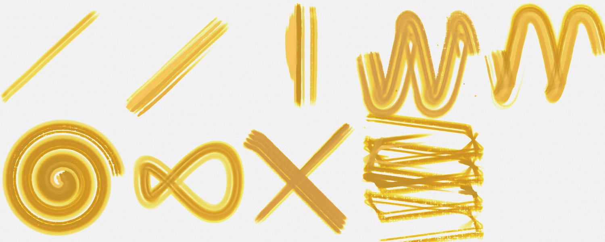

| stroke | covered | width | dark | spread | ms |
|---|---|---|---|---|---|
| light line | 8 % → 0 % | 23.4 px | 0.00 | 0.00 | 249 |
| heavy line | 17 % → 5 % | 49.4 px | 0.12 | 0.28 | 349 |
| pressure swell | 15 % → 5 % | 55.6 px | 0.17 | 0.32 | 237 |
| fast wave | 51 % → 8 % | 59.4 px | 0.21 | 0.15 | 1150 |
| slow wave | 40 % → 7 % | 45.8 px | 0.18 | 0.18 | 1569 |
| spiral | 68 % → 8 % | 44.6 px | 0.29 | 0.12 | 1416 |
| loop | 34 % → 1 % | 43.6 px | 0.23 | 0.03 | 659 |
| tilted | 18 % → 19 % | 51.6 px | 0.26 | 1.00 | 402 |
| over the wet one | 27 % → 6 % | 24.7 px | 0.26 | 0.22 | 269 |
| long, no reload | 52 % → 7 % | 23.4 px | 0.27 | 0.14 | 2423 | quarters: 0.09 → 0.14 → 0.10 → 0.04

Numbers say: light vs heavy: width 23.4 → 49.4 px, dark 0.00 → 0.12.

## Oil · Henry Ward · Ground #efe8b8 flat
Gouache 1.00 + turpentine 30 % · 160 px · 76.8 s

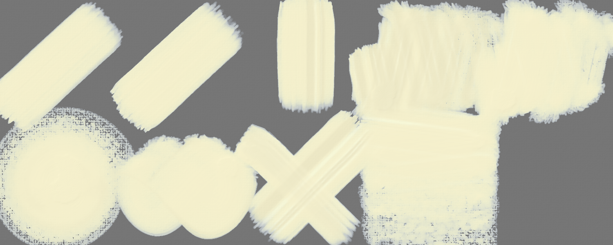

A light paint: laid on a grey sheet (on white it cannot be seen); **dark** = how far it is from the grey either way.

| stroke | covered | width | dark | spread | ms |
|---|---|---|---|---|---|
| light line | 51 % → 43 % | 148.1 px | 0.37 | 0.84 | 703 |
| heavy line | 52 % → 45 % | 151.1 px | 0.37 | 0.87 | 806 |
| pressure swell | 41 % → 43 % | 154.5 px | 0.37 | 1.04 | 639 |
| fast wave | 85 % → 83 % | 97.9 px | 0.36 | 0.98 | 2205 |
| slow wave | 86 % → 70 % | 99.3 px | 0.37 | 0.81 | 4164 |
| spiral | 89 % → 64 % | 58.5 px | 0.37 | 0.72 | 4669 |
| loop | 75 % → 67 % | 97.0 px | 0.37 | 0.89 | 2034 |
| tilted | 38 % → 38 % | 107.0 px | 0.37 | 1.00 | 1097 |
| over the wet one | 76 % → 69 % | 104.8 px | 0.37 | 0.90 | 904 |
| long, no reload | 99 % → 85 % | 44.3 px | 0.36 | 0.86 | 5714 | quarters: 0.00 → 0.00 → 0.00 → 0.00

Numbers say: light vs heavy: width 148.1 → 151.1 px, dark 0.37 → 0.37; pressure barely changes the width.

## Oil · Henry Ward · Loaded flat #a89ac8 worn
Gouache 1.00 + turpentine 35 % · 84 px · 49.0 s

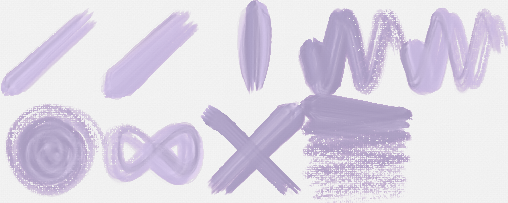

| stroke | covered | width | dark | spread | ms |
|---|---|---|---|---|---|
| light line | 22 % → 2 % | 63.8 px | 0.10 | 0.08 | 280 |
| heavy line | 31 % → 15 % | 91.2 px | 0.13 | 0.48 | 416 |
| pressure swell | 25 % → 11 % | 94.1 px | 0.18 | 0.44 | 315 |
| fast wave | 66 % → 37 % | 76.2 px | 0.24 | 0.56 | 1040 |
| slow wave | 56 % → 32 % | 65.1 px | 0.15 | 0.57 | 2032 |
| spiral | 67 % → 30 % | 44.1 px | 0.22 | 0.44 | 2421 |
| loop | 50 % → 25 % | 65.1 px | 0.13 | 0.51 | 1088 |
| tilted | 22 % → 22 % | 62.6 px | 0.21 | 1.00 | 518 |
| over the wet one | 49 % → 35 % | 74.9 px | 0.21 | 0.71 | 434 |
| long, no reload | 90 % → 44 % | 40.3 px | 0.25 | 0.49 | 2481 | quarters: 0.23 → 0.22 → 0.13 → 0.07

Numbers say: light vs heavy: width 63.8 → 91.2 px, dark 0.10 → 0.13.

## Oil · Henry Ward · Dirty contour #2a2418 flat
Gouache 1.00 + turpentine 35 % · 34 px · 41.0 s

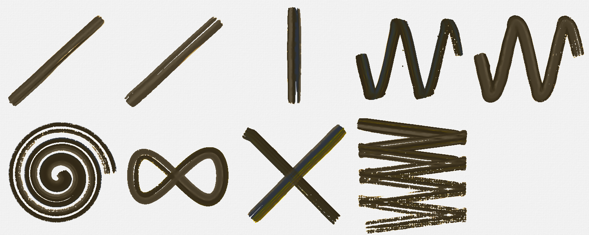

| stroke | covered | width | dark | spread | ms |
|---|---|---|---|---|---|
| light line | 11 % → 4 % | 30.7 px | 0.52 | 0.42 | 89 |
| heavy line | 24 % → 16 % | 69.3 px | 0.54 | 0.67 | 215 |
| pressure swell | 15 % → 11 % | 54.9 px | 0.57 | 0.72 | 145 |
| fast wave | 43 % → 19 % | 50.1 px | 0.62 | 0.44 | 551 |
| slow wave | 41 % → 24 % | 47.5 px | 0.58 | 0.58 | 812 |
| spiral | 59 % → 24 % | 39.1 px | 0.59 | 0.41 | 1280 |
| loop | 37 % → 23 % | 47.5 px | 0.57 | 0.64 | 551 |
| tilted | 14 % → 14 % | 37.9 px | 0.62 | 1.01 | 213 |
| over the wet one | 32 % → 27 % | 52.1 px | 0.62 | 0.84 | 248 |
| long, no reload | 72 % → 28 % | 32.4 px | 0.61 | 0.39 | 1177 | quarters: 0.56 → 0.53 → 0.45 → 0.36

Numbers say: light vs heavy: width 30.7 → 69.3 px, dark 0.52 → 0.54.

## Oil · Henry Ward · Loaded flat #2a2418 filbert
Gouache 1.00 + turpentine 35 % · 84 px · 43.6 s

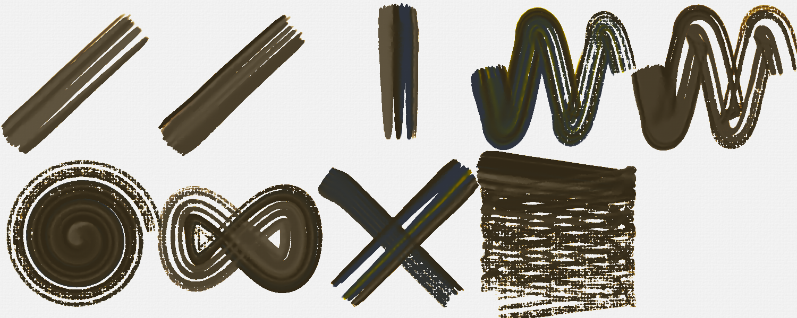

| stroke | covered | width | dark | spread | ms |
|---|---|---|---|---|---|
| light line | 8 % → 0 % | 24.3 px | 0.00 | 0.00 | 224 |
| heavy line | 19 % → 16 % | 54.3 px | 0.55 | 0.84 | 355 |
| pressure swell | 15 % → 12 % | 55.4 px | 0.58 | 0.83 | 288 |
| fast wave | 47 % → 36 % | 54.9 px | 0.62 | 0.77 | 908 |
| slow wave | 47 % → 28 % | 54.4 px | 0.60 | 0.60 | 1458 |
| spiral | 64 % → 29 % | 42.2 px | 0.64 | 0.46 | 1412 |
| loop | 38 % → 18 % | 49.3 px | 0.62 | 0.47 | 738 |
| tilted | 18 % → 19 % | 51.5 px | 0.63 | 1.00 | 438 |
| over the wet one | 36 % → 26 % | 48.2 px | 0.63 | 0.73 | 337 |
| long, no reload | 61 % → 34 % | 27.4 px | 0.63 | 0.56 | 1817 | quarters: 0.56 → 0.45 → 0.35 → 0.17

Numbers say: light vs heavy: width 24.3 → 54.3 px, dark 0.00 → 0.55.

## Oil · Henry Ward · Dry scrub #efeee6 worn
Gouache 1.00 + turpentine 20 % · 90 px · 34.1 s

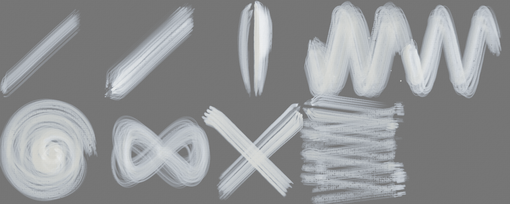

A light paint: laid on a grey sheet (on white it cannot be seen); **dark** = how far it is from the grey either way.

| stroke | covered | width | dark | spread | ms |
|---|---|---|---|---|---|
| light line | 17 % → 0 % | 48.2 px | 0.00 | 0.00 | 296 |
| heavy line | 30 % → 0 % | 85.8 px | 0.32 | 0.01 | 466 |
| pressure swell | 21 % → 6 % | 77.1 px | 0.31 | 0.28 | 332 |
| fast wave | 68 % → 7 % | 78.5 px | 0.26 | 0.10 | 1200 |
| slow wave | 51 % → 4 % | 58.7 px | 0.29 | 0.07 | 1792 |
| spiral | 72 % → 10 % | 47.6 px | 0.26 | 0.13 | 1841 |
| loop | 51 % → 1 % | 66.3 px | 0.28 | 0.01 | 978 |
| tilted | 20 % → 20 % | 56.8 px | 0.26 | 1.00 | 518 |
| over the wet one | 41 % → 7 % | 56.6 px | 0.26 | 0.17 | 473 |
| long, no reload | 79 % → 0 % | 35.4 px | 0.23 | 0.00 | 2038 | quarters: 0.01 → 0.02 → 0.01 → 0.02

Numbers say: light vs heavy: width 48.2 → 85.8 px, dark 0.00 → 0.32; the long stroke does not run out of paint.

## Oil · Henry Ward · Ground #e6e2f0 flat
Gouache 1.00 + turpentine 30 % · 160 px · 94.2 s

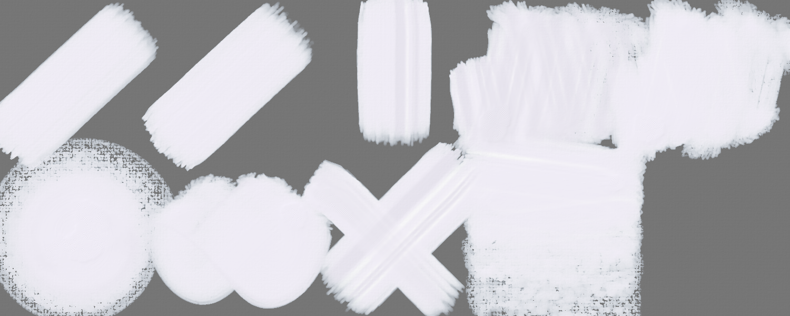

A light paint: laid on a grey sheet (on white it cannot be seen); **dark** = how far it is from the grey either way.

| stroke | covered | width | dark | spread | ms |
|---|---|---|---|---|---|
| light line | 51 % → 43 % | 148.1 px | 0.37 | 0.84 | 778 |
| heavy line | 52 % → 45 % | 151.1 px | 0.37 | 0.87 | 901 |
| pressure swell | 41 % → 43 % | 154.5 px | 0.37 | 1.04 | 634 |
| fast wave | 85 % → 83 % | 97.9 px | 0.36 | 0.98 | 2387 |
| slow wave | 86 % → 70 % | 99.3 px | 0.37 | 0.81 | 4136 |
| spiral | 89 % → 64 % | 58.5 px | 0.37 | 0.72 | 3685 |
| loop | 75 % → 67 % | 97.0 px | 0.37 | 0.89 | 1959 |
| tilted | 38 % → 38 % | 107.0 px | 0.37 | 1.00 | 1211 |
| over the wet one | 76 % → 69 % | 104.8 px | 0.37 | 0.90 | 1021 |
| long, no reload | 99 % → 85 % | 44.3 px | 0.36 | 0.86 | 5718 | quarters: 0.00 → 0.00 → 0.00 → 0.00

Numbers say: light vs heavy: width 148.1 → 151.1 px, dark 0.37 → 0.37; pressure barely changes the width.

## Oil · Henry Ward · Loaded flat #a8b84a worn
Gouache 1.00 + turpentine 35 % · 84 px · 49.7 s

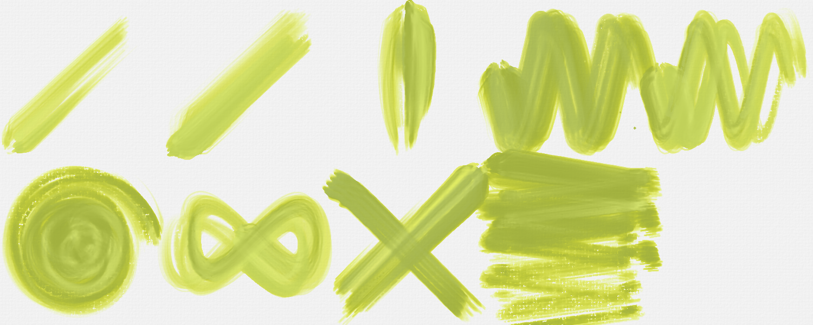

| stroke | covered | width | dark | spread | ms |
|---|---|---|---|---|---|
| light line | 22 % → 2 % | 63.8 px | 0.08 | 0.08 | 384 |
| heavy line | 31 % → 15 % | 91.2 px | 0.11 | 0.48 | 486 |
| pressure swell | 25 % → 11 % | 94.1 px | 0.16 | 0.44 | 362 |
| fast wave | 66 % → 37 % | 76.2 px | 0.21 | 0.56 | 1106 |
| slow wave | 56 % → 32 % | 65.1 px | 0.13 | 0.57 | 1946 |
| spiral | 67 % → 30 % | 44.1 px | 0.20 | 0.44 | 1914 |
| loop | 50 % → 25 % | 65.1 px | 0.12 | 0.51 | 954 |
| tilted | 22 % → 22 % | 62.6 px | 0.19 | 1.00 | 640 |
| over the wet one | 49 % → 35 % | 74.9 px | 0.19 | 0.71 | 500 |
| long, no reload | 90 % → 44 % | 40.3 px | 0.22 | 0.49 | 2451 | quarters: 0.21 → 0.20 → 0.12 → 0.07

Numbers say: light vs heavy: width 63.8 → 91.2 px, dark 0.08 → 0.11.

## Oil · Henry Ward · Thin veil #5a8a6a flat
Watercolour 0.93 · Ink 0.07 + turpentine 80 % · 96 px · 44.6 s

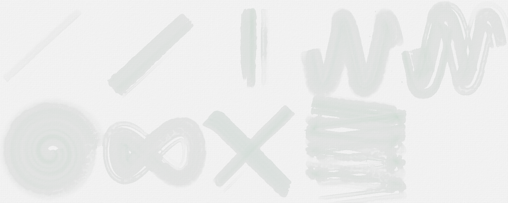

| stroke | covered | width | dark | spread | ms |
|---|---|---|---|---|---|
| light line | 3 % → 4 % | 9.5 px | 0.02 | 1.09 | 230 |
| heavy line | 17 % → 20 % | 50.1 px | 0.06 | 1.13 | 387 |
| pressure swell | 12 % → 14 % | 44.3 px | 0.06 | 1.21 | 270 |
| fast wave | 47 % → 54 % | 54.4 px | 0.06 | 1.14 | 868 |
| slow wave | 48 % → 55 % | 54.9 px | 0.06 | 1.16 | 1325 |
| spiral | 65 % → 70 % | 42.6 px | 0.06 | 1.09 | 1714 |
| loop | 40 % → 48 % | 52.2 px | 0.05 | 1.19 | 760 |
| tilted | 18 % → 19 % | 50.9 px | 0.07 | 1.03 | 681 |
| over the wet one | 28 % → 31 % | 28.0 px | 0.07 | 1.11 | 309 |
| long, no reload | 62 % → 78 % | 27.6 px | 0.06 | 1.26 | 2193 | quarters: 0.06 → 0.06 → 0.04 → 0.03

Numbers say: light vs heavy: width 9.5 → 50.1 px, dark 0.02 → 0.06.

## Oil · Henry Ward · Loaded flat #4a1420 worn
Gouache 1.00 + turpentine 35 % · 84 px · 50.9 s

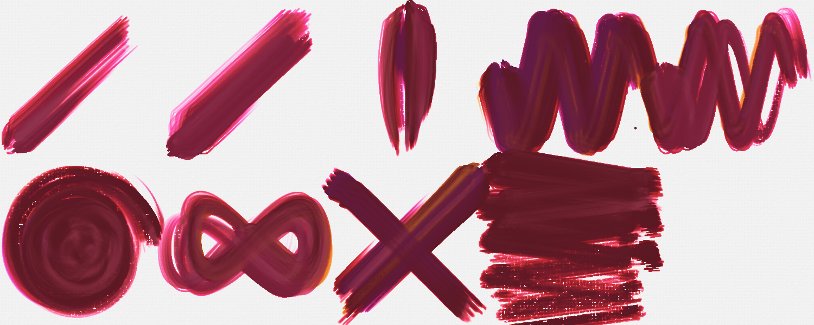

| stroke | covered | width | dark | spread | ms |
|---|---|---|---|---|---|
| light line | 22 % → 2 % | 63.8 px | 0.49 | 0.08 | 261 |
| heavy line | 31 % → 15 % | 91.2 px | 0.51 | 0.48 | 453 |
| pressure swell | 25 % → 11 % | 94.1 px | 0.52 | 0.44 | 298 |
| fast wave | 66 % → 37 % | 76.2 px | 0.55 | 0.56 | 1117 |
| slow wave | 56 % → 32 % | 65.1 px | 0.52 | 0.57 | 2064 |
| spiral | 67 % → 30 % | 44.1 px | 0.54 | 0.44 | 1942 |
| loop | 50 % → 25 % | 65.1 px | 0.50 | 0.51 | 993 |
| tilted | 22 % → 22 % | 62.6 px | 0.54 | 1.00 | 543 |
| over the wet one | 49 % → 35 % | 74.9 px | 0.54 | 0.71 | 601 |
| long, no reload | 90 % → 44 % | 40.3 px | 0.56 | 0.49 | 2234 | quarters: 0.55 → 0.54 → 0.48 → 0.41

Numbers say: light vs heavy: width 63.8 → 91.2 px, dark 0.49 → 0.51.

## Oil · Henry Ward · Dirty contour #2a0a10 flat
Gouache 1.00 + turpentine 35 % · 34 px · 44.1 s

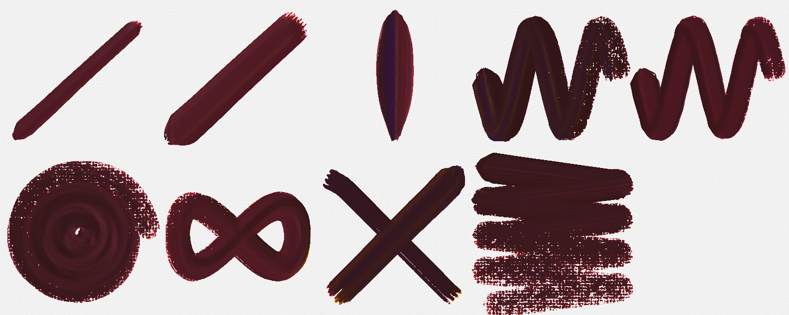

| stroke | covered | width | dark | spread | ms |
|---|---|---|---|---|---|
| light line | 11 % → 4 % | 30.7 px | 0.62 | 0.42 | 121 |
| heavy line | 24 % → 16 % | 69.3 px | 0.63 | 0.67 | 287 |
| pressure swell | 15 % → 11 % | 54.9 px | 0.64 | 0.72 | 224 |
| fast wave | 43 % → 19 % | 50.1 px | 0.67 | 0.44 | 433 |
| slow wave | 41 % → 24 % | 47.5 px | 0.65 | 0.58 | 741 |
| spiral | 59 % → 24 % | 39.1 px | 0.65 | 0.41 | 734 |
| loop | 37 % → 23 % | 47.5 px | 0.64 | 0.64 | 402 |
| tilted | 14 % → 14 % | 37.9 px | 0.66 | 1.01 | 196 |
| over the wet one | 32 % → 27 % | 52.1 px | 0.66 | 0.84 | 167 |
| long, no reload | 72 % → 28 % | 32.4 px | 0.66 | 0.39 | 1113 | quarters: 0.61 → 0.58 → 0.50 → 0.41

Numbers say: light vs heavy: width 30.7 → 69.3 px, dark 0.62 → 0.63.

## Oil · Henry Ward · Dry scrub #c0506a worn
Gouache 1.00 + turpentine 20 % · 90 px · 40.6 s

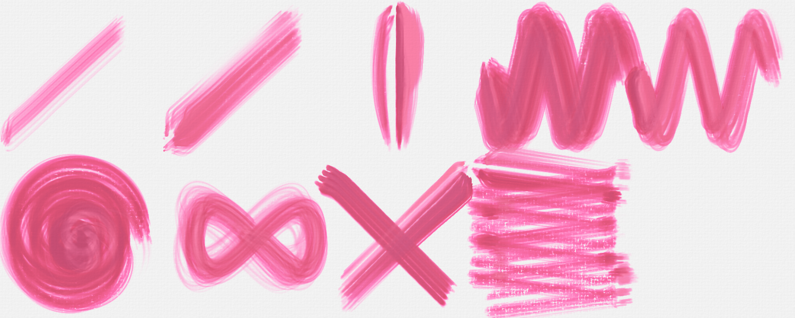

| stroke | covered | width | dark | spread | ms |
|---|---|---|---|---|---|
| light line | 17 % → 0 % | 48.2 px | 0.00 | 0.00 | 245 |
| heavy line | 30 % → 0 % | 85.8 px | 0.26 | 0.01 | 409 |
| pressure swell | 21 % → 6 % | 77.1 px | 0.26 | 0.28 | 318 |
| fast wave | 68 % → 7 % | 78.5 px | 0.34 | 0.10 | 1198 |
| slow wave | 51 % → 4 % | 58.7 px | 0.28 | 0.07 | 1653 |
| spiral | 72 % → 9 % | 47.6 px | 0.35 | 0.13 | 2033 |
| loop | 51 % → 1 % | 66.3 px | 0.26 | 0.01 | 909 |
| tilted | 20 % → 20 % | 56.8 px | 0.34 | 1.00 | 560 |
| over the wet one | 41 % → 7 % | 56.6 px | 0.34 | 0.16 | 408 |
| long, no reload | 79 % → 0 % | 35.4 px | 0.38 | 0.00 | 2806 | quarters: 0.21 → 0.16 → 0.16 → 0.11

Numbers say: light vs heavy: width 48.2 → 85.8 px, dark 0.00 → 0.26.

## Oil · Henry Ward · Ground #d8d4c8 flat
Ink 0.65 · Watercolour 0.35 + turpentine 75 % · 160 px · 98.4 s

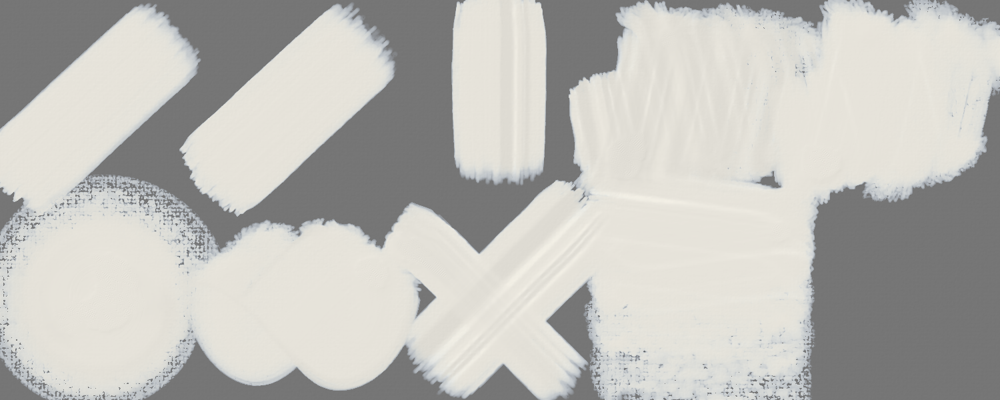

A light paint: laid on a grey sheet (on white it cannot be seen); **dark** = how far it is from the grey either way.

| stroke | covered | width | dark | spread | ms |
|---|---|---|---|---|---|
| light line | 51 % → 56 % | 148.0 px | 0.06 | 1.10 | 671 |
| heavy line | 53 % → 52 % | 153.8 px | 0.06 | 0.98 | 1043 |
| pressure swell | 41 % → 50 % | 155.4 px | 0.06 | 1.21 | 600 |
| fast wave | 87 % → 93 % | 101.1 px | 0.05 | 1.06 | 2239 |
| slow wave | 88 % → 86 % | 101.4 px | 0.04 | 0.98 | 3849 |
| spiral | 93 % → 92 % | 61.6 px | 0.04 | 0.99 | 4848 |
| loop | 78 % → 78 % | 101.0 px | 0.04 | 1.00 | 2307 |
| tilted | 40 % → 40 % | 110.6 px | 0.05 | 1.01 | 1090 |
| over the wet one | 77 % → 79 % | 104.0 px | 0.05 | 1.03 | 938 |
| long, no reload | 99 % → 100 % | 44.6 px | 0.04 | 1.00 | 8086 | quarters: 0.01 → 0.02 → 0.04 → 0.07

Numbers say: light vs heavy: width 148.0 → 153.8 px, dark 0.06 → 0.06; pressure barely changes the width; the long stroke does not run out of paint.

## Oil · Henry Ward · Loaded flat #e8d8b0 flat
Gouache 1.00 + turpentine 35 % · 84 px · 59.9 s

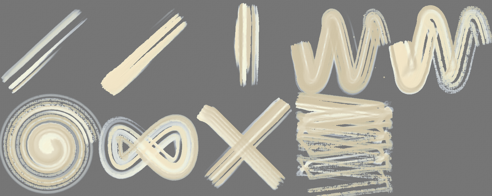

A light paint: laid on a grey sheet (on white it cannot be seen); **dark** = how far it is from the grey either way.

| stroke | covered | width | dark | spread | ms |
|---|---|---|---|---|---|
| light line | 11 % → 3 % | 30.6 px | 0.42 | 0.24 | 238 |
| heavy line | 15 % → 12 % | 42.2 px | 0.40 | 0.82 | 288 |
| pressure swell | 15 % → 9 % | 58.0 px | 0.31 | 0.57 | 215 |
| fast wave | 48 % → 28 % | 55.7 px | 0.28 | 0.58 | 719 |
| slow wave | 42 % → 28 % | 48.3 px | 0.34 | 0.67 | 1251 |
| spiral | 63 % → 33 % | 41.5 px | 0.28 | 0.53 | 1481 |
| loop | 39 % → 22 % | 50.4 px | 0.32 | 0.55 | 774 |
| tilted | 19 % → 19 % | 53.0 px | 0.30 | 1.01 | 493 |
| over the wet one | 32 % → 28 % | 36.9 px | 0.30 | 0.88 | 409 |
| long, no reload | 61 % → 31 % | 27.3 px | 0.28 | 0.52 | 2085 | quarters: 0.00 → 0.01 → 0.01 → 0.02

Numbers say: light vs heavy: width 30.6 → 42.2 px, dark 0.42 → 0.40; the long stroke does not run out of paint.

## Oil · Henry Ward · Dry scrub #f2ead0 filbert
Gouache 1.00 + turpentine 20 % · 90 px · 55.1 s

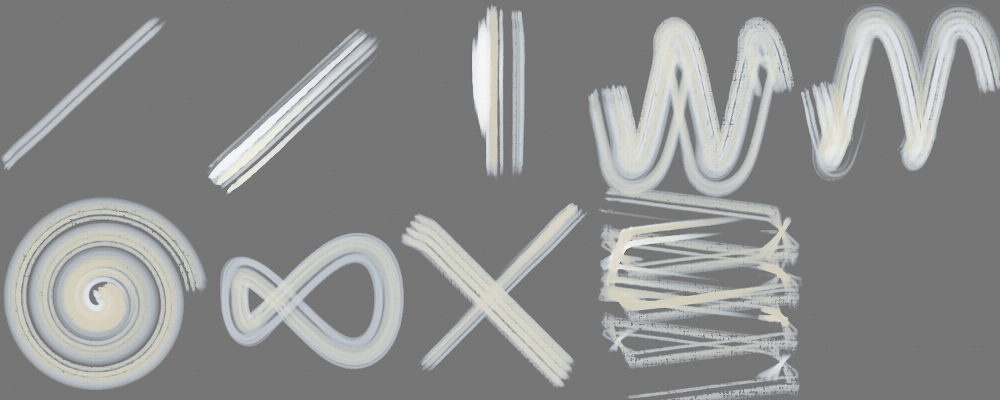

A light paint: laid on a grey sheet (on white it cannot be seen); **dark** = how far it is from the grey either way.

| stroke | covered | width | dark | spread | ms |
|---|---|---|---|---|---|
| light line | 8 % → 0 % | 23.4 px | 0.00 | 0.00 | 228 |
| heavy line | 17 % → 5 % | 49.3 px | 0.38 | 0.27 | 345 |
| pressure swell | 15 % → 5 % | 55.6 px | 0.35 | 0.33 | 245 |
| fast wave | 51 % → 8 % | 59.4 px | 0.31 | 0.16 | 1064 |
| slow wave | 40 % → 7 % | 45.7 px | 0.33 | 0.19 | 1951 |
| spiral | 68 % → 8 % | 44.5 px | 0.28 | 0.12 | 1813 |
| loop | 34 % → 1 % | 43.6 px | 0.28 | 0.03 | 772 |
| tilted | 18 % → 19 % | 51.6 px | 0.28 | 1.00 | 1072 |
| over the wet one | 27 % → 6 % | 24.7 px | 0.28 | 0.23 | 294 |
| long, no reload | 52 % → 8 % | 23.4 px | 0.28 | 0.14 | 2497 | quarters: 0.04 → 0.02 → 0.03 → 0.05

Numbers say: light vs heavy: width 23.4 → 49.3 px, dark 0.00 → 0.38; the long stroke does not run out of paint.

## Oil · Henry Ward · Loaded flat #2a1428 flat
Gouache 1.00 + turpentine 35 % · 84 px · 71.5 s

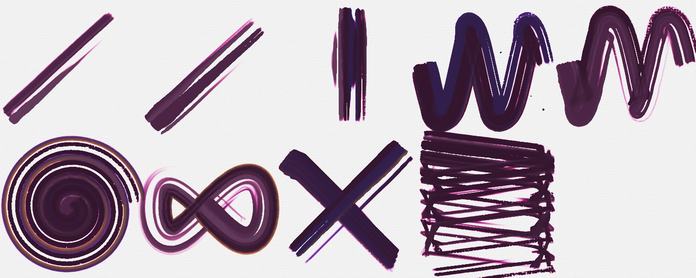

| stroke | covered | width | dark | spread | ms |
|---|---|---|---|---|---|
| light line | 11 % → 3 % | 30.6 px | 0.55 | 0.24 | 259 |
| heavy line | 15 % → 12 % | 42.2 px | 0.61 | 0.82 | 339 |
| pressure swell | 15 % → 9 % | 58.0 px | 0.66 | 0.57 | 223 |
| fast wave | 48 % → 28 % | 55.7 px | 0.68 | 0.58 | 1431 |
| slow wave | 42 % → 28 % | 48.3 px | 0.63 | 0.67 | 1467 |
| spiral | 63 % → 33 % | 41.5 px | 0.68 | 0.53 | 1738 |
| loop | 39 % → 22 % | 50.4 px | 0.63 | 0.55 | 798 |
| tilted | 19 % → 19 % | 53.0 px | 0.67 | 1.01 | 1283 |
| over the wet one | 32 % → 28 % | 36.9 px | 0.67 | 0.88 | 528 |
| long, no reload | 61 % → 31 % | 27.3 px | 0.68 | 0.52 | 4376 | quarters: 0.60 → 0.46 → 0.38 → 0.27

Numbers say: light vs heavy: width 30.6 → 42.2 px, dark 0.55 → 0.61.

## Oil · Henry Ward · Ground #e8e4e0 flat
Gouache 1.00 + turpentine 30 % · 160 px · 104.2 s

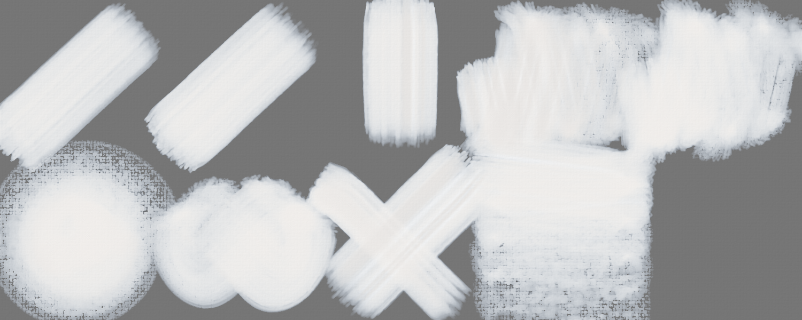

A light paint: laid on a grey sheet (on white it cannot be seen); **dark** = how far it is from the grey either way.

| stroke | covered | width | dark | spread | ms |
|---|---|---|---|---|---|
| light line | 51 % → 43 % | 148.1 px | 0.37 | 0.84 | 801 |
| heavy line | 52 % → 45 % | 151.1 px | 0.37 | 0.87 | 1548 |
| pressure swell | 41 % → 43 % | 154.5 px | 0.37 | 1.04 | 615 |
| fast wave | 85 % → 83 % | 97.9 px | 0.36 | 0.98 | 2973 |
| slow wave | 86 % → 70 % | 99.3 px | 0.37 | 0.81 | 7108 |
| spiral | 89 % → 64 % | 58.5 px | 0.37 | 0.72 | 9751 |
| loop | 75 % → 67 % | 97.0 px | 0.37 | 0.89 | 3053 |
| tilted | 38 % → 38 % | 107.0 px | 0.37 | 1.00 | 1381 |
| over the wet one | 76 % → 69 % | 104.8 px | 0.37 | 0.90 | 1318 |
| long, no reload | 99 % → 85 % | 44.3 px | 0.36 | 0.86 | 7643 | quarters: 0.00 → 0.00 → 0.00 → 0.00

Numbers say: light vs heavy: width 148.1 → 151.1 px, dark 0.37 → 0.37; pressure barely changes the width.

## Oil · Henry Ward · Loaded flat #8a2a18 filbert
Gouache 1.00 + turpentine 35 % · 84 px · 70.5 s

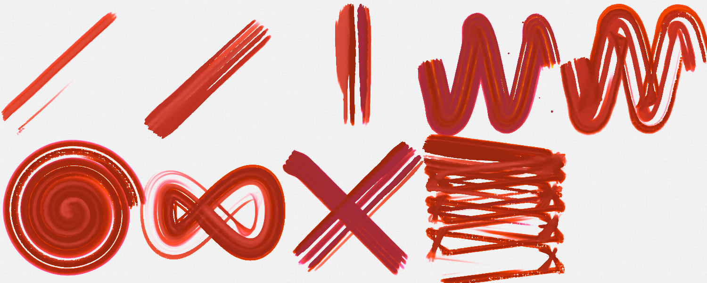

| stroke | covered | width | dark | spread | ms |
|---|---|---|---|---|---|
| light line | 8 % → 0 % | 24.3 px | 0.00 | 0.00 | 763 |
| heavy line | 19 % → 16 % | 54.3 px | 0.50 | 0.84 | 332 |
| pressure swell | 15 % → 12 % | 55.4 px | 0.52 | 0.83 | 242 |
| fast wave | 47 % → 36 % | 54.9 px | 0.56 | 0.77 | 1318 |
| slow wave | 47 % → 28 % | 54.4 px | 0.54 | 0.60 | 1624 |
| spiral | 64 % → 29 % | 42.2 px | 0.57 | 0.46 | 2674 |
| loop | 38 % → 18 % | 49.3 px | 0.55 | 0.47 | 2683 |
| tilted | 18 % → 19 % | 51.5 px | 0.57 | 1.00 | 841 |
| over the wet one | 36 % → 26 % | 48.2 px | 0.57 | 0.73 | 673 |
| long, no reload | 61 % → 34 % | 27.4 px | 0.57 | 0.56 | 2785 | quarters: 0.50 → 0.40 → 0.31 → 0.15

Numbers say: light vs heavy: width 24.3 → 54.3 px, dark 0.00 → 0.50.

## Oil · Henry Ward · Loaded flat #a8c8dc filbert
Gouache 1.00 + turpentine 35 % · 84 px · 69.4 s

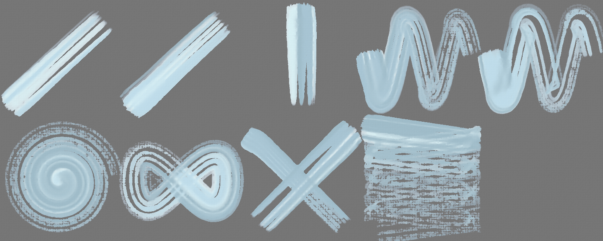

A light paint: laid on a grey sheet (on white it cannot be seen); **dark** = how far it is from the grey either way.

| stroke | covered | width | dark | spread | ms |
|---|---|---|---|---|---|
| light line | 8 % → 0 % | 24.3 px | 0.00 | 0.00 | 261 |
| heavy line | 19 % → 16 % | 54.3 px | 0.35 | 0.84 | 371 |
| pressure swell | 15 % → 12 % | 55.4 px | 0.30 | 0.83 | 431 |
| fast wave | 47 % → 36 % | 54.9 px | 0.26 | 0.77 | 2310 |
| slow wave | 47 % → 28 % | 54.4 px | 0.29 | 0.60 | 4952 |
| spiral | 64 % → 29 % | 42.2 px | 0.25 | 0.46 | 5257 |
| loop | 38 % → 18 % | 49.3 px | 0.26 | 0.47 | 1084 |
| tilted | 18 % → 19 % | 51.5 px | 0.24 | 1.00 | 728 |
| over the wet one | 36 % → 26 % | 48.2 px | 0.24 | 0.73 | 571 |
| long, no reload | 61 % → 34 % | 27.4 px | 0.25 | 0.56 | 2745 | quarters: 0.00 → 0.01 → 0.01 → 0.02

Numbers say: light vs heavy: width 24.3 → 54.3 px, dark 0.00 → 0.35; the long stroke does not run out of paint.

## Oil · Henry Ward · Dry scrub #d8e8f0 filbert
Gouache 1.00 + turpentine 20 % · 90 px · 59.2 s

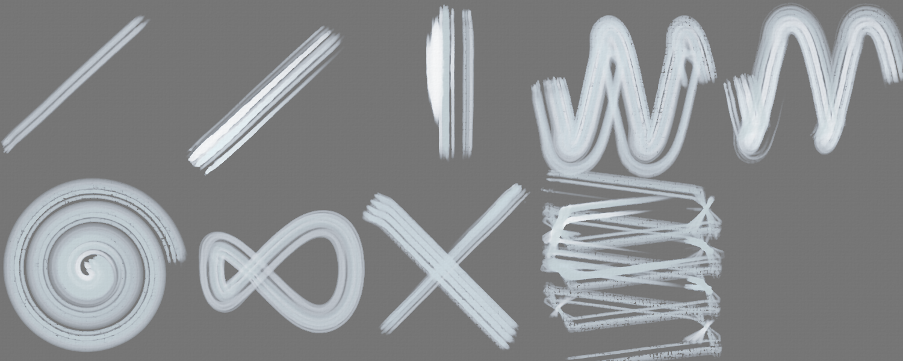

A light paint: laid on a grey sheet (on white it cannot be seen); **dark** = how far it is from the grey either way.

| stroke | covered | width | dark | spread | ms |
|---|---|---|---|---|---|
| light line | 8 % → 0 % | 23.4 px | 0.00 | 0.00 | 1224 |
| heavy line | 17 % → 5 % | 49.3 px | 0.38 | 0.27 | 1507 |
| pressure swell | 15 % → 5 % | 55.6 px | 0.35 | 0.33 | 365 |
| fast wave | 51 % → 8 % | 59.4 px | 0.30 | 0.16 | 4585 |
| slow wave | 40 % → 7 % | 45.7 px | 0.33 | 0.19 | 2298 |
| spiral | 68 % → 8 % | 44.5 px | 0.27 | 0.12 | 2506 |
| loop | 34 % → 1 % | 43.6 px | 0.28 | 0.03 | 1232 |
| tilted | 18 % → 19 % | 51.6 px | 0.28 | 1.00 | 606 |
| over the wet one | 27 % → 6 % | 24.7 px | 0.28 | 0.23 | 548 |
| long, no reload | 52 % → 8 % | 23.4 px | 0.28 | 0.14 | 2770 | quarters: 0.04 → 0.02 → 0.03 → 0.05

Numbers say: light vs heavy: width 23.4 → 49.3 px, dark 0.00 → 0.38; the long stroke does not run out of paint.

## Oil · Henry Ward · Ground #3a3a34 flat
Ink 0.65 · Watercolour 0.35 + turpentine 75 % · 160 px · 93.3 s

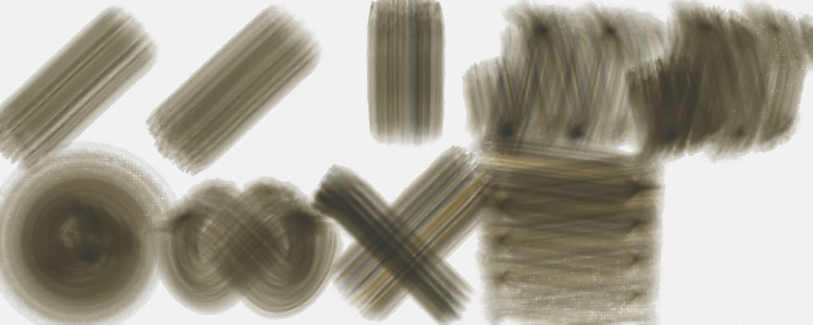

| stroke | covered | width | dark | spread | ms |
|---|---|---|---|---|---|
| light line | 51 % → 56 % | 148.0 px | 0.36 | 1.10 | 1948 |
| heavy line | 53 % → 52 % | 153.8 px | 0.40 | 0.98 | 1483 |
| pressure swell | 41 % → 50 % | 155.4 px | 0.41 | 1.21 | 3981 |
| fast wave | 87 % → 93 % | 101.1 px | 0.45 | 1.06 | 3261 |
| slow wave | 88 % → 86 % | 101.4 px | 0.49 | 0.98 | 5087 |
| spiral | 93 % → 92 % | 61.6 px | 0.47 | 0.99 | 5303 |
| loop | 78 % → 78 % | 101.0 px | 0.47 | 1.00 | 2149 |
| tilted | 40 % → 40 % | 110.6 px | 0.45 | 1.01 | 2379 |
| over the wet one | 77 % → 79 % | 104.0 px | 0.45 | 1.03 | 1659 |
| long, no reload | 99 % → 100 % | 44.6 px | 0.48 | 1.00 | 9193 | quarters: 0.62 → 0.57 → 0.47 → 0.34

Numbers say: light vs heavy: width 148.0 → 153.8 px, dark 0.36 → 0.40; pressure barely changes the width.

## Oil · Henry Ward · Loaded flat #8a906a worn
Gouache 1.00 + turpentine 35 % · 84 px · 60.7 s

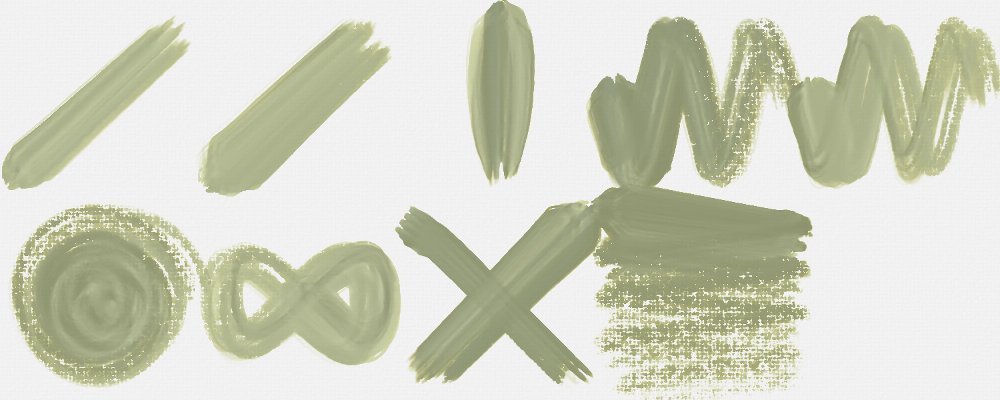

| stroke | covered | width | dark | spread | ms |
|---|---|---|---|---|---|
| light line | 22 % → 2 % | 63.8 px | 0.15 | 0.08 | 382 |
| heavy line | 31 % → 15 % | 91.2 px | 0.18 | 0.48 | 520 |
| pressure swell | 25 % → 11 % | 94.1 px | 0.23 | 0.44 | 357 |
| fast wave | 66 % → 37 % | 76.2 px | 0.29 | 0.56 | 2133 |
| slow wave | 56 % → 32 % | 65.1 px | 0.20 | 0.57 | 2403 |
| spiral | 67 % → 30 % | 44.1 px | 0.27 | 0.44 | 3327 |
| loop | 50 % → 25 % | 65.1 px | 0.19 | 0.51 | 2187 |
| tilted | 22 % → 22 % | 62.6 px | 0.26 | 1.00 | 1019 |
| over the wet one | 49 % → 35 % | 74.9 px | 0.26 | 0.71 | 812 |
| long, no reload | 90 % → 44 % | 40.3 px | 0.30 | 0.49 | 3648 | quarters: 0.28 → 0.27 → 0.17 → 0.09

Numbers say: light vs heavy: width 63.8 → 91.2 px, dark 0.15 → 0.18.

## Oil · Henry Ward · Loaded flat #7a8458 flat
Gouache 1.00 + turpentine 35 % · 84 px · 55.4 s

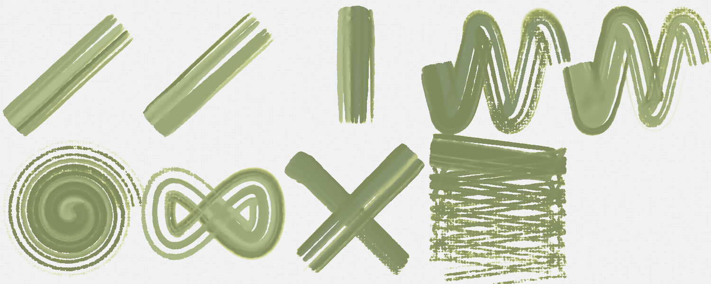

| stroke | covered | width | dark | spread | ms |
|---|---|---|---|---|---|
| light line | 11 % → 3 % | 30.6 px | 0.18 | 0.24 | 264 |
| heavy line | 15 % → 12 % | 42.2 px | 0.25 | 0.82 | 420 |
| pressure swell | 15 % → 9 % | 58.0 px | 0.32 | 0.57 | 491 |
| fast wave | 48 % → 28 % | 55.7 px | 0.37 | 0.58 | 1315 |
| slow wave | 42 % → 28 % | 48.3 px | 0.28 | 0.67 | 1708 |
| spiral | 63 % → 33 % | 41.5 px | 0.35 | 0.53 | 1861 |
| loop | 39 % → 22 % | 50.4 px | 0.28 | 0.55 | 1498 |
| tilted | 19 % → 19 % | 53.0 px | 0.35 | 1.01 | 874 |
| over the wet one | 32 % → 28 % | 36.9 px | 0.35 | 0.88 | 529 |
| long, no reload | 61 % → 31 % | 27.3 px | 0.36 | 0.52 | 2573 | quarters: 0.30 → 0.19 → 0.14 → 0.10

Numbers say: light vs heavy: width 30.6 → 42.2 px, dark 0.18 → 0.25.

## Oil · Henry Ward · Dry scrub #a8ae88 filbert
Gouache 1.00 + turpentine 20 % · 90 px · 48.5 s

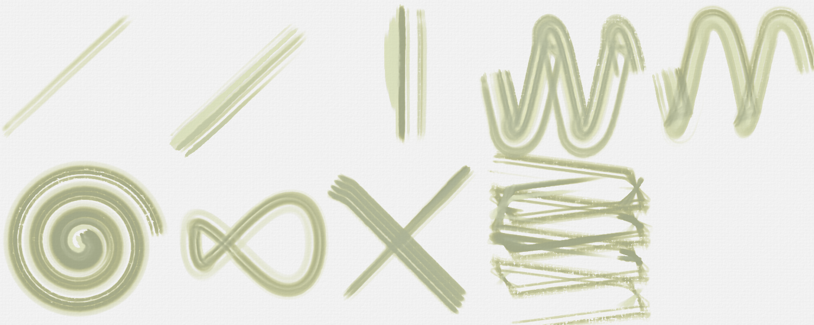

| stroke | covered | width | dark | spread | ms |
|---|---|---|---|---|---|
| light line | 8 % → 0 % | 23.4 px | 0.00 | 0.00 | 438 |
| heavy line | 17 % → 5 % | 49.4 px | 0.06 | 0.28 | 419 |
| pressure swell | 15 % → 5 % | 55.6 px | 0.12 | 0.32 | 344 |
| fast wave | 51 % → 8 % | 59.4 px | 0.16 | 0.15 | 1375 |
| slow wave | 40 % → 7 % | 45.8 px | 0.13 | 0.18 | 1945 |
| spiral | 68 % → 8 % | 44.6 px | 0.24 | 0.12 | 2816 |
| loop | 34 % → 1 % | 43.6 px | 0.18 | 0.03 | 1639 |
| tilted | 18 % → 19 % | 51.6 px | 0.21 | 1.00 | 693 |
| over the wet one | 27 % → 6 % | 24.7 px | 0.21 | 0.22 | 458 |
| long, no reload | 52 % → 7 % | 23.4 px | 0.22 | 0.14 | 2785 | quarters: 0.06 → 0.10 → 0.07 → 0.03

Numbers say: light vs heavy: width 23.4 → 49.4 px, dark 0.00 → 0.06.

## v3 · Any shape · K stamp
Gouache 1.00 · 48 px · 44.3 s

| stroke | covered | width | dark | spread | ms |
|---|---|---|---|---|---|
| light line | 20 % → 18 % | 59.0 px | 0.40 | 0.91 | 233 |
| heavy line | 20 % → 19 % | 59.2 px | 0.40 | 0.95 | 220 |
| pressure swell | 12 % → 11 % | 43.7 px | 0.40 | 0.98 | 196 |
| fast wave | 42 % → 34 % | 48.2 px | 0.40 | 0.82 | 576 |
| slow wave | 42 % → 33 % | 48.3 px | 0.40 | 0.80 | 887 |
| spiral | 66 % → 49 % | 43.6 px | 0.40 | 0.74 | 1010 |
| loop | 37 % → 33 % | 48.2 px | 0.40 | 0.90 | 514 |
| tilted | 15 % → 15 % | 42.0 px | 0.40 | 1.01 | 322 |
| over the wet one | 33 % → 31 % | 51.2 px | 0.40 | 0.94 | 274 |
| long, no reload | 81 % → 51 % | 36.5 px | 0.40 | 0.63 | 1699 | quarters: 0.35 → 0.35 → 0.33 → 0.31

Numbers say: light vs heavy: width 59.0 → 59.2 px, dark 0.40 → 0.40; pressure barely changes the width; the long stroke does not run out of paint.

## v3 · Any shape · K of hairs
Oil 1.00 · 48 px · 18.4 s

| stroke | covered | width | dark | spread | ms |
|---|---|---|---|---|---|
| light line | 18 % → 18 % | 51.3 px | 0.40 | 1.00 | 150 |
| heavy line | 27 % → 27 % | 78.5 px | 0.46 | 1.00 | 166 |
| pressure swell | 16 % → 16 % | 58.2 px | 0.47 | 1.01 | 107 |
| fast wave | 49 % → 51 % | 57.1 px | 0.45 | 1.04 | 434 |
| slow wave | 50 % → 50 % | 58.1 px | 0.48 | 1.00 | 718 |
| spiral | 68 % → 68 % | 44.6 px | 0.45 | 1.00 | 673 |
| loop | 46 % → 46 % | 59.0 px | 0.48 | 1.00 | 495 |
| tilted | 16 % → 16 % | 45.9 px | 0.46 | 1.00 | 226 |
| over the wet one | 39 % → 39 % | 62.7 px | 0.46 | 1.01 | 289 |
| long, no reload | 85 % → 85 % | 38.0 px | 0.43 | 1.00 | 1236 | quarters: 0.48 → 0.45 → 0.34 → 0.27

Numbers say: light vs heavy: width 51.3 → 78.5 px, dark 0.40 → 0.46.

## v3 · Any shape · Star stamp
Gouache 1.00 · 44 px · 38.0 s

A light paint: laid on a grey sheet (on white it cannot be seen); **dark** = how far it is from the grey either way.

| stroke | covered | width | dark | spread | ms |
|---|---|---|---|---|---|
| light line | 13 % → 10 % | 37.9 px | 0.36 | 0.79 | 145 |
| heavy line | 13 % → 12 % | 38.5 px | 0.36 | 0.88 | 103 |
| pressure swell | 10 % → 10 % | 39.2 px | 0.36 | 0.93 | 150 |
| fast wave | 33 % → 27 % | 38.0 px | 0.36 | 0.83 | 310 |
| slow wave | 33 % → 26 % | 38.4 px | 0.35 | 0.79 | 851 |
| spiral | 56 % → 42 % | 37.3 px | 0.35 | 0.75 | 690 |
| loop | 28 % → 24 % | 36.0 px | 0.36 | 0.88 | 401 |
| tilted | 13 % → 13 % | 36.9 px | 0.36 | 1.01 | 166 |
| over the wet one | 26 % → 23 % | 36.3 px | 0.36 | 0.89 | 121 |
| long, no reload | 68 % → 47 % | 30.5 px | 0.35 | 0.70 | 679 | quarters: 0.01 → 0.01 → 0.01 → 0.01

Numbers say: light vs heavy: width 37.9 → 38.5 px, dark 0.36 → 0.36; pressure barely changes the width; the long stroke does not run out of paint.

## v3 · Any shape · Star of hairs
Oil 1.00 · 44 px · 17.0 s

| stroke | covered | width | dark | spread | ms |
|---|---|---|---|---|---|
| light line | 15 % → 15 % | 43.7 px | 0.34 | 1.00 | 180 |
| heavy line | 23 % → 23 % | 68.0 px | 0.32 | 1.00 | 170 |
| pressure swell | 14 % → 14 % | 53.2 px | 0.35 | 1.00 | 123 |
| fast wave | 45 % → 46 % | 52.0 px | 0.32 | 1.01 | 405 |
| slow wave | 44 % → 44 % | 51.0 px | 0.33 | 1.00 | 1040 |
| spiral | 64 % → 64 % | 41.9 px | 0.32 | 1.00 | 775 |
| loop | 39 % → 39 % | 50.6 px | 0.34 | 1.00 | 450 |
| tilted | 14 % → 14 % | 39.2 px | 0.34 | 1.00 | 256 |
| over the wet one | 34 % → 34 % | 55.5 px | 0.34 | 1.00 | 222 |
| long, no reload | 79 % → 79 % | 35.3 px | 0.30 | 1.00 | 985 | quarters: 0.32 → 0.29 → 0.24 → 0.17

Numbers say: light vs heavy: width 43.7 → 68.0 px, dark 0.34 → 0.32.

## v3 · Any shape · Rag
Oil 1.00 · 60 px · 21.9 s

| stroke | covered | width | dark | spread | ms |
|---|---|---|---|---|---|
| light line | 22 % → 24 % | 62.8 px | 0.16 | 1.12 | 201 |
| heavy line | 38 % → 38 % | 111.4 px | 0.29 | 1.00 | 319 |
| pressure swell | 25 % → 26 % | 93.9 px | 0.23 | 1.02 | 264 |
| fast wave | 68 % → 73 % | 79.1 px | 0.26 | 1.07 | 1095 |
| slow wave | 71 % → 71 % | 82.1 px | 0.27 | 1.00 | 1606 |
| spiral | 82 % → 82 % | 53.9 px | 0.28 | 1.00 | 1448 |
| loop | 61 % → 61 % | 79.5 px | 0.29 | 1.00 | 595 |
| tilted | 22 % → 22 % | 61.2 px | 0.26 | 1.00 | 267 |
| over the wet one | 51 % → 52 % | 80.3 px | 0.26 | 1.03 | 214 |
| long, no reload | 94 % → 94 % | 42.2 px | 0.29 | 1.00 | 1703 | quarters: 0.35 → 0.32 → 0.27 → 0.21

Numbers say: light vs heavy: width 62.8 → 111.4 px, dark 0.16 → 0.29.

## v3 · Any shape · Dry oil on canvas
Oil 1.00 · 40 px · 14.1 s

A light paint: laid on a grey sheet (on white it cannot be seen); **dark** = how far it is from the grey either way.

| stroke | covered | width | dark | spread | ms |
|---|---|---|---|---|---|
| light line | 5 % → 5 % | 13.4 px | 0.14 | 1.00 | 86 |
| heavy line | 8 % → 8 % | 23.6 px | 0.35 | 1.00 | 87 |
| pressure swell | 9 % → 9 % | 32.6 px | 0.27 | 1.00 | 82 |
| fast wave | 27 % → 27 % | 31.8 px | 0.25 | 1.00 | 335 |
| slow wave | 26 % → 26 % | 30.4 px | 0.24 | 1.00 | 557 |
| spiral | 46 % → 46 % | 30.2 px | 0.24 | 1.00 | 527 |
| loop | 21 % → 21 % | 27.4 px | 0.24 | 1.00 | 291 |
| tilted | 9 % → 9 % | 26.5 px | 0.23 | 1.00 | 143 |
| over the wet one | 18 % → 18 % | 23.1 px | 0.23 | 1.00 | 123 |
| long, no reload | 41 % → 41 % | 18.3 px | 0.21 | 1.00 | 662 | quarters: 0.00 → 0.00 → 0.01 → 0.00

Numbers say: light vs heavy: width 13.4 → 23.6 px, dark 0.14 → 0.35; the long stroke does not run out of paint.

## v3 · Any shape · Two colours streaks
Oil 1.00 · 44 px · 16.1 s

| stroke | covered | width | dark | spread | ms |
|---|---|---|---|---|---|
| light line | 14 % → 14 % | 39.7 px | 0.35 | 1.00 | 142 |
| heavy line | 16 % → 16 % | 46.1 px | 0.30 | 1.00 | 124 |
| pressure swell | 11 % → 11 % | 42.7 px | 0.39 | 1.00 | 139 |
| fast wave | 37 % → 37 % | 43.1 px | 0.34 | 1.00 | 472 |
| slow wave | 36 % → 36 % | 41.1 px | 0.30 | 1.00 | 631 |
| spiral | 62 % → 62 % | 40.6 px | 0.35 | 1.00 | 664 |
| loop | 32 % → 32 % | 41.1 px | 0.32 | 1.00 | 364 |
| tilted | 13 % → 13 % | 37.2 px | 0.36 | 1.00 | 241 |
| over the wet one | 27 % → 27 % | 39.1 px | 0.36 | 1.00 | 133 |
| long, no reload | 73 % → 73 % | 32.8 px | 0.32 | 1.00 | 820 | quarters: 0.29 → 0.28 → 0.25 → 0.20

Numbers say: light vs heavy: width 39.7 → 46.1 px, dark 0.35 → 0.30.

## Watercolour · Wash
Watercolour 1.00 + water 65 % · 60 px · 40.5 s

| stroke | covered | width | dark | spread | ms |
|---|---|---|---|---|---|
| light line | 15 % → 18 % | 43.3 px | 0.14 | 1.23 | 130 |
| heavy line | 30 % → 30 % | 86.5 px | 0.13 | 1.01 | 249 |
| pressure swell | 18 % → 19 % | 68.1 px | 0.16 | 1.06 | 150 |
| fast wave | 57 % → 59 % | 65.8 px | 0.13 | 1.04 | 501 |
| slow wave | 53 % → 55 % | 61.7 px | 0.14 | 1.02 | 765 |
| spiral | 70 % → 71 % | 46.4 px | 0.11 | 1.01 | 802 |
| loop | 46 % → 48 % | 60.0 px | 0.13 | 1.03 | 403 |
| tilted | 21 % → 21 % | 57.6 px | 0.15 | 1.01 | 271 |
| over the wet one | 42 % → 45 % | 60.4 px | 0.15 | 1.06 | 323 |
| long, no reload | 89 % → 91 % | 39.7 px | 0.09 | 1.03 | 1451 | quarters: 0.14 → 0.11 → 0.07 → 0.04

Numbers say: light vs heavy: width 43.3 → 86.5 px, dark 0.14 → 0.13.

## Watercolour · Wet-in-wet
Watercolour 1.00 + water 80 % · 60 px · 47.0 s

| stroke | covered | width | dark | spread | ms |
|---|---|---|---|---|---|
| light line | 13 % → 30 % | 37.6 px | 0.17 | 2.31 | 92 |
| heavy line | 25 % → 38 % | 73.7 px | 0.19 | 1.52 | 200 |
| pressure swell | 16 % → 28 % | 58.1 px | 0.22 | 1.78 | 136 |
| fast wave | 49 % → 73 % | 56.2 px | 0.20 | 1.49 | 477 |
| slow wave | 47 % → 69 % | 54.7 px | 0.22 | 1.46 | 699 |
| spiral | 67 % → 80 % | 44.3 px | 0.18 | 1.19 | 777 |
| loop | 43 % → 60 % | 55.3 px | 0.23 | 1.40 | 428 |
| tilted | 20 % → 21 % | 55.9 px | 0.18 | 1.03 | 273 |
| over the wet one | 40 % → 64 % | 56.1 px | 0.18 | 1.58 | 202 |
| long, no reload | 85 % → 97 % | 37.9 px | 0.18 | 1.15 | 1584 | quarters: 0.31 → 0.22 → 0.15 → 0.09

Numbers say: light vs heavy: width 37.6 → 73.7 px, dark 0.17 → 0.19; wet paint spreads well beyond the stroke.

## Watercolour · Glaze
Watercolour 1.00 + water 75 % · 50 px · 38.4 s

| stroke | covered | width | dark | spread | ms |
|---|---|---|---|---|---|
| light line | 13 % → 16 % | 38.2 px | 0.03 | 1.25 | 97 |
| heavy line | 26 % → 27 % | 74.7 px | 0.03 | 1.04 | 165 |
| pressure swell | 16 % → 18 % | 60.2 px | 0.03 | 1.09 | 117 |
| fast wave | 50 % → 54 % | 58.2 px | 0.03 | 1.08 | 446 |
| slow wave | 47 % → 50 % | 53.9 px | 0.03 | 1.07 | 749 |
| spiral | 63 % → 67 % | 41.9 px | 0.02 | 1.05 | 759 |
| loop | 42 % → 44 % | 54.2 px | 0.03 | 1.05 | 684 |
| tilted | 17 % → 17 % | 47.1 px | 0.03 | 1.03 | 204 |
| over the wet one | 37 % → 40 % | 57.4 px | 0.03 | 1.08 | 232 |
| long, no reload | 80 % → 87 % | 35.7 px | 0.02 | 1.09 | 1105 | quarters: 0.04 → 0.02 → 0.01 → 0.01

Numbers say: light vs heavy: width 38.2 → 74.7 px, dark 0.03 → 0.03.

## Watercolour · Granulating
Watercolour 1.00 + water 60 % · 56 px · 39.5 s

| stroke | covered | width | dark | spread | ms |
|---|---|---|---|---|---|
| light line | 14 % → 17 % | 40.6 px | 0.20 | 1.23 | 107 |
| heavy line | 28 % → 28 % | 80.2 px | 0.18 | 1.01 | 235 |
| pressure swell | 17 % → 18 % | 63.0 px | 0.23 | 1.05 | 135 |
| fast wave | 53 % → 55 % | 61.2 px | 0.18 | 1.04 | 585 |
| slow wave | 51 % → 52 % | 59.0 px | 0.19 | 1.03 | 924 |
| spiral | 68 % → 69 % | 44.8 px | 0.15 | 1.01 | 916 |
| loop | 45 % → 46 % | 58.1 px | 0.20 | 1.03 | 400 |
| tilted | 20 % → 20 % | 54.6 px | 0.21 | 1.01 | 275 |
| over the wet one | 40 % → 42 % | 57.6 px | 0.21 | 1.05 | 313 |
| long, no reload | 88 % → 90 % | 39.4 px | 0.15 | 1.02 | 1127 | quarters: 0.22 → 0.17 → 0.11 → 0.06

Numbers say: light vs heavy: width 40.6 → 80.2 px, dark 0.20 → 0.18.

## Watercolour · Dry brush
Watercolour 1.00 + water 35 % · 44 px · 33.0 s

| stroke | covered | width | dark | spread | ms |
|---|---|---|---|---|---|
| light line | 5 % → 2 % | 15.8 px | 0.01 | 0.29 | 101 |
| heavy line | 20 % → 20 % | 56.8 px | 0.09 | 1.00 | 178 |
| pressure swell | 14 % → 14 % | 51.9 px | 0.08 | 1.02 | 100 |
| fast wave | 47 % → 47 % | 54.1 px | 0.03 | 0.99 | 418 |
| slow wave | 35 % → 35 % | 40.0 px | 0.04 | 1.00 | 633 |
| spiral | 61 % → 62 % | 40.4 px | 0.02 | 1.01 | 749 |
| loop | 32 % → 30 % | 41.6 px | 0.02 | 0.92 | 303 |
| tilted | 11 % → 12 % | 31.3 px | 0.04 | 1.05 | 144 |
| over the wet one | 25 % → 26 % | 38.4 px | 0.04 | 1.04 | 169 |
| long, no reload | 69 % → 64 % | 31.1 px | 0.02 | 0.93 | 802 | quarters: 0.01 → 0.01 → 0.01 → 0.02

Numbers say: light vs heavy: width 15.8 → 56.8 px, dark 0.01 → 0.09; the long stroke does not run out of paint.

## Watercolour · Runs
Watercolour 1.00 + water 80 % · 60 px · 51.4 s

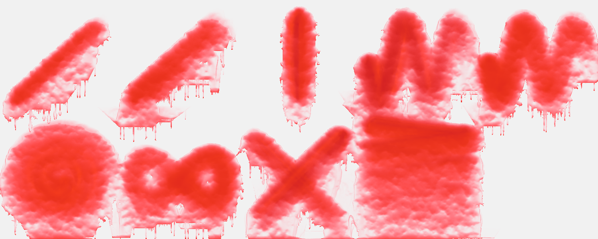

| stroke | covered | width | dark | spread | ms |
|---|---|---|---|---|---|
| light line | 26 % → 35 % | 74.7 px | 0.34 | 1.37 | 119 |
| heavy line | 39 % → 42 % | 114.3 px | 0.38 | 1.06 | 278 |
| pressure swell | 17 % → 28 % | 64.3 px | 0.41 | 1.61 | 220 |
| fast wave | 64 % → 74 % | 73.9 px | 0.40 | 1.16 | 607 |
| slow wave | 57 % → 68 % | 65.4 px | 0.42 | 1.21 | 1072 |
| spiral | 74 % → 82 % | 48.6 px | 0.42 | 1.12 | 982 |
| loop | 60 % → 69 % | 78.3 px | 0.41 | 1.14 | 418 |
| tilted | 30 % → 30 % | 82.4 px | 0.37 | 1.02 | 257 |
| over the wet one | 55 % → 67 % | 70.2 px | 0.37 | 1.23 | 200 |
| long, no reload | 90 % → 99 % | 40.5 px | 0.43 | 1.09 | 1418 | quarters: 0.57 → 0.50 → 0.41 → 0.27

Numbers say: light vs heavy: width 74.7 → 114.3 px, dark 0.34 → 0.38; wet paint spreads well beyond the stroke.

## Watercolour · Two-tone
Watercolour 1.00 + water 60 % · 56 px · 41.6 s

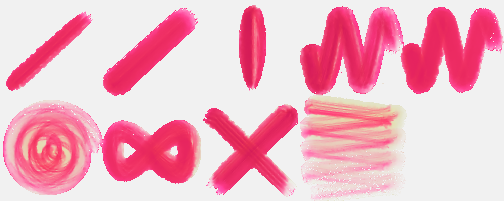

| stroke | covered | width | dark | spread | ms |
|---|---|---|---|---|---|
| light line | 15 % → 18 % | 43.8 px | 0.55 | 1.19 | 137 |
| heavy line | 30 % → 30 % | 85.9 px | 0.57 | 1.01 | 242 |
| pressure swell | 18 % → 18 % | 66.0 px | 0.57 | 1.05 | 217 |
| fast wave | 56 % → 58 % | 64.6 px | 0.52 | 1.04 | 575 |
| slow wave | 52 % → 54 % | 60.6 px | 0.56 | 1.02 | 786 |
| spiral | 69 % → 70 % | 45.7 px | 0.31 | 1.01 | 967 |
| loop | 47 % → 48 % | 61.1 px | 0.53 | 1.02 | 370 |
| tilted | 19 % → 19 % | 53.0 px | 0.53 | 1.01 | 205 |
| over the wet one | 41 % → 43 % | 61.9 px | 0.53 | 1.05 | 231 |
| long, no reload | 87 % → 90 % | 39.1 px | 0.18 | 1.03 | 1263 | quarters: 0.25 → 0.22 → 0.15 → 0.09

Numbers say: light vs heavy: width 43.8 → 85.9 px, dark 0.55 → 0.57.

## Watercolour · SH blue
Watercolour 1.00 + water 30 % · 46 px · 30.1 s

| stroke | covered | width | dark | spread | ms |
|---|---|---|---|---|---|
| light line | 6 % → 13 % | 18.7 px | 0.39 | 1.99 | 52 |
| heavy line | 13 % → 17 % | 37.9 px | 0.41 | 1.29 | 113 |
| pressure swell | 8 % → 12 % | 29.8 px | 0.45 | 1.45 | 78 |
| fast wave | 29 % → 34 % | 33.0 px | 0.45 | 1.20 | 283 |
| slow wave | 26 % → 32 % | 30.0 px | 0.39 | 1.23 | 332 |
| spiral | 44 % → 50 % | 29.0 px | 0.31 | 1.13 | 351 |
| loop | 23 % → 29 % | 29.3 px | 0.41 | 1.27 | 175 |
| tilted | 15 % → 15 % | 42.1 px | 0.39 | 1.00 | 124 |
| over the wet one | 25 % → 29 % | 27.7 px | 0.39 | 1.17 | 99 |
| long, no reload | 59 % → 63 % | 26.4 px | 0.30 | 1.08 | 575 | quarters: 0.31 → 0.23 → 0.17 → 0.12

Numbers say: light vs heavy: width 18.7 → 37.9 px, dark 0.39 → 0.41; wet paint spreads well beyond the stroke.

## Watercolour · SH violet
Watercolour 1.00 + water 30 % · 46 px · 31.2 s

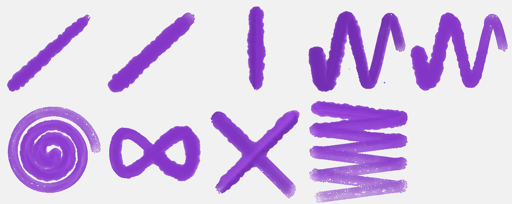

| stroke | covered | width | dark | spread | ms |
|---|---|---|---|---|---|
| light line | 6 % → 13 % | 18.7 px | 0.59 | 1.99 | 51 |
| heavy line | 13 % → 17 % | 37.9 px | 0.60 | 1.29 | 105 |
| pressure swell | 8 % → 12 % | 29.8 px | 0.62 | 1.45 | 71 |
| fast wave | 29 % → 34 % | 33.0 px | 0.63 | 1.20 | 235 |
| slow wave | 26 % → 32 % | 30.0 px | 0.59 | 1.23 | 332 |
| spiral | 44 % → 50 % | 29.0 px | 0.53 | 1.13 | 435 |
| loop | 23 % → 29 % | 29.3 px | 0.60 | 1.27 | 179 |
| tilted | 15 % → 15 % | 42.1 px | 0.58 | 1.00 | 131 |
| over the wet one | 25 % → 29 % | 27.7 px | 0.58 | 1.17 | 102 |
| long, no reload | 59 % → 63 % | 26.4 px | 0.51 | 1.08 | 662 | quarters: 0.45 → 0.38 → 0.32 → 0.24

Numbers say: light vs heavy: width 18.7 → 37.9 px, dark 0.59 → 0.60; wet paint spreads well beyond the stroke.

## Watercolour · SH teal
Watercolour 1.00 + water 30 % · 46 px · 31.1 s

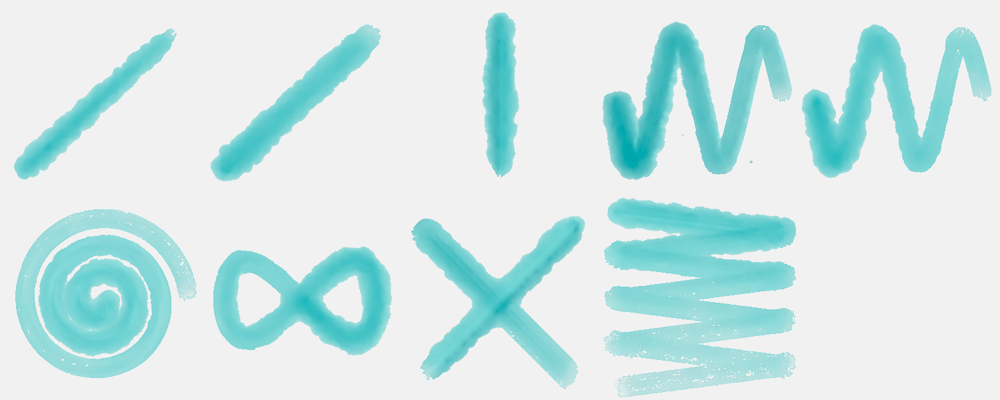

| stroke | covered | width | dark | spread | ms |
|---|---|---|---|---|---|
| light line | 6 % → 13 % | 18.7 px | 0.21 | 1.99 | 64 |
| heavy line | 13 % → 17 % | 37.9 px | 0.22 | 1.29 | 105 |
| pressure swell | 8 % → 12 % | 29.8 px | 0.25 | 1.45 | 75 |
| fast wave | 29 % → 34 % | 33.0 px | 0.25 | 1.20 | 249 |
| slow wave | 26 % → 32 % | 30.0 px | 0.21 | 1.23 | 345 |
| spiral | 44 % → 50 % | 29.0 px | 0.16 | 1.13 | 398 |
| loop | 23 % → 29 % | 29.3 px | 0.22 | 1.27 | 200 |
| tilted | 15 % → 15 % | 42.1 px | 0.21 | 1.00 | 140 |
| over the wet one | 25 % → 29 % | 27.7 px | 0.21 | 1.17 | 109 |
| long, no reload | 59 % → 63 % | 26.4 px | 0.16 | 1.08 | 625 | quarters: 0.16 → 0.12 → 0.09 → 0.07

Numbers say: light vs heavy: width 18.7 → 37.9 px, dark 0.21 → 0.22; wet paint spreads well beyond the stroke.

## Watercolour · #16 Shrigley strokes
Watercolour 1.00 + water 30 % · 46 px · 31.0 s

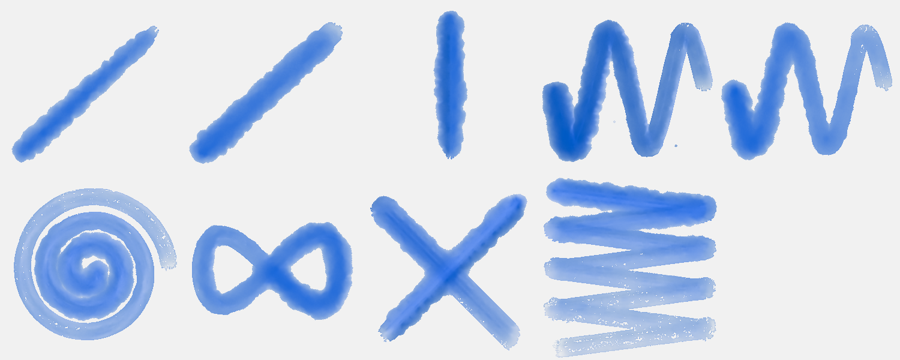

| stroke | covered | width | dark | spread | ms |
|---|---|---|---|---|---|
| light line | 6 % → 13 % | 18.7 px | 0.39 | 1.99 | 52 |
| heavy line | 13 % → 17 % | 37.9 px | 0.41 | 1.29 | 109 |
| pressure swell | 8 % → 12 % | 29.8 px | 0.45 | 1.45 | 86 |
| fast wave | 29 % → 34 % | 33.0 px | 0.45 | 1.20 | 209 |
| slow wave | 26 % → 32 % | 30.0 px | 0.39 | 1.23 | 367 |
| spiral | 44 % → 50 % | 29.0 px | 0.31 | 1.13 | 398 |
| loop | 23 % → 29 % | 29.3 px | 0.41 | 1.27 | 218 |
| tilted | 15 % → 15 % | 42.1 px | 0.39 | 1.00 | 122 |
| over the wet one | 25 % → 29 % | 27.7 px | 0.39 | 1.17 | 109 |
| long, no reload | 59 % → 63 % | 26.4 px | 0.30 | 1.08 | 1274 | quarters: 0.31 → 0.23 → 0.17 → 0.12

Numbers say: light vs heavy: width 18.7 → 37.9 px, dark 0.39 → 0.41; wet paint spreads well beyond the stroke.

## Watercolour · #29 Shrigley asterisk
Watercolour 1.00 + water 50 % · 70 px · 48.0 s

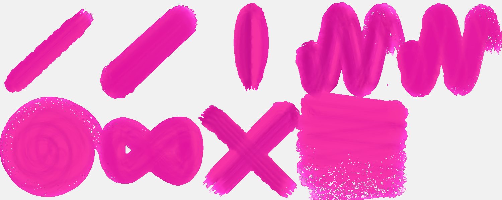

| stroke | covered | width | dark | spread | ms |
|---|---|---|---|---|---|
| light line | 20 % → 23 % | 57.6 px | 0.60 | 1.15 | 196 |
| heavy line | 39 % → 39 % | 112.5 px | 0.62 | 1.00 | 426 |
| pressure swell | 24 % → 25 % | 88.7 px | 0.61 | 1.06 | 225 |
| fast wave | 68 % → 72 % | 78.7 px | 0.61 | 1.06 | 813 |
| slow wave | 64 % → 65 % | 74.5 px | 0.62 | 1.01 | 1093 |
| spiral | 77 % → 77 % | 50.8 px | 0.57 | 1.00 | 1595 |
| loop | 57 % → 58 % | 74.3 px | 0.60 | 1.01 | 502 |
| tilted | 24 % → 24 % | 67.8 px | 0.60 | 1.00 | 289 |
| over the wet one | 53 % → 55 % | 78.8 px | 0.60 | 1.05 | 349 |
| long, no reload | 93 % → 94 % | 41.7 px | 0.55 | 1.01 | 2187 | quarters: 0.57 → 0.56 → 0.54 → 0.46

Numbers say: light vs heavy: width 57.6 → 112.5 px, dark 0.60 → 0.62.

## Watercolour · Pink flame
Watercolour 1.00 + water 80 % · 60 px · 52.4 s

| stroke | covered | width | dark | spread | ms |
|---|---|---|---|---|---|
| light line | 31 % → 58 % | 88.7 px | 0.04 | 1.91 | 118 |
| heavy line | 35 % → 48 % | 101.7 px | 0.08 | 1.37 | 231 |
| pressure swell | 17 % → 41 % | 62.7 px | 0.08 | 2.48 | 224 |
| fast wave | 64 % → 95 % | 74.3 px | 0.09 | 1.48 | 604 |
| slow wave | 64 % → 80 % | 74.2 px | 0.09 | 1.24 | 1250 |
| spiral | 77 % → 80 % | 50.5 px | 0.10 | 1.04 | 824 |
| loop | 56 % → 71 % | 72.8 px | 0.10 | 1.27 | 393 |
| tilted | 29 % → 29 % | 79.8 px | 0.08 | 1.03 | 243 |
| over the wet one | 56 % → 76 % | 77.4 px | 0.08 | 1.35 | 200 |
| long, no reload | 89 % → 95 % | 39.7 px | 0.10 | 1.07 | 1393 | quarters: 0.15 → 0.12 → 0.08 → 0.04

Numbers say: light vs heavy: width 88.7 → 101.7 px, dark 0.04 → 0.08; wet paint spreads well beyond the stroke.

## Watercolour · #33 Red band, pink flames
Watercolour 1.00 + water 60 % · 90 px · 57.7 s

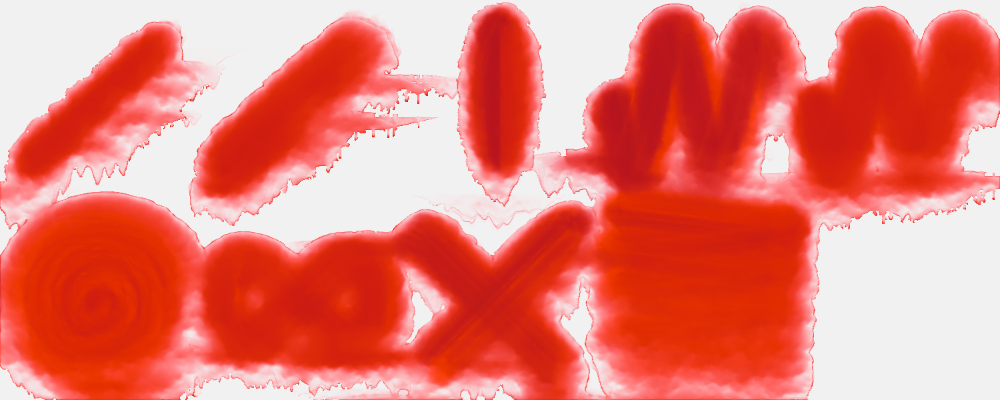

| stroke | covered | width | dark | spread | ms |
|---|---|---|---|---|---|
| light line | 28 % → 48 % | 82.7 px | 0.43 | 1.70 | 178 |
| heavy line | 45 % → 57 % | 129.7 px | 0.49 | 1.27 | 383 |
| pressure swell | 27 % → 46 % | 100.3 px | 0.46 | 1.71 | 269 |
| fast wave | 71 % → 86 % | 82.6 px | 0.57 | 1.20 | 1427 |
| slow wave | 72 % → 83 % | 83.7 px | 0.56 | 1.14 | 1131 |
| spiral | 85 % → 95 % | 56.1 px | 0.55 | 1.12 | 1502 |
| loop | 62 % → 79 % | 80.7 px | 0.54 | 1.27 | 933 |
| tilted | 37 % → 39 % | 104.3 px | 0.51 | 1.04 | 464 |
| over the wet one | 66 % → 87 % | 80.3 px | 0.51 | 1.32 | 376 |
| long, no reload | 96 % → 100 % | 42.9 px | 0.59 | 1.04 | 2036 | quarters: 0.66 → 0.64 → 0.61 → 0.49

Numbers say: light vs heavy: width 82.7 → 129.7 px, dark 0.43 → 0.49; wet paint spreads well beyond the stroke.

## Watercolour · #35 Red band with runs
Watercolour 1.00 + water 75 % · 80 px · 60.5 s

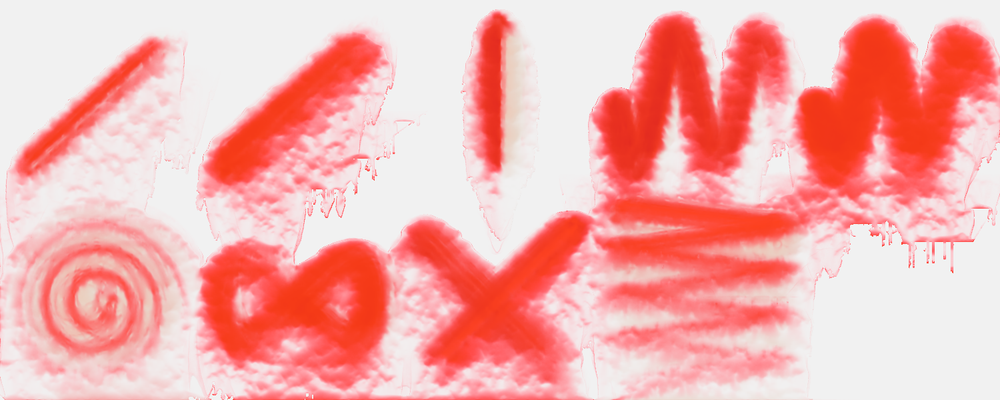

| stroke | covered | width | dark | spread | ms |
|---|---|---|---|---|---|
| light line | 37 % → 51 % | 107.7 px | 0.15 | 1.39 | 183 |
| heavy line | 50 % → 56 % | 145.0 px | 0.30 | 1.11 | 440 |
| pressure swell | 20 % → 33 % | 76.7 px | 0.22 | 1.63 | 300 |
| fast wave | 69 % → 80 % | 79.9 px | 0.36 | 1.16 | 763 |
| slow wave | 70 % → 78 % | 80.8 px | 0.42 | 1.12 | 1476 |
| spiral | 88 % → 95 % | 57.8 px | 0.16 | 1.08 | 1710 |
| loop | 72 % → 86 % | 93.8 px | 0.35 | 1.18 | 850 |
| tilted | 47 % → 47 % | 129.9 px | 0.31 | 1.01 | 371 |
| over the wet one | 73 % → 86 % | 73.0 px | 0.31 | 1.18 | 432 |
| long, no reload | 94 % → 100 % | 42.4 px | 0.27 | 1.06 | 1976 | quarters: 0.41 → 0.32 → 0.23 → 0.13

Numbers say: light vs heavy: width 107.7 → 145.0 px, dark 0.15 → 0.30; wet paint spreads well beyond the stroke.

## Watercolour · Sepia wash
Watercolour 1.00 + water 60 % · 80 px · 54.5 s

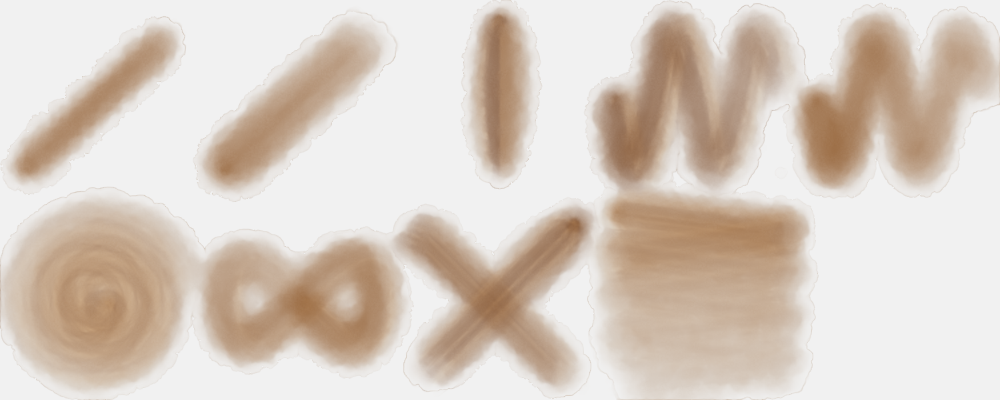

| stroke | covered | width | dark | spread | ms |
|---|---|---|---|---|---|
| light line | 18 % → 36 % | 53.2 px | 0.19 | 1.94 | 175 |
| heavy line | 34 % → 45 % | 98.0 px | 0.20 | 1.34 | 609 |
| pressure swell | 21 % → 33 % | 76.9 px | 0.21 | 1.61 | 239 |
| fast wave | 62 % → 82 % | 72.0 px | 0.24 | 1.32 | 652 |
| slow wave | 60 % → 76 % | 69.6 px | 0.23 | 1.26 | 1008 |
| spiral | 76 % → 85 % | 50.2 px | 0.21 | 1.12 | 1121 |
| loop | 54 % → 66 % | 69.9 px | 0.24 | 1.23 | 589 |
| tilted | 26 % → 27 % | 72.6 px | 0.22 | 1.04 | 392 |
| over the wet one | 51 % → 74 % | 70.8 px | 0.22 | 1.45 | 320 |
| long, no reload | 94 % → 99 % | 42.3 px | 0.23 | 1.05 | 1722 | quarters: 0.34 → 0.26 → 0.20 → 0.14

Numbers say: light vs heavy: width 53.2 → 98.0 px, dark 0.19 → 0.20; wet paint spreads well beyond the stroke.

## Watercolour · #40 Olive and sepia blooms
Watercolour 1.00 + water 55 % · 90 px · 53.9 s

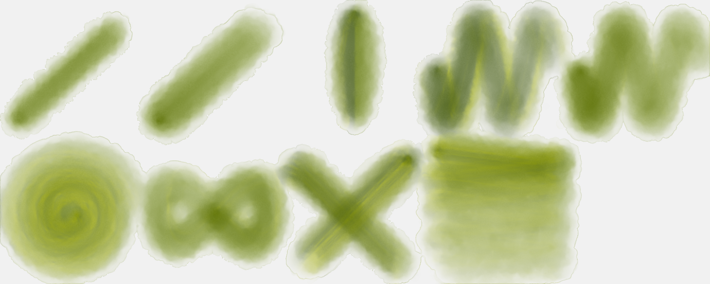

| stroke | covered | width | dark | spread | ms |
|---|---|---|---|---|---|
| light line | 20 % → 38 % | 59.3 px | 0.19 | 1.86 | 250 |
| heavy line | 37 % → 48 % | 107.5 px | 0.21 | 1.29 | 329 |
| pressure swell | 23 % → 37 % | 87.2 px | 0.22 | 1.59 | 218 |
| fast wave | 67 % → 86 % | 77.7 px | 0.25 | 1.28 | 857 |
| slow wave | 66 % → 80 % | 76.0 px | 0.24 | 1.22 | 1233 |
| spiral | 79 % → 88 % | 52.2 px | 0.22 | 1.11 | 1426 |
| loop | 58 % → 69 % | 74.7 px | 0.25 | 1.19 | 849 |
| tilted | 29 % → 30 % | 81.1 px | 0.22 | 1.04 | 473 |
| over the wet one | 57 % → 79 % | 77.9 px | 0.22 | 1.39 | 326 |
| long, no reload | 96 % → 99 % | 43.0 px | 0.23 | 1.04 | 1986 | quarters: 0.34 → 0.28 → 0.21 → 0.15

Numbers say: light vs heavy: width 59.3 → 107.5 px, dark 0.19 → 0.21; wet paint spreads well beyond the stroke.

## Watercolour · #46 Lips on wet paper
Watercolour 1.00 + water 65 % · 50 px · 44.8 s

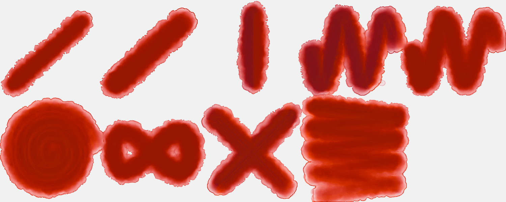

| stroke | covered | width | dark | spread | ms |
|---|---|---|---|---|---|
| light line | 11 % → 28 % | 32.3 px | 0.61 | 2.48 | 90 |
| heavy line | 22 % → 35 % | 64.7 px | 0.64 | 1.56 | 161 |
| pressure swell | 13 % → 25 % | 49.9 px | 0.63 | 1.86 | 88 |
| fast wave | 44 % → 68 % | 50.6 px | 0.65 | 1.56 | 421 |
| slow wave | 41 % → 64 % | 47.8 px | 0.65 | 1.54 | 630 |
| spiral | 64 % → 77 % | 42.2 px | 0.67 | 1.20 | 616 |
| loop | 37 % → 56 % | 47.7 px | 0.66 | 1.51 | 306 |
| tilted | 18 % → 19 % | 50.4 px | 0.62 | 1.05 | 191 |
| over the wet one | 36 % → 58 % | 50.8 px | 0.62 | 1.59 | 218 |
| long, no reload | 79 % → 96 % | 35.5 px | 0.66 | 1.21 | 820 | quarters: 0.72 → 0.71 → 0.67 → 0.57

Numbers say: light vs heavy: width 32.3 → 64.7 px, dark 0.61 → 0.64; wet paint spreads well beyond the stroke.

## Brush Artist · Refs · #01 Henry Ward peach cloud — own sheet
own sheet 600 × 600 · Gouache 1.00 · 44 px · 11.2 s

| stroke | covered | width | dark | spread | ms |
|---|---|---|---|---|---|
| stroke 1 | 5 % → 16 % | 15.6 px | 0.53 | 2.97 | 118 |
| stroke 2 | 11 % → 29 % | 35.1 px | 0.54 | 2.71 | 134 |
| stroke 3 | 16 % → 31 % | 45.4 px | 0.54 | 2.00 | 151 |
| stroke 4 | 21 % → 34 % | 68.0 px | 0.54 | 1.63 | 158 |
| stroke 5 | 21 % → 31 % | 60.5 px | 0.54 | 1.48 | 136 |
| stroke 6 | 20 % → 24 % | 61.5 px | 0.54 | 1.21 | 193 |
| stroke 7 | 9 % → 33 % | 22.9 px | 0.53 | 3.58 | 216 |
| stroke 8 | 14 % → 32 % | 34.7 px | 0.53 | 2.28 | 186 |
| stroke 9 | 13 % → 33 % | 33.9 px | 0.53 | 2.47 | 148 |
| stroke 10 | 13 % → 34 % | 35.3 px | 0.53 | 2.57 | 155 |
| stroke 11 | 14 % → 36 % | 40.5 px | 0.54 | 2.53 | 160 |
| stroke 12 | 14 % → 39 % | 42.4 px | 0.54 | 2.76 | 115 |
| stroke 13 | 19 % → 42 % | 54.8 px | 0.54 | 2.23 | 148 |
| stroke 14 | 27 % → 44 % | 77.4 px | 0.54 | 1.63 | 194 |
| stroke 15 | 30 % → 48 % | 88.5 px | 0.53 | 1.60 | 154 |
| stroke 16 | 35 % → 48 % | 104.8 px | 0.53 | 1.39 | 270 |
| stroke 17 | 35 % → 50 % | 98.5 px | 0.53 | 1.41 | 196 |
| stroke 18 | 41 % → 49 % | 117.6 px | 0.53 | 1.21 | 170 |
| stroke 19 | 41 % → 49 % | 116.0 px | 0.54 | 1.18 | 193 |
| stroke 20 | 43 % → 46 % | 123.0 px | 0.54 | 1.07 | 250 |
| stroke 21 | 43 % → 42 % | 125.4 px | 0.54 | 0.96 | 166 |
| stroke 22 | 45 % → 42 % | 131.2 px | 0.54 | 0.94 | 175 |
| stroke 23 | 49 % → 43 % | 139.0 px | 0.54 | 0.88 | 139 |
| stroke 24 | 52 % → 45 % | 156.2 px | 0.54 | 0.86 | 117 |

Numbers say: wet paint spreads well beyond the stroke.

## Brush Artist · Refs · #02 Henry Ward cream strokes — own sheet
own sheet 600 × 600 · Gouache 1.00 · 46 px · 6.8 s

| stroke | covered | width | dark | spread | ms |
|---|---|---|---|---|---|
| stroke 1 | 9 % → 2 % | 17.7 px | 0.65 | 0.26 | 168 |
| stroke 2 | 15 % → 6 % | 39.4 px | 0.66 | 0.41 | 158 |
| stroke 3 | 19 % → 22 % | 48.9 px | 0.64 | 1.15 | 218 |
| stroke 4 | 23 % → 22 % | 56.7 px | 0.64 | 0.97 | 242 |
| stroke 5 | 24 % → 27 % | 59.0 px | 0.64 | 1.11 | 256 |
| stroke 6 | 18 % → 16 % | 43.4 px | 0.64 | 0.88 | 225 |
| stroke 7 | 21 % → 10 % | 53.1 px | 0.64 | 0.48 | 186 |

## Brush Artist · Refs · #03 Henry Ward navy contours — own sheet
own sheet 600 × 600 · Impasto 1.00 · 22 px · 2.6 s

| stroke | covered | width | dark | spread | ms |
|---|---|---|---|---|---|
| stroke 1 | 10 % → 15 % | 20.0 px | 0.70 | 1.51 | 100 |
| stroke 2 | 16 % → 19 % | 22.1 px | 0.70 | 1.19 | 98 |
| stroke 3 | 20 % → 20 % | 29.5 px | 0.71 | 0.99 | 147 |
| stroke 4 | 19 % → 17 % | 43.6 px | 0.71 | 0.89 | 157 |

Numbers say: wet paint spreads well beyond the stroke.

## Brush Artist · Refs · #04 Henry Ward grey cloud — own sheet
own sheet 600 × 600 · Gouache 1.00 · 50 px · 10.8 s

| stroke | covered | width | dark | spread | ms |
|---|---|---|---|---|---|
| stroke 1 | 5 % → 21 % | 15.7 px | 0.32 | 3.88 | 162 |
| stroke 2 | 14 % → 21 % | 40.2 px | 0.31 | 1.53 | 245 |
| stroke 3 | 21 % → 22 % | 59.7 px | 0.31 | 1.05 | 227 |
| stroke 4 | 27 % → 23 % | 79.5 px | 0.31 | 0.84 | 274 |
| stroke 5 | 27 % → 26 % | 83.3 px | 0.31 | 0.94 | 211 |
| stroke 6 | 33 % → 30 % | 109.0 px | 0.31 | 0.89 | 201 |
| stroke 7 | 34 % → 36 % | 100.8 px | 0.30 | 1.03 | 188 |
| stroke 8 | 38 % → 38 % | 112.6 px | 0.30 | 0.99 | 208 |
| stroke 9 | 32 % → 39 % | 94.9 px | 0.31 | 1.23 | 168 |
| stroke 10 | 33 % → 39 % | 106.9 px | 0.31 | 1.19 | 193 |
| stroke 11 | 34 % → 36 % | 96.9 px | 0.31 | 1.05 | 195 |
| stroke 12 | 32 % → 34 % | 96.3 px | 0.30 | 1.06 | 140 |
| stroke 13 | 27 % → 38 % | 78.1 px | 0.31 | 1.38 | 231 |
| stroke 14 | 34 % → 38 % | 100.7 px | 0.31 | 1.11 | 230 |
| stroke 15 | 35 % → 37 % | 100.1 px | 0.31 | 1.07 | 181 |
| stroke 16 | 38 % → 36 % | 116.5 px | 0.31 | 0.93 | 214 |
| stroke 17 | 39 % → 31 % | 112.7 px | 0.31 | 0.79 | 186 |
| stroke 18 | 40 % → 28 % | 133.2 px | 0.31 | 0.70 | 187 |
| stroke 19 | 38 % → 24 % | 113.0 px | 0.32 | 0.63 | 187 |
| stroke 20 | 40 % → 23 % | 125.2 px | 0.32 | 0.57 | 215 |

Numbers say: wet paint spreads well beyond the stroke.

## Brush Artist · Refs · #05 Henry Ward green in rust loops — own sheet
own sheet 600 × 600 · Impasto 1.00 · 20 px · 2.5 s

| stroke | covered | width | dark | spread | ms |
|---|---|---|---|---|---|
| stroke 1 | 11 % → 16 % | 19.1 px | 0.02 | 1.49 | 124 |
| stroke 2 | 12 % → 10 % | 24.0 px | 0.02 | 0.86 | 176 |
| stroke 3 | 20 % → 17 % | 35.4 px | 0.02 | 0.89 | 140 |

## Brush Artist · Refs · #06 Henry Ward scrubbed grey — own sheet
own sheet 600 × 600 · Gouache 1.00 · 50 px · 12.4 s

| stroke | covered | width | dark | spread | ms |
|---|---|---|---|---|---|
| stroke 1 | 6 % → 24 % | 15.9 px | 0.32 | 3.69 | 168 |
| stroke 2 | 16 % → 25 % | 41.5 px | 0.31 | 1.58 | 194 |
| stroke 3 | 21 % → 23 % | 64.7 px | 0.31 | 1.10 | 174 |
| stroke 4 | 25 % → 24 % | 78.0 px | 0.31 | 0.96 | 206 |
| stroke 5 | 31 % → 30 % | 92.8 px | 0.31 | 0.97 | 238 |
| stroke 6 | 38 % → 31 % | 115.7 px | 0.31 | 0.81 | 192 |
| stroke 7 | 36 % → 35 % | 103.6 px | 0.31 | 0.98 | 199 |
| stroke 8 | 40 % → 36 % | 125.1 px | 0.31 | 0.90 | 179 |
| stroke 9 | 35 % → 37 % | 107.6 px | 0.31 | 1.06 | 161 |
| stroke 10 | 34 % → 38 % | 111.3 px | 0.31 | 1.10 | 240 |
| stroke 11 | 35 % → 37 % | 101.5 px | 0.31 | 1.06 | 213 |
| stroke 12 | 33 % → 35 % | 99.4 px | 0.31 | 1.08 | 192 |
| stroke 13 | 24 % → 37 % | 69.3 px | 0.31 | 1.53 | 199 |
| stroke 14 | 30 % → 39 % | 88.5 px | 0.31 | 1.30 | 239 |
| stroke 15 | 33 % → 44 % | 95.1 px | 0.32 | 1.34 | 175 |
| stroke 16 | 35 % → 45 % | 111.8 px | 0.32 | 1.28 | 261 |
| stroke 17 | 37 % → 42 % | 110.5 px | 0.32 | 1.12 | 262 |
| stroke 18 | 41 % → 40 % | 123.6 px | 0.32 | 0.98 | 234 |
| stroke 19 | 38 % → 35 % | 112.0 px | 0.32 | 0.93 | 229 |
| stroke 20 | 38 % → 34 % | 117.9 px | 0.32 | 0.90 | 253 |
| stroke 21 | 40 % → 30 % | 116.2 px | 0.33 | 0.75 | 231 |
| stroke 22 | 39 % → 28 % | 127.1 px | 0.33 | 0.73 | 235 |

Numbers say: wet paint spreads well beyond the stroke.

## Brush Artist · Refs · #07 Henry Ward blue L + black zigzag — own sheet
own sheet 600 × 600 · Impasto 1.00 · 34 px · 1.9 s

| stroke | covered | width | dark | spread | ms |
|---|---|---|---|---|---|
| stroke 1 | 13 % → 15 % | 31.2 px | 0.58 | 1.09 | 106 |
| stroke 2 | 15 % → 14 % | 37.7 px | 0.58 | 0.90 | 85 |

## Brush Artist · Refs · #08 Henry Ward olive bands — own sheet
own sheet 600 × 600 · Gouache 1.00 · 34 px · 5.5 s

| stroke | covered | width | dark | spread | ms |
|---|---|---|---|---|---|
| stroke 1 | 8 % → 4 % | 15.7 px | 0.58 | 0.53 | 149 |
| stroke 2 | 12 % → 4 % | 28.0 px | 0.58 | 0.35 | 152 |
| stroke 3 | 13 % → 11 % | 27.5 px | 0.58 | 0.87 | 162 |
| stroke 4 | 17 % → 10 % | 37.3 px | 0.58 | 0.57 | 217 |
| stroke 5 | 22 % → 13 % | 45.2 px | 0.56 | 0.59 | 182 |
| stroke 6 | 16 % → 6 % | 30.5 px | 0.54 | 0.40 | 184 |

## Brush Artist · Refs · #09 Henry Ward white loops — own sheet
own sheet 600 × 600 · Gouache 1.00 · 46 px · 8.8 s

| stroke | covered | width | dark | spread | ms |
|---|---|---|---|---|---|
| stroke 1 | 23 % → 0 % | 12.1 px | 0.06 | 0.00 | 1211 |
| stroke 2 | 27 % → 0 % | 27.4 px | 0.07 | 0.00 | 1248 |
| stroke 3 | 34 % → 0 % | 31.4 px | 0.07 | 0.00 | 1218 |
| stroke 4 | 8 % → 0 % | 18.4 px | 0.00 | 0.00 | 173 |
| stroke 5 | 5 % → 0 % | 14.8 px | 0.06 | 0.00 | 153 |
| stroke 6 | 5 % → 0 % | 13.8 px | 0.08 | 0.00 | 210 |
| stroke 7 | 10 % → 0 % | 26.8 px | 0.08 | 0.00 | 198 |
| stroke 8 | 5 % → 0 % | 8.2 px | 0.00 | 0.00 | 282 |

## Brush Artist · Refs · #10 Henry Ward maroon loops — own sheet
own sheet 600 × 600 · Impasto 1.00 · 30 px · 4.0 s

| stroke | covered | width | dark | spread | ms |
|---|---|---|---|---|---|
| stroke 1 | 12 % → 26 % | 28.9 px | 0.72 | 2.25 | 279 |
| stroke 2 | 23 % → 39 % | 51.0 px | 0.72 | 1.74 | 172 |
| stroke 3 | 30 % → 36 % | 59.6 px | 0.72 | 1.20 | 213 |
| stroke 4 | 40 % → 38 % | 91.4 px | 0.72 | 0.94 | 123 |
| stroke 5 | 33 % → 29 % | 82.1 px | 0.71 | 0.89 | 160 |

Numbers say: wet paint spreads well beyond the stroke.

## Brush Artist · Refs · #11 Henry Ward purple spun balls — own sheet
own sheet 600 × 600 · Impasto 1.00 · 36 px · 4.3 s

| stroke | covered | width | dark | spread | ms |
|---|---|---|---|---|---|
| stroke 1 | 22 % → 31 % | 24.4 px | 0.69 | 1.42 | 206 |
| stroke 2 | 31 % → 44 % | 34.3 px | 0.69 | 1.39 | 272 |
| stroke 3 | 34 % → 33 % | 37.7 px | 0.69 | 0.97 | 407 |

## Brush Artist · Refs · #12 Henry Ward black-olive cage — own sheet
own sheet 600 × 600 · Gouache 1.00 · 28 px · 6.6 s

| stroke | covered | width | dark | spread | ms |
|---|---|---|---|---|---|
| stroke 1 | 9 % → 10 % | 17.0 px | 0.58 | 1.15 | 261 |
| stroke 2 | 7 % → 10 % | 15.8 px | 0.58 | 1.46 | 245 |
| stroke 3 | 18 % → 13 % | 28.0 px | 0.58 | 0.72 | 586 |
| stroke 4 | 20 % → 14 % | 39.4 px | 0.59 | 0.70 | 301 |
| stroke 5 | 18 % → 7 % | 33.8 px | 0.58 | 0.40 | 208 |
| stroke 6 | 29 % → 15 % | 54.8 px | 0.58 | 0.52 | 388 |

## Brush Artist · Refs · #13 Henry Ward blue streaky form — own sheet
own sheet 600 × 600 · Gouache 1.00 · 50 px · 9.3 s

| stroke | covered | width | dark | spread | ms |
|---|---|---|---|---|---|
| stroke 1 | 5 % → 0 % | 15.9 px | 0.00 | 0.00 | 172 |
| stroke 2 | 13 % → 0 % | 40.6 px | 0.00 | 0.00 | 194 |
| stroke 3 | 22 % → 0 % | 62.3 px | 0.00 | 0.00 | 188 |
| stroke 4 | 24 % → 0 % | 78.4 px | 0.00 | 0.00 | 259 |
| stroke 5 | 31 % → 0 % | 90.1 px | 0.00 | 0.00 | 196 |
| stroke 6 | 37 % → 0 % | 105.3 px | 0.00 | 0.00 | 220 |
| stroke 7 | 36 % → 0 % | 107.2 px | 0.00 | 0.00 | 195 |
| stroke 8 | 40 % → 0 % | 120.3 px | 0.00 | 0.00 | 215 |
| stroke 9 | 33 % → 0 % | 102.9 px | 0.00 | 0.00 | 195 |
| stroke 10 | 32 % → 0 % | 105.4 px | 0.00 | 0.00 | 171 |
| stroke 11 | 30 % → 0 % | 92.1 px | 0.00 | 0.00 | 243 |
| stroke 12 | 26 % → 0 % | 78.3 px | 0.00 | 0.00 | 164 |
| stroke 13 | 24 % → 0 % | 74.8 px | 0.00 | 0.00 | 191 |
| stroke 14 | 29 % → 0 % | 84.9 px | 0.00 | 0.00 | 275 |
| stroke 15 | 30 % → 0 % | 86.3 px | 0.00 | 0.00 | 180 |
| stroke 16 | 35 % → 0 % | 104.8 px | 0.00 | 0.00 | 215 |
| stroke 17 | 41 % → 0 % | 103.0 px | 0.00 | 0.00 | 225 |
| stroke 18 | 49 % → 0 % | 117.7 px | 0.00 | 0.00 | 198 |
| stroke 19 | 51 % → 0 % | 104.2 px | 0.00 | 0.00 | 181 |
| stroke 20 | 60 % → 0 % | 115.5 px | 0.00 | 0.00 | 273 |
| stroke 21 | 7 % → 0 % | 15.0 px | 0.00 | 0.00 | 153 |
| stroke 22 | 6 % → 0 % | 18.5 px | 0.00 | 0.00 | 156 |
| stroke 23 | 11 % → 0 % | 35.1 px | 0.00 | 0.00 | 180 |
| stroke 24 | 4 % → 0 % | 11.0 px | 0.00 | 0.00 | 148 |
| stroke 25 | 4 % → 0 % | 9.1 px | 0.00 | 0.00 | 136 |

## Brush Artist · Refs · #14 Henry Ward olive totem — own sheet
own sheet 600 × 600 · Impasto 1.00 · 48 px · 7.2 s

| stroke | covered | width | dark | spread | ms |
|---|---|---|---|---|---|
| stroke 1 | 18 % → 46 % | 46.6 px | 0.38 | 2.57 | 145 |
| stroke 2 | 20 % → 50 % | 61.7 px | 0.38 | 2.53 | 122 |
| stroke 3 | 27 % → 52 % | 93.9 px | 0.39 | 1.89 | 133 |
| stroke 4 | 30 % → 54 % | 110.9 px | 0.39 | 1.82 | 155 |
| stroke 5 | 38 % → 63 % | 134.1 px | 0.39 | 1.64 | 141 |
| stroke 6 | 38 % → 64 % | 149.8 px | 0.39 | 1.67 | 207 |
| stroke 7 | 35 % → 60 % | 119.1 px | 0.39 | 1.70 | 140 |
| stroke 8 | 37 % → 62 % | 141.6 px | 0.39 | 1.67 | 147 |
| stroke 9 | 38 % → 62 % | 131.6 px | 0.39 | 1.64 | 139 |
| stroke 10 | 37 % → 61 % | 136.5 px | 0.39 | 1.65 | 143 |
| stroke 11 | 38 % → 64 % | 136.7 px | 0.39 | 1.66 | 176 |
| stroke 12 | 38 % → 64 % | 143.5 px | 0.38 | 1.68 | 156 |
| stroke 13 | 37 % → 66 % | 129.3 px | 0.39 | 1.78 | 134 |
| stroke 14 | 36 % → 61 % | 131.1 px | 0.39 | 1.70 | 188 |
| stroke 15 | 39 % → 65 % | 134.4 px | 0.39 | 1.66 | 139 |
| stroke 16 | 38 % → 63 % | 136.6 px | 0.39 | 1.67 | 213 |
| stroke 17 | 37 % → 61 % | 124.1 px | 0.39 | 1.64 | 164 |
| stroke 18 | 40 % → 65 % | 152.2 px | 0.39 | 1.63 | 139 |
| stroke 19 | 38 % → 58 % | 131.3 px | 0.39 | 1.54 | 153 |
| stroke 20 | 40 % → 53 % | 142.6 px | 0.39 | 1.31 | 172 |
| stroke 21 | 46 % → 53 % | 136.0 px | 0.39 | 1.15 | 175 |
| stroke 22 | 53 % → 51 % | 143.0 px | 0.39 | 0.97 | 129 |

Numbers say: wet paint spreads well beyond the stroke.

## Brush Artist · Refs · #15 Ultramarine brush script — own sheet
own sheet 600 × 600 · Ink 1.00 · 4 px · 8.2 s

| stroke | covered | width | dark | spread | ms |
|---|---|---|---|---|---|
| stroke 1 | 40 % → 42 % | 9.0 px | 0.65 | 1.05 | 45 |
| stroke 2 | 41 % → 43 % | 9.0 px | 0.67 | 1.07 | 44 |
| stroke 3 | 39 % → 42 % | 9.4 px | 0.72 | 1.08 | 27 |
| stroke 4 | 42 % → 46 % | 10.2 px | 0.74 | 1.10 | 14 |
| stroke 5 | 46 % → 49 % | 10.1 px | 0.72 | 1.06 | 30 |
| stroke 6 | 43 % → 45 % | 9.7 px | 0.65 | 1.05 | 100 |
| stroke 7 | 44 % → 47 % | 9.3 px | 0.72 | 1.08 | 26 |
| stroke 8 | 37 % → 39 % | 8.9 px | 0.65 | 1.06 | 41 |
| stroke 9 | 39 % → 42 % | 9.1 px | 0.70 | 1.07 | 33 |
| stroke 10 | 35 % → 37 % | 9.6 px | 0.66 | 1.05 | 69 |
| stroke 11 | 44 % → 47 % | 9.9 px | 0.69 | 1.06 | 46 |
| stroke 12 | 39 % → 41 % | 9.4 px | 0.65 | 1.06 | 45 |
| stroke 13 | 45 % → 46 % | 10.1 px | 0.69 | 1.04 | 23 |
| stroke 14 | 37 % → 40 % | 9.6 px | 0.71 | 1.07 | 22 |
| stroke 15 | 37 % → 38 % | 9.0 px | 0.67 | 1.05 | 36 |
| stroke 16 | 42 % → 45 % | 9.4 px | 0.70 | 1.06 | 24 |
| stroke 17 | 41 % → 45 % | 7.1 px | 0.71 | 1.09 | 53 |
| stroke 18 | 43 % → 45 % | 9.3 px | 0.73 | 1.05 | 27 |
| stroke 19 | 40 % → 42 % | 9.0 px | 0.65 | 1.06 | 58 |
| stroke 20 | 42 % → 44 % | 9.7 px | 0.69 | 1.06 | 53 |
| stroke 21 | 39 % → 42 % | 9.6 px | 0.69 | 1.07 | 55 |
| stroke 22 | 44 % → 46 % | 8.9 px | 0.65 | 1.06 | 58 |
| stroke 23 | 38 % → 42 % | 9.5 px | 0.72 | 1.10 | 18 |
| stroke 24 | 39 % → 42 % | 9.1 px | 0.73 | 1.06 | 32 |
| stroke 25 | 41 % → 44 % | 10.0 px | 0.71 | 1.06 | 25 |
| stroke 26 | 45 % → 47 % | 9.1 px | 0.66 | 1.04 | 39 |
| stroke 27 | 43 % → 45 % | 9.0 px | 0.62 | 1.05 | 55 |
| stroke 28 | 45 % → 47 % | 9.3 px | 0.70 | 1.06 | 35 |
| stroke 29 | 35 % → 38 % | 10.4 px | 0.69 | 1.08 | 36 |
| stroke 30 | 39 % → 40 % | 8.5 px | 0.70 | 1.04 | 49 |
| stroke 31 | 43 % → 46 % | 10.4 px | 0.74 | 1.07 | 14 |
| stroke 32 | 41 % → 45 % | 9.3 px | 0.70 | 1.09 | 24 |
| stroke 33 | 35 % → 40 % | 10.9 px | 0.73 | 1.13 | 22 |
| stroke 34 | 41 % → 45 % | 10.1 px | 0.74 | 1.09 | 26 |
| stroke 35 | 36 % → 38 % | 9.4 px | 0.67 | 1.06 | 42 |

## Brush Artist · Refs · #18 Blue oil-stick scribbles — own sheet
own sheet 600 × 600 · Pastel 1.00 · 10 px · 3.1 s

| stroke | covered | width | dark | spread | ms |
|---|---|---|---|---|---|
| stroke 1 | 16 % → 32 % | 3.9 px | 0.49 | 2.03 | 165 |
| stroke 2 | 13 % → 37 % | 3.6 px | 0.49 | 2.75 | 164 |
| stroke 3 | 16 % → 26 % | 5.8 px | 0.49 | 1.64 | 244 |
| stroke 4 | 15 % → 29 % | 7.9 px | 0.49 | 1.91 | 172 |
| stroke 5 | 29 % → 34 % | 8.5 px | 0.49 | 1.18 | 154 |
| stroke 6 | 26 % → 26 % | 9.4 px | 0.49 | 1.02 | 167 |
| stroke 7 | 26 % → 32 % | 8.4 px | 0.49 | 1.24 | 182 |
| stroke 8 | 30 % → 30 % | 17.0 px | 0.49 | 1.00 | 195 |

Numbers say: wet paint spreads well beyond the stroke.

## Brush Artist · Refs · #20 Orange-red crayon scribble — own sheet
own sheet 600 × 600 · Pastel 1.00 · 14 px · 2.7 s

| stroke | covered | width | dark | spread | ms |
|---|---|---|---|---|---|
| stroke 1 | 8 % → 19 % | 5.5 px | 0.59 | 2.47 | 177 |
| stroke 2 | 9 % → 22 % | 6.6 px | 0.60 | 2.50 | 176 |
| stroke 3 | 13 % → 21 % | 8.3 px | 0.60 | 1.65 | 165 |
| stroke 4 | 24 % → 32 % | 8.8 px | 0.60 | 1.36 | 166 |
| stroke 5 | 28 % → 28 % | 7.9 px | 0.59 | 1.00 | 154 |
| stroke 6 | 22 % → 22 % | 16.4 px | 0.60 | 1.00 | 162 |

Numbers say: wet paint spreads well beyond the stroke.

## Brush Artist · Refs · #21 Gritty black contours — own sheet
own sheet 600 × 600 · Gouache 1.00 · 12 px · 3.9 s

| stroke | covered | width | dark | spread | ms |
|---|---|---|---|---|---|
| stroke 1 | 6 % → 4 % | 6.2 px | 0.36 | 0.68 | 135 |
| stroke 2 | 5 % → 2 % | 7.9 px | 0.36 | 0.47 | 168 |
| stroke 3 | 9 % → 2 % | 7.8 px | 0.37 | 0.17 | 123 |
| stroke 4 | 9 % → 3 % | 10.9 px | 0.36 | 0.36 | 184 |
| stroke 5 | 10 % → 4 % | 12.7 px | 0.35 | 0.35 | 97 |

## Brush Artist · Refs · #22 Bold black brush poster — own sheet
own sheet 600 × 600 · Ink 1.00 · 20 px · 4.9 s

| stroke | covered | width | dark | spread | ms |
|---|---|---|---|---|---|
| stroke 1 | 24 % → 28 % | 38.8 px | 0.95 | 1.18 | 105 |
| stroke 2 | 28 % → 39 % | 42.9 px | 0.94 | 1.38 | 24 |
| stroke 3 | 30 % → 30 % | 46.0 px | 0.94 | 1.00 | 43 |
| stroke 4 | 30 % → 41 % | 57.8 px | 0.94 | 1.41 | 56 |
| stroke 5 | 27 % → 27 % | 46.3 px | 0.93 | 1.00 | 102 |

## Brush Artist · Refs · #23 Dry white on orange + black line — own sheet
own sheet 600 × 600 · Gouache 1.00 · 50 px · 7.8 s

| stroke | covered | width | dark | spread | ms |
|---|---|---|---|---|---|
| stroke 1 | 4 % → 11 % | 14.5 px | 0.38 | 2.70 | 118 |
| stroke 2 | 8 % → 10 % | 26.7 px | 0.38 | 1.35 | 151 |
| stroke 3 | 13 % → 11 % | 49.0 px | 0.38 | 0.81 | 135 |
| stroke 4 | 17 % → 12 % | 68.6 px | 0.38 | 0.67 | 190 |
| stroke 5 | 23 % → 13 % | 85.0 px | 0.38 | 0.55 | 150 |
| stroke 6 | 26 % → 14 % | 106.9 px | 0.38 | 0.53 | 143 |
| stroke 7 | 23 % → 13 % | 86.4 px | 0.38 | 0.57 | 133 |
| stroke 8 | 22 % → 12 % | 87.4 px | 0.38 | 0.53 | 152 |
| stroke 9 | 19 % → 11 % | 69.7 px | 0.38 | 0.60 | 140 |
| stroke 10 | 18 % → 11 % | 68.9 px | 0.38 | 0.63 | 135 |
| stroke 11 | 20 % → 11 % | 73.3 px | 0.38 | 0.56 | 139 |
| stroke 12 | 19 % → 12 % | 72.9 px | 0.38 | 0.65 | 145 |
| stroke 13 | 20 % → 14 % | 75.6 px | 0.38 | 0.70 | 152 |
| stroke 14 | 21 % → 14 % | 84.0 px | 0.38 | 0.64 | 160 |
| stroke 15 | 21 % → 13 % | 79.6 px | 0.38 | 0.62 | 143 |
| stroke 16 | 22 % → 11 % | 87.4 px | 0.38 | 0.52 | 204 |
| stroke 17 | 22 % → 9 % | 76.2 px | 0.38 | 0.40 | 139 |
| stroke 18 | 27 % → 9 % | 99.3 px | 0.38 | 0.34 | 131 |

Numbers say: wet paint spreads well beyond the stroke.

## Brush Artist · Refs · #24 Picasso flat oil — own sheet
own sheet 600 × 600 · Oil 0.89 · Oil glaze 0.11 · 34 px · 5.5 s

| stroke | covered | width | dark | spread | ms |
|---|---|---|---|---|---|
| stroke 1 | 14 % → 44 % | 30.0 px | 0.22 | 3.11 | 125 |
| stroke 2 | 19 % → 47 % | 44.5 px | 0.23 | 2.49 | 125 |
| stroke 3 | 27 % → 56 % | 59.7 px | 0.23 | 2.06 | 141 |
| stroke 4 | 37 % → 62 % | 82.9 px | 0.23 | 1.69 | 185 |
| stroke 5 | 41 % → 68 % | 91.2 px | 0.22 | 1.64 | 154 |
| stroke 6 | 42 % → 63 % | 96.5 px | 0.22 | 1.52 | 141 |
| stroke 7 | 42 % → 63 % | 87.5 px | 0.23 | 1.51 | 120 |
| stroke 8 | 42 % → 63 % | 101.6 px | 0.23 | 1.50 | 136 |
| stroke 9 | 34 % → 60 % | 74.4 px | 0.23 | 1.76 | 248 |
| stroke 10 | 38 % → 58 % | 89.8 px | 0.23 | 1.55 | 163 |
| stroke 11 | 35 % → 56 % | 74.6 px | 0.24 | 1.61 | 130 |
| stroke 12 | 37 % → 58 % | 88.3 px | 0.24 | 1.56 | 194 |
| stroke 13 | 35 % → 64 % | 77.9 px | 0.25 | 1.81 | 133 |
| stroke 14 | 36 % → 66 % | 82.0 px | 0.24 | 1.82 | 180 |
| stroke 15 | 36 % → 60 % | 76.0 px | 0.24 | 1.67 | 156 |
| stroke 16 | 36 % → 52 % | 83.2 px | 0.24 | 1.46 | 143 |
| stroke 17 | 41 % → 47 % | 86.1 px | 0.24 | 1.15 | 147 |
| stroke 18 | 42 % → 42 % | 101.0 px | 0.24 | 1.00 | 142 |

Numbers say: wet paint spreads well beyond the stroke.

## Brush Artist · Refs · #25 Yellow heavy flat stroke — own sheet
own sheet 600 × 600 · Impasto 1.00 · 110 px · 2.8 s

| stroke | covered | width | dark | spread | ms |
|---|---|---|---|---|---|
| stroke 1 | 18 % → 18 % | 103.7 px | 0.16 | 0.98 | 689 |

## Brush Artist · Refs · #27 Orange impasto swatch — own sheet
own sheet 600 × 600 · Impasto 1.00 · 60 px · 3.0 s

| stroke | covered | width | dark | spread | ms |
|---|---|---|---|---|---|
| stroke 1 | 8 % → 21 % | 58.4 px | 0.32 | 2.66 | 53 |
| stroke 2 | 7 % → 33 % | 62.2 px | 0.32 | 4.61 | 40 |
| stroke 3 | 25 % → 34 % | 238.0 px | 0.32 | 1.41 | 38 |
| stroke 4 | 10 % → 12 % | 69.5 px | 0.34 | 1.26 | 67 |
| stroke 5 | 17 % → 32 % | 61.8 px | 0.31 | 1.90 | 67 |
| stroke 6 | 17 % → 31 % | 143.7 px | 0.32 | 1.77 | 100 |
| stroke 7 | 8 % → 14 % | 68.6 px | 0.31 | 1.88 | 63 |
| stroke 8 | 32 % → 33 % | 328.8 px | 0.32 | 1.04 | 55 |
| stroke 9 | 37 % → 36 % | 182.9 px | 0.32 | 0.97 | 72 |
| stroke 10 | 33 % → 32 % | 298.6 px | 0.32 | 0.97 | 57 |

Numbers say: wet paint spreads well beyond the stroke.

## Brush Artist · Refs · #28 Miles Davis black lines — own sheet
own sheet 600 × 600 · Ink 1.00 · 22 px · 5.7 s

| stroke | covered | width | dark | spread | ms |
|---|---|---|---|---|---|
| stroke 1 | 22 % → 31 % | 36.1 px | 0.88 | 1.42 | 160 |
| stroke 2 | 26 % → 47 % | 35.8 px | 0.88 | 1.79 | 128 |
| stroke 3 | 38 % → 42 % | 73.3 px | 0.88 | 1.11 | 93 |
| stroke 4 | 41 % → 47 % | 81.4 px | 0.88 | 1.16 | 200 |
| stroke 5 | 54 % → 54 % | 108.2 px | 0.88 | 1.00 | 119 |

Numbers say: wet paint spreads well beyond the stroke.

## Brush Artist · Refs · #29 Shrigley magenta asterisk — own sheet
own sheet 600 × 600 · Watercolour 1.00 · 70 px · 6.1 s

| stroke | covered | width | dark | spread | ms |
|---|---|---|---|---|---|
| stroke 1 | 13 % → 37 % | 46.6 px | 0.67 | 2.86 | 170 |
| stroke 2 | 12 % → 12 % | 87.1 px | 0.67 | 1.00 | 225 |
| stroke 3 | 28 % → 37 % | 100.9 px | 0.67 | 1.31 | 206 |
| stroke 4 | 23 % → 23 % | 164.0 px | 0.67 | 1.02 | 178 |

Numbers say: wet paint spreads well beyond the stroke.

## Brush Artist · Refs · #30 Red gouache face patch — own sheet
own sheet 600 × 600 · Gouache 1.00 · 60 px · 13.1 s

| stroke | covered | width | dark | spread | ms |
|---|---|---|---|---|---|
| stroke 1 | 11 % → 37 % | 50.6 px | 0.54 | 3.29 | 147 |
| stroke 2 | 15 % → 41 % | 74.2 px | 0.54 | 2.74 | 153 |
| stroke 3 | 24 % → 50 % | 115.1 px | 0.54 | 2.08 | 227 |
| stroke 4 | 26 % → 52 % | 133.4 px | 0.54 | 1.95 | 213 |
| stroke 5 | 34 % → 60 % | 160.6 px | 0.54 | 1.77 | 175 |
| stroke 6 | 35 % → 61 % | 178.6 px | 0.54 | 1.76 | 184 |
| stroke 7 | 35 % → 59 % | 164.2 px | 0.54 | 1.70 | 257 |
| stroke 8 | 34 % → 56 % | 162.3 px | 0.54 | 1.66 | 181 |
| stroke 9 | 36 % → 60 % | 172.7 px | 0.53 | 1.66 | 170 |
| stroke 10 | 38 % → 62 % | 196.7 px | 0.53 | 1.64 | 207 |
| stroke 11 | 37 % → 61 % | 181.6 px | 0.53 | 1.67 | 177 |
| stroke 12 | 36 % → 58 % | 179.8 px | 0.53 | 1.60 | 185 |
| stroke 13 | 33 % → 46 % | 157.0 px | 0.53 | 1.38 | 215 |
| stroke 14 | 33 % → 41 % | 159.9 px | 0.53 | 1.24 | 199 |
| stroke 15 | 33 % → 37 % | 153.6 px | 0.53 | 1.12 | 205 |
| stroke 16 | 39 % → 39 % | 186.3 px | 0.53 | 0.98 | 251 |

Numbers say: wet paint spreads well beyond the stroke.

## Brush Artist · Refs · #31 Warhol blotted line — own sheet
own sheet 600 × 600 · Ink 1.00 · 6 px · 4.9 s

| stroke | covered | width | dark | spread | ms |
|---|---|---|---|---|---|
| stroke 1 | 22 % → 43 % | 16.5 px | 0.83 | 1.94 | 83 |
| stroke 2 | 17 % → 23 % | 15.7 px | 0.81 | 1.35 | 66 |
| stroke 3 | 24 % → 25 % | 24.9 px | 0.81 | 1.03 | 110 |
| stroke 4 | 32 % → 41 % | 32.7 px | 0.83 | 1.28 | 69 |
| stroke 5 | 37 % → 45 % | 38.1 px | 0.83 | 1.21 | 71 |
| stroke 6 | 34 % → 35 % | 27.8 px | 0.81 | 1.03 | 69 |

Numbers say: wet paint spreads well beyond the stroke.

## Brush Artist · Refs · #32 Thick orange swipes — own sheet
own sheet 600 × 600 · Impasto 1.00 · 90 px · 3.6 s

| stroke | covered | width | dark | spread | ms |
|---|---|---|---|---|---|
| stroke 1 | 14 % → 27 % | 86.6 px | 0.02 | 1.89 | 359 |
| stroke 2 | 26 % → 37 % | 177.9 px | 0.02 | 1.41 | 302 |
| stroke 3 | 27 % → 27 % | 176.1 px | 0.02 | 0.98 | 316 |

Numbers say: wet paint spreads well beyond the stroke.

## Brush Artist · Refs · #33 Red wet-in-wet band — own sheet
own sheet 600 × 600 · Watercolour 1.00 · 80 px · 11.7 s

| stroke | covered | width | dark | spread | ms |
|---|---|---|---|---|---|
| stroke 1 | 22 % → 57 % | 83.4 px | 0.61 | 2.61 | 370 |
| stroke 2 | 28 % → 51 % | 228.4 px | 0.62 | 1.82 | 102 |
| stroke 3 | 34 % → 53 % | 330.0 px | 0.61 | 1.57 | 115 |
| stroke 4 | 40 % → 60 % | 389.9 px | 0.62 | 1.51 | 110 |
| stroke 5 | 40 % → 55 % | 339.4 px | 0.61 | 1.38 | 156 |
| stroke 6 | 41 % → 48 % | 310.3 px | 0.59 | 1.18 | 170 |

Numbers say: wet paint spreads well beyond the stroke.

## Brush Artist · Refs · #34 Magenta oil patches — own sheet
own sheet 600 × 600 · Oil 0.89 · Oil glaze 0.11 · 60 px · 3.6 s

| stroke | covered | width | dark | spread | ms |
|---|---|---|---|---|---|
| stroke 1 | 8 % → 39 % | 57.1 px | 0.13 | 4.77 | 118 |
| stroke 2 | 8 % → 28 % | 56.8 px | 0.14 | 3.32 | 82 |
| stroke 3 | 7 % → 32 % | 58.6 px | 0.13 | 4.60 | 63 |
| stroke 4 | 15 % → 19 % | 122.2 px | 0.12 | 1.26 | 55 |
| stroke 5 | 21 % → 30 % | 112.2 px | 0.13 | 1.45 | 89 |
| stroke 6 | 19 % → 36 % | 159.7 px | 0.13 | 1.91 | 68 |
| stroke 7 | 28 % → 33 % | 226.6 px | 0.13 | 1.17 | 71 |
| stroke 8 | 30 % → 37 % | 213.6 px | 0.13 | 1.21 | 117 |
| stroke 9 | 23 % → 25 % | 147.9 px | 0.14 | 1.07 | 96 |
| stroke 10 | 27 % → 27 % | 240.6 px | 0.14 | 1.00 | 68 |
| stroke 11 | 33 % → 33 % | 297.2 px | 0.13 | 1.00 | 67 |
| stroke 12 | 24 % → 24 % | 173.6 px | 0.13 | 1.00 | 68 |

Numbers say: wet paint spreads well beyond the stroke.

## Brush Artist · Refs · #35 Red band with runs — own sheet
own sheet 600 × 600 · Watercolour 1.00 · 70 px · 9.5 s

| stroke | covered | width | dark | spread | ms |
|---|---|---|---|---|---|
| stroke 1 | 37 % → 47 % | 140.3 px | 0.45 | 1.27 | 316 |

## Brush Artist · Refs · #36 Magenta letters flat brush — own sheet
own sheet 600 × 600 · Gouache 1.00 · 36 px · 12.9 s

| stroke | covered | width | dark | spread | ms |
|---|---|---|---|---|---|
| stroke 1 | 20 % → 38 % | 58.3 px | 0.50 | 1.95 | 32 |
| stroke 2 | 20 % → 31 % | 45.2 px | 0.51 | 1.54 | 28 |
| stroke 3 | 28 % → 52 % | 84.6 px | 0.50 | 1.83 | 34 |
| stroke 4 | 26 % → 44 % | 50.3 px | 0.51 | 1.69 | 126 |
| stroke 5 | 33 % → 54 % | 96.3 px | 0.50 | 1.63 | 83 |
| stroke 6 | 43 % → 56 % | 246.0 px | 0.49 | 1.30 | 22 |
| stroke 7 | 30 % → 43 % | 56.6 px | 0.50 | 1.43 | 132 |
| stroke 8 | 31 % → 52 % | 97.7 px | 0.51 | 1.66 | 61 |
| stroke 9 | 38 % → 50 % | 158.2 px | 0.51 | 1.31 | 53 |
| stroke 10 | 37 % → 62 % | 107.5 px | 0.50 | 1.68 | 97 |
| stroke 11 | 39 % → 61 % | 225.6 px | 0.49 | 1.55 | 28 |
| stroke 12 | 44 % → 55 % | 82.9 px | 0.50 | 1.26 | 154 |
| stroke 13 | 31 % → 45 % | 113.5 px | 0.51 | 1.43 | 37 |
| stroke 14 | 34 % → 50 % | 129.9 px | 0.51 | 1.47 | 41 |
| stroke 15 | 36 % → 54 % | 105.5 px | 0.50 | 1.49 | 98 |
| stroke 16 | 39 % → 47 % | 221.7 px | 0.50 | 1.23 | 20 |
| stroke 17 | 43 % → 51 % | 81.6 px | 0.50 | 1.18 | 154 |
| stroke 18 | 26 % → 35 % | 95.6 px | 0.50 | 1.34 | 32 |
| stroke 19 | 39 % → 37 % | 112.8 px | 0.50 | 0.97 | 50 |
| stroke 20 | 45 % → 44 % | 129.9 px | 0.51 | 0.98 | 35 |
| stroke 21 | 40 % → 38 % | 78.2 px | 0.50 | 0.94 | 120 |

Numbers say: wet paint spreads well beyond the stroke.

## Brush Artist · Refs · #37 Oil still life dabs — own sheet
own sheet 600 × 600 · Oil 0.89 · Oil glaze 0.11 · 40 px · 2.8 s

| stroke | covered | width | dark | spread | ms |
|---|---|---|---|---|---|
| stroke 1 | 6 % → 6 % | 38.2 px | 0.37 | 1.00 | 35 |
| stroke 2 | 6 % → 26 % | 39.8 px | 0.40 | 4.69 | 34 |
| stroke 3 | 11 % → 33 % | 86.6 px | 0.39 | 3.00 | 14 |
| stroke 4 | 8 % → 8 % | 39.3 px | 0.37 | 1.00 | 57 |
| stroke 5 | 6 % → 10 % | 43.2 px | 0.38 | 1.67 | 24 |
| stroke 6 | 13 % → 29 % | 80.2 px | 0.40 | 2.26 | 27 |
| stroke 7 | 11 % → 22 % | 113.9 px | 0.38 | 2.08 | 15 |
| stroke 8 | 8 % → 13 % | 85.3 px | 0.38 | 1.59 | 34 |
| stroke 9 | 12 % → 13 % | 61.1 px | 0.36 | 1.12 | 56 |
| stroke 10 | 20 % → 24 % | 100.4 px | 0.40 | 1.20 | 47 |
| stroke 11 | 23 % → 27 % | 194.4 px | 0.41 | 1.15 | 22 |
| stroke 12 | 20 % → 20 % | 212.5 px | 0.39 | 1.00 | 16 |
| stroke 13 | 15 % → 15 % | 150.5 px | 0.42 | 1.00 | 22 |
| stroke 14 | 15 % → 15 % | 121.2 px | 0.38 | 1.00 | 26 |

Numbers say: wet paint spreads well beyond the stroke.

## Brush Artist · Refs · #38 Sanguine drawing — own sheet
own sheet 600 × 600 · Pastel 1.00 · 6 px · 2.4 s

| stroke | covered | width | dark | spread | ms |
|---|---|---|---|---|---|
| stroke 1 | 3 % → 15 % | 3.3 px | 0.57 | 4.99 | 14 |
| stroke 2 | 3 % → 8 % | 2.9 px | 0.57 | 3.03 | 13 |
| stroke 3 | 3 % → 9 % | 3.3 px | 0.57 | 3.13 | 6 |
| stroke 4 | 2 % → 18 % | 2.8 px | 0.57 | 7.17 | 8 |
| stroke 5 | 3 % → 7 % | 2.9 px | 0.57 | 2.87 | 7 |
| stroke 6 | 3 % → 19 % | 3.5 px | 0.57 | 6.36 | 7 |
| stroke 7 | 5 % → 15 % | 5.3 px | 0.57 | 3.13 | 7 |
| stroke 8 | 4 % → 16 % | 4.8 px | 0.57 | 3.71 | 6 |
| stroke 9 | 3 % → 8 % | 3.4 px | 0.57 | 2.52 | 8 |
| stroke 10 | 4 % → 16 % | 4.9 px | 0.57 | 3.75 | 7 |
| stroke 11 | 3 % → 4 % | 3.0 px | 0.57 | 1.63 | 4 |
| stroke 12 | 4 % → 16 % | 4.7 px | 0.57 | 3.75 | 7 |
| stroke 13 | 8 % → 18 % | 9.2 px | 0.57 | 2.20 | 7 |
| stroke 14 | 5 % → 14 % | 5.3 px | 0.57 | 2.95 | 7 |
| stroke 15 | 9 % → 18 % | 10.7 px | 0.57 | 1.88 | 7 |
| stroke 16 | 6 % → 16 % | 7.0 px | 0.57 | 2.64 | 4 |
| stroke 17 | 4 % → 9 % | 5.0 px | 0.57 | 2.12 | 7 |
| stroke 18 | 3 % → 5 % | 3.1 px | 0.57 | 1.89 | 11 |
| stroke 19 | 6 % → 17 % | 7.4 px | 0.57 | 2.68 | 6 |
| stroke 20 | 9 % → 14 % | 9.8 px | 0.57 | 1.66 | 6 |
| stroke 21 | 4 % → 4 % | 4.6 px | 0.57 | 1.00 | 5 |
| stroke 22 | 8 % → 14 % | 9.2 px | 0.57 | 1.71 | 6 |
| stroke 23 | 8 % → 12 % | 8.7 px | 0.57 | 1.63 | 6 |
| stroke 24 | 4 % → 8 % | 5.0 px | 0.57 | 1.72 | 6 |
| stroke 25 | 8 % → 15 % | 9.3 px | 0.57 | 1.87 | 7 |
| stroke 26 | 6 % → 8 % | 6.9 px | 0.57 | 1.32 | 7 |
| stroke 27 | 4 % → 5 % | 4.8 px | 0.57 | 1.07 | 6 |
| stroke 28 | 8 % → 13 % | 8.9 px | 0.57 | 1.61 | 5 |
| stroke 29 | 8 % → 17 % | 9.0 px | 0.57 | 2.18 | 17 |
| stroke 30 | 13 % → 17 % | 15.2 px | 0.57 | 1.29 | 10 |
| stroke 31 | 5 % → 7 % | 6.0 px | 0.57 | 1.24 | 15 |
| stroke 32 | 11 % → 14 % | 12.9 px | 0.57 | 1.23 | 8 |
| stroke 33 | 8 % → 9 % | 9.5 px | 0.57 | 1.06 | 15 |
| stroke 34 | 11 % → 14 % | 12.3 px | 0.57 | 1.34 | 10 |
| stroke 35 | 9 % → 15 % | 10.7 px | 0.57 | 1.57 | 8 |
| stroke 36 | 10 % → 13 % | 11.9 px | 0.57 | 1.26 | 9 |
| stroke 37 | 10 % → 16 % | 11.4 px | 0.57 | 1.63 | 4 |
| stroke 38 | 14 % → 20 % | 15.3 px | 0.57 | 1.46 | 8 |
| stroke 39 | 14 % → 17 % | 16.5 px | 0.57 | 1.20 | 4 |
| stroke 40 | 6 % → 7 % | 7.3 px | 0.57 | 1.15 | 12 |
| stroke 41 | 16 % → 16 % | 18.2 px | 0.57 | 1.01 | 4 |
| stroke 42 | 14 % → 16 % | 16.1 px | 0.57 | 1.15 | 7 |
| stroke 43 | 11 % → 13 % | 13.0 px | 0.57 | 1.16 | 12 |
| stroke 44 | 13 % → 16 % | 15.2 px | 0.57 | 1.19 | 6 |
| stroke 45 | 2 % → 2 % | 2.8 px | 0.56 | 1.00 | 4 |
| stroke 46 | 17 % → 17 % | 18.9 px | 0.57 | 1.00 | 10 |
| stroke 47 | 14 % → 14 % | 15.9 px | 0.57 | 1.00 | 11 |
| stroke 48 | 13 % → 14 % | 14.7 px | 0.57 | 1.06 | 10 |
| stroke 49 | 19 % → 19 % | 21.8 px | 0.57 | 1.00 | 9 |
| stroke 50 | 11 % → 11 % | 12.2 px | 0.57 | 1.00 | 9 |

Numbers say: wet paint spreads well beyond the stroke.

## Brush Artist · Refs · #39 Very thick impasto — own sheet
own sheet 600 × 600 · Impasto 1.00 · 60 px · 5.4 s

| stroke | covered | width | dark | spread | ms |
|---|---|---|---|---|---|
| stroke 1 | 24 % → 35 % | 55.6 px | 0.43 | 1.44 | 308 |
| stroke 2 | 30 % → 46 % | 91.2 px | 0.43 | 1.52 | 346 |
| stroke 3 | 37 % → 48 % | 123.1 px | 0.44 | 1.31 | 310 |
| stroke 4 | 31 % → 43 % | 90.2 px | 0.43 | 1.39 | 355 |
| stroke 5 | 41 % → 39 % | 102.0 px | 0.43 | 0.97 | 413 |

Numbers say: wet paint spreads well beyond the stroke.

## Brush Artist · Refs · #40 Watercolour blooms — own sheet
own sheet 600 × 600 · Watercolour 1.00 · 90 px · 10.2 s

| stroke | covered | width | dark | spread | ms |
|---|---|---|---|---|---|
| stroke 1 | 21 % → 27 % | 92.8 px | 0.12 | 1.28 | 808 |

## Brush Artist · Refs · #41 Coloured pencil hatching — own sheet
own sheet 600 × 600 · Pastel 1.00 · 4 px · 3.0 s

| stroke | covered | width | dark | spread | ms |
|---|---|---|---|---|---|
| stroke 1 | 3 % → 15 % | 2.3 px | 0.35 | 5.04 | 3 |
| stroke 2 | 3 % → 8 % | 2.5 px | 0.35 | 2.34 | 3 |
| stroke 3 | 3 % → 12 % | 2.2 px | 0.35 | 4.03 | 7 |
| stroke 4 | 3 % → 20 % | 2.4 px | 0.35 | 6.35 | 5 |
| stroke 5 | 4 % → 8 % | 3.5 px | 0.35 | 1.78 | 5 |
| stroke 6 | 3 % → 14 % | 2.3 px | 0.35 | 4.57 | 4 |
| stroke 7 | 4 % → 17 % | 3.0 px | 0.35 | 4.34 | 8 |
| stroke 8 | 3 % → 13 % | 2.4 px | 0.35 | 4.14 | 5 |
| stroke 9 | 5 % → 12 % | 4.1 px | 0.35 | 2.18 | 6 |
| stroke 10 | 6 % → 17 % | 4.4 px | 0.35 | 2.92 | 3 |
| stroke 11 | 4 % → 14 % | 3.2 px | 0.35 | 3.38 | 6 |
| stroke 12 | 3 % → 3 % | 2.2 px | 0.35 | 1.00 | 6 |
| stroke 13 | 8 % → 19 % | 6.0 px | 0.35 | 2.35 | 3 |
| stroke 14 | 4 % → 15 % | 2.7 px | 0.35 | 4.14 | 6 |
| stroke 15 | 6 % → 13 % | 4.6 px | 0.35 | 2.12 | 5 |
| stroke 16 | 7 % → 12 % | 5.6 px | 0.35 | 1.63 | 5 |
| stroke 17 | 3 % → 3 % | 2.4 px | 0.35 | 1.00 | 2 |
| stroke 18 | 5 % → 9 % | 4.0 px | 0.36 | 1.63 | 8 |
| stroke 19 | 5 % → 14 % | 4.0 px | 0.35 | 2.72 | 5 |
| stroke 20 | 6 % → 16 % | 4.2 px | 0.35 | 2.94 | 2 |
| stroke 21 | 5 % → 15 % | 3.6 px | 0.35 | 3.13 | 4 |
| stroke 22 | 10 % → 18 % | 7.7 px | 0.35 | 1.77 | 5 |
| stroke 23 | 10 % → 15 % | 7.2 px | 0.35 | 1.54 | 3 |
| stroke 24 | 7 % → 15 % | 5.3 px | 0.35 | 2.12 | 5 |
| stroke 25 | 5 % → 12 % | 4.0 px | 0.35 | 2.27 | 3 |
| stroke 26 | 4 % → 7 % | 3.1 px | 0.35 | 1.79 | 2 |
| stroke 27 | 3 % → 8 % | 2.6 px | 0.35 | 2.35 | 3 |
| stroke 28 | 7 % → 11 % | 5.2 px | 0.36 | 1.68 | 2 |
| stroke 29 | 3 % → 15 % | 2.6 px | 0.35 | 4.48 | 6 |
| stroke 30 | 7 % → 10 % | 5.2 px | 0.35 | 1.40 | 5 |
| stroke 31 | 7 % → 16 % | 5.8 px | 0.35 | 2.09 | 5 |
| stroke 32 | 3 % → 6 % | 2.4 px | 0.36 | 1.93 | 2 |
| stroke 33 | 8 % → 13 % | 5.9 px | 0.35 | 1.65 | 5 |
| stroke 34 | 3 % → 6 % | 2.6 px | 0.35 | 1.71 | 4 |
| stroke 35 | 7 % → 15 % | 5.4 px | 0.35 | 2.11 | 13 |
| stroke 36 | 5 % → 5 % | 4.0 px | 0.35 | 1.01 | 8 |
| stroke 37 | 8 % → 16 % | 5.9 px | 0.35 | 2.07 | 2 |
| stroke 38 | 8 % → 14 % | 6.2 px | 0.35 | 1.71 | 5 |
| stroke 39 | 7 % → 12 % | 5.4 px | 0.35 | 1.65 | 3 |
| stroke 40 | 9 % → 20 % | 6.7 px | 0.36 | 2.23 | 4 |
| stroke 41 | 10 % → 15 % | 7.7 px | 0.35 | 1.46 | 2 |
| stroke 42 | 11 % → 19 % | 8.5 px | 0.36 | 1.73 | 4 |
| stroke 43 | 5 % → 9 % | 4.1 px | 0.35 | 1.66 | 3 |
| stroke 44 | 11 % → 15 % | 8.5 px | 0.36 | 1.41 | 5 |
| stroke 45 | 14 % → 19 % | 10.5 px | 0.35 | 1.37 | 3 |
| stroke 46 | 5 % → 7 % | 4.0 px | 0.35 | 1.38 | 5 |
| stroke 47 | 11 % → 14 % | 8.7 px | 0.36 | 1.21 | 11 |
| stroke 48 | 13 % → 18 % | 10.0 px | 0.36 | 1.36 | 2 |
| stroke 49 | 6 % → 9 % | 4.3 px | 0.35 | 1.65 | 4 |
| stroke 50 | 7 % → 7 % | 5.6 px | 0.35 | 1.00 | 5 |
| stroke 51 | 10 % → 16 % | 7.4 px | 0.36 | 1.67 | 5 |
| stroke 52 | 14 % → 16 % | 10.5 px | 0.35 | 1.19 | 2 |
| stroke 53 | 12 % → 16 % | 9.0 px | 0.35 | 1.35 | 4 |
| stroke 54 | 11 % → 16 % | 8.5 px | 0.35 | 1.46 | 5 |
| stroke 55 | 12 % → 16 % | 9.0 px | 0.35 | 1.34 | 6 |
| stroke 56 | 12 % → 13 % | 9.0 px | 0.35 | 1.11 | 2 |
| stroke 57 | 11 % → 14 % | 8.2 px | 0.36 | 1.31 | 4 |
| stroke 58 | 11 % → 12 % | 8.6 px | 0.35 | 1.12 | 3 |
| stroke 59 | 13 % → 15 % | 9.8 px | 0.35 | 1.16 | 8 |
| stroke 60 | 17 % → 22 % | 13.1 px | 0.35 | 1.26 | 5 |
| stroke 61 | 21 % → 22 % | 15.6 px | 0.35 | 1.05 | 3 |
| stroke 62 | 10 % → 10 % | 7.5 px | 0.35 | 1.00 | 7 |
| stroke 63 | 12 % → 13 % | 9.5 px | 0.35 | 1.09 | 3 |
| stroke 64 | 16 % → 17 % | 12.4 px | 0.35 | 1.02 | 8 |
| stroke 65 | 17 % → 17 % | 12.7 px | 0.35 | 1.00 | 2 |
| stroke 66 | 15 % → 15 % | 11.9 px | 0.35 | 1.00 | 5 |
| stroke 67 | 13 % → 14 % | 9.9 px | 0.35 | 1.06 | 2 |
| stroke 68 | 5 % → 10 % | 4.1 px | 0.35 | 1.90 | 5 |
| stroke 69 | 6 % → 6 % | 4.3 px | 0.35 | 1.00 | 5 |
| stroke 70 | 11 % → 14 % | 8.5 px | 0.35 | 1.28 | 5 |
| stroke 71 | 10 % → 12 % | 7.7 px | 0.35 | 1.17 | 6 |
| stroke 72 | 6 % → 7 % | 4.5 px | 0.35 | 1.26 | 7 |
| stroke 73 | 14 % → 14 % | 10.4 px | 0.35 | 1.00 | 5 |
| stroke 74 | 16 % → 16 % | 12.3 px | 0.35 | 1.00 | 5 |
| stroke 75 | 17 % → 17 % | 13.1 px | 0.35 | 1.00 | 6 |
| stroke 76 | 15 % → 15 % | 11.7 px | 0.36 | 1.00 | 4 |
| stroke 77 | 8 % → 10 % | 6.0 px | 0.35 | 1.32 | 2 |
| stroke 78 | 10 % → 10 % | 7.5 px | 0.35 | 1.00 | 7 |
| stroke 79 | 8 % → 8 % | 6.2 px | 0.35 | 1.00 | 4 |
| stroke 80 | 12 % → 12 % | 9.1 px | 0.36 | 1.00 | 4 |

Numbers say: wet paint spreads well beyond the stroke.

## Brush Artist · Refs · #42 Oil pastel shaggy — own sheet
own sheet 600 × 600 · Pastel 1.00 · 18 px · 3.2 s

| stroke | covered | width | dark | spread | ms |
|---|---|---|---|---|---|
| stroke 1 | 5 % → 27 % | 8.5 px | 0.27 | 5.25 | 10 |
| stroke 2 | 5 % → 24 % | 7.8 px | 0.29 | 5.02 | 8 |
| stroke 3 | 5 % → 29 % | 8.8 px | 0.28 | 5.49 | 9 |
| stroke 4 | 5 % → 11 % | 9.1 px | 0.26 | 1.99 | 13 |
| stroke 5 | 6 % → 11 % | 10.2 px | 0.26 | 1.77 | 12 |
| stroke 6 | 8 % → 36 % | 13.4 px | 0.28 | 4.52 | 6 |
| stroke 7 | 11 % → 30 % | 18.0 px | 0.28 | 2.79 | 11 |
| stroke 8 | 7 % → 37 % | 10.8 px | 0.28 | 5.63 | 10 |
| stroke 9 | 8 % → 21 % | 13.4 px | 0.28 | 2.61 | 9 |
| stroke 10 | 8 % → 18 % | 13.2 px | 0.29 | 2.30 | 7 |
| stroke 11 | 5 % → 26 % | 8.8 px | 0.28 | 4.89 | 18 |
| stroke 12 | 8 % → 19 % | 13.1 px | 0.28 | 2.33 | 11 |
| stroke 13 | 12 % → 23 % | 20.4 px | 0.28 | 1.91 | 11 |
| stroke 14 | 5 % → 22 % | 7.6 px | 0.28 | 4.76 | 12 |
| stroke 15 | 6 % → 24 % | 9.1 px | 0.28 | 4.28 | 9 |
| stroke 16 | 9 % → 21 % | 15.5 px | 0.29 | 2.21 | 12 |
| stroke 17 | 16 % → 37 % | 26.3 px | 0.28 | 2.36 | 9 |
| stroke 18 | 14 % → 25 % | 22.6 px | 0.28 | 1.82 | 15 |
| stroke 19 | 14 % → 30 % | 23.7 px | 0.28 | 2.08 | 12 |
| stroke 20 | 21 % → 39 % | 35.4 px | 0.28 | 1.81 | 10 |
| stroke 21 | 9 % → 16 % | 14.2 px | 0.28 | 1.88 | 11 |
| stroke 22 | 14 % → 17 % | 23.1 px | 0.27 | 1.19 | 18 |
| stroke 23 | 12 % → 17 % | 20.4 px | 0.29 | 1.37 | 17 |
| stroke 24 | 18 % → 26 % | 30.0 px | 0.29 | 1.43 | 22 |
| stroke 25 | 19 % → 34 % | 32.1 px | 0.28 | 1.75 | 6 |
| stroke 26 | 5 % → 13 % | 8.8 px | 0.28 | 2.45 | 11 |
| stroke 27 | 18 % → 26 % | 30.3 px | 0.29 | 1.41 | 12 |
| stroke 28 | 14 % → 23 % | 23.2 px | 0.29 | 1.66 | 14 |
| stroke 29 | 9 % → 26 % | 14.2 px | 0.29 | 3.08 | 14 |
| stroke 30 | 15 % → 36 % | 24.5 px | 0.28 | 2.44 | 22 |
| stroke 31 | 13 % → 17 % | 22.3 px | 0.29 | 1.24 | 24 |
| stroke 32 | 16 % → 29 % | 26.3 px | 0.29 | 1.82 | 14 |
| stroke 33 | 15 % → 16 % | 24.3 px | 0.28 | 1.09 | 8 |
| stroke 34 | 19 % → 27 % | 31.4 px | 0.28 | 1.44 | 26 |
| stroke 35 | 25 % → 35 % | 40.9 px | 0.28 | 1.39 | 12 |
| stroke 36 | 24 % → 33 % | 40.2 px | 0.28 | 1.34 | 14 |
| stroke 37 | 11 % → 12 % | 18.4 px | 0.28 | 1.04 | 19 |
| stroke 38 | 19 % → 24 % | 30.7 px | 0.29 | 1.31 | 16 |
| stroke 39 | 16 % → 22 % | 27.0 px | 0.27 | 1.35 | 13 |
| stroke 40 | 21 % → 29 % | 34.9 px | 0.28 | 1.37 | 21 |
| stroke 41 | 31 % → 34 % | 51.2 px | 0.28 | 1.12 | 9 |
| stroke 42 | 23 % → 29 % | 37.9 px | 0.28 | 1.28 | 13 |
| stroke 43 | 12 % → 12 % | 20.2 px | 0.28 | 1.00 | 19 |
| stroke 44 | 29 % → 36 % | 48.3 px | 0.28 | 1.24 | 14 |
| stroke 45 | 16 % → 16 % | 25.6 px | 0.27 | 1.00 | 13 |
| stroke 46 | 28 % → 33 % | 46.9 px | 0.28 | 1.15 | 11 |
| stroke 47 | 37 % → 41 % | 61.6 px | 0.28 | 1.09 | 21 |
| stroke 48 | 28 % → 35 % | 47.2 px | 0.28 | 1.26 | 21 |
| stroke 49 | 27 % → 30 % | 43.8 px | 0.29 | 1.11 | 24 |
| stroke 50 | 37 % → 40 % | 61.8 px | 0.28 | 1.07 | 11 |
| stroke 51 | 15 % → 15 % | 25.8 px | 0.28 | 1.00 | 20 |
| stroke 52 | 37 % → 37 % | 61.4 px | 0.28 | 1.01 | 10 |
| stroke 53 | 22 % → 26 % | 35.6 px | 0.29 | 1.20 | 13 |
| stroke 54 | 17 % → 19 % | 29.0 px | 0.29 | 1.10 | 18 |
| stroke 55 | 15 % → 15 % | 24.6 px | 0.29 | 1.00 | 19 |
| stroke 56 | 13 % → 14 % | 21.3 px | 0.27 | 1.08 | 10 |
| stroke 57 | 23 % → 23 % | 38.0 px | 0.29 | 1.00 | 22 |
| stroke 58 | 26 % → 28 % | 43.7 px | 0.28 | 1.06 | 7 |
| stroke 59 | 40 % → 40 % | 66.1 px | 0.28 | 1.00 | 9 |
| stroke 60 | 21 % → 21 % | 34.4 px | 0.29 | 1.00 | 15 |

Numbers say: wet paint spreads well beyond the stroke.

## Brush Artist · Refs · #43 Dragged black ink blocks — own sheet
own sheet 600 × 600 · Gouache 1.00 · 70 px · 7.9 s

| stroke | covered | width | dark | spread | ms |
|---|---|---|---|---|---|
| stroke 1 | 11 % → 4 % | 24.9 px | 0.46 | 0.40 | 449 |
| stroke 2 | 10 % → 8 % | 35.4 px | 0.46 | 0.82 | 588 |
| stroke 3 | 18 % → 14 % | 66.1 px | 0.46 | 0.77 | 449 |
| stroke 4 | 22 % → 11 % | 75.0 px | 0.43 | 0.53 | 527 |
| stroke 5 | 31 % → 13 % | 72.0 px | 0.43 | 0.43 | 814 |

## Brush Artist · Refs · #44 Blue looping ribbon — own sheet
own sheet 600 × 600 · Oil 1.00 · 80 px · 5.9 s

| stroke | covered | width | dark | spread | ms |
|---|---|---|---|---|---|
| stroke 1 | 32 % → 32 % | 42.1 px | 0.78 | 1.00 | 3219 |

## Brush Artist · Refs · #45 Soft pastel pepper — own sheet
own sheet 600 × 600 · Pastel 1.00 · 40 px · 5.6 s

| stroke | covered | width | dark | spread | ms |
|---|---|---|---|---|---|
| stroke 1 | 10 % → 38 % | 11.3 px | 0.50 | 3.71 | 429 |
| stroke 2 | 18 % → 33 % | 20.7 px | 0.50 | 1.88 | 331 |
| stroke 3 | 25 % → 36 % | 16.9 px | 0.50 | 1.46 | 335 |
| stroke 4 | 24 % → 34 % | 29.4 px | 0.50 | 1.45 | 496 |
| stroke 5 | 30 % → 30 % | 20.9 px | 0.49 | 1.00 | 432 |
| stroke 6 | 35 % → 44 % | 22.7 px | 0.50 | 1.24 | 395 |
| stroke 7 | 39 % → 43 % | 21.3 px | 0.50 | 1.11 | 474 |
| stroke 8 | 43 % → 43 % | 43.7 px | 0.50 | 1.00 | 436 |

Numbers say: wet paint spreads well beyond the stroke.

## Brush Artist · Refs · #46 Red-brown ink lips — own sheet
own sheet 600 × 600 · Watercolour 1.00 · 50 px · 8.6 s

| stroke | covered | width | dark | spread | ms |
|---|---|---|---|---|---|
| stroke 1 | 13 % → 26 % | 54.5 px | 0.56 | 1.96 | 148 |
| stroke 2 | 17 % → 31 % | 72.4 px | 0.53 | 1.89 | 109 |

Numbers say: wet paint spreads well beyond the stroke.

## Brush Artist · Refs · #47 Pink knife slabs — own sheet
own sheet 600 × 600 · Impasto 1.00 · 90 px · 5.2 s

| stroke | covered | width | dark | spread | ms |
|---|---|---|---|---|---|
| stroke 1 | 16 % → 32 % | 81.5 px | 0.10 | 1.97 | 339 |
| stroke 2 | 29 % → 42 % | 165.6 px | 0.11 | 1.45 | 319 |
| stroke 3 | 29 % → 43 % | 165.1 px | 0.13 | 1.47 | 356 |
| stroke 4 | 39 % → 38 % | 165.8 px | 0.14 | 0.97 | 450 |

Numbers say: wet paint spreads well beyond the stroke.

## Brush Artist · Refs · #48 Black bands with drips — own sheet
own sheet 600 × 600 · Gouache 1.00 · 70 px · 11.7 s

| stroke | covered | width | dark | spread | ms |
|---|---|---|---|---|---|
| stroke 1 | 28 % → 40 % | 72.6 px | 0.38 | 1.43 | 640 |
| stroke 2 | 43 % → 55 % | 137.3 px | 0.38 | 1.30 | 592 |
| stroke 3 | 45 % → 56 % | 141.4 px | 0.38 | 1.23 | 574 |
| stroke 4 | 48 % → 45 % | 139.2 px | 0.37 | 0.94 | 541 |

## Brush Artist · Refs · #49 Magenta letters round brush — own sheet
own sheet 600 × 600 · Ink 1.00 · 30 px · 9.6 s

| stroke | covered | width | dark | spread | ms |
|---|---|---|---|---|---|
| stroke 1 | 27 % → 46 % | 64.7 px | 0.52 | 1.68 | 55 |
| stroke 2 | 29 % → 41 % | 53.0 px | 0.53 | 1.40 | 39 |
| stroke 3 | 42 % → 68 % | 98.0 px | 0.52 | 1.62 | 33 |
| stroke 4 | 33 % → 52 % | 53.5 px | 0.52 | 1.56 | 122 |
| stroke 5 | 41 % → 66 % | 97.1 px | 0.52 | 1.62 | 97 |
| stroke 6 | 56 % → 72 % | 237.9 px | 0.52 | 1.28 | 21 |
| stroke 7 | 42 % → 58 % | 65.1 px | 0.52 | 1.36 | 134 |
| stroke 8 | 36 % → 61 % | 92.6 px | 0.53 | 1.71 | 77 |
| stroke 9 | 50 % → 62 % | 156.5 px | 0.52 | 1.24 | 30 |
| stroke 10 | 43 % → 73 % | 102.9 px | 0.52 | 1.68 | 81 |
| stroke 11 | 52 % → 72 % | 221.9 px | 0.52 | 1.39 | 20 |
| stroke 12 | 54 % → 70 % | 84.9 px | 0.52 | 1.28 | 149 |
| stroke 13 | 42 % → 53 % | 116.2 px | 0.53 | 1.27 | 42 |
| stroke 14 | 45 % → 68 % | 131.6 px | 0.53 | 1.52 | 34 |
| stroke 15 | 43 % → 63 % | 101.8 px | 0.52 | 1.47 | 75 |
| stroke 16 | 52 % → 61 % | 220.3 px | 0.52 | 1.19 | 21 |
| stroke 17 | 53 % → 64 % | 82.3 px | 0.52 | 1.19 | 143 |
| stroke 18 | 36 % → 43 % | 98.8 px | 0.53 | 1.20 | 29 |
| stroke 19 | 53 % → 52 % | 122.0 px | 0.52 | 0.99 | 32 |
| stroke 20 | 55 % → 55 % | 127.4 px | 0.52 | 1.00 | 27 |
| stroke 21 | 49 % → 49 % | 80.4 px | 0.52 | 1.00 | 83 |

Numbers say: wet paint spreads well beyond the stroke.

## Brush Artist · Refs · #50 Thick swipes on photo — own sheet
own sheet 600 × 600 · Impasto 1.00 · 40 px · 3.2 s

| stroke | covered | width | dark | spread | ms |
|---|---|---|---|---|---|
| stroke 1 | 9 % → 21 % | 43.0 px | 0.35 | 2.32 | 37 |
| stroke 2 | 9 % → 16 % | 42.2 px | 0.34 | 1.82 | 39 |
| stroke 3 | 10 % → 11 % | 42.0 px | 0.32 | 1.06 | 56 |
| stroke 4 | 11 % → 18 % | 44.0 px | 0.35 | 1.60 | 65 |
| stroke 5 | 11 % → 10 % | 42.2 px | 0.34 | 0.94 | 42 |
| stroke 6 | 17 % → 21 % | 99.5 px | 0.35 | 1.19 | 35 |
| stroke 7 | 22 % → 26 % | 92.9 px | 0.35 | 1.18 | 94 |
| stroke 8 | 21 % → 20 % | 119.7 px | 0.35 | 0.96 | 44 |
| stroke 9 | 10 % → 11 % | 43.0 px | 0.30 | 1.11 | 56 |
| stroke 10 | 22 % → 22 % | 75.4 px | 0.35 | 0.96 | 74 |
| stroke 11 | 8 % → 8 % | 41.8 px | 0.36 | 0.95 | 36 |
| stroke 12 | 17 % → 16 % | 94.4 px | 0.35 | 0.96 | 26 |

Numbers say: wet paint spreads well beyond the stroke.

## Brush Artist · Ink — dry brush — own sheet
own sheet 600 × 600 · Gouache 1.00 · 30 px · 3.2 s

| stroke | covered | width | dark | spread | ms |
|---|---|---|---|---|---|
| ear | 8 % → 2 % | 9.7 px | 0.85 | 0.22 | 592 |
| drag0 | 4 % → 6 % | 7.6 px | 0.85 | 1.51 | 189 |
| drag1 | 7 % → 7 % | 15.1 px | 0.85 | 0.89 | 145 |
| drag2 | 10 % → 7 % | 22.1 px | 0.85 | 0.71 | 92 |
| drag3 | 12 % → 7 % | 30.1 px | 0.85 | 0.60 | 80 |

Numbers say: wet paint spreads well beyond the stroke.

## Brush Artist · Watercolour — blue — own sheet
own sheet 600 × 600 · Watercolour 0.93 · Ink 0.07 · 40 px · 10.3 s

| stroke | covered | width | dark | spread | ms |
|---|---|---|---|---|---|
| s0 | 7 % → 24 % | 28.8 px | 0.30 | 3.32 | 52 |
| s1 | 6 % → 33 % | 10.1 px | 0.37 | 6.00 | 46 |
| s2 | 10 % → 19 % | 44.2 px | 0.26 | 1.81 | 38 |
| s3 | 10 % → 18 % | 26.7 px | 0.31 | 1.92 | 49 |
| s4 | 14 % → 30 % | 38.6 px | 0.36 | 2.16 | 54 |
| s5 | 19 % → 29 % | 39.3 px | 0.37 | 1.54 | 45 |
| s6 | 18 % → 22 % | 48.7 px | 0.31 | 1.25 | 54 |
| s7 | 25 % → 36 % | 32.7 px | 0.37 | 1.46 | 37 |
| s8 | 21 % → 25 % | 79.8 px | 0.30 | 1.20 | 43 |

Numbers say: wet paint spreads well beyond the stroke.

## Brush Artist · Charcoal — stick — own sheet
own sheet 600 × 600 · Charcoal 0.78 · Pastel 0.22 · 28 px · 1.2 s

| stroke | covered | width | dark | spread | ms |
|---|---|---|---|---|---|
| finger0 | 12 % → 25 % | 21.2 px | 0.83 | 2.03 | 39 |
| tip0 | 13 % → 21 % | 33.8 px | 0.83 | 1.70 | 9 |
| finger1 | 23 % → 41 % | 40.4 px | 0.83 | 1.77 | 45 |
| tip1 | 21 % → 29 % | 57.3 px | 0.83 | 1.38 | 12 |
| finger2 | 25 % → 37 % | 43.8 px | 0.83 | 1.49 | 45 |
| tip2 | 21 % → 29 % | 55.7 px | 0.83 | 1.40 | 14 |
| finger3 | 24 % → 27 % | 42.7 px | 0.83 | 1.14 | 39 |
| tip3 | 20 % → 20 % | 54.1 px | 0.83 | 1.00 | 11 |
| cig0 | 34 % → 47 % | 75.0 px | 0.83 | 1.39 | 13 |
| cig1 | 36 % → 47 % | 80.5 px | 0.83 | 1.30 | 14 |
| cig2 | 39 % → 47 % | 86.7 px | 0.83 | 1.20 | 16 |
| cig3 | 41 % → 47 % | 91.3 px | 0.83 | 1.14 | 19 |
| cig4 | 44 % → 46 % | 97.5 px | 0.83 | 1.06 | 21 |
| cig5 | 46 % → 46 % | 102.9 px | 0.83 | 1.00 | 23 |

Numbers say: wet paint spreads well beyond the stroke.

## Oil · Henry Ward · HW #02 cream over wet olive — own sheet
own sheet 600 × 600 · Watercolour 0.93 · Ink 0.07 + turpentine 80 % · 96 px · 37.7 s

| stroke | covered | width | dark | spread | ms |
|---|---|---|---|---|---|
| stroke 1 | 44 % → 44 % | 86.0 px | 0.59 | 0.98 | 1422 |
| stroke 2 | 56 % → 50 % | 144.3 px | 0.56 | 0.89 | 2024 |
| stroke 3 | 65 % → 50 % | 205.6 px | 0.57 | 0.76 | 2051 |
| stroke 4 | 69 % → 50 % | 241.1 px | 0.58 | 0.73 | 2547 |
| stroke 5 | 69 % → 57 % | 240.7 px | 0.58 | 0.82 | 2061 |
| stroke 6 | 68 % → 46 % | 240.2 px | 0.56 | 0.67 | 1994 |
| stroke 7 | 77 % → 35 % | 239.6 px | 0.58 | 0.46 | 2233 |
| stroke 8 | 94 % → 29 % | 239.8 px | 0.60 | 0.31 | 2679 |
| stroke 9 | 100 % → 27 % | 192.3 px | 0.59 | 0.27 | 2591 |
| stroke 10 | 6 % → 49 % | 43.6 px | 0.57 | 8.17 | 382 |
| stroke 11 | 12 % → 54 % | 77.4 px | 0.58 | 4.68 | 384 |
| stroke 12 | 10 % → 39 % | 88.7 px | 0.57 | 4.07 | 197 |
| stroke 13 | 28 % → 50 % | 121.1 px | 0.56 | 1.82 | 430 |
| stroke 14 | 30 % → 50 % | 173.8 px | 0.57 | 1.68 | 435 |
| stroke 15 | 30 % → 48 % | 203.1 px | 0.57 | 1.61 | 352 |
| stroke 16 | 35 % → 47 % | 179.3 px | 0.58 | 1.34 | 654 |
| stroke 17 | 39 % → 55 % | 261.0 px | 0.58 | 1.39 | 437 |
| stroke 18 | 43 % → 55 % | 303.5 px | 0.58 | 1.28 | 482 |
| stroke 19 | 40 % → 50 % | 348.7 px | 0.56 | 1.22 | 377 |
| stroke 20 | 35 % → 40 % | 289.4 px | 0.57 | 1.14 | 608 |
| stroke 21 | 39 % → 37 % | 196.3 px | 0.57 | 0.95 | 986 |
| stroke 22 | 53 % → 50 % | 462.2 px | 0.57 | 0.94 | 298 |
| stroke 23 | 50 % → 47 % | 340.3 px | 0.58 | 0.94 | 423 |
| stroke 24 | 57 % → 54 % | 374.9 px | 0.58 | 0.95 | 361 |
| stroke 25 | 61 % → 58 % | 538.5 px | 0.57 | 0.96 | 198 |
| stroke 26 | 42 % → 39 % | 335.5 px | 0.57 | 0.93 | 408 |

Numbers say: wet paint spreads well beyond the stroke.

## Oil · Henry Ward · HW #04 grey arcs over ochre — own sheet
own sheet 600 × 600 · Gouache 1.00 + turpentine 35 % · 84 px · 44.3 s

| stroke | covered | width | dark | spread | ms |
|---|---|---|---|---|---|
| stroke 1 | 47 % → 54 % | 79.1 px | 0.39 | 1.15 | 1478 |
| stroke 2 | 63 % → 63 % | 149.2 px | 0.39 | 1.01 | 2069 |
| stroke 3 | 70 % → 56 % | 209.4 px | 0.39 | 0.80 | 2150 |
| stroke 4 | 71 % → 62 % | 217.9 px | 0.33 | 0.88 | 2416 |
| stroke 5 | 71 % → 61 % | 218.3 px | 0.27 | 0.86 | 2200 |
| stroke 6 | 71 % → 49 % | 217.0 px | 0.20 | 0.69 | 2337 |
| stroke 7 | 75 % → 37 % | 218.9 px | 0.08 | 0.50 | 2211 |
| stroke 8 | 94 % → 39 % | 218.4 px | 0.02 | 0.42 | 2866 |
| stroke 9 | 100 % → 36 % | 167.6 px | 0.02 | 0.36 | 2485 |
| stroke 10 | 11 % → 64 % | 62.2 px | 0.28 | 5.98 | 455 |
| stroke 11 | 15 % → 56 % | 78.3 px | 0.29 | 3.68 | 520 |
| stroke 12 | 18 % → 57 % | 119.7 px | 0.30 | 3.10 | 311 |
| stroke 13 | 27 % → 60 % | 164.0 px | 0.35 | 2.28 | 404 |
| stroke 14 | 26 % → 64 % | 216.3 px | 0.29 | 2.48 | 398 |
| stroke 15 | 32 % → 58 % | 243.9 px | 0.36 | 1.84 | 328 |
| stroke 16 | 28 % → 55 % | 137.0 px | 0.31 | 1.97 | 1269 |
| stroke 17 | 45 % → 58 % | 191.1 px | 0.39 | 1.29 | 1075 |
| stroke 18 | 39 % → 55 % | 183.6 px | 0.34 | 1.41 | 657 |
| stroke 19 | 48 % → 56 % | 219.7 px | 0.38 | 1.16 | 507 |
| stroke 20 | 44 % → 58 % | 336.6 px | 0.32 | 1.33 | 482 |
| stroke 21 | 45 % → 60 % | 292.3 px | 0.29 | 1.33 | 1030 |
| stroke 22 | 50 % → 65 % | 340.3 px | 0.28 | 1.30 | 526 |
| stroke 23 | 52 % → 57 % | 255.3 px | 0.33 | 1.10 | 720 |
| stroke 24 | 51 % → 57 % | 264.0 px | 0.32 | 1.10 | 671 |
| stroke 25 | 54 % → 55 % | 316.4 px | 0.34 | 1.02 | 515 |
| stroke 26 | 50 % → 56 % | 264.1 px | 0.31 | 1.10 | 830 |
| stroke 27 | 36 % → 49 % | 201.0 px | 0.20 | 1.39 | 291 |
| stroke 28 | 34 % → 44 % | 232.6 px | 0.13 | 1.27 | 284 |
| stroke 29 | 34 % → 39 % | 207.7 px | 0.10 | 1.15 | 403 |
| stroke 30 | 40 % → 39 % | 183.7 px | 0.02 | 0.98 | 254 |

Numbers say: wet paint spreads well beyond the stroke.

## Oil · Henry Ward · HW #09 white arches over wet blue-grey — own sheet
own sheet 600 × 600 · Gouache 1.00 + turpentine 35 % · 84 px · 46.2 s

| stroke | covered | width | dark | spread | ms |
|---|---|---|---|---|---|
| stroke 1 | 47 % → 18 % | 81.2 px | 0.15 | 0.38 | 1534 |
| stroke 2 | 62 % → 30 % | 144.0 px | 0.15 | 0.49 | 2060 |
| stroke 3 | 70 % → 38 % | 206.7 px | 0.15 | 0.54 | 2123 |
| stroke 4 | 71 % → 50 % | 217.4 px | 0.15 | 0.70 | 2459 |
| stroke 5 | 71 % → 62 % | 219.0 px | 0.15 | 0.88 | 2073 |
| stroke 6 | 71 % → 63 % | 217.3 px | 0.15 | 0.89 | 2227 |
| stroke 7 | 75 % → 58 % | 218.8 px | 0.14 | 0.77 | 2146 |
| stroke 8 | 93 % → 56 % | 218.7 px | 0.14 | 0.60 | 2725 |
| stroke 9 | 100 % → 52 % | 167.6 px | 0.13 | 0.52 | 2450 |
| stroke 10 | 8 % → 46 % | 21.0 px | 0.15 | 6.12 | 927 |
| stroke 11 | 15 % → 53 % | 34.6 px | 0.15 | 3.61 | 825 |
| stroke 12 | 16 % → 55 % | 50.1 px | 0.15 | 3.39 | 686 |
| stroke 13 | 18 % → 60 % | 60.1 px | 0.15 | 3.37 | 473 |
| stroke 14 | 20 % → 59 % | 29.3 px | 0.14 | 2.90 | 727 |
| stroke 15 | 26 % → 55 % | 114.0 px | 0.15 | 2.15 | 1126 |
| stroke 16 | 36 % → 65 % | 187.9 px | 0.15 | 1.78 | 1231 |
| stroke 17 | 36 % → 49 % | 130.9 px | 0.16 | 1.39 | 734 |
| stroke 18 | 43 % → 55 % | 172.7 px | 0.15 | 1.26 | 878 |
| stroke 19 | 48 % → 55 % | 197.9 px | 0.16 | 1.14 | 958 |
| stroke 20 | 51 % → 59 % | 208.7 px | 0.15 | 1.16 | 781 |
| stroke 21 | 52 % → 55 % | 194.9 px | 0.14 | 1.04 | 872 |
| stroke 22 | 61 % → 65 % | 362.9 px | 0.15 | 1.06 | 600 |
| stroke 23 | 58 % → 58 % | 268.9 px | 0.15 | 1.00 | 637 |
| stroke 24 | 60 % → 62 % | 327.8 px | 0.15 | 1.03 | 479 |
| stroke 25 | 69 % → 70 % | 480.3 px | 0.14 | 1.03 | 319 |
| stroke 26 | 58 % → 58 % | 288.3 px | 0.14 | 1.01 | 547 |
| stroke 27 | 58 % → 59 % | 381.8 px | 0.14 | 1.02 | 283 |
| stroke 28 | 62 % → 56 % | 242.8 px | 0.14 | 0.90 | 498 |

Numbers say: wet paint spreads well beyond the stroke.

## Oil · Henry Ward · HW #03 navy contours over wet band — own sheet
own sheet 600 × 600 · Gouache 1.00 + turpentine 35 % · 84 px · 30.3 s

| stroke | covered | width | dark | spread | ms |
|---|---|---|---|---|---|
| stroke 1 | 50 % → 37 % | 87.6 px | 0.65 | 0.73 | 1257 |
| stroke 2 | 61 % → 41 % | 145.4 px | 0.61 | 0.68 | 1768 |
| stroke 3 | 69 % → 43 % | 202.2 px | 0.58 | 0.62 | 1971 |
| stroke 4 | 71 % → 48 % | 218.6 px | 0.57 | 0.68 | 2131 |
| stroke 5 | 71 % → 51 % | 217.2 px | 0.58 | 0.72 | 1822 |
| stroke 6 | 71 % → 39 % | 222.3 px | 0.56 | 0.54 | 1720 |
| stroke 7 | 74 % → 29 % | 218.0 px | 0.56 | 0.39 | 1980 |
| stroke 8 | 95 % → 23 % | 218.1 px | 0.62 | 0.24 | 2184 |
| stroke 9 | 100 % → 17 % | 170.3 px | 0.66 | 0.17 | 1808 |
| stroke 10 | 7 % → 45 % | 47.5 px | 0.57 | 6.55 | 308 |
| stroke 11 | 12 % → 52 % | 114.2 px | 0.58 | 4.26 | 196 |
| stroke 12 | 20 % → 52 % | 186.7 px | 0.56 | 2.61 | 178 |
| stroke 13 | 18 % → 41 % | 158.3 px | 0.56 | 2.20 | 267 |
| stroke 14 | 18 % → 48 % | 157.3 px | 0.63 | 2.61 | 149 |
| stroke 15 | 27 % → 47 % | 217.1 px | 0.60 | 1.77 | 203 |
| stroke 16 | 37 % → 37 % | 109.6 px | 0.57 | 0.99 | 915 |
| stroke 17 | 42 % → 38 % | 151.9 px | 0.58 | 0.91 | 687 |

Numbers say: wet paint spreads well beyond the stroke.

## Oil · Henry Ward · HW #01 peach cloud and legs over teal — own sheet
own sheet 600 × 600 · Gouache 1.00 + turpentine 35 % · 84 px · 37.8 s

| stroke | covered | width | dark | spread | ms |
|---|---|---|---|---|---|
| stroke 1 | 50 % → 45 % | 88.9 px | 0.52 | 0.89 | 1733 |
| stroke 2 | 62 % → 53 % | 146.9 px | 0.54 | 0.86 | 2020 |
| stroke 3 | 69 % → 56 % | 203.4 px | 0.54 | 0.81 | 2241 |
| stroke 4 | 72 % → 61 % | 220.2 px | 0.54 | 0.86 | 2386 |
| stroke 5 | 70 % → 52 % | 218.3 px | 0.53 | 0.74 | 2072 |
| stroke 6 | 71 % → 50 % | 218.2 px | 0.46 | 0.70 | 2302 |
| stroke 7 | 77 % → 45 % | 222.3 px | 0.33 | 0.59 | 2140 |
| stroke 8 | 95 % → 40 % | 219.1 px | 0.24 | 0.42 | 2728 |
| stroke 9 | 100 % → 37 % | 170.3 px | 0.11 | 0.37 | 2419 |
| stroke 10 | 13 % → 52 % | 48.3 px | 0.54 | 4.09 | 399 |
| stroke 11 | 21 % → 55 % | 94.4 px | 0.54 | 2.57 | 392 |
| stroke 12 | 22 % → 57 % | 116.2 px | 0.54 | 2.56 | 334 |
| stroke 13 | 30 % → 61 % | 155.2 px | 0.54 | 2.01 | 390 |
| stroke 14 | 46 % → 52 % | 175.2 px | 0.54 | 1.13 | 549 |
| stroke 15 | 38 % → 56 % | 188.0 px | 0.54 | 1.46 | 390 |
| stroke 16 | 38 % → 60 % | 201.9 px | 0.54 | 1.58 | 682 |
| stroke 17 | 33 % → 52 % | 178.8 px | 0.43 | 1.59 | 401 |
| stroke 18 | 38 % → 55 % | 323.6 px | 0.43 | 1.44 | 840 |
| stroke 19 | 49 % → 70 % | 405.9 px | 0.43 | 1.41 | 755 |
| stroke 20 | 49 % → 69 % | 374.2 px | 0.43 | 1.43 | 343 |
| stroke 21 | 44 % → 57 % | 362.1 px | 0.44 | 1.29 | 323 |
| stroke 22 | 42 % → 50 % | 293.1 px | 0.44 | 1.18 | 256 |
| stroke 23 | 41 % → 46 % | 144.4 px | 0.24 | 1.14 | 208 |
| stroke 24 | 48 % → 44 % | 180.0 px | 0.23 | 0.90 | 234 |

Numbers say: wet paint spreads well beyond the stroke.

## Oil · Henry Ward · HW #05 rust, pink, green-black — own sheet
own sheet 600 × 600 · Gouache 1.00 + turpentine 35 % · 84 px · 36.3 s

| stroke | covered | width | dark | spread | ms |
|---|---|---|---|---|---|
| stroke 1 | 49 % → 53 % | 83.9 px | 0.58 | 1.08 | 1257 |
| stroke 2 | 63 % → 60 % | 148.0 px | 0.49 | 0.96 | 1794 |
| stroke 3 | 69 % → 60 % | 207.2 px | 0.40 | 0.88 | 2037 |
| stroke 4 | 71 % → 68 % | 218.5 px | 0.34 | 0.96 | 2155 |
| stroke 5 | 71 % → 67 % | 220.5 px | 0.35 | 0.94 | 1764 |
| stroke 6 | 70 % → 63 % | 216.1 px | 0.35 | 0.90 | 1744 |
| stroke 7 | 74 % → 53 % | 217.7 px | 0.39 | 0.72 | 2031 |
| stroke 8 | 93 % → 50 % | 217.2 px | 0.49 | 0.53 | 2205 |
| stroke 9 | 100 % → 42 % | 167.6 px | 0.69 | 0.42 | 1837 |
| stroke 10 | 15 % → 57 % | 53.7 px | 0.56 | 3.76 | 433 |
| stroke 11 | 22 % → 62 % | 94.0 px | 0.44 | 2.78 | 426 |
| stroke 12 | 26 % → 62 % | 137.0 px | 0.40 | 2.37 | 418 |
| stroke 13 | 31 % → 65 % | 163.8 px | 0.36 | 2.10 | 470 |
| stroke 14 | 48 % → 59 % | 216.8 px | 0.50 | 1.23 | 295 |
| stroke 15 | 42 % → 63 % | 211.5 px | 0.42 | 1.49 | 392 |
| stroke 16 | 38 % → 65 % | 254.1 px | 0.36 | 1.73 | 235 |
| stroke 17 | 43 % → 68 % | 221.3 px | 0.34 | 1.58 | 777 |
| stroke 18 | 45 % → 68 % | 242.7 px | 0.35 | 1.52 | 737 |
| stroke 19 | 43 % → 63 % | 217.8 px | 0.36 | 1.45 | 611 |
| stroke 20 | 48 % → 62 % | 354.6 px | 0.39 | 1.30 | 97 |
| stroke 21 | 50 % → 61 % | 363.4 px | 0.40 | 1.23 | 261 |
| stroke 22 | 51 % → 63 % | 424.5 px | 0.41 | 1.24 | 228 |
| stroke 23 | 46 % → 56 % | 264.4 px | 0.35 | 1.21 | 789 |
| stroke 24 | 47 % → 49 % | 223.8 px | 0.46 | 1.04 | 810 |
| stroke 25 | 52 % → 49 % | 184.5 px | 0.56 | 0.93 | 417 |

Numbers say: wet paint spreads well beyond the stroke.

## Oil · Henry Ward · HW #07 blue L and zigzag on lilac — own sheet
own sheet 600 × 600 · Gouache 1.00 + turpentine 20 % · 90 px · 39.8 s

| stroke | covered | width | dark | spread | ms |
|---|---|---|---|---|---|
| stroke 1 | 45 % → 29 % | 81.5 px | 0.28 | 0.64 | 1247 |
| stroke 2 | 58 % → 39 % | 140.1 px | 0.36 | 0.67 | 1861 |
| stroke 3 | 67 % → 67 % | 204.7 px | 0.37 | 1.00 | 2047 |
| stroke 4 | 70 % → 51 % | 231.5 px | 0.35 | 0.72 | 1917 |
| stroke 5 | 69 % → 60 % | 227.8 px | 0.33 | 0.87 | 1961 |
| stroke 6 | 69 % → 61 % | 227.3 px | 0.31 | 0.90 | 2152 |
| stroke 7 | 75 % → 56 % | 228.0 px | 0.26 | 0.75 | 2076 |
| stroke 8 | 96 % → 50 % | 229.1 px | 0.19 | 0.52 | 2869 |
| stroke 9 | 100 % → 54 % | 182.6 px | 0.16 | 0.54 | 2071 |
| stroke 10 | 12 % → 33 % | 33.5 px | 0.30 | 2.69 | 489 |
| stroke 11 | 22 % → 41 % | 73.6 px | 0.38 | 1.90 | 586 |
| stroke 12 | 21 % → 42 % | 75.1 px | 0.38 | 2.02 | 384 |
| stroke 13 | 23 % → 46 % | 87.9 px | 0.37 | 2.05 | 464 |
| stroke 14 | 28 % → 49 % | 127.2 px | 0.35 | 1.75 | 626 |
| stroke 15 | 30 % → 55 % | 150.9 px | 0.33 | 1.81 | 454 |
| stroke 16 | 36 % → 61 % | 160.5 px | 0.33 | 1.70 | 1109 |
| stroke 17 | 34 % → 62 % | 168.7 px | 0.31 | 1.85 | 548 |
| stroke 18 | 43 % → 61 % | 187.9 px | 0.29 | 1.42 | 580 |
| stroke 19 | 46 % → 56 % | 189.0 px | 0.26 | 1.20 | 454 |
| stroke 20 | 52 % → 55 % | 202.0 px | 0.22 | 1.04 | 446 |
| stroke 21 | 62 % → 51 % | 203.4 px | 0.19 | 0.82 | 744 |
| stroke 22 | 71 % → 50 % | 219.7 px | 0.17 | 0.71 | 610 |
| stroke 23 | 61 % → 53 % | 339.8 px | 0.29 | 0.86 | 289 |
| stroke 24 | 73 % → 55 % | 481.2 px | 0.23 | 0.76 | 231 |
| stroke 25 | 67 % → 52 % | 251.0 px | 0.33 | 0.78 | 581 |
| stroke 26 | 67 % → 60 % | 725.7 px | 0.29 | 0.90 | 152 |
| stroke 27 | 75 % → 63 % | 714.6 px | 0.28 | 0.84 | 177 |
| stroke 28 | 75 % → 62 % | 562.8 px | 0.28 | 0.83 | 289 |
| stroke 29 | 74 % → 62 % | 653.2 px | 0.28 | 0.83 | 186 |
| stroke 30 | 78 % → 64 % | 607.6 px | 0.28 | 0.82 | 261 |
| stroke 31 | 78 % → 64 % | 1158.0 px | 0.26 | 0.82 | 84 |

Numbers say: wet paint spreads well beyond the stroke.

## Oil · Henry Ward · HW #08 crown and dark oval — own sheet
own sheet 600 × 600 · Gouache 1.00 + turpentine 35 % · 84 px · 29.0 s

| stroke | covered | width | dark | spread | ms |
|---|---|---|---|---|---|
| stroke 1 | 50 % → 0 % | 88.5 px | 0.00 | 0.00 | 1330 |
| stroke 2 | 61 % → 0 % | 142.2 px | 0.00 | 0.00 | 1605 |
| stroke 3 | 70 % → 3 % | 206.2 px | 0.09 | 0.04 | 1770 |
| stroke 4 | 72 % → 7 % | 223.5 px | 0.08 | 0.10 | 2353 |
| stroke 5 | 71 % → 13 % | 220.0 px | 0.08 | 0.18 | 2106 |
| stroke 6 | 70 % → 13 % | 219.6 px | 0.08 | 0.18 | 2215 |
| stroke 7 | 74 % → 13 % | 217.8 px | 0.08 | 0.18 | 2354 |
| stroke 8 | 94 % → 13 % | 217.3 px | 0.08 | 0.14 | 2426 |
| stroke 9 | 100 % → 9 % | 166.8 px | 0.09 | 0.09 | 1532 |
| stroke 10 | 19 % → 0 % | 78.0 px | 0.00 | 0.00 | 636 |
| stroke 11 | 31 % → 1 % | 159.4 px | 0.08 | 0.03 | 1120 |
| stroke 12 | 35 % → 3 % | 220.7 px | 0.09 | 0.09 | 506 |
| stroke 13 | 33 % → 9 % | 99.9 px | 0.08 | 0.27 | 740 |
| stroke 14 | 41 % → 12 % | 298.0 px | 0.08 | 0.30 | 329 |
| stroke 15 | 42 % → 12 % | 346.6 px | 0.08 | 0.29 | 289 |
| stroke 16 | 41 % → 12 % | 334.3 px | 0.08 | 0.30 | 376 |
| stroke 17 | 44 % → 14 % | 281.7 px | 0.08 | 0.31 | 437 |
| stroke 18 | 11 % → 13 % | 97.1 px | 0.08 | 1.19 | 341 |
| stroke 19 | 22 % → 13 % | 191.6 px | 0.08 | 0.57 | 294 |
| stroke 20 | 28 % → 13 % | 212.5 px | 0.08 | 0.47 | 352 |

## Oil · Henry Ward · HW #10 green block over maroon — own sheet
own sheet 600 × 600 · Gouache 1.00 + turpentine 35 % · 84 px · 35.4 s

| stroke | covered | width | dark | spread | ms |
|---|---|---|---|---|---|
| stroke 1 | 50 % → 39 % | 86.8 px | 0.17 | 0.79 | 1199 |
| stroke 2 | 61 % → 44 % | 141.4 px | 0.30 | 0.72 | 1642 |
| stroke 3 | 70 % → 48 % | 209.0 px | 0.41 | 0.69 | 2028 |
| stroke 4 | 71 % → 55 % | 218.3 px | 0.49 | 0.77 | 2221 |
| stroke 5 | 70 % → 57 % | 215.7 px | 0.58 | 0.81 | 2589 |
| stroke 6 | 71 % → 54 % | 218.8 px | 0.62 | 0.76 | 2356 |
| stroke 7 | 75 % → 45 % | 219.0 px | 0.63 | 0.59 | 2158 |
| stroke 8 | 93 % → 40 % | 217.8 px | 0.61 | 0.43 | 2136 |
| stroke 9 | 100 % → 30 % | 172.0 px | 0.54 | 0.30 | 2308 |
| stroke 10 | 14 % → 44 % | 78.5 px | 0.22 | 3.20 | 244 |
| stroke 11 | 24 % → 46 % | 155.7 px | 0.34 | 1.95 | 295 |
| stroke 12 | 26 % → 53 % | 227.1 px | 0.46 | 2.01 | 298 |
| stroke 13 | 39 % → 47 % | 260.6 px | 0.31 | 1.19 | 195 |
| stroke 14 | 34 % → 51 % | 275.3 px | 0.38 | 1.50 | 404 |
| stroke 15 | 29 % → 53 % | 259.7 px | 0.44 | 1.85 | 321 |
| stroke 16 | 29 % → 53 % | 208.5 px | 0.47 | 1.81 | 676 |
| stroke 17 | 33 % → 56 % | 221.2 px | 0.54 | 1.70 | 447 |
| stroke 18 | 36 % → 56 % | 248.9 px | 0.60 | 1.58 | 431 |
| stroke 19 | 38 % → 53 % | 272.6 px | 0.62 | 1.41 | 332 |
| stroke 20 | 37 % → 49 % | 265.3 px | 0.63 | 1.33 | 442 |
| stroke 21 | 42 % → 46 % | 156.1 px | 0.50 | 1.08 | 798 |
| stroke 22 | 41 % → 46 % | 332.1 px | 0.63 | 1.11 | 380 |
| stroke 23 | 45 % → 43 % | 280.7 px | 0.62 | 0.94 | 426 |
| stroke 24 | 50 % → 36 % | 278.5 px | 0.58 | 0.72 | 318 |

Numbers say: wet paint spreads well beyond the stroke.

## Oil · Henry Ward · HW #11 cream mass and purple balls — own sheet
own sheet 600 × 600 · Gouache 1.00 + turpentine 35 % · 84 px · 38.1 s

| stroke | covered | width | dark | spread | ms |
|---|---|---|---|---|---|
| stroke 1 | 49 % → 41 % | 83.5 px | 0.10 | 0.84 | 1529 |
| stroke 2 | 62 % → 44 % | 147.7 px | 0.11 | 0.71 | 2123 |
| stroke 3 | 70 % → 46 % | 210.2 px | 0.12 | 0.66 | 2413 |
| stroke 4 | 71 % → 49 % | 221.0 px | 0.12 | 0.69 | 3060 |
| stroke 5 | 71 % → 48 % | 217.6 px | 0.20 | 0.68 | 2999 |
| stroke 6 | 70 % → 48 % | 216.5 px | 0.29 | 0.69 | 2591 |
| stroke 7 | 76 % → 40 % | 221.8 px | 0.35 | 0.52 | 2262 |
| stroke 8 | 94 % → 36 % | 219.3 px | 0.43 | 0.39 | 3551 |
| stroke 9 | 100 % → 37 % | 171.2 px | 0.54 | 0.37 | 1871 |
| stroke 10 | 14 % → 44 % | 59.6 px | 0.11 | 3.12 | 297 |
| stroke 11 | 20 % → 44 % | 104.4 px | 0.11 | 2.25 | 237 |
| stroke 12 | 24 % → 46 % | 133.1 px | 0.12 | 1.95 | 279 |
| stroke 13 | 27 % → 48 % | 172.1 px | 0.11 | 1.76 | 295 |
| stroke 14 | 30 % → 48 % | 199.1 px | 0.14 | 1.63 | 348 |
| stroke 15 | 30 % → 48 % | 182.9 px | 0.18 | 1.60 | 282 |
| stroke 16 | 31 % → 50 % | 206.4 px | 0.26 | 1.62 | 308 |
| stroke 17 | 29 % → 48 % | 184.9 px | 0.29 | 1.66 | 297 |
| stroke 18 | 44 % → 44 % | 225.6 px | 0.11 | 1.00 | 317 |
| stroke 19 | 46 % → 45 % | 268.8 px | 0.11 | 0.99 | 310 |
| stroke 20 | 49 % → 47 % | 340.5 px | 0.11 | 0.96 | 387 |
| stroke 21 | 52 % → 49 % | 408.4 px | 0.12 | 0.95 | 353 |
| stroke 22 | 48 % → 48 % | 336.3 px | 0.15 | 1.00 | 298 |
| stroke 23 | 38 % → 49 % | 254.7 px | 0.24 | 1.29 | 368 |
| stroke 24 | 34 % → 49 % | 239.4 px | 0.27 | 1.45 | 325 |
| stroke 25 | 41 % → 48 % | 115.7 px | 0.34 | 1.17 | 468 |
| stroke 26 | 53 % → 54 % | 157.2 px | 0.34 | 1.02 | 474 |
| stroke 27 | 51 % → 47 % | 132.4 px | 0.33 | 0.93 | 419 |

Numbers say: wet paint spreads well beyond the stroke.

## Oil · Henry Ward · HW #13 blue scrub under red — own sheet
own sheet 600 × 600 · Gouache 1.00 + turpentine 35 % · 84 px · 29.2 s

| stroke | covered | width | dark | spread | ms |
|---|---|---|---|---|---|
| stroke 1 | 49 % → 10 % | 83.9 px | 0.06 | 0.20 | 1554 |
| stroke 2 | 61 % → 23 % | 142.5 px | 0.06 | 0.37 | 1616 |
| stroke 3 | 69 % → 30 % | 204.0 px | 0.06 | 0.43 | 1790 |
| stroke 4 | 71 % → 40 % | 220.1 px | 0.06 | 0.56 | 1807 |
| stroke 5 | 70 % → 55 % | 216.6 px | 0.06 | 0.79 | 1808 |
| stroke 6 | 71 % → 64 % | 220.3 px | 0.06 | 0.90 | 1736 |
| stroke 7 | 75 % → 64 % | 216.2 px | 0.06 | 0.86 | 1643 |
| stroke 8 | 95 % → 66 % | 222.8 px | 0.06 | 0.70 | 1908 |
| stroke 9 | 100 % → 70 % | 165.9 px | 0.06 | 0.70 | 1393 |
| stroke 10 | 15 % → 12 % | 55.6 px | 0.07 | 0.81 | 265 |
| stroke 11 | 18 % → 28 % | 108.8 px | 0.05 | 1.54 | 218 |
| stroke 12 | 19 % → 30 % | 117.2 px | 0.05 | 1.55 | 217 |
| stroke 13 | 9 % → 33 % | 43.7 px | 0.06 | 3.67 | 298 |
| stroke 14 | 19 % → 45 % | 99.3 px | 0.05 | 2.39 | 419 |
| stroke 15 | 27 % → 54 % | 140.4 px | 0.06 | 2.04 | 302 |
| stroke 16 | 34 % → 61 % | 175.7 px | 0.06 | 1.78 | 313 |
| stroke 17 | 37 % → 66 % | 196.9 px | 0.06 | 1.75 | 318 |
| stroke 18 | 39 % → 64 % | 176.2 px | 0.06 | 1.65 | 367 |
| stroke 19 | 44 % → 64 % | 182.0 px | 0.06 | 1.46 | 378 |
| stroke 20 | 55 % → 66 % | 204.4 px | 0.06 | 1.21 | 337 |
| stroke 21 | 68 % → 71 % | 206.1 px | 0.05 | 1.04 | 302 |
| stroke 22 | 42 % → 39 % | 225.8 px | 0.06 | 0.93 | 331 |
| stroke 23 | 55 % → 51 % | 279.9 px | 0.06 | 0.94 | 378 |
| stroke 24 | 59 % → 56 % | 339.8 px | 0.06 | 0.94 | 306 |
| stroke 25 | 66 % → 63 % | 324.7 px | 0.06 | 0.96 | 327 |
| stroke 26 | 68 % → 66 % | 351.4 px | 0.06 | 0.96 | 420 |
| stroke 27 | 67 % → 64 % | 322.4 px | 0.06 | 0.97 | 339 |
| stroke 28 | 70 % → 66 % | 288.6 px | 0.06 | 0.95 | 342 |
| stroke 29 | 72 % → 67 % | 281.7 px | 0.06 | 0.93 | 292 |

Numbers say: wet paint spreads well beyond the stroke.

## Oil · Henry Ward · HW #14 olive totem on dark — own sheet
own sheet 600 × 600 · Gouache 1.00 + turpentine 35 % · 84 px · 28.3 s

| stroke | covered | width | dark | spread | ms |
|---|---|---|---|---|---|
| stroke 1 | 47 % → 42 % | 78.9 px | 0.38 | 0.89 | 1428 |
| stroke 2 | 62 % → 50 % | 146.1 px | 0.40 | 0.80 | 1862 |
| stroke 3 | 70 % → 48 % | 208.2 px | 0.41 | 0.68 | 2004 |
| stroke 4 | 71 % → 55 % | 219.4 px | 0.41 | 0.77 | 2337 |
| stroke 5 | 71 % → 60 % | 217.3 px | 0.40 | 0.85 | 2179 |
| stroke 6 | 71 % → 56 % | 216.7 px | 0.41 | 0.80 | 2015 |
| stroke 7 | 74 % → 45 % | 219.2 px | 0.40 | 0.62 | 1747 |
| stroke 8 | 94 % → 46 % | 217.9 px | 0.39 | 0.49 | 1812 |
| stroke 9 | 100 % → 42 % | 172.0 px | 0.39 | 0.42 | 1351 |
| stroke 10 | 22 % → 69 % | 90.9 px | 0.40 | 3.21 | 443 |
| stroke 11 | 28 % → 72 % | 119.1 px | 0.40 | 2.58 | 449 |
| stroke 12 | 44 % → 63 % | 183.0 px | 0.40 | 1.42 | 414 |
| stroke 13 | 39 % → 48 % | 189.5 px | 0.41 | 1.25 | 342 |
| stroke 14 | 46 % → 52 % | 263.5 px | 0.40 | 1.14 | 371 |
| stroke 15 | 50 % → 57 % | 270.2 px | 0.40 | 1.15 | 373 |
| stroke 16 | 38 % → 49 % | 211.6 px | 0.40 | 1.28 | 285 |
| stroke 17 | 36 % → 44 % | 183.0 px | 0.39 | 1.23 | 218 |
| stroke 18 | 43 % → 46 % | 202.6 px | 0.39 | 1.06 | 240 |
| stroke 19 | 53 % → 50 % | 286.6 px | 0.41 | 0.94 | 233 |
| stroke 20 | 51 % → 51 % | 316.0 px | 0.41 | 0.99 | 248 |
| stroke 21 | 55 % → 55 % | 361.8 px | 0.41 | 0.99 | 268 |
| stroke 22 | 59 % → 59 % | 398.7 px | 0.40 | 0.99 | 201 |
| stroke 23 | 62 % → 60 % | 403.3 px | 0.40 | 0.96 | 202 |
| stroke 24 | 58 % → 55 % | 398.9 px | 0.41 | 0.95 | 163 |
| stroke 25 | 53 % → 51 % | 348.1 px | 0.40 | 0.95 | 165 |
| stroke 26 | 48 % → 44 % | 297.3 px | 0.40 | 0.92 | 219 |
| stroke 27 | 49 % → 44 % | 239.3 px | 0.39 | 0.91 | 212 |

Numbers say: wet paint spreads well beyond the stroke.

## Watercolour · #16 Shrigley strokes — own sheet
own sheet 600 × 600 · Watercolour 1.00 + water 30 % · 46 px · 10.3 s

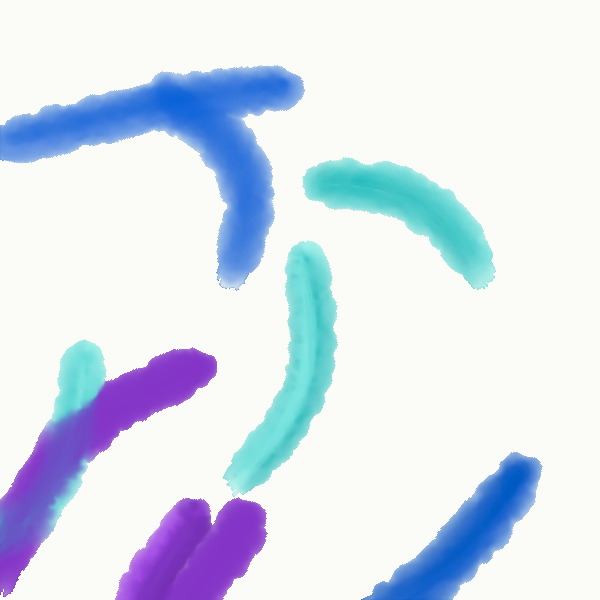

| stroke | covered | width | dark | spread | ms |
|---|---|---|---|---|---|
| s0 | 7 % → 30 % | 33.9 px | 0.40 | 4.00 | 67 |
| s1 | 6 % → 38 % | 11.8 px | 0.54 | 6.54 | 59 |
| s2 | 12 % → 24 % | 60.3 px | 0.30 | 1.98 | 61 |
| s3 | 11 % → 25 % | 32.6 px | 0.49 | 2.31 | 79 |
| s4 | 15 % → 35 % | 46.0 px | 0.50 | 2.30 | 86 |
| s5 | 21 % → 33 % | 47.5 px | 0.53 | 1.60 | 79 |
| s6 | 20 % → 27 % | 61.4 px | 0.43 | 1.33 | 89 |
| s7 | 29 % → 43 % | 44.7 px | 0.53 | 1.51 | 75 |
| s8 | 24 % → 30 % | 108.9 px | 0.40 | 1.25 | 81 |

Numbers say: wet paint spreads well beyond the stroke.

## Watercolour · #29 Shrigley asterisk — own sheet
own sheet 600 × 600 · Watercolour 1.00 + water 50 % · 70 px · 13.6 s

| stroke | covered | width | dark | spread | ms |
|---|---|---|---|---|---|
| stroke 1 | 28 % → 63 % | 98.2 px | 0.65 | 2.25 | 387 |
| stroke 2 | 24 % → 24 % | 170.9 px | 0.65 | 1.00 | 419 |
| stroke 3 | 50 % → 63 % | 179.7 px | 0.66 | 1.24 | 505 |
| stroke 4 | 42 % → 42 % | 300.0 px | 0.65 | 1.00 | 517 |

Numbers say: wet paint spreads well beyond the stroke.

## Watercolour · #33 Red band, pink flames — own sheet
own sheet 600 × 600 · Watercolour 1.00 + water 60 % · 90 px · 16.9 s

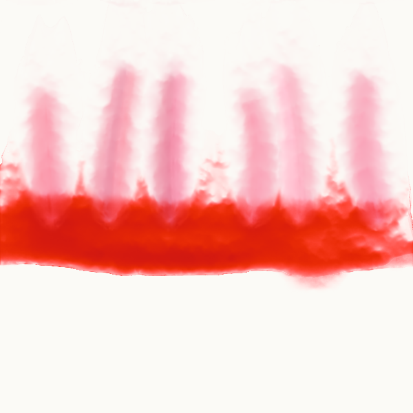

| stroke | covered | width | dark | spread | ms |
|---|---|---|---|---|---|
| stroke 1 | 25 % → 62 % | 101.7 px | 0.35 | 2.49 | 638 |
| stroke 2 | 29 % → 65 % | 179.9 px | 0.29 | 2.27 | 99 |
| stroke 3 | 32 % → 62 % | 250.9 px | 0.29 | 1.92 | 141 |
| stroke 4 | 37 % → 66 % | 300.7 px | 0.28 | 1.80 | 123 |
| stroke 5 | 36 % → 68 % | 342.1 px | 0.26 | 1.88 | 108 |
| stroke 6 | 38 % → 64 % | 301.6 px | 0.26 | 1.67 | 126 |
| stroke 7 | 47 % → 65 % | 263.1 px | 0.24 | 1.39 | 119 |

Numbers say: wet paint spreads well beyond the stroke.

## Watercolour · #35 Red band with runs — own sheet
own sheet 600 × 600 · Watercolour 1.00 + water 75 % · 80 px · 12.5 s

| stroke | covered | width | dark | spread | ms |
|---|---|---|---|---|---|
| stroke 1 | 37 % → 48 % | 147.3 px | 0.20 | 1.27 | 550 |

## Watercolour · #40 Olive and sepia blooms — own sheet
own sheet 600 × 600 · Watercolour 1.00 + water 55 % · 90 px · 14.3 s

| stroke | covered | width | dark | spread | ms |
|---|---|---|---|---|---|
| stroke 1 | 27 % → 58 % | 94.6 px | 0.21 | 2.14 | 1122 |
| stroke 2 | 47 % → 62 % | 150.8 px | 0.22 | 1.31 | 801 |

Numbers say: wet paint spreads well beyond the stroke.

## Watercolour · #46 Lips on wet paper — own sheet
own sheet 600 × 600 · Watercolour 1.00 + water 65 % · 50 px · 10.3 s

| stroke | covered | width | dark | spread | ms |
|---|---|---|---|---|---|
| stroke 1 | 13 % → 31 % | 56.0 px | 0.53 | 2.32 | 131 |
| stroke 2 | 15 % → 32 % | 63.8 px | 0.52 | 2.20 | 113 |

Numbers say: wet paint spreads well beyond the stroke.

